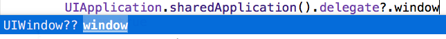

## 聊聊swift语言中的“??”

大家好，我是liuyubobobo :-)

我在慕课网上发布了一系列的swift教学视频，称为[**《玩儿转Swift》**](https://www.imooc.com/learn/635)系列。这个系列系统地从头到尾讲解了swift的语法知识，夹杂了一部分代码书写规范、设计模式和语言范式方面的内容。但是，无论是计算机语言的学习，还是ios开发的学习，都是一个太大的话题。特别是swift语言这个新兴的语言，还是有很多细节，是我的系列课程无法顾及到的。为此，我尝试将一些有价值的内容以文字的形式呈现出来，希望大家有所收获：）

这次，我试试更加深入地，和大家聊聊swift中的`??` ：）

---

最近很多同学问我，swift语言中，``??``是怎么回事。因为在微信交流中，问题不能被清晰表述，所以我很奇怪对于这么简单的一个运算符，会有这么多同学有疑问。后来随着对问题理解的深入，我渐渐意识到了大家遇到的``??``的问题和我想象的是不一样的。正巧，对于``??``，就算只是简单地把它当做运算符看待，也有很多值得挖掘的地方，为此，便有了这篇文章，绝对深入地来探讨一下：

1. 为什么要有``??`` -- 空合运算符
2. swift实现空合运算符的背后
3. ``??``仅仅是一个运算符吗？

---

众所周知，可选型（``Optional``）是swift语言的一个很重要的语言特性。窃以为，从swift1到现在的swift2.2，很多改变都直接或者间接地和可选型相关。其中，在swift2中“偷偷”引入了一个看起来很稀疏平常的新运算符—— ``??``，英文名称为``Nil Coalescing Operator``。

在[最新的swift文档的官方中文翻译](https://github.com/numbbbbb/the-swift-programming-language-in-chinese)中，``??``被翻译成了**_空合运算符_**。如果我没有记错，在第一版的官方翻译中，将其翻译成**_nil聚合运算符_**。其实，“聚合”二字属于直译，正是**coalesce**（读作/kəʊəˈlɛs/）一词的意义，现在的翻译“空合”，将nil的含义——“空”，也放在了其中。值得一提的是，空合运算并非swift语言的首创，``C#``，``Perl``，``PHP7.0.0``等等均有这个运算符（或者叫``Null Coalescing Operator``）

空合运算符做的事情很简单。``x ?? y``表示判断``x``是否为``nil``，若不为``nil``，则将``x``解包后返回，否则，取``y``的值。比如下面的代码：

```swift
let username = loginName ?? "Guest"
```

假设有一个“系统”，用户可以实名登录，也可作为游客匿名登录，此时，用户的登录名``loginName``则应该表示为可选型。而系统最终显示的用户名``username``则需要根据``loginName``的内容做一个判断，如果``loginName``为空，则使用默认名称``"Guest"``。

好了，大多数教程讲到这里就已经讲完了空合运算符。但是对于我们这群超酷的swifter而言，这一切仅仅是开始：）

### 1. 为什么要有空合运算符？

首先，一个显而易见的问题是，这样写和下面两种写法，除了代码更简洁以外，还有其他区别吗？

```
// 写法1，使用if-else
let username: String
if let loginName = loginName{
    username = loginName
}
else{
    username = "Guest"
}

// 写法2，使用三目运算符(ternary operator)
let username = loginName != nil ? loginName! : "Guest" 
```

恩，在我们的这个例子中，答案是**没有区别**。``??``在这里的使用就只是让代码更加简洁了。但要知道，如果我们只是因为代码的简洁就给语言添加各种奇怪的符号，这种语言势必可读性很差。那么多语言都引入空合运算符，绝不仅仅只是因为代码简化，难道空合运算还有功能作用？

相信很多朋友早就感觉到了，空合运算``x ?? y``像极了一种三目运算符使用的简化形式。三目运算符的使用是这样的：``condition ? x : y``。我们需要判断表达式``condition``的真假，若为真，则取``x``，否则取``y``。而空合运算就是在判断可选型是否为``nil``的情况下，一种特殊的使用三目运算的形式：``x != nil ? x : y``。因为在很多语言中，空可以和布尔值``False``直接对应，所以我们抽象地将其称为``x ? x : y``

为什么这种特殊的使用三目运算符的方式要被一个新的符号``??``所取代？答案就蕴藏在``x ? x : y``这个式子中。这里注意，``x``被使用了两次！当我们的``x``仅仅是一个变量的时候，这无关痛痒。但如果``x``是一套复杂的逻辑呢？

依然以我们引以为傲，宣称自由民主的可以匿名登录的系统为例。现在登录过程有一个函数``login()``，返回``String?``，登陆成功则返回登录用户名的``String``，失败则返回``nil``。那么此时，使用三目运算符获取系统显示的用户名就变成了这个样子：

```swift
let username = login() != nil ? login()! : "Guest" 
```

有没有觉得整个人都不好了？为什么要登录（调用``login()``）两次？在这里如果只是对效率有影响也就罢了（也！！就！！罢！！了！！你的年终奖应该泡汤了！）更关键的是，如果``login()``函数带有副效果（side effect）怎么办？比如，用户登录成功的话，顺便给一个记录用户登陆次数的指示器+1，此时，逻辑都出问题了，用户的每次登录被记录了两次！

空合运算符因此应运而生。相较于``x ? x : y``，在``x ?? y``中，保证了``x``只被运算了一次。这便是空合运算符的功能作用。

```swift
let username = login() ?? "Guest" 
```

当然了，很多同学都表示不会写出``login() != nil ? login()! : "Guest"``这么傻的代码。但是，要知道，在这里我只是举一个例子。对于login这么重要的模块儿，我们当然不会这么做。但是，你真的敢保证，自己在庞大的工程深处，没有写出过类似性质的代码吗？哦，你敢保证？我的意思是，你敢保证你的队友，不是，对手公司派来的内奸，也不会写出这样的代码吗？：）

### 2. 空合运算符的背后

你以为空合运算背后真的这么简单吗？现在让我们在XCode中，按住``Command``点击这对儿可爱的``??``，看看这个运算符在swift标准库中是怎么声明的？答案是这样的：

```swift
public func ??<T>(optional: T?, @autoclosure defaultValue: () throws -> T) rethrows -> T
```

``??``左边的那个变量叫``optional``，是一个``T?``类型，右边那个变量叫``defaultValue``，意思是默认值。恩，很好，非常可以理解，``optional``是可选型，万一是``nil``我们就用默认值（``defaultValue``）。这和我们的理解完全一样，so far so good。但是，等等，``defaultValue``的类型是什么鬼？``() throws -> T``，这俨然是个函数啊？可我们在使用的时候一直在传入一个变量值甚至是硬编码的常量值啊？在``defalutValue`` 前的那个``@autoclosure``又是什么鬼？


<br/>

事实上，之前，我们一直在探讨``x ?? y``这个模型里的``x``，但是``y``呢？

回到我们自由民主的伟大系统中，为了昭显这个系统的伟大，对于游客，我们的系统才不会使用千篇一律的``"Guest"``这个名字呢，而是使用世界一流的智能算法，为每一名游客起一个好听到没朋友的名字。恩恩，这个功能被封装在了一个看起来很平庸的函数中——``generateGuestName()``。我们就是要这么低调。虽然这个函数里面并不低调，它使用了最先进的智能算法，实时采集了全世界最酷的名字（包括狗的名字，当然，这属于机密，不能外泄），然后随机选择了一个...恩，总之很复杂，消耗计算资源很多就对了。

现在，我们的系统为了显示用户名，就要这样：

```swift
let username = login() ?? generateGuestName() 
```

这么写有什么问题？如果不经过特殊处理，编译器会先执行``login()``，之后不管``login()``返回值是不是``nil``，都再调用一下``generateGuestName()``！不信，我们自己试验一下。照着``??``的声明，实现一个我们自己的空合运算符，管它叫``???``吧：

```swift
infix operator ???{}
func ???<T>(optional: T? , defaultValue: T) -> T{   
    if let value = optional{ return value }
    return defaultValue
}
```

之后，我们这样尝试使用一下我们自己的 ``???``:

```swift
func A() -> String{
    print("A is called!!!")
    return "A"
}

func B() -> String{
    print("B is called!!!")
    return "B"
}

let AorB = A() ??? B()

// 控制台打印出
// A is called!!!
// B is called!!!
```

看看控制台！Oh My Gosh，``B is called``被打印了出来！尽管``A()``函数没有任何质疑的为我们返回了一个非可选型的字符串，``B()``函数依然被执行了！

回到我们的登录系统，如果我们不做些什么，``login() ?? generateGuestName()`` 这个式子将无视你是否有真实的名字，都要强行调用一下``generateGuestName()``。我们的系统看起来不是那么自由民主了。（当然，其实我只是从效率角度思考问题。毕竟这关系到我的年终奖😅）

怎么解决这个问题？答案是让``defaultValue``不是一个值，而是一个函数，这样一来，我们可以在需要的时候再执行这个函数，而不需要的话，就不执行。我们把自己的``???``这样改写：

```swift
// 注意defaultValue的定义，传入的是一个函数参数！
func ???<T>(optional: T? , defaultValue: ()->T) -> T{
    
    if let value = optional{ return value }
    return defaultValue() 
    //注意defaultValue后面的小括号，这是一次函数执行。
    //在此之前，defaultValue不会被计算！
}

// A(), B()两个函数定义和前面一样，不再重复

let AorB = A() ??? B  
// 注意，此时，???的第二个参数是传入一个函数

// 控制台打印出
// A is called!!!
// 并且只有A is called!!! 欧耶！
```

非常棒！这样我们解决了一个很重要的世界难题。我没有夸张，听说过**最短路原则**吗？我们为自己的``???``符号添加上了执行**最短路原则**的能力！像伟大的``&&``运算符和``||``运算符一样，只有在需要的时候，我们才会计算第二个操作符的值！

不过，这样一来，缺点也很明显。一方面，``A() ??? B``这个调用形式很奇怪（竟然不对称？这是要逼死处女座啊！？），另一方面，我们的``???``的第二个参数只能传入函数型参数，为了传入一个值，我们必须手动将其封装成一个函数，当然，最简单的封装方式是做成一个闭包，像这样：

```swift
let AorX = A() ??? {return "X"}
```

这未免太不方便了:(

为此，苹果向我们提供了一个新的关键字，``@autoclosure``，看名字就知道了，这个关键字将一个类型自动转换成了一个闭包。如果你本身就是闭包（或者函数），非常好，你将享受这种延迟调用带来的优势；但如果你不是闭包，你将被自动封装成闭包，同时也享受了这种延迟调用带来的性能提升！比如``"X"``，就会被封装成``{return "X"}``

试试看：
```swift
infix operator ???{}
func ???<T>(optional: T? , @autoclosure defaultValue: ()->T) -> T{
    if let value = optional{ return value}
    return defaultValue()
}

let AorB = A() ??? B()
let AorX = A() ??? "X"
```

以上两个调用都是合法的，并且在第一个调用中，只有``A()``被执行了，``B()``不会被执行。使用``@autoclosure``，你将之前的两个问题都解决了。又可以愉快地和处女座的同学做朋友了：）

值得一提的是，此时，你已经可以扔掉自己定义的``???``而更加自信地去使用系统提供给你的``??``了。我们的``???``和系统的``??``逻辑上是一模一样的，只不过系统的``??``还提供了错误处理的功能（``throws`` and ``rethrows``）。以后有机会，我再向大家介绍``throws``和``rethrows``里好玩儿的东东，包括``@autoclosure``相关，还有很多值得我们探讨的内容。恩，最后的这句话是广告，不过你已经看完了：）

### 3. ?? 仅仅是一个运算符吗？

到目前为止，我们一直在分析空合运算符。但要注意，我的文章标题不是“聊聊空合运算符”，而是“聊聊``??``”。在swift语言中，``??``还能另作他用？

随便创建一个ios的项目，然后随便找一个可以执行的地方写这么一行代码:``UIApplication.sharedApplication().delegate?.window``，看看这个``window``的类型，你发现了什么？



怎么类型是``UIWindow??``，两个问号是怎么个意思？空合？空在哪里？怎么合啊！？还能不能愉快地玩耍了？老子不干了！


<br/>

别急，我们冷静下来，分析分析。在这里，``??``显然是修饰``UIWindow``的（咦？怎么像英语语法课？恩，语法课都差不多啦，这里是swift语法课...）就像``?``用于修饰``UIWindow``，就构成了``UIWindow``的可选型``UIWindow?``一样。为了方便，我们下面举例用大家都喜闻乐见的``Int``，我们可以这么声明一个类型：

```swift
var x: Int??
```

编译器静悄悄地让这句声明通过了编译，连一丁点儿抵抗的意思都没有。这个神秘的``x``是什么类型？

不要想得太复杂，这里没有任何神秘的元素，既然``?``表示可选型，这个``??``表示的就是可选型的可选型。换句话说，我们的变量``x``中，可以存放``nil``，也可以存放一个整型的可选型``Int?``

这么理解是不是清晰了很多？也就是说，如果``x``里要真的存放了一个整数的话，我们需要解包两次！比如这样：

```swift
var x: Int?? = 42
if let anotherX = x{
    // 此时，anotherX的类型是整型的可选型Int?
    // 要想使用其中的值，还是需要解包！
    if let value = anotherX{
        print(value)
    }
}
// 控制台打印出42
```

当然了，我们也可以这么解包。这里，希望你没有被太多的``x``搞晕：
```swift
if let x = x, value = x{
    print(value)
}
// 控制台打印出42
```

不过看起来这么欠揍的``x``，很多同学可能更愿意硬来...

```swift
print(x!!)  // 注意，是两个叹号！！
// 控制台打印出42
```

恩，理解了这个可选型的可选型``??``以后，相信脑洞大开的各位swifter一定会满心欢喜地写出这样的声明:

```swift
let realX: Int???????????????? = 42
```

编译器是不会报错的，一切都合法。下次迷惑对手的时候就这么干。


<br/>

不过言归正传，``??``除了迷惑对手以外，有什么实际意义？毕竟我们作为闷声发大财...哦，不对，闷声研究计算机科学的swifter来说，没有那么多对手啊...

实际上，对于我们之前的例子而言，``UIApplication.sharedApplication().delegate``下的``window``类型是``UIWindow??``，这背后是两个机制共同作用的结果。我们首先需要看一下这个``UIApplication.sharedApplication().delegate``是什么东东？按住``Command``点击``delegate``，我们可以看到，这个``delegate``是定义在``UIApplication``下的一个``UIApplicationDelegate?``类型的成员变量：

```swift
public class UIApplication : UIResponder {
    public class func sharedApplication() -> UIApplication
    unowned(unsafe) public var delegate: UIApplicationDelegate?
    // ...
    // 以下省略很多代码
}
```

按住``Command``看一下``UIApplicationDelegate``的定义，就会发现，``UIApplicationDelegate``是一个协议，里面的``window``这个变量是这么定义的：

```swift
public protocol UIApplicationDelegate : NSObjectProtocol {
    // ... 省略了很多代码 
   
    @available(iOS 5.0, *)
    optional public var window: UIWindow? { get set }
    // XCode7.3中，在UIApplication.h的395行

    // ... 省略了很多代码
}
```

``UIApplicationDelegate``是一个协议。在swift中，协议中定义的属性或者方法如果想被表示为**可选择被实现的**，需要加上``optional``的关键字（还要声明成``@objc``，有时间再深入介绍啦）。相应的，在协议的实现中，这个“可选择被实现的属性或者方法”，就会被解析成可选型。这是第一个``?``。

另一个层面，在这个协议的定义里，``window``变量本身就被定义成一个可选型``UIWindow?``，于是有了第二个``?``。

也就是说，第一个``?``表示这个变量在协议中是可选择实现的；第二个``?``，表示这个变量可以为``nil``。这便是我们的例子里，最终实现出来供我们使用的``UIApplication.sharedApplication().delegate?.window``，其类型是``UIWindow??``的原因。

<br/>

但在我们实际编程中，会经常使用诸如``Int??``这种类型吗？反正我还没有遇到过。如果大家发现了需要``Int??``才能合理表意的场景，请一定和我分享：）
