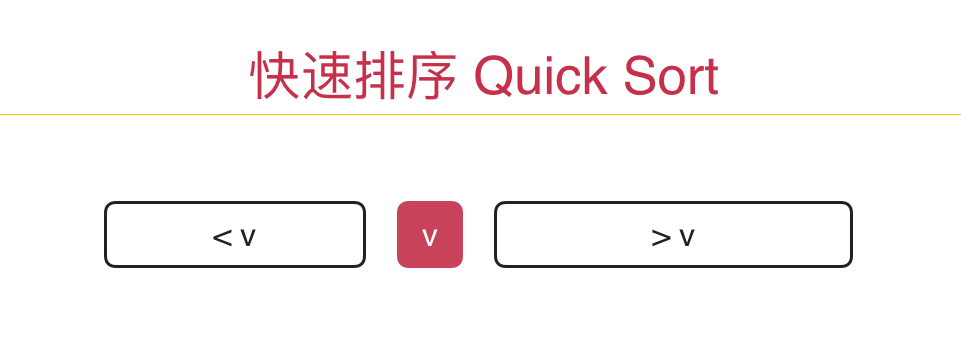
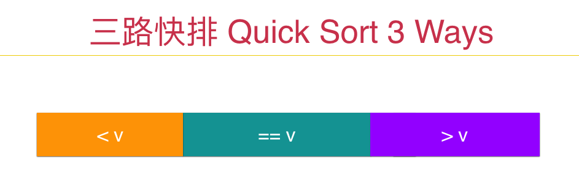

## 从一道面试题再看三路快排partition

在这次分享中，我将为大家回顾一下排序算法，同时，详细解析一下LeetCode中第75个问题：[Sort Color](https://leetcode.com/problems/sort-colors/)。这个问题是Facebook，Microsoft和Pocket Gems的面试题。在LeetCode中难度标记为Medium：）

---

在我的课程[《算法与数据结构》](https://coding.imooc.com/class/71.html)中，我向大家详细介绍了快速排序这个最经典的排序算法。在这里为大家简单复习一下，没有学习这门课程的同学，也可以简单看到一个轮廓。

快速排序算法的思路是每次选择一个元素作为标的点（pivot），将整个数组的所有元素分为小于这个元素和大于这个元素两部分，之后再递归地对左右两部分分别进行这个过程，直至整个数组有序。



显然，在这个过程中，“选择一个元素作为标的点（pivot），将整个数组的所有元素分为小于这个元素和大于这个元素两部分”这步操作是最重要的，也是快速排序的核心所在。这个步骤被称为 Partition。

如果使用一个辅助空间来实现Partition是一件非常简单的事情。但是如果不使用辅助空间，原地（in place）地进行partition，可能就稍微有些难度了。虽然有难度，但绝非高不可攀。有兴趣的同学，不妨把这个问题看作是一个面试题，自己实现一下看看：）（这是一个基础的需要大家能够进行白板编程的问题，请大家一定打好基础）

我们在课程中首先介绍了Partition的一个经典实现，代码简单优雅的令人发指：

（以下代码均使用C++代码，请其他语言的同学看懂逻辑以后尝试转换成自己熟悉的语言：））

```
// v为pivot，初始存储在arr[l]的位置
int j = l; // 循环过程保持 arr[l+1...j] < v ; arr[j+1...i) > v
for( int i = l + 1 ; i <= r ; i ++ )
    if( arr[i] < v )
        swap( arr[++j] , arr[i] );

swap( arr[l] , arr[j]);
// 此时，j指向pivot的正确位置
```

关于这个算法的动画演示，课程中有详细介绍，不再赘述。有兴趣的同学或者印象不深的同学，强烈建议用自己的小的测试用例（6-10个数据即可），用纸笔自己走一遍这个程序，加深理解：）

但我们很快就发现，这样的一个快排，在面临有序或者近乎有序的数组时，会退化成为一个O(n2)的算法。于是我们使用了一个很简单的随机选取pivot的方式来处理这个问题。这步随机化让快速排序的时间期望成为了O(nlogn)，并且只有极低的概率退化为O(n2)。关于这一点，背后的数学证明比较复杂，对背后的数学不感兴趣的同学，只要相信这个结论就好了。事实上，n不需要太大，在100这个量级，其退化成O(n^2)算法的概率就已经低于大家彩票中大奖的概率了：）

但是，我们又会发现，这样的一个快排，面对有大量重复元素的数据时，还是有可能退化成O(n^2)级别的。于是我们介绍了双路快排的Partition思路。通过这个思路，我们可以进一步优化，提出三路快排的思想。三路快排要做的事情，其实就是将数组分成三部分：小于v，等于v和大于v，之后递归的对小于v和大于v部分进行排序就好了。


	
三路快排的Partition代码是这样的。依然是，这个算法的动画演示，课程中有详细介绍，不再赘述。有兴趣的同学或者印象不深的同学，强烈建议用自己的小的测试用例（6-10个数据即可），用纸笔自己走一遍这个程序，加深理解：）

```
// v为pivot，初始存储在arr[l]的位置
int lt = l;        // 循环过程中保持 arr[l+1...lt] < v
int gt = r + 1;    // 循环过程中保持 arr[gt...r] > v
int i = l+1;       // 循环过程中保持 arr[lt+1...i) == v

while( i < gt ){
    if( arr[i] < v ){
        swap( arr[i++], arr[lt+1]); lt ++;
    }
    else if( arr[i] > v ){
        swap( arr[i], arr[gt-1]); gt --;
    }
    else // arr[i] == v
        i ++;
}

swap( arr[l] , arr[lt] );
// 此时 arr[lt...gt-1]部分为数组中元素等于v的部分
// 之后只需要递归地对arr[l...lt-1]和arr[gt...r]两部分进行三路快排即可
```

三路快排如此好的解决了近乎有序的数组和有大量重复数组的元素排序问题，以至于在很多语言的标准库中，排序接口使用的就是三路快排的思路，比如Java语言：）

---

好了，我们非常快速地回顾了一遍快速排序算法。下面，我们来看LeetCode上编号为75的题目：[Sort Color](https://leetcode.com/problems/sort-colors/)。请英文好，或者想练习英文的同学，直接点链接读题。只想阅读中文的同学，可以直接看下面的分析。

这个问题，LeetCode告诉我们，是Facebook，Microsoft和Pocket Gems的面试题。在LeetCode中难度标记为Medium。怎么样，是不是觉得很高大上？

题目大意是：有一个数组，其中的元素取值只有可能是0，1，2。为这样一个数组排序。

当然了，面对这个问题，大多数同学已经会想，肯定不是用普通的排序算法完成这个任务吧？嗯，既然题目有特殊的条件，肯定有其他的思路，但是如果在真正的面试或者笔试或者机试中，如果你一时没有更好的解法，用最笨的方法也比没有方法强。这就好像在实际项目中，我们不一定一上来就采用最优的解法解决问题，我们首先要解决问题，再谈优化。所以，这样解决问题，我觉得不寒碜：）

```
/// 解法一：直接使用排序接口，时间复杂度O(nlogn)
class Solution {
public:
    void sortColors(vector<int>& nums) {
        sort( nums.begin(), nums.end() );
        return;
    }
};
```

---

不过就像我们前面介绍的一样，这样的解法未免没有充分利用我们的数据的特殊性。要知道，我们的数据取值只有三种可能啊！那么，我们其实可以非常方便的使用一次扫面，计算出0，1，2三个元素的个数，然后直接把他们再按照0，1，2的顺序和个数，放回原数组不就好了！这样，我们只需要两次遍历：第一次统计元素个数，第二次放回原数组，就解决了问题！

```
/// 解法二：基于计数排序的解法，时间复杂度O(n)，需要两遍遍历
class Solution {
public:
    void sortColors(vector<int>& nums) {

        int count[3] = {0};  // count[i]表示元素i的个数
        for( int i = 0 ; i < nums.size() ; i ++ ){
            assert( nums[i] >= 0 && nums[i] <= 2 );
            count[ nums[i] ] += 1;
        }

        int index = 0;
        for( int i = 0 ; i < count[0] ; i ++ ) // 安置count[0]个0
            nums[index++] = 0;
        for( int i = 0 ; i < count[1] ; i ++ ) // 安置count[1]个1
            nums[index++] = 1;
        for( int i = 0 ; i < count[2] ; i ++ ) // 安置count[2]个2
            nums[index++] = 2;

        return;
    }
};
```

上面的代码很好理解，在这里提示大家两个小问题。

1. 大家可以看到，在第一遍遍历的时候，我添加了一个assert语句，来确保传入的nums中的每个元素，取值确实都是0，1，2的。这让我们的代码更严谨。当然了，对于错误处理，我们也可以抛异常或者走别的逻辑，在这里，我简单的使用assert。在面试过程中，表明我care这个问题了，点到即可。
 
2. 大家可以看到，后面我是用了三次循环，分别按照0, 1, 2三个元素。这在这个问题中是有效的，但是如果我们的nums的取值范围是0-100呢？0-1000呢？事实上，同样的思路依然有效。但是，我们在第二次遍历安置元素的时候，就不能使用这样的写法了。那要怎么写？在这里给大家留一个小练习：）

事实上，这个算法的思路，就是**计数排序（Counting Sort）**算法的思路。计数排序可以使用O(n)的时间，来解决元素取值范围固定且相对较小的一组数据的排序问题。怎么样？是不是非常有意思？如果我们为我们的待排序数组加上一些条件限制，就能突破O(nlogn)这个界限。

实际上，我们经常说的排序算法复杂度至少为O(nlogn)，是有一个前提的，即我们的排序算法是基于元素间的比较的。换句话，严谨地说：**基于比较的排序算法，其时间复杂度至少为O(nlogn)的。**仔细看看我们上面的计数排序的思路，元素之间根本没有进行比较，我们不需要在任何时候看诸如nums[i]和nums[j]之间的大小关系。

非基于比较的排序算法还有一些，有兴趣以后再向大家介绍。在这里，希望大家通过这个问题，能够自学计数排序算法，完成一个更加灵活的计数排序算法的接口：）

---

算法有意思的地方就在于，我们总能问自己，是否可以做得更好？上面的解法将算法的时间复杂度降为了O(n)这个级别，但是需要进行两遍遍历。我们有没有可能使用一遍遍历完成这个问题？

再看看这个问题：将只有0,1,2三种元素的数组排序。如果我们对这个数组进行三路快排的话，并且选择1是pivot，那么第一次partition的过程，就会把数组分成小于1的部分和大于1的部分，也就是所有的0在1的左边；所有的2在1的右边，就已经完成了排序！换句话说，我们对整个数组进行一次以1为pivot的三路快排的partition就完成了排序！而且，只进行了一次遍历！

所以，我们只需要根据这个特殊的情况，改写三路快排的partition的思想就好了！在这里，我建议大家不要看之前的三路快排partition的代码，自己手写一下。我给出的参考答案如下：

```
/// 解法三：基于三路快排的partition的解法，时间复杂度O(n)，只需要一边遍历
class Solution {
public:
    void sortColors(vector<int>& nums) {

        int i = 0;  // nums[0..<i) == 0
        int j = 0;  // nums[i..<j) == 1
        int k = nums.size(); // nums[k..<n) == 2

        while( j < k ){
            if( nums[j] == 1 )
                j++;
            else if( nums[j] == 0 )
                swap( nums[i++] , nums[j++] );
            else{ // nums[j] == 2
                assert( nums[j] == 2 );
                swap( nums[j] , nums[k-1] );
                k --;
            }
        }

        return;
    }
};
```

怎么样，是不是很酷？另外，我们的课程曾经提到过，swap操作背后其实有三个步骤。很多问题，我们可以用赋值操作替代swap操作，来进行常数级的优化。有兴趣的同学不妨试试看？对于这个问题，我们可以很容易的抛弃swap操作来完成：）

到这里，这个问题就为大家讲解完了。有没有觉得很简单的一个问题，也能引申出好多有意思的东西？

关于以上解析中，留的一些关于这道题目的更多优化解法，可以参考这个[repo](https://github.com/liuyubobobo/Play-Leetcode/)

我们下一次分享见：）


