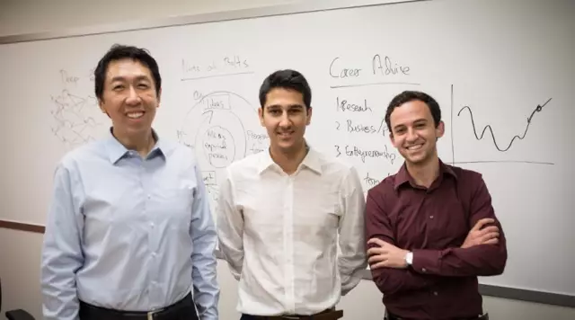
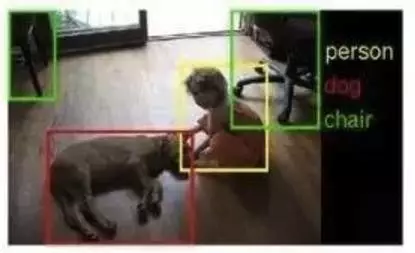
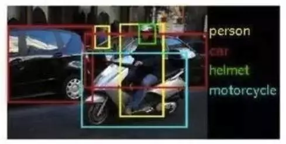

## 吴恩达的创业公司每周工作80小时？聊聊人工智能背后的人工

关注人工智能领域的人应该都知道吴恩达(Andrew Ng )。吴恩达离开百度首席科学家的职位以后，创建了属于自己的创业公司deeplearning.ai，迅速引起了硅谷上下的注意。他的“小”公司在17年刚成立不久就募集了1.5亿美元的人工智能风投资金，被戏称为：秒成为独角兽创业公司。也正因为如此，吴恩达公司的一举一动极其受媒体关注。

今天，deeperlearning.ai官网发布招聘启事，招募“机器学习工程师”和“全栈工程师”。这是这家秒成为独角兽的创业公司第一次发布招聘启事，有兴趣的同学可以去官网围观招。但引起全网热议的，是其中对工作时间的说明：我们大多每周工作70-90小时。（Many of us routinely work 70-90 hours a week.）

这个工作时间在国外迅速引起了广泛讨论，现在看来，国内IT界搞不好因为这个新闻，再次掀起一轮对工作时间和加班的讨论。

 

其实，看了这则新闻，我只能说Andrew Ng太实在了。他没有说要让大家每周坐班70-90小时。我相信Andrew Ng真正想强调的是：刻苦。当然，你可以把它理解成是“隐性加班”。说白了，你一周可以在办公室只坐40小时，但是在这40小时以外，你就把你的工作忘得一干二净了，那是不可以的。在这40小时以外，你还是要思考你的工作的：或者和同事做更多沟通；或者持续学习以保证自己的水平可以胜任工作；或者额外付出一些时间赶项目进度。当然了，如果你愿意在办公室来做这些额外的事情，办公室永远向你敞开大门，可能还有喝不尽的苏打水，吃不完的薯片和沙拉等小福利。

我相信从这个角度出发的话，每周“工作”80小时真的是很正常的。即使是在劳动法被极其严格执行的美国加州。我曾经和某Google大佬一起去海边休小长假，然后，当我以为在海边躺下可以一边享受阳光一边数浪花一朵朵一边看美女的比基尼的时候，他！拿！出！了！论！文！开！始！读！

或许Andrew Ng意识到了措辞的不妥，现在，官网的招聘启事措辞已经修改了，变为：我们大多每周工作或者学习70个小时以上（Many of us routinely work and study 70+ hours a week.）

 

但其实，看了这个招聘启事后，我马上想到的另外一个问题，是人工智能这个高大上的领域背后隐藏的“人工”问题。众所周知，现在这轮火起来的人工智能，是以机器学习方法为主的。机器学习，顾名思义，是让机器去学习。机器怎么学习？其实和人一样，通过例子去学习。不过机器特别笨。要让一个人分清什么是猫什么是狗，举3个例子大概就够了；但是如果要让机器分清什么是猫什么是狗，可能要上万的例子。什么是例子？就是数据。

人工智能需要数据。普遍大家可能只关注“大”数据中的这个“大”。人工智能确实需要大数据，甚至是海量数据；但人工智能还需要，或者叫更需要，高质量的数据。

什么叫高质量的数据？举个简单的例子，大家可能都做过各种市场调研的问卷。每一份问卷都是一个数据。相信没什么人会认真做这种问卷。胡写，乱写，不写，省略着写，甚至成心反着写，都是常态。那么这些问卷产生的数据，就是低质量的数据。而一个人如果能够像答高考卷子答市场调研问卷，那么就会产生一个高质量的数据。只有这种高质量的数据，才能够真实地反映现状。但是相信到这里，大家也能看出来，一份高质量的数据成本是多么高昂，数量是多么少。

获得高质量数据的一个有效方式，就是人为标记。举几个例子。人脸识别已经算是比较成熟的算法领域了。但是我们要想让计算机学会如何在一张掺和各种复杂背景的照片（甚至视频流）中定位人脸，首先要给计算机大量已经标识人脸的图片。比如这个样子：

看见了吗？照片中四个人，人脸都被方框用特殊颜色框起来了。这个可不是机器识别的结果。是机器在拥有识别能力前，所需要的高质量的学习数据。怎么来的？人工标识的。机器需要多少个这样的数据才能学到一个好的算法？数以万记。

实际上，上面这个图片标注的工作还是比较简单的，把人脸画个方块儿就好，看下面这个数据的标记工作：

能看出来吗？为了让机器可以学习识别人的动作，需要大致画出人物在照片中的躯干轮廓以及关节点，哪里是躯体哪里是头哪里是四肢。显然，标识这种照片比画脸难很多。

但其实，上面举得两个例子，还是在识别任务极其清晰的状况下设定的简单标记任务。我们只需要关注脸或者躯体就好了。但是更前沿的研究要让机器理解图像的“语意”。意思就是说，给机器一张照片，要机器能够描述出这张照片是怎么回事。这比上面的两个例子难得多。上面的例子把要识别的内容聚焦在了脸，躯体，或者是猫是狗这种固定的任务上，有点儿像是在做选择题；但是随便给你一张图片，机器要回答出这张图片里有什么是什么，这就像是简答题了。这样的训练数据怎么标注呢？大概是这样：

看到了吗？不同颜色大小的方框，配合不同的文字标识，人为地把一张图片中认为需要关注的信息标识出来。这个标识过程最好不要出错，不然机器学习的结果也不会好。

可以这么说，高质量的标注数据，足以决定一家人工智能公司的竞争力。前阵子大热的华裔科学家李飞飞，加盟了Google。她的一大成就是参与建立了ImageNet。这是由167个国家的48940名工作者，用两年时间，过了近十亿张图片以后，形成的一个拥有1500万张标注图片的数据集。这是多大的工作量？

可能，更重要的问题是，这到底是体力劳动还是智力劳动？嗯，反正我怎么看怎么都觉得，是人类在给机器打工。我的反乌托邦病又犯了。

对于这种数据标注工作，简单的部分已经可以交给外包公司进行了。但是对于一些复杂的部分，或者还在探索的部分，还是需要“高级人员”自己动手来。一方面是对标注质量更放心，另一方面，可以一边标注一边实验结果，甚至要不断改进标注的方式。其实，标注数据只是人工智能领域底层的体力工作之一，只有从事人工智能领域的人才明白，看起来高大上的光环背后，是无尽的清洗数据和特征工程。其实一点也不高大上。

但是，或许，或许，所有的高大上的背后，都有着这样的辛酸。
