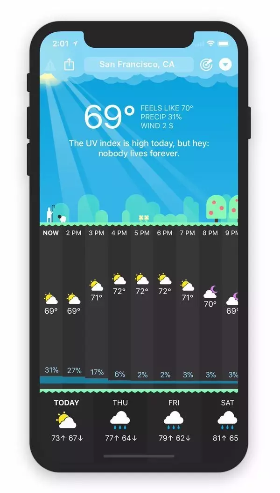
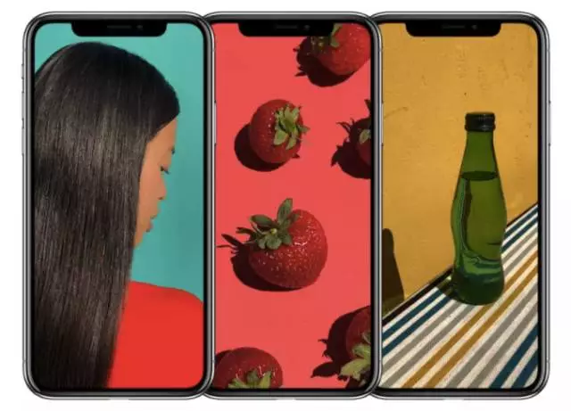
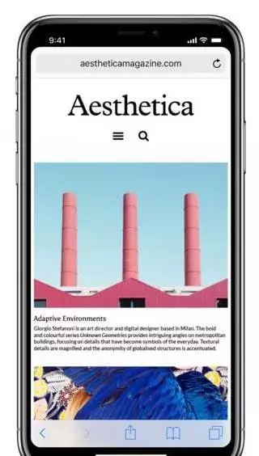
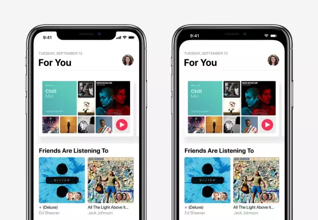
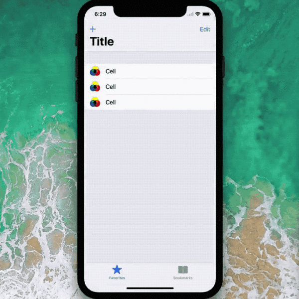
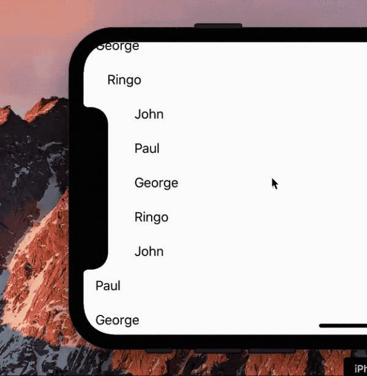
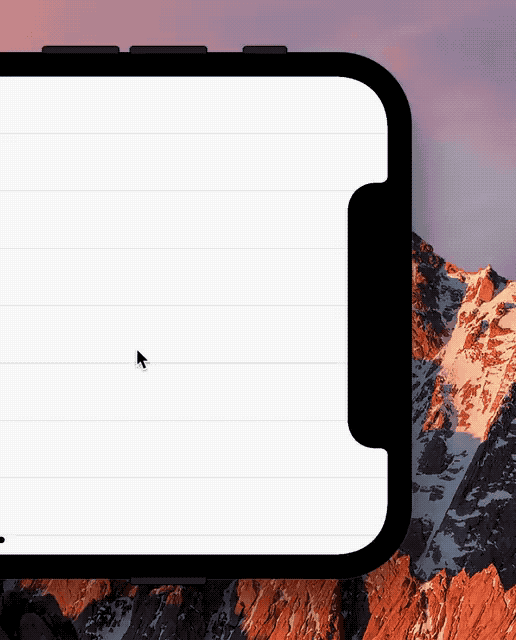
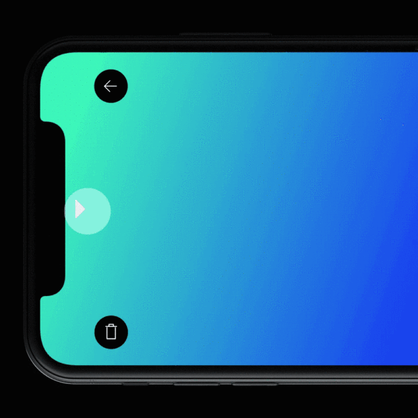

## iPhoneX 刘海儿打理攻略

iPhoneX已经公布一阵子了。对于iPhoneX的刘海设计，国内外一致的评论就是——丑。因为你的app显示效果将是这样的：

来自 Twitter 用户 CARROT

 

嗯，感觉屏幕上方被什么东西给啃了。。。不过app的显示效果可能习惯一阵子也就好了，但是每次全屏看美女，不不不，看艺术作品的时候，这个刘海。。。

嗯，以上效果来自苹果官方宣传。。。

不过没关系，聪明的设计者们和开发者们早就在iPhoneX还没到来之前，研究如何为iPhoneX遮丑了。。。

最一般的思路，就是在屏幕上方制作一个黑色的“任务栏”，让刘海儿和黑色的任务栏融为一体。

来自 Twitter 用户 Mike Rundle

 

我们可以用同一个app的两个设计思路对比一下：

来自 Twitter 用户 Carlos Garvina

 

怎么样？是不是觉得右侧的设计方案明显比左侧好？

但是你猜怎么着？这个方案似乎和新版的苹果交互设计指南冲突。更新后的苹果交互设计指南表示：

> 不要遮挡或者特别修饰显示特性来引起用户注意: 请勿尝试隐藏设备的圆角、传感器外壳，或者通过在屏幕顶部和底部放置控件来访问主屏幕的引导。也要特别注意不要试图使用像括号，边框或各种符号等视觉修饰这些特殊区域。

嗯，虽然苹果自家的music设计，似乎是将这个传感器隐藏了。。。

好吧，不管怎么样，聪明的开发者么还是想出了很多解决方案的。比如，似乎对于一般的app，在竖屏状态下，这个刘海还可以忍受，但是在横屏状态下，就会极度影响操作。所以我们在横屏操作时，将它隐藏：

来自 Twiiter 用户 Alex Devarty

 

一个更酷的思路是，在横屏操作时，显示中的文字自动躲开刘海。。。

来自 Twitter 用户 Vojta Stavik

 

如果刘海在右侧，我们可以让滚动条和刘海作自适应！

来自 Twitter 用户 Zev Eisenberg

 

不过到目前为止，我看过的最酷的设计，还是直接将刘海和界面融为一体！

嗯，是不是觉得其实这个丑丑的刘海运用好了，也是机会？

坐等以产品设计闻名的国内大厂，推出他们的刘海打理方案：）