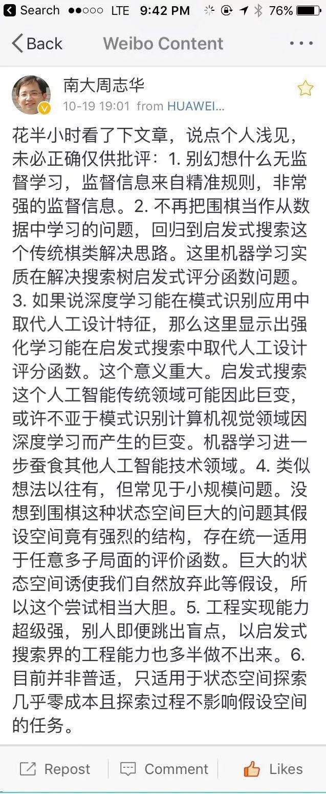

## 随便聊聊AlphaGo Zero

AlphaGo Zero已经刷屏了。社会被科技新闻刷屏总归是好事情，比被娱乐八卦新闻刷屏有意义的多。看了很多媒体的评论，大多是在鼓吹“人类多余论”，直到周志华老师发声，觉得才算真正看到了有独到见解的评论。我将周志华老师的微博原文放在了本文最后。

在这里，我认为最重要的就是：AlphaGo Zero进行的不是无监督学习！是有监督的学习，甚至可以说是非常强的监督学习。只不过监督信息不来自于数据，而来自于棋类任务天然具有的”强规则“属性。但是，要知道，我们的世界中大多数问题和棋类游戏相比，都不能叫弱规则了，说是没规则都不夸张。因为在真实的世界中，新规则随时会建立起来，旧规则也随时会废弃或者改变，各种规则以各种排列组合的形式被应用，有些规则甚至还能衍生出不同的解释。在这样的条件下，AlphaGo Zero的方式被真正有效地应用在我们的社会生活中还有多远的路要走？很难说。

但我并不是说AlphaGo Zero没有意义。相反，过几年回头看，AlphaGo Zero的意义很有可能比现在人们想象的还要大。2001年微软研究院的一篇著名的论文向我们揭示了这样一个事实：对于不同的算法，他们虽然有优有劣，但当我们给它们输入越来越多的数据以后，它们的表现都非常好，甚至没有差别！这篇论文告诉我们：算法或许并不重要，数据才重要。也就是说：或许数据即算法。从此，大数据时代的帷幕轰轰烈烈地拉开了。

但是Google的这篇AlphaGo Zero的文章重新告诉我们：算法依然是凌驾在数据之上的。只有高效的算法才能将数据的功效发挥出来。甚至对于棋类游戏这种规则属性很强的任务，没有数据都不是问题，算法才是最重要的。

在我看来，这对大多数人来说都是好事。因为这个事实再一次强调了人的主观能动性的意义。人类绝不仅仅是机器的数据的提供源而已。人类更是算法的设计者，创造者和生产者。

至于人类多余论，科技的发展总是在取代人类的工作的，但与此同时也在创建新的工作。如果说机器威胁人类的话，那人类承受这样的威胁已经有很长时间了。ATM取代了银行柜员的工作；自动贩售机取代了售货员的工作；电子邮件取代了邮局的工作；搜索引擎取代了图书馆的工作；自动化的农耕机械取代了农民的工作；现代化的车间设备取代了工人的工作...... 其实如果没有机器，现在的人类社会已经很难运转了。但是要注意，在我举的这些例子中，与其说是”取代“，不如说是”辅助“更合适。与此同时，由于这些机器的使用，大量新生的，更富创造力的，同时也能带来更多社会收益和财富的新工作和新方向源源不断地涌现了出来。

现在问题来了，未来的新工作和新方向到底是怎样的？其实关于这方面的分析很多。笼统的，具体的，我觉得有道理的，没道理的，已经撒满了互联网。不过这篇AlphaGo Zero的论文告诉了我们一个更加具体的方向。

我相信：增强学习在未来会越来越火的：）

