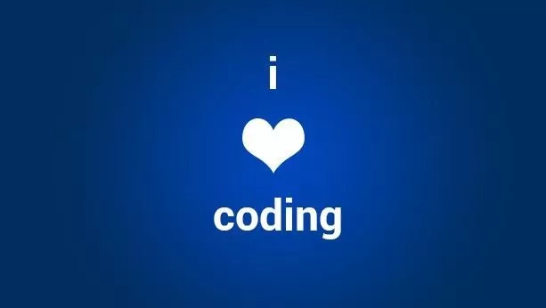

## 为什么是1024？

10月24日，被中国广大程序员朋友们定为程序员节，据说是因为有一个广大码农都必去的论坛......哦，不不不，据说是因为2^10=1024。（剧透：下文开始一本正经，直到最后才会回归标题的主题）

但其实，在国际上，被众多科技公司和软件企业真正承认的业内人士程序员节日，是在每年的第256天。这一天是平年的9月13日，闰年的9月12日。

之所以定在每年的第256天，是因为2^8=256，而在计算机中，每8个比特是一个字节，而字节才是计算机最基本的存储单元。当然了，更重要的原因是2月56日是不存在的：）

每年的第256天是程序员节，是俄罗斯官方承认的一个节日。这个节日最早是由瓦伦丁·巴尔特（Valentin Balt），并行技术网页设计公司（Parallel Technologies web design company）的一名职员提出的。2002年，他收集签名向俄罗斯联邦政府请愿，请求将这一天定为程序员节。直到2009年，俄罗斯才正式签署法案，通过了这个节日申请。

有意思的是，在我搜索这家公司的时候，他们的主业已经变成了Data Center和Intelligent Building。好像突然又看到了一段历史的变迁，有种物是人非的感觉。

好了，关于节日介绍完了。因为今天不过节，大家可以放心的继续加班了。不过根据上文的介绍，我们可以再深入研究两个问题：

 

**问题1：为什么一个字节是8个比特？**

答案是：**历史原因，而非技术原因**。历史上，封装字节这个单位的根本原因，是为了对字符 (character) 进行编码。在存储资源很昂贵的年代，26个字母用5个bit就够了（2^4=16；2^5=32），所以，其实，在很长一段时间，计算机的一个字节是5个bit的。是的，顾不上区分大小写了。

随着技术进步，存储资源慢慢不紧张了，同时，人们需要的字符集数量在扩大，曾经有一个时期，一个字节包含多少个bit是在逐渐上升，6个bit，7个bit，直到IBM在上个世纪80年代奠定了8个bit一个字节的经典PC架构，与之相应的字符编码方案，便是经典的ASC II码了。当然了，现在人们所需要的字符集更大了，不过相应的编码方式，采用在8 bit一个字节的基础上进行扩展。8 bit一个字节就这样约定俗成了。

 

**问题2：某论坛为什么"俗称"1024？**

因为该论坛的新用户，每隔1024秒才能再发新帖。

 

祝大家节日快乐!

