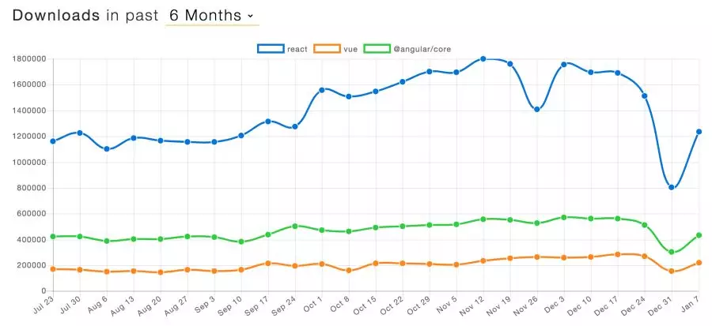
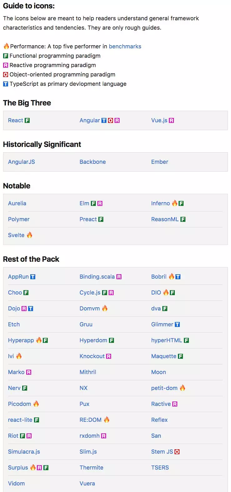

## Javascript框架汇总，一次认清当下最流行的前端框架

前端童鞋，或者是想要进入前端领域的童鞋，可能最头疼的就是当下有辣么多Javascript的框架，要如何选择？2018年1月16日，国外前端大神John Hannah干了一件大事儿，把当下的前端框架进行了一次汇总。这个汇总清单里包含了近乎当下所有的Javascript框架（不包含已经弃用的框架），同时，他详细的列出了每一个框架的优缺点。目测John神还在维护这个工程，最近一次更新就是今天（2018年1月21日）。

在其中，最引人注明的应该就是被John神称为The Big Three的三大Javascript框架了。他们分别是：React，Angular和Vue.js。现阶段的前端工作者，近乎一定要掌握这三者之一。同时，想要进军前端的同学，特别是想要找工作的同学，从这三个框架之一入手不会出啥错。当然了，技术的发展是动态的，明年就不一定了。

至于这三者的比较，John神也给出了一幅图，以这三个框架的下载量作为流行度指标，看过去6个月这三个框架的流行度。结果是React遥遥领先；Angular次之；Vue.js最后。当然了，这个统计不一定适用于国内市场，仅供参考。

下图蓝色为React；绿色为Angular；橙色为Vue.js：

至于这份完整的框架汇总，参见下图。由于时间有限，我没有将John神总结的每一个框架的优缺点翻译过来，感兴趣的同学可以点击[阅读原文](https://jsreport.io/the-ultimate-guide-to-javascript-frameworks/)，跳转到John神的原文详细观摩。

