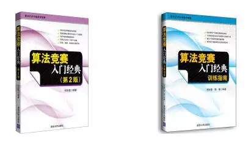
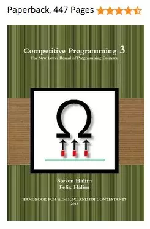
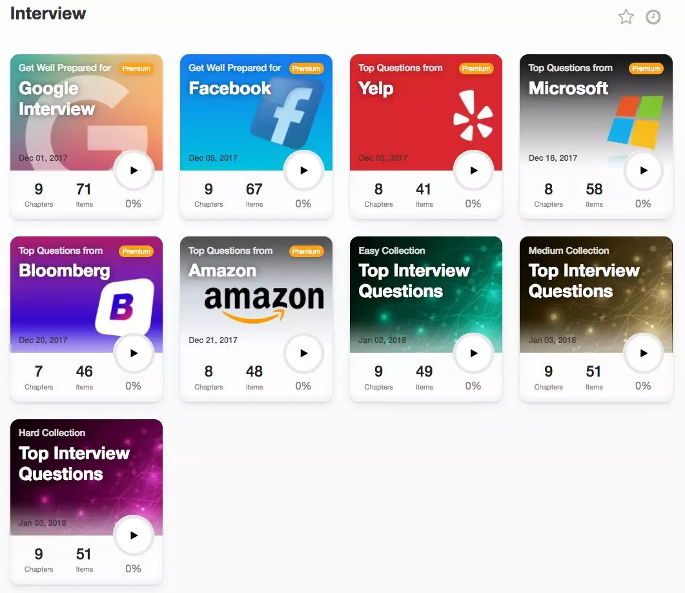
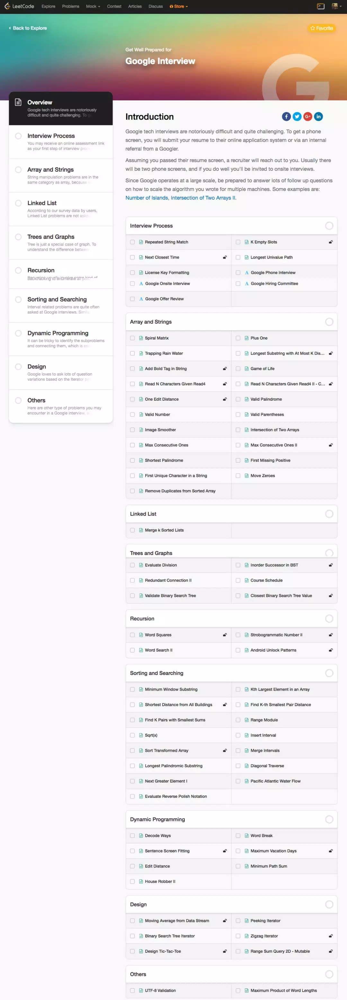
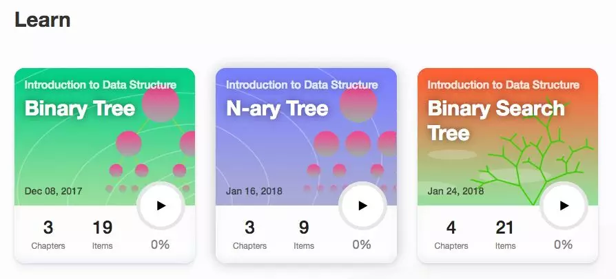
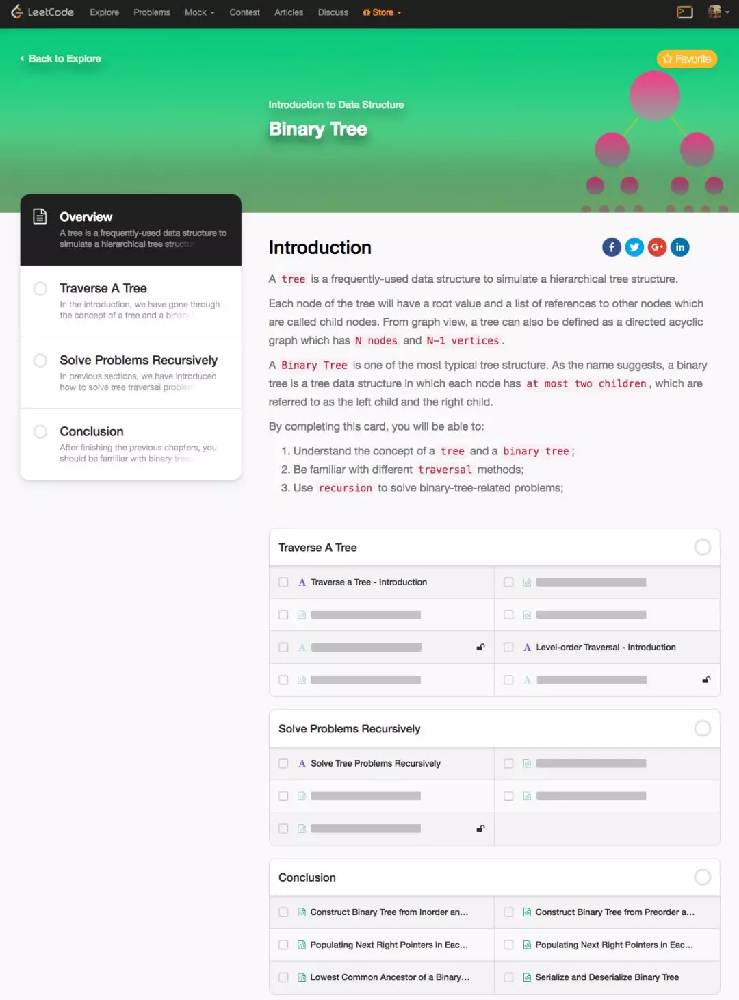
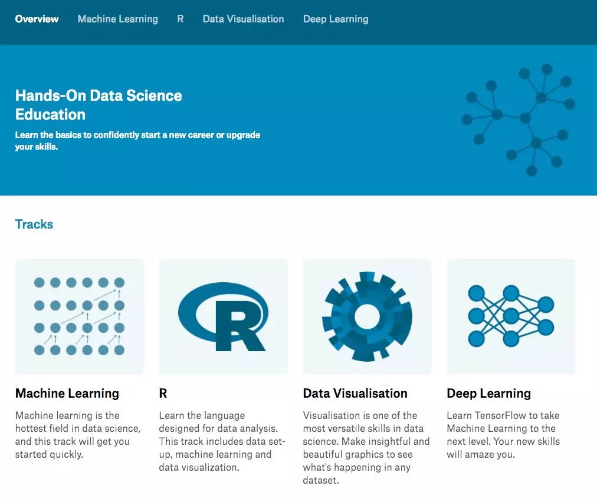
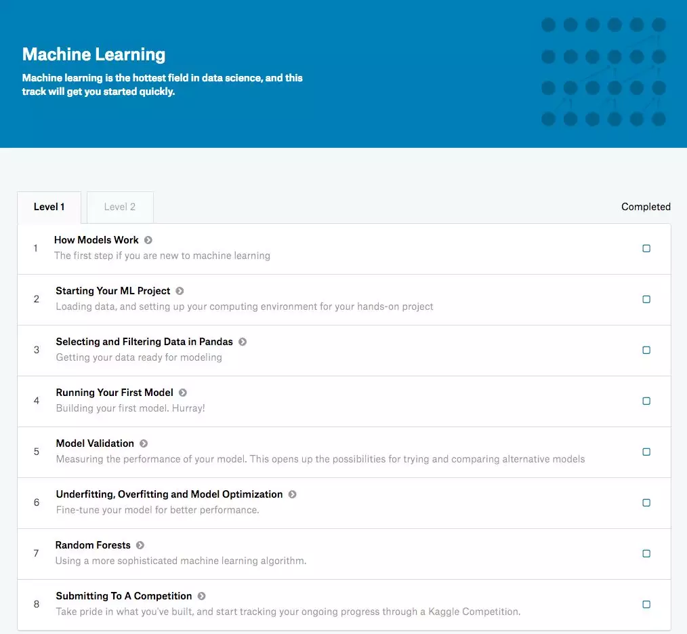

## 竞赛网站“终于”纷纷做起了教育

由于本科是玩儿竞赛的，所以对竞赛网站格外关注。研究生以后虽然不再玩儿竞赛了，但是竞赛网站却越来越多。现在流行的口碑很好的一些竞赛网站，其实大多是后起之秀。不过在观察这些竞赛网站的时候，我一直有一个疑惑：这些竞赛网站为什么不顺便做教育？

当然了，大多数竞赛网站都有很完善的社区功能，可以让参与者自由的讨论。一般竞赛网站也会在每次竞赛以后，给出一些官方的解题指南。在我印象里，Codeforces，Codechef，Topcoder等网站，每次算法比赛以后，都有较为详实的赛题解析。这些解析非常有帮助，这是无可厚非的。但是，它们的问题是不够“系统”。参与者只能片面地获得某几道题的解题思路。由于缺乏系统的学习和训练，参与者其实很难将这种思路举一反三，用到其他的问题上；甚至由于一些基础知识的缺失，对于很多用户来说，解题指南也是“天书”。怎么才能看懂这些解题指南，这些解题指南是不会说的。这和我说的“教育”还相差甚远。

我说的“教育”，是指：通过某种方式（视频，文字，以及在线编程）系统地介绍某个领域的知识。在这一点上，竞赛网站和教育网站似乎一直是分离的。所有网站中，我觉得做的尚可的，是非常老牌的竞赛网站UVa。国内玩儿ACM竞赛的童鞋应该一定购买过刘汝佳的《算法竞赛入门经典》，这套书一共两本，其中全部练习题，都可以在UVa的一个专区中找到并进行编程实践。

 

不过大家可能有所不知的是：国外也有一本超经典的算法竞赛书籍，叫《Competitive Programming 3: The New Lower Bound of Programming Contests (Steven & Felix Halim)》。这本书目标更明确，就是给参加ACM竞赛的童鞋准备的。书中包含海量的习题（真的是海量。。。），这些问题也全都可以在UVa的网站上找到并进行实践。但是，这种教育和竞赛网站结合的方式，一方面是依靠发布实体书籍实现的，不完全是“在线教育”；另外，教学内容也主要是算法竞赛，难度偏大。

下图为 Competitive Programming 3 这本书的封面。这里的3不是这套书有三本，而是这是这本书的第三版。我也不知道为什么这么起名...：）

 

今年，刚进入2018年，就听到了两个“好”消息。这两个消息在IT圈儿内看都是“小消息”，但不知道为什么，我却觉得很激动。就是两大竞赛网站，终于开始做教育了。

第一个网站是大名鼎鼎的Leetcode。相信Leetcode我不用太为大家介绍了——算法面试刷题必去的网站。基本上把Leetcode上Medium级别的题目都刷了，不管是哪个公司的算法面试，都小菜一碟。不过这一年半，Leetcode特别“努力”，题目量直接飙到了近800。两年前刷通Leetcode还是一个合理的目标（只有200多道题），但是现在，由于题目太多，刷通Leetcode已经有些太耽误时间，甚至是不切实际，没有必要的了。尽管如此，Leetcode中的早期经典问题还是非常值得参考的。

现在，Leetcode网站多了一个新的"Explore"的标签。点击后，就可以看见Leetcode全新的“教育板块”。这里分两部分内容。第一部分内容是以公司命名的Interview版块儿，基本上就是把Leetcode上各家不同公司的面试题做一个集结。

 

以Google版块儿为例，打开就是这个样子的：

 

大家可以看到，这个版块儿本质其实还是在线编程问题的一个“分类汇总”，“教育味儿”不够浓。但是另外一个板块就明显很教育了，叫做Learn。现在暂时只有三个专题，是这样的：

 

很明显，每个专题是讲解一个具体的数据结构的。打开其中一个Binary Tree瞅瞅，是这样的：

 

虽然，这个教育形式其实比较“粗糙”，和教育网站不能比，但我依然很欣喜。因为竞赛网站终于开始“做教育”了。我一直认为，参加竞赛是必须严密地和学习结合起来的。可惜大多数时候，我们学习和竞赛的平台是分离的。现在二者如果能够有机的合二为一，将大大降低用户的学习成本。

 

如果说Leetcode的“教育”还比较初级，另外一个重量级的竞赛网站Kaggle，在今年推出的Learn模块儿，在我看来就有更浓厚的“教育味儿”了。现在Kaggle的Learn模块儿，一共有4个专题，分别是Machine Learning, R, Data Visualization和Deep Learning，如下：

 

和Leetcode的只是简单的把题目按照专题汇总，配以一定的文字说明不同，Kaggle的每个专题，都含有大量的解释性文字，甚至还有视频。相比之下，更加像是“小型教材”。同时，一些章节还有小型的练习，充分发挥了竞赛网站的优势。由于时间关系，我还没来得及具体看内容，不能向大家汇报具体“质量如何”，但是“看起来”还是很不错的：）

 

虽然，这两个网站现在做“教育”的方式，在我看来都很初级，和老牌的教育网站，诸如Coursera, Edx, Udemy，（还有慕课网）一类的没法比。但是，这是一个好苗头。竞赛网站深入介入教育领域，可以更加方便的将教学和实践结合起来，个人认为有极大的潜力，会适合一大批同学，更是很多竞赛选手备战竞赛的福音：）

在这里和大家推荐一下，建议有兴趣的同学，不妨试试看：）

---

好了，写这篇文章的真实目的来了。

在这里，我为大家介绍的两个竞赛+教育的网站，都是英文网站。相应的，他们的教学内容也是全英文的。其实，相信很多同学都了解，大量的非常棒的教学资源，都是英文形式的。至于中文翻译，通常都存在或者翻译的太慢，或者干脆没有翻译，或者由于翻译者的水平原因，使得阅读者会产生不必要的理解障碍。在这个信息爆炸，教育资源丰富的年代，可以说，英语优秀的同学，将拥有极大的学习优势。

我在和很多同学交流的过程中，发现很多同学都清醒地了解这一点，也有很强的学习好英语的意愿，但是就是不知道如何学好英语，或者畏惧学习英语，或者一直在使用非常错误的英语学习方法（最典型的就是只是非常机械的背单词。。。）

对此，我一直非常想帮助大家，提供给大家一些英语上的学习指导。同时，我还希望能够结合程序员这个群体，让大家在学习英语的过程中，有一定的专业提升。其实，国内英语学习的一个最大的误区，就是把英语当做一个学科来学习，而不是把英语当做一种语言工具去应用。这导致了大家摸索出了很多“阅读理解的技巧”，却不能真正理解阅读的内容；背了很多单词，但是在具体的语境中出现这些单词，却又不认识 :-(

不过，我现在不是很确定如何为大家提供英语上的帮助更好。英语不像计算机，有很多“知识点”可以讲解（其实有很多知识点，但是我坚信大部分所谓的知识点的讲解，并不是大家当务之急所需要的英语学习内容。）英语更重要的是要大家投入时间，坚持不断的去“使用”。刚开始，我想聚焦在“阅读”上，以让大家能够相对无障碍的阅读原版技术书籍为目标。我可以为大家提供合适难度水平的材料，一些宏观的学习方法的介绍。但是更具体的，大家认为自己还需要什么样的指导，服务，或者组织形式？希望大家给我留言，在这个文章下留言或者在我公众号直接给我消息都可以，我希望听到更多大家学习英语的困惑或者希望，更好的帮助大家：）

谢谢！