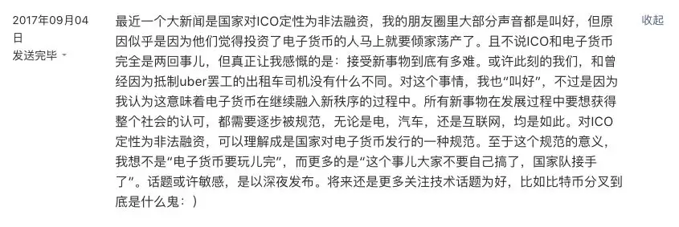

## 随便聊聊比特币和区块链

最近，关于比特币和区块链终于有点儿风平浪静的意思了，朋友圈和公众号里似乎不再有各种区块链入门指南了。所以，我来凑热闹了：）

这篇文章不是一个系统地发表我对比特币和区块链的思考的文章，也不是介绍技术的文章。更多的是杂乱无章的思考。所以不想看碎碎念的同学，已经可以关闭了：）

1）

我是在2013年第一次接触比特币的。这个时间点其实很尴尬，不早也不晚。所以在新人面前，我不敢说自己是老人；在老人面前，我对这个新事物的嗅觉，和他们差了5年。2008年，中本聪发布的比特币白皮书。有意思的是，不知道是历史的巧合还是中本聪有意为之，2008年恰恰是美国金融危机爆发的年头。而如果区块链技术在那时就可以得到应用，这场金融危机完全可以避免。

2）

对于比特币，我不是一个炒币者，也不是一个区块链技术痴迷者。我介乎于在这二者之间。这是好听的说法，不好听的说法就是：我既不精通币圈炒币之术；又不精通区块链技术。这么多年有买有卖，手里还剩点存货。不过我认识的朋友里有币圈”精英“，我认为他在2017年的收益绝对是1000万这个级别的。

3）

在过去的一个月，以比特币为首的各路电子货币一路下跌，跌幅近乎都达到了50%。很多人欢欣鼓舞。我当然很理解这种欢欣鼓舞。我也是很”仇富“的人：）不过，我在这个公众号，4个月以前就发表过一个观点：

再用文字版转一下：

> 最近一个大新闻是国家对ICO定性为非法融资，我的朋友圈里大部分声音都是叫好，但原因似乎是因为他们觉得投资了电子货币的人马上就要倾家荡产了。且不说ICO和电子货币完全是两回事儿，但真正让我感慨的是：接受新事物到底有多难。或许此刻的我们，和曾经因为抵制uber罢工的出租车司机没有什么不同。对这个事情，我也“叫好”，不过是因为我认为这意味着电子货币在继续融入新秩序的过程中。所有新事物在发展过程中要想获得整个社会的认可，都需要逐步被规范，无论是电，汽车，还是互联网，均是如此。对ICO定性为非法融资，可以理解成是国家对电子货币发行的一种规范。至于这个规范的意义，我想不是“电子货币要玩儿完”，而更多的是“这个事儿大家不要自己搞了，国家队接手了”。

现在看来，这个说法有欠妥的地方，不够精准。但是我的核心观点没有改变。”电子货币“这个新事物，这个当下看来是区块链技术最大的承载者，让它的价值回归为0，近乎已经是不可能了。这就好比出租车公司再怎么不愿意，uber和滴滴已经在这个市场上站稳了脚跟。就算退一百万步，出现了极度不可思议的事情，这两家公司突然在一夜之间都倒闭了，这种商业形式本身依然会存在下去，直到下一次被另外一个什么玩意儿革命掉。历史很难发生倒退。

4）

有意思的是，我发现，和人类世界的革命不同。技术的革命，其实比我们想象的慢。人类的革命，一夜之间，政权变迁。但技术的革命不同。互联网这么多年了，可以说现在计算机毕业的童鞋还在或多或少地享受互联网技术的红利，虽然比10年前少了太多。区块链亦是如此。虽然比特币已经有十年的时间，但我坚信，站在历史的角度，现在还是区块链技术本身太早期的时间。这点值得庆幸，也值得警惕。值得庆幸的是：还有机会，而且是很大的机会；值得警惕的是：温水就是这么煮青蛙的。尤其是现在流行的佛性蛙。

5）

有很多同学问过我，要不要投资比特币，我的回答都是：即使是投资保守的人，拿出流动总财产的1%-5%进行比特币投资，没有什么不合适。有的同学问我投资的时机，我的回答都是：短线投资，什么时候都有风险；长线投资，近乎是稳赚不赔。注意，这里我说的是比特币，至于现在世界上存在的这么多不同的电子货币，如果没有深入研究，不建议轻易入坑。

6）

很多人可能正在坐看2018年电子货币彻底垮掉。依然是，如3）所述，这近乎不可能发生。历史总是惊人的相似。2000年的互联网泡沫，很多当时所谓的”互联网巨头“轰然倒闭了，到现在连个名字都没有留下。但是18年后回头看，那场泡沫似乎在预示着此后20年互联网行业的蓬勃健康理性的发展。2017年电子货币的走势俨然存在巨大的泡沫，那这个泡沫什么时候破？是现在吗？我不知道。但是我相信，在此之后，”电子货币“也将经历风风雨雨，慢慢走向蓬勃健康理性的发展之路。

7）

通过前面的文字，相信大家也知道了，我是比特币的拥护者，区块链技术的支持者。当然，我可能是错的。如果我是错的，前面的话都是废话。这是我的免责声明。如果你看了这篇文章，决定购买比特币，结果在你购买完的那一刹那，全球电子货币市场轰然倒塌... 相信我，我也希望这是我干的，但这真的不是我干的。听上去...更像是你干的：）