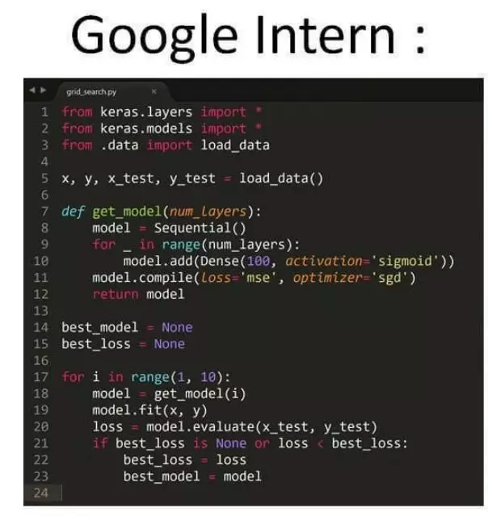
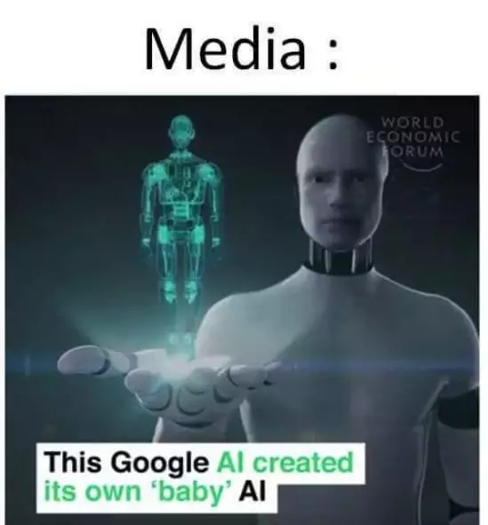
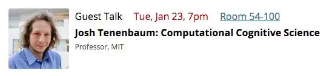
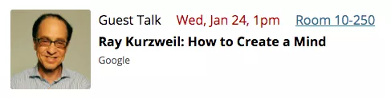
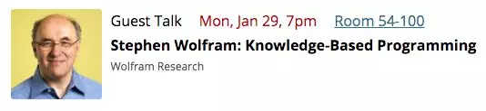

## 据说是世界上第一门探讨“强人工智能”的公开课，开课了！

强人工智能一直是人工智能领域追求的终极目标，也是各路科幻作品一直以来探讨的主要问题。

所谓的强人工智能，是相对弱人工智能而言的。弱人工智能，是指只可以完成特定任务的智能。无论是已经发展相对成熟的语音识别，数字识别，文字识别；还是仍然在发展中的自动翻译，图像识别；无论是大红大紫的AlphaGo，还是万众瞩目的无人驾驶，其实都是弱人工智能。他们都只解决一个特定问题。很显然，这和我们人类拥有的智能极其不同。人类不仅可以在极短的时间内，通过极小的样本学习，掌握极其复杂的知识（甚至人类自己都不自知）；还能够同时处理多个极度复杂的任务。我们可以一边安全的过马路，一边构思一个文学作品；或者一边驾驶汽车，一边盘算到达了目的地以后要如何行动；更不用说一边欣赏艺术作品，一边将艺术作品中的情境融合进自己的生活经验中，产生出属于每个人不同的主观体验这样的高级的“认知加工”。上述举的例子，随便拿出一个，当下的弱人工智能完成起来都是极度费劲的，更不用提强人工智能了——可以将这些任务综合起来，把所谓的“意识”，“感性”，“知识”，“自觉”，“创造”等人类的特征连接起来，表现出具有一般智慧行为的能力。

如果上述的解释太晦涩，那么一言以蔽之，强人工智能，就是制造一个和人类拥有同样智慧能力的机器人。

 

通常我们说的强人工智能，英文可以叫Strong AI，这个名字很直白，但是它有另外一个名字：Artificial General Intelligence，简称AGI，一般中文翻译成“通用人工智能”。这个翻译虽然是对的，但我总觉得有些生硬。这里的General，其实就是和Specific相对应的。是指这种人工智能不仅仅是用来完成特定任务的，而是拥有”通用“的智慧，可以处理任何一般性的任务。像人类一样。

 

一般认为现代人工智能起源于1950年代中期，最早的一批研究者不仅相信强人工智能是可以实现的，而且是在20年内就能实现的。现在看来，那批人图样图森破。事实上，1970年，大部分人工智能领域的研究者已经意识到了之前自己或者先驱者们的乐观，强人工智能的难度超乎大家的想象。不要说强人工智能了，很多对人类简单至极的任务，做成弱人工智能似乎都存在着巨大的瓶颈。到了八九十年代，甚至迎来了人工智能市场崩塌的日子。科学家们承诺的智能根本没有出现，而且看上去遥遥无期，很多人甚至将人工智能领域的研究者和骗子划上了等号。大众不再幻想强人工智能降临的日子，虽然科幻小说家们依然孜孜不倦地探讨着强人工智能来临之时，人类社会可能面临的诸多问题。而且，不少作品成为了传世名作。

在最近的几年，随着计算机性能的突飞猛进，深度学习方法的出现，以及深度学习在几个领域上的应用都被证明”有效“，人工智能领域又被注入了新的活力。社会上普遍又开始关注起了人工智能。这轮关注，甚至让很多人工智能研究者都害怕。毕竟，希望越大，失望越大。大多数人工智能从业者都坦言：我们离强人工智能还远，还很远很远。我想，这也是一个行业的成熟标志：知道自己能力的局限性。50年代人工智能研究者的豪言壮语，现在看来就像没接触过世界的小孩子，扬言要拯救宇宙一样。我们都是这么过来的：）

 

但尽管如此，仍然有很多人不很理解当下人工智能发展的边界。于是，MIT推出了一个新的公开课程，被称为是：世界上第一门探讨“强人工智能”的公开课。当然了，如前所述，我们离强人工智能还很远，所以这个课程探讨的不是具体技术，而是从各个方面各个角度来说明一个问题：**我们离强人工智能到底还有多远。**

现在，课程的第一节已经放出来了，一个约50分钟的视频，对课程主要探讨的内容进行了一个综述，展望了一下后续每一节课要探讨的具体内容。后续每一节课的内容，都会请来一位业界大咖，从自己的研究领域的角度，讲述一下”强人工智能“这个话题。整体提纲还是很激动人心的，目前来看演讲的主题都是比较前沿的领域。而且课程肯定不涉及具体技术，主要是概念性的介绍，但又肯定不会像科技媒体的报道那么浮夸。聊到科技媒体，在第一节的视频里，主讲人黑了一下现在的媒体：

 

Google的实习生写一个loop：

媒体表示，Google的AI自主创造出了新的AI！

黑得非常形象生动：）

 

Anyway，最后，我们来看一下课程大纲包含的内容：

> Josh Tenenbaum: Computational Cognitive Science
>
> 计算神经科学

> Ray Kurzweil: How to Create a Mind
>
> 如何创建思维

> Lisa Feldman Barrett: Emotion Creation
>
> 情感创造

> Nate Derbinsky: Cognitive Modeling
>
> 认知建模

> Andrej Karpathy: Deep Learning
>
> 深度学习

> Stephen Wolfram: Knowledge-Based Programming
>
> 基于知识的编程

> Richard Moyes: AI Safety and Autonomous Weapon Systems
>
> 智能安全且自治的武器系统

> Marc Raibert: Robotics
>
> 机器人学

> Ilya Sutskever: Deep Reinforcement Learning
>
> 深度增强学习

> Human-Centered Artificial Intelligence
>
> 以人为中心的人工智能

 

是不是觉得非常酷？最后附上课程链接：[https://agi.mit.edu/](https://agi.mit.edu/)

这个时代真好，轻松接触到世界上最前沿的内容。

大家加油！