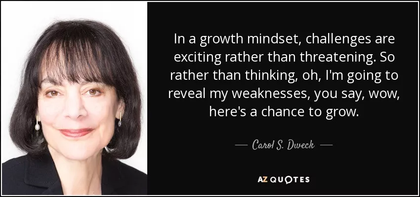

## 天生不聪明

因为我在慕课网上讲了几门算法课程，所以经常收到一些同学的提问。除了技术性的问题，一个很常见的问题就是：老师，我觉得算法好难，自己不够聪明，要花好长时间才能理解一个算法，刷题效率也很低，半天能过一道题就不错了，我该怎么办？

关于如何学习算法，如何刷题，或者到底要不要刷题，有时间我再写更多的文章总结。有兴趣的同学，可以先参考我之前的文章[《如果高效学习有什么秘诀的话，那就都在这里了》](../2018-04-18/)，相信也会有不小的收获。这篇文章，我想探讨一下“聪明”这个话题 ：）

---

**1**

和大多数人一样，我也是一个从小渴望聪明的孩纸。可是，依然和大多数人一样，我的身边有着无数比我聪明，让我无时无刻不意识到，自己是如此之笨的孩纸。那些聪明的别人家的孩子，或者反应更快，或者理解力强；奥数不用学就将近满分，英语课文读一遍就能背下来；更重要的是，在大家都情窦初开的年纪，他们把起妹来还花样百出，妙语连珠，见多识广，这实在是太！让！人！懊！恼！了！

于是，我在初中下决心好好学习一下怎么变聪明——通过这个举动，你可以看出我是多么不聪明的孩纸。我到家门口的新华书店，用可以买5本机器猫漫画的“巨款”，买了一本类似叫做《如何变聪明》的书。然后，就没有然后了。那本书讲的是什么，我现在已经完全忘记了。但是我敢肯定的是，我没有看完它。因为，我意识到了，这本告诉我如何变聪明的书，是无论如何都不能让我变聪明的。或许那时，我是绝望的，坚信自己只能这么不聪明下去了。但是现在回头看，我发现自己很可能在那时，就接近了一个真理。

 

**2**

随着年龄的长大，我慢慢发现了一个现象。那些小时候我认为极度聪明的小伙伴们，长大以后，似乎并没有像我曾经坚信的那样，干出一番大成就。当然，我这么说为时过早。我的那些小伙伴们都还年轻，人家可能10年后20年后就会干出一番大成就，甚至拯救全人类。只不过，在现阶段，大多数人的成就，在我看来，和他们的聪明程度是不成正比的。

有一天，我和老婆闲聊，说起了这个话题。老婆是心理学博士。而“聪明”这个话题，其实是心理学领域一直在研究的话题。可能一般人对心理学的认识都是《无间道》里的陈慧琳那个角色，洋气的称呼叫shrink，坐在那里倾听人的烦恼，缓解别人的情绪，而已。

但其实，心理学所包含的内容比“心理疾病”或者“情绪失调”要广袤的多。简单来说，只要和你的大脑的思考有关，就是心理学家感兴趣的话题。而“学习”这个事情，是所有人都必然会经历的一种大脑活动，自然也是心理学家的研究重点。在心理学，更专业的术语叫“认知能力”。我们是如何认知的？什么在影响我们的认知？怎么提高我们的认知？这些统统是心理学研究的范畴。而对于“聪明”这个因素，早就被一票野心勃勃想解开人类大脑之谜的心理学家们关注多年了。

 

**3**

在心理学界，最经典的和聪明相关的研究，应该是属于斯坦福大学的心理学教授Carol S. Dweck的。

Dweck教授对聪明的研究，首先从一个很简单的问题开始，**聪明到底来源于哪里？**有的人认为聪明是天生的；有的认为聪明是后天的。这两种说法都有道理，但我们却无法实际去检验。我们很难对一个人为定义的抽象概念——聪明，去客观地探讨它的来源。所以，Dweck教授将关注点放到了另一个地方：**不同的人认为聪明源自哪里？**

于是，Dweck教授找来了57个三岁的孩子，用尽一切手段，尽量客观的来获得这些小孩子对聪明的看法：**聪明到底是天生的？还是后天学习来的？**当有了这个样本以后，Dweck教授的团队跟踪这些小孩子直至小学四年级——整整七年。结果发现：**认为聪明是后天学习来的孩子，学习成绩明显的高于相信聪明是天生的孩子。**

可能有的同学会质疑。毕竟三岁的孩子，在表达对如此抽象的问题上，会有不小的偏差。尽管Dweck教授在研究过程中已经使用各种手段，想尽办法获得孩子们的真实想法了，但还是会显得说服力不够强。所以，Dweck教授进行了新的一轮实验。这次，实验对象是美国的初中生。

和中国一样，大多数美国学生，在进入初中阶段，数学成绩会产生大幅度下降。这其中的原因很多，有学习内容产生巨大变化的原因，也有学生进入青春期的原因。这些原因不是Dweck教授关注的重点。Dweck教授关注的是，**不同学生对聪明的看法不同，是否会在这个阶段造成他们数学成绩的差异？**

于是Dweck教授找来了373名美国刚上初一的学生，询问他们对聪明的看法。初一的学生已经可以完全清楚地表达自己的观点了，甚至很多学生已经有了相当成熟的体系性思考。Dweck教授拿到这373名学生对聪明的看法之后，跟踪他们直至初二结束。结果发现：**相信聪明是天生的学生，数学成绩持续下降；而那些相信聪明是后天的学习可以弥补的学生，数学成绩是不降反升的！**

 

**4**

上述实验，只是Dweck教授观察得到的结论。只是观察，是无法满足科学家们的好奇心的。所有的科学家都是好奇宝宝，像小孩子一样，观察完以后，一定要用手捅捅自己的研究对象。Dweck教授开始了她的下一个实验。

这次，Dweck教授找来了99个数学成绩在初一有所下滑的学生，把他们分成两组，分别给他们“开小灶”。不过，对于这两组学生，开小灶的内容是截然不同的。

对于第一组同学，Dweck教授给他们上“补习班”——讲解具体的数学知识点。数学考不好？来来来，课后我们多做点儿练习。

对于第二组同学，Dweck教授则给他们用近八周的时间，开展了一场别开生面的“认知神经科学”基础课。课程的内容，主要就是向大家传授当前认知神经科学的最新研究成果：**人类的大脑是如何学习到知识的？答案是通过不断的思考。在不断地学习和思考的过程中，人的大脑内部产生着剧烈的神经活动，迫使脑神经之间建立了更多的连接。随着神经元之间连接越来越多，我们对问题的认识也就越来越深刻，遇到类似问题反应也会越来越快。不仅如此，甚至还能触类旁通，举一反三，乃至和其他的领域结合，产生创新性的想法。这表现出来，就是你更聪明了。**

换句话说，Dweck教授在想尽办法，用科学的事实，告诉第二组学生：聪明是可以靠不断的学习，思考获得的。至于你们学什么，怎么学，我不管，你们看着办！

在给这两组学生加完“小灶”之后，Dweck教授又跟踪了一年这两组学生的成绩，第一组学生的成绩继续持续下降；而第二组学生的数学成绩停止了下降，甚至有所提升。

Dweck的实验告诉了我们，**我们对聪明的看法，会影响，甚至是严重影响我们的表现！**

 

**5**

为了凿实这个实验结论，Dweck教授做了一组最为经典的实验。

他找来了400个五年级的小学生，让他们做一套智力测验。之后，Dweck教授把这400个学生分成两组。不管他们的成绩如何，Dweck教授都对第一组的同学说：**这个测试非常难，你能拿到这个成绩，说明你特别聪明；**而对第二组的同学说：**这个测试非常难，你能拿到这个成绩，说明你特别努力。**

然后，Dweck教授让这400个学生再做一次智力测试。这次，所有的同学有了选择：他们可以选择做一套和上次一样难的测试；也可以选择做一套更难，更具有挑战，但被Dweck教授形容为也是更有趣的测试。结果，**被夸努力的学生，有92%选择了比上次更难的挑战；而被夸聪明的学生，则只有33%选择了比上次更难的挑战。**

为什么？或许是因为“偶像包袱”。被夸聪明的同学，怕自己做了更难的问题，错误太多，就显得自己不是那么聪明了。

最后，Dweck教授让这400名学生做第三次智力测试。这次测试的问题，和第一次的难度相同。结果，**被夸努力的学生，整体成绩上升了近30%，而被夸聪明的同学，整体成绩下降了20%**。

为什么？被夸努力的学生，大部分同学都接受了更难得挑战。做过难的问题，再做普通的题，普通的题就变得简单了。至于被夸聪明的同学，或许是因为患得患失，生怕自己做错了被别人说其实你不聪明，结果，成绩反而下降了。

Dweck教授因为这一系列著名的实验，极大地改变和完善了人们对学习，自我认知，教育等领域的看法。她获得了美国心理学界的至高荣誉——心理学杰出科学贡献奖；同时获得了教育研究领域的“诺贝尔奖”——一丹奖。她现在是美国文理学院的院士。虽然她的研究也有不小的争议，但现在，她仍然坚持在自己的领域为世界做着贡献。

 

**6**

相信大多数同学都看懂了，Dweck教授的实验，告诉了我们一个血淋淋的事实——**人们对聪明的看法，会极大地影响人们的行为**。聪明有没有天生的成分？大多数心理学家，认知科学家和脑科学家还在研究。但是，Dweck教授告诉我们的是：**聪明不是固定的。只要你相信聪明是靠努力可以弥补的，并且努力下去，你就会变聪明。**

我们现在可以回到文章开头的问题了：觉得算法好难，自己不够聪明，要花好长时间才能理解一个算法，刷题效率也很低，半天能过一道题就不错了，我该怎么办？

对此，我的回答是：对不起，我没有更好的方法。并且，我坚信，不仅我没有，这个世界上根本不存在这样的一个方法。我经常使用反证法来阐述这个问题：假设这个世界存在一个简单、可行、快速、高效的学会算法的方法，那么，所有的人早就使用这个方法学习算法了，所有的人也早就成为算法大神了，算法也就不是什么让人头疼的事情了。可这是和现实不相符的。所以，这个方法不存在：）

以上证明不仅适用于算法学习，对各个领域的学习都适用。

但是，如果能给你一点安慰的话，我想实话告诉你：在我刚开始接触算法的时候，我也觉得算法好难，自己不够聪明，要花很长时间才能理解一个算法，刷题效率也特别低，别说半天一道题了，一个礼拜死磕一道题都是家常便饭。

**或许，你我都是天生不聪明的人。**

**不过，好在，天生不聪明似乎并没有什么关系。因为，只要你相信聪明是靠努力可以弥补的，并且努力下去，你终将变得很“聪明”。甚至，你会超越这种“聪明”，理解一个很嘻哈又很深刻的道理：聪明不是什么大不了不起的事儿：）**

据统计，无论是诺贝尔奖的获奖者，还是美国总统，平均智商都和普通人没有有显著差距。而和普通人智商有巨大差异的群体，门萨高智商俱乐部应该是典型了。可惜，很少听说门萨高智商俱乐部的成员，在任何领域，是的，任何领域，对世界，对社会有重大的贡献。

除了一堆稀奇古怪的智力题。

 

**7**

我用了这么长的文章，回答了一个问题。其实最后答案是一句废话：要努力。换句文绉绉的表示法，就是：**万事无他，唯手熟尔**。

当然，我也承认，只是努力，可能并不够。或者说，至少，还有改进的余地。人生是一个维度极其丰富的过程，用任何一个单一维度去解释它，都是极其幼稚可笑的。比如，我就认为，另外一个非常重要的维度，叫做“选择”。我们经常听到互联网上的一种声音：选择大于努力。对于这个观点怎么看？大家可以期待一下我的一篇文章，我会聊聊我对于“选择”的看法。
