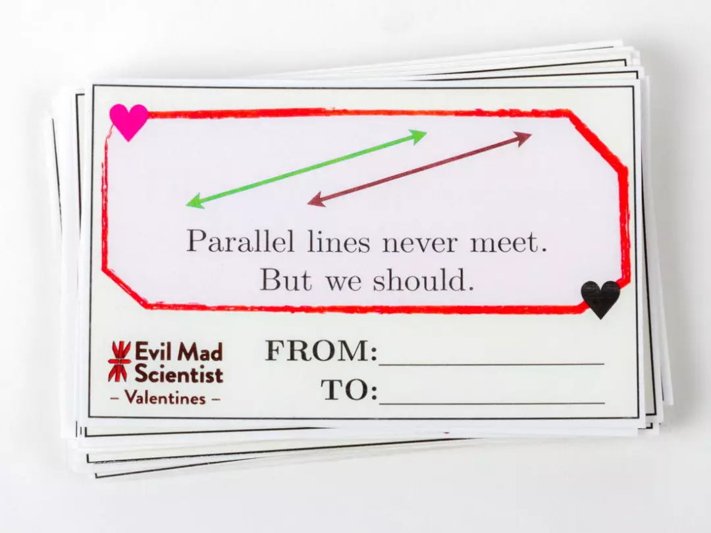
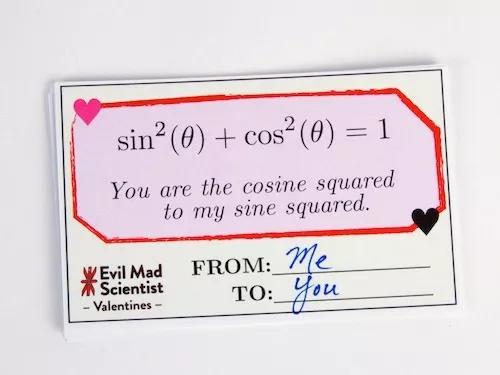
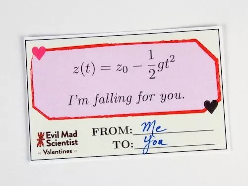
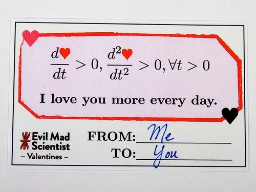
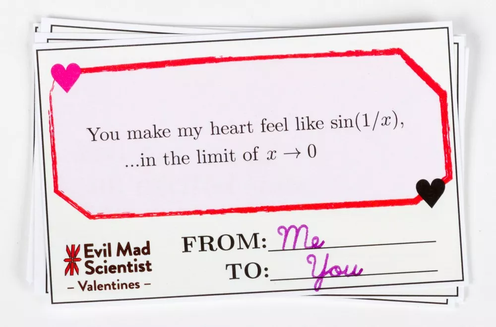
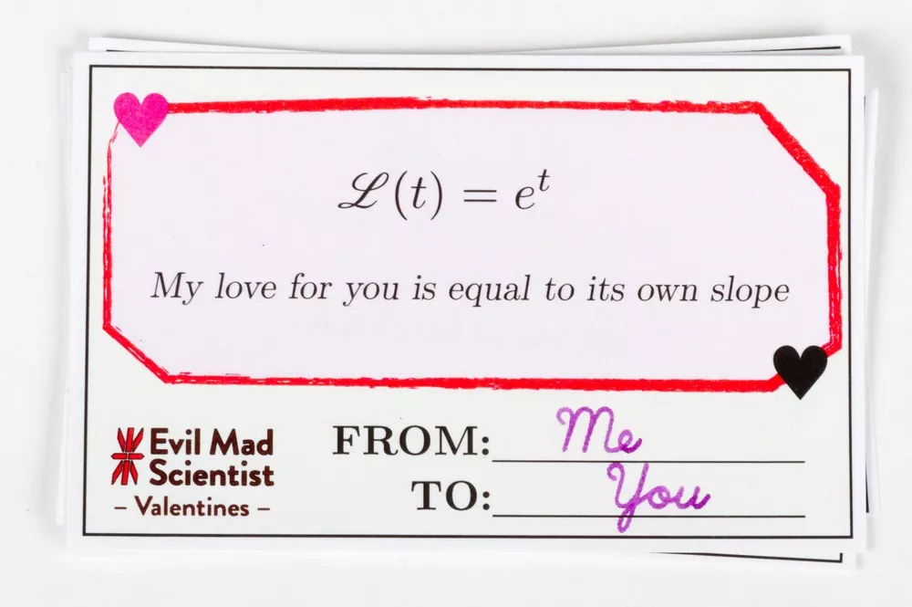
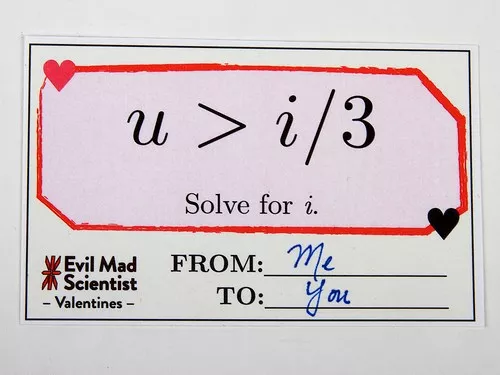

## 七夕节，给他这样一张贺卡，让他秀一下智商：）

七夕节到了！各位理工男的女朋友们，是不是到时候让你们的另一半秀一下他一直引以为傲的智商了？嘿嘿，怎么让他秀？来来来，这次七夕节，我给各位理工男的女朋友们推荐一套专门寄给理工男的情人节卡片。

这是国外的一个小有名气的小众组织：Evil Mad Scientist设计的一套情人节表白卡片。专门用来寄给极客群体，顺便具有测智商的奇效：）（其实是测数学有没有好好学...）

这套卡片数目不少，我挑出来了七张给大家分享。（我才不会告诉你是因为我只看懂了这七张呢）

那为什么是专门给理工男的女朋友们推荐的呢？理工女的男朋友们呢？

根据很（wo）多（ji）人（ji）的经验，咳咳咳（前方重要提醒）：请各位男士准备好荷包，大大方方的买买买！寄送以下卡片会死的很惨。

好啦，各位ladies，It's show time！

---

首先，来一组很直白的：

 

下面的晦涩一些：）

 

最后，是我最喜欢的，但或许，是最不严谨的：）

---

如果留言区的留言不能覆盖这七张贺卡的正确解释的话，下周我将单独发文公布正确答案。

祝天下有情人终成眷属：）

七夕快乐。