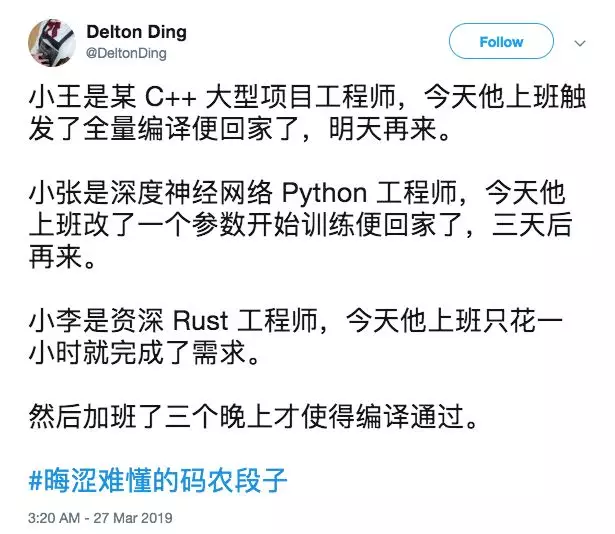
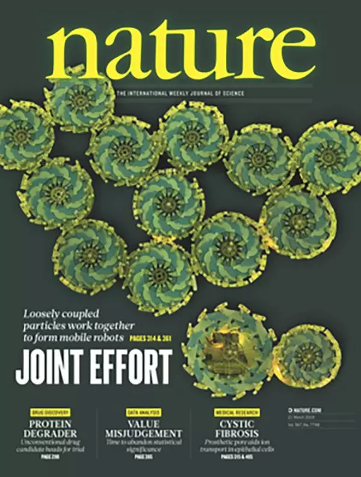
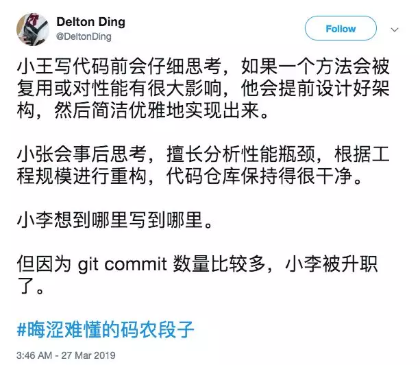

## 哈哈哈！晦涩难懂的码农段子，和。。。拥抱未来：）

今日最佳码农段子。来自Twitter @Delton Ding

> 小王是某 C++ 大型项目工程师，今天他上班触发了全量编译便回家了，明天再来。 
>
> 小张是深度神经网络 Python 工程师，今天他上班改了一个参数开始训练便回家了，三天后再来。 
>
> 小李是资深 Rust 工程师，今天他上班只花一小时就完成了需求。  
>
> 然后加班了三个晚上才使得编译通过。

哈哈哈哈哈，玩儿推的同学，快去关注他！

---

虽然这个段子主要是黑rust的。但是，仔细体会，其实也顺便把C++和深度学习黑了一下。

黑rust的这个点，我有时间想单独写篇文章，今天轻松一些，就不谈这么深入了。其实，不仅仅是rust，很多语言都有着令人发指的语言特性。本周我的文章[《编程语言的发展趋势：从没有分号，到DSL》](../2018-03-27/)里，我一直在说：**编程语言的一大发展趋势，就是越来越是给人看的，而不是给机器看的。**但现代编程语言中，依然有很多语法特性，是在惨绝人寰地违背这个原则。不仅仅是rust，从我的角度看，就算大红大紫的Python, JS, Swift，也有很多类似这样的语言特性。这是一个很有意思的话题，我慢慢写，或许能写成一系列文章：）

另一方面，这个段子本身，蛮有时代的印记的。如果放在十年前，不要说看懂这个段子了，其实，这个段子里小张和小李上班用的技术（深度学习和rust），还没出现呢（更准确的说，还不可能是普通上班的码农掌握的技术呢）。但是，十年后，这些技术已经可以成为段子，在码农圈儿被津津乐道了。可以想象，十年后的笑话，我们今天还看不懂呢。但是，我却已经迫不及待地想看十年后的笑话了。

今天，我又看了一篇关于医学的技术报道。在最近几年里，关注技术越多，我越倾向于相信：**21世纪是生物医学的世纪。**

首先，人类有足够大的动力去研究生物医学——延长生命，对抗疾病。不仅仅每一个个体有这样的需求，人类整体作为一个生物物种，也有着这样的目标。我们不难想象，一个个大富豪们，会在晚年（或者中年），将大量的钱财，都投入到生物医学领域。实际上，现在，已经有很多人这么做了。

其次，计算机的发展，已经为生物医学的发展奠定了相当的基础。由于人类基因组测序工作已经基本完成，海量的数据就静静地躺在那里，等待人类挖掘。同时，摩尔定律已然见顶，量子计算呼之欲出。算力本身越来越不是问题。**很多生物医学问题，本质已经被转换成了一个个计算问题。国外一些算法课程的课后大作业，已经是设计一个算法，解决一个生物学或者医学的问题了。**

当然，还有更多生物医学技术的问题，还远远不是计算问题，需要生物医学的专业知识，才能创新性地解决。这些问题的答案还躺在黑暗中，等待人类去发现。所以，生物医学技术工程师会被越来越多的需要。至于计算机专业？嗯，生物医学技术工程师们也需要各种软件工具，来完成他们的研究；就好比我们软件工程师也需要硬件工程师们发明的各种硬件，来执行我们的程序一样。又回到了[《学算法有什么用？唉，对你来说，可能真没用》](../2018-03-18/)中的观点：**“分工”本身就是经济学的基础概念之一，是我们这个世界能够良性运转逐渐发展的诸多核心规则之一。**

今天科技界的一大新闻，是深度学习三巨头斩获图灵奖。仔细思考，其实**深度学习，或者深度学习的底层架构——神经网络本身，也是计算机和生物科学的一种融合——用计算机去模拟大脑的神经元**。如果去看神经网络之父Geoffrey Hinton的背景，就会发现，他有着非常坚实的认知神经科学的背景。认知神经科学已经渐渐成为了一个单独的分支，横跨生物学，医学，心理学。主要研究的，就是大脑认知的机制。虽然，我们现阶段对大脑认知的机制，理解的还相当浅薄，但是这些浅薄的认知，已经能够帮助我们产生出像深度学习这样的技术，让我们看到人工智能的曙光（虽然离强人工智能还很远很远）。未来，更加的前沿的研究工作，和突破性进展，近乎将离不开生物科学的影子。

最近科研圈的另一个大新闻，是一名年轻的华人博士后的一作论文，登上了nature杂志的封面。他的研究成果——仿细胞集群机器人系统，又和生物学相关。是机器人领域和生物学的结合。

一想到软件行业和所有行业一样，逃不出行业周期的“大势”，也会没落，不禁黯然神伤。但是，**人类毕竟要向前，我们能做的，只能是去拥抱未来。**而且，短时间内，互联网行业的红利期还远不会结束。相信每一个学习计算机的同学都能感受到这一点。不信，去和那些其他理工科专业的同学，比如材料，化学，电控，等等，比比看。**在绝大多数情况下，我们必须承认，我们付出的努力更少，收到的回报更大。**

哎，本来想轻松一些，结果越写越沉重。那最后，再给大家奉献一个段子吧。同样来自Twitter @Delton Ding

> 小王写代码前会仔细思考，如果一个方法会被复用或对性能有很大影响，他会提前设计好架构，然后简洁优雅地实现出来。 
>
> 小张会事后思考，擅长分析性能瓶颈，根据工程规模进行重构，代码仓库保持得很干净。 
>
> 小李想到哪里写到哪里。 
>
> 但因为 git commit 数量比较多，小李被升职了。

哈哈哈。

**新的一天，拥抱未来。大家加油！：）**
