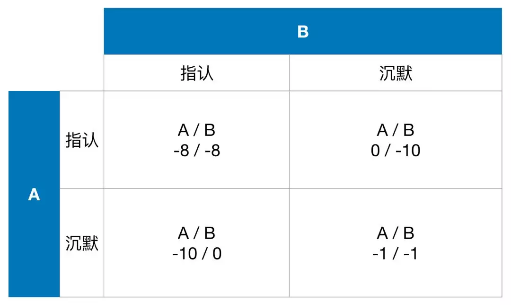
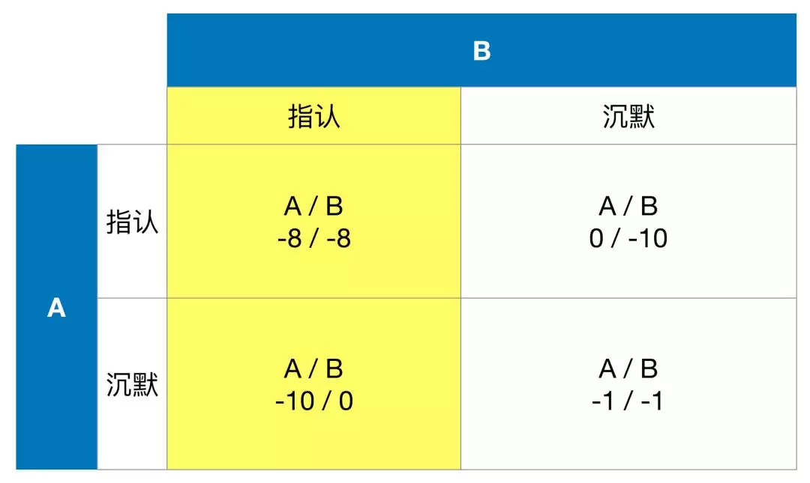
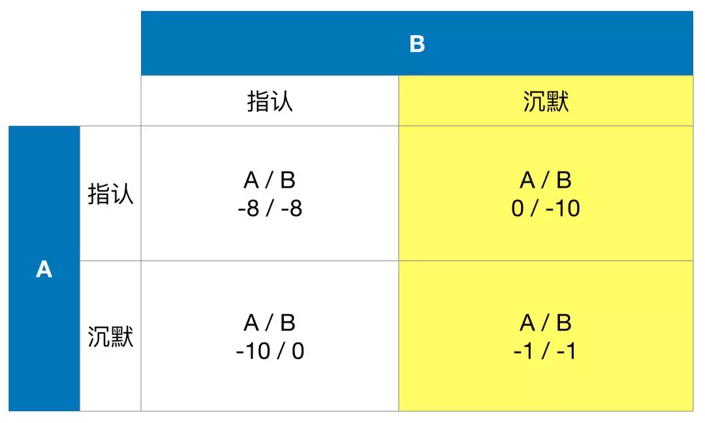
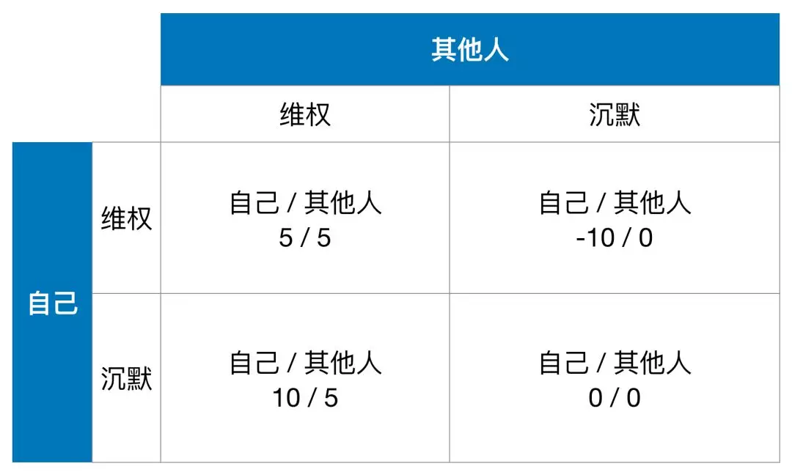
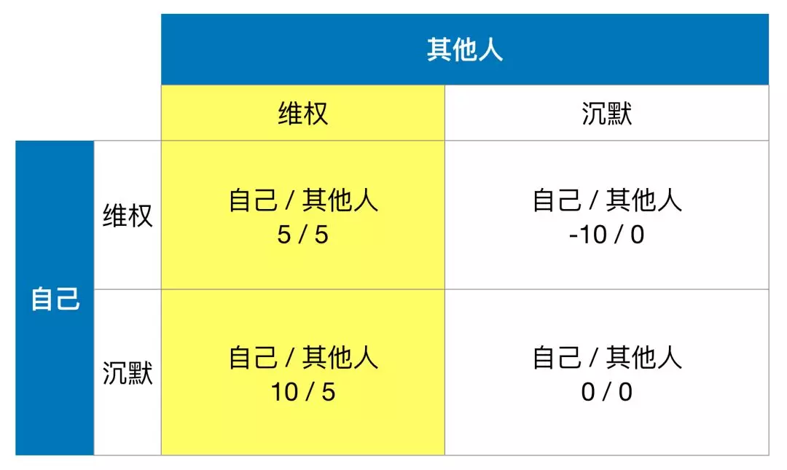
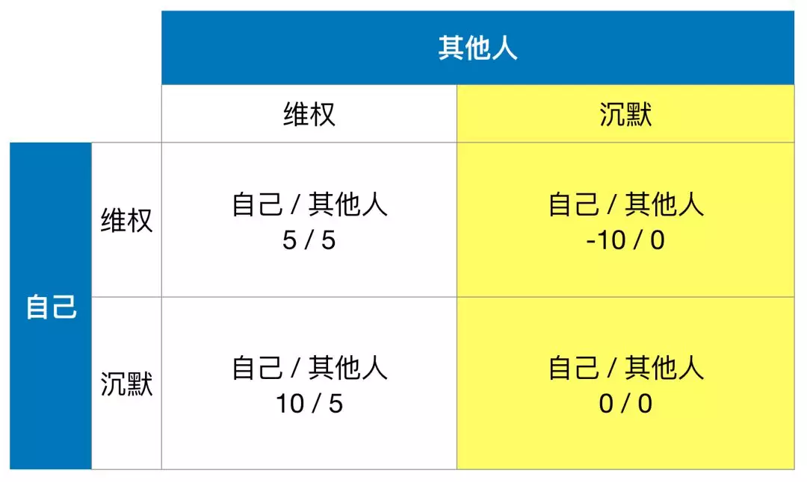

## 我们每个人都是囚徒。996.ICU与囚徒困境。

**1.**

996.ICU这个项目彻底火了。在我写这篇文章的时候，这个项目已经获得了6.8万多的star。

我估计看到这篇推文的时候，应该已经不会有互联网人不了解这个项目了。简单说，就是有位大佬，注册了一个域名 [https://996.icu](https://996.icu)，控诉国内互联网企业蔚然成风的996工作制，同时，将这个项目放到了程序员专属社区——github上。

如果打开996.icu的网站，你会看到，这份控诉包括：

1）对996工作制的解读；

2）对996工作制所违反的中华人民共和国《劳动法》的列举；

3）以及最后，对三个典型企业实施996工作制的描述。

这个网站最后，还为大家算了一笔经济账：按照劳动法规定，996 工作制下，只有拿到当前工资的 2.275 倍，才是正常的。

最后，是一个响亮的口号：什么是 996.ICU？工作 996，生病 ICU。

如果你还没有访问过这个网站，可以直接点击[这里：https://996.icu](https://996.icu)。

 

**2.**

首先，我是非常赞赏这位大佬的做法的。同时，也是非常支持大家为这个项目点赞的。我个人也在第一时间，为这个项目点了赞。为自己遭遇的不公发声，或者为周围人遭遇的不公发声，这本身在中国，就是一个很稀缺的品质。我们在文化上，就有一股“多一事不如少一事”，“能忍则忍，小不忍则乱大谋”的基因。即使吃了亏，也会安慰自己“吃亏是福”，“塞翁失马”。社会上，我们更不在一个有不断发声传统的政治氛围里。现在，突然有人站出来，发起这样的一个项目，大家一起用点赞的形式表达一下心声，没有一点毛病。

但是，对于这个项目，在我点赞以后，却又有些失落。点了赞，又怎样呢？我不知道我还能做什么，可以改变现状。我完全可以想象，很多义愤填膺的程序员朋友们，点赞，在issue中留言，表达自己的观点，阐述自己的境遇，之后，可能就在同一天，依旧晚上九点，拖着疲惫的身躯回家，没有X生活。而自己的直接领导，搞不好，他们也偷偷在996.ICU项目上点了赞。只是面对自己的下属不声张。但同样在晚上九点，甚至更晚，和你一样，拖着疲惫的身躯回家，没有X生活。大家都没有财富自由，大家都是打工讨生活，大家都是一样的。

点赞无法让企业有任何改变，因为企业吃不到点赞的苦头。这就是为什么，国外的各个行业，一旦遇到看似无法调和的问题，都会组织罢工。因为，罢工，将导致企业利益的损失，才能让企业真正的重视起大家的诉求。

当然，我并不是特别赞同罢工，**更好的方式还是拿起法律的武器**。毕竟，工作时长和超出工作时长如何做出经济补偿，是被《劳动法》明确规定的。如果确定自己所在的企业违反了《劳动法》，为什么不能拿起法律的武器？中国法律真的只是txt，不是exe？**我们不是一直在强调：要依法治国？！**

 

**3.**

但是，无论是组织一场罢工，还是拿起法律的武器，都是有难度的。我很理解。因为其实，大家都陷入在一个囚徒困境的局面中。

为了更清晰的解释：为什么大家在这个事件中，都陷入了囚徒困境，我先简单的解释一下，什么是囚徒困境（虽然我相信，很多同学都了解囚徒困境）。

囚徒困境是一个经典的博弈论模型。

假想有两个罪犯合作犯罪，被警察逮捕了。但是警察证据不足，无法直接给他们定罪。因此，警察将这两个罪犯分隔开，分别劝说他们指认对方。

警察制定了这样一个规则：

对于每一个罪犯，如果和警察合作，指认对方，但是对方却拒不合作，保持沉默的话，那么和警察合作的罪犯将无罪释放，但是，另一个罪犯，要被判10年；

如果两个罪犯都指认了对方，对不起，你们犯罪事实确定，鉴于和警察合作，少判一点儿，两个人各判8年；

但如果两个人都不合作，互相不指认对方，警察没办法给他们定重罪，但可以让两个人各被判1年。

这个规则说出来好像很复杂，但用一个表格表示，非常简单清晰：

现在，假设你是某一名囚犯A，你会选择指认，还是沉默？

由于，你不知道另一名囚犯B的决策，所以，你会分情况讨论。

假设囚犯B会指认你的话。那么此时，如果你选择指认，你将被判8年。但是，如果你选择沉默的话，你将被判10年。显然，选择指认，对你更好。

假设囚犯B会选择沉默的话。那么此时，如果你选择指认，你将无罪释放。但是，如果你选择沉默的话，你将被判1年。显然，依然是，选择指认，对你更好。

因此，不管B怎么选，对于你来说，都是选择指认更好。

由于这个表格是完全对称的，所以，对于B来说，也将得到完全一样的结论。不管你怎么选，B都是选择指认最好。

这样一来，一个奇怪的事情发生了。对每一个人而言，都是选择指认最好，最终的结果，将必然导致两个人各判8年。这比两个人都选择沉默，付出的代价要高得多。可是，每个人都是从个体利益最大化的角度做出的选择，怎么分析，怎么没毛病，但最终的结果，却陷入了于整体而言，最差的结果。

这就是囚徒困境——这个经典数学模型，向我们展示的一个非常重要的社会学，经济学上的现象：**局部的最优化决策，不一定指向整体最优化，相反的，甚至可能指向对整体而言，最差的结果。**（专业术语是，达到了纳什均衡，或者是达到了非合作博弈均衡。这个均衡点的位置，和结果的”好坏“，没有必然联系。）

当然，囚徒困境本身，还可以有更多可以更深入讨论的地方。条件的改变，假设的改变，都会影响最终结论。同时，这个模型也有更多的应用，帮助我们揭示很多社会上，生活中的现象。在这里，我们就不过多地去讨论了。如果理解了上面这个最基础的模型，就已经足够来看下面的问题了。

 

**4.**

现在，我们来看一看，为什么在企业用工996这件事情上，大家陷入了同样的囚徒困境。

此时，每一个人都被996的工作制度压迫着。每一个人都有选择：或者拿起法律的武器维护权利；或者沉默，等待其他人拿起法律的武器维护权利。此时，上文中的A和B，变成了”自己“和”其他人“；“指认”和“沉默”两个动作，我给修改为“维权”和“沉默”两个动作。那么，我就可以得到下面的表格：

简单解释一下，从左到右，从上到下，介绍这四个格子的数值：

如果你选择维权，其他人也选择维权，那么所有人都联合起来，维权就会成功，那么大家都有收益。我将这个收益记做5。所以，左上角的格子是5 / 5；

如果你选择维权，但其他所有人都沉默。那么你将承受巨大的成本和压力，而且由于一个人力量太渺小，维权近乎一定不会成功，你可能产生巨大的损失，我记为-10。同时，由于你的维权不会成功，其他人的境遇也不会发生改变，我记为0。所以，右上角的格子是-10 / 0；

如果你选择沉默，其他人一起维权，那么这个维权活动，不会因为少你一个人有什么改变，也是会成功的。所以，大家都有收益，我记为5。但是要注意，于你而言，由于你没有参与，所以你没有付出时间成本，也没有承担风险，但维权成功后，你的工作状况也变好了。换句话说，你没有参加维权，却能享受到维权成功后的好处。因此，你的收益是更高的（因为没有支出）。我记为10（比5高）。所以，左下角的格子是10 / 5；

最后，如果你和其他所有人都沉默，那么什么都不会改变。大家都是0。右下角的格子是0 / 0。

现在，我们就分情况来分析，对于你来说，到底要不要站出来维权？

如果其他人决定维权。那么对于你来说，加入维权，收益为5，选择沉默，收益却是10。你会选择沉默。

如果其他人都沉默。那么对于你来说，加入维权，收益为-10，选择沉默，收益是0。你还是会选择沉默。

这个模型，对所有人都是成立的。所有人在思考自己和其他人的行为关系的时候，都会不自觉地倾向于沉默——不作为。

**我们每个人都是囚徒。**

 

**5.**

当然了，对于这样一个复杂的社会问题，使用这样一个简单的博弈论模型，去下定论，是片面的。但是，使用这样一个简单的模型，确实也能展现出问题的一个侧面：为什么很少有人会激进地拿起法律武器，或者鼓动大家一起罢工。因为大家都是理性的。自觉不自觉地，大家都意识到了，沉默，是更好的选择。毕竟，程序员朋友们有吃有穿，工资不低。和大多数行业比起来，虽然辛苦点儿，但整体生活还是不差的。揭竿起义值不值？每个人心里都有自己的结论。

其实，曾有过很多朋友，跟我吃饭闲聊，抱怨公司的996制度。面对这个话题，通常我都是很有人情味儿地先同情一番，之后又很不近人情地指出：为什么不去使用法律的武器保护自己。嗯。这样做一阵子以后，我的朋友们都再也不跟我探讨996的问题了。

在这里，我完全没有指责我的这些朋友的意思。我真的非常非常理解他们。囚徒困境向我们展现了，人性就是如此。如果是我，恐怕也不会那么轻易，就拿起法律的武器和企业死磕。**我想，我会从告诉领导，”对不起，家里有事儿，我不能加班“开始。其实，如果所有人都能这么做，事情也会得到很大的改善。**

但是显然，事情不是这样的，要明白，对于很多人来说，996其实是一个机会。**相比起用业绩来说话，用加班来展现出自己对公司的贡献，实在是太简单的一种方式。**

如果所有人都不加班，就你加班，你肯定有好处；

如果所有人都加班，你也只能继续加班，否则，你很可能有坏果子吃。

里外里，选择加班都是对自己更好的决策。所有人都这么想。

**瞧，我们又陷入了囚徒困境。**

 

**P.S.**

这篇文章最后的[阅读原文](https://996.icu)链接，我送给996.ICU这个项目的官方网站，表达我的支持。

虽然我们都是囚徒，但我依然相信，一切都在向着更好的方向前进。这个项目的出现，就是证明。

大家加油！：）