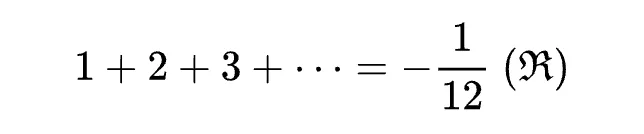

## 1 + 2 + 3 + ⋯ + ∞ = -1/12？这不是一个愚人节玩笑。

1 + 2 + 3 + ⋯ + ∞，结果是多少？当然是正无穷了！嗯。这个答案显然没毛病。不过，在这篇文章中，我将严谨的证明出：1 + 2 + 3 + ⋯ + ∞也可以等于-1/12。你没有看错，无穷多的连续自然数的“和”，也可以是一个负数；不仅如此，还是一个负分数。这并不是一愚人节的玩笑：）

和所有的数学证明一样，如果对于一个命题，通过不同的计算或者思路，我们可以求解出两个不同的答案，或者相互矛盾的结论的话，通常，我们对此一定能找到一个合理的解释。或者是其中的一个证明是错的，或者是讨论问题的角度是完全不同的。

最简单的例子：初中认真学习数学的同学一定知道：初中数学的一大重点是一元二次方程，对应在解析几何中，就是大名鼎鼎的二次函数：抛物线。在初中，我们经常会说，一个一元二次方程没有解。但是，当我们将数字范围扩充到复数域的时候，我们就会明白，任何一个一元二次方程，一定是有解的。只不过，一个一元二次方程在实数范围内，可能是无解的；但在复数范围内，一定有解。你看，当我们讨论问题的范围改变了，定义改变了，就会得到截然不同，甚至是完全相反的结论。

要看懂这篇文章，你只需要有初中水平的数学知识就够了；在文章最后，我会简单阐述为什么会有这样反直觉的结论，这部分内容，需要你有本科高等数学的基础知识，大一上的高等数学就够了。但是，如果有些同学在本科或者研究生学习过复变函数的话，就会明白，这个问题背后，隐藏着更加深刻的内容，结论和应用。对于这些内容，由于篇幅原因和定位原因，这篇文章不会涉及。所以，如果你系统学习过复变函数，这篇文章毫无价值，至此结束：）

---

下面，为了证明出 1 + 2 + 3 + ⋯ + ∞ = -1/12，我们先来证明另外两个结论。

第一个结论：

**1 - 1 + 1 - 1 + ⋯ = 1/2**

即1，-1这两个数字交替出现的无穷序列，其和为1/2。

 

我们假设这个和存在，记为A，则：

A = 1 – 1 + 1 – 1 + 1 – 1 + ...

所以，1 - A = 1 - (1 - 1 + 1 - 1 + 1  ...)

如果我们把小括号去掉：

1 - A = 1 - 1 + 1 - 1 + 1 - 1 + ...

前两项 1 - 1 的结果显然为0，我们的式子就变成了：

1 - A = 0 + 1 - 1 + 1 - 1 + ...

等等，0后面那一串是什么？1，-1这两个数字交替出现，就是 A 啊！所以，我们得到了：

1 - A = 0 + A

所以：2A = 1，A = 1/2。得证：）

 

看，根据我们的推导，一连串整数的和（1和-1），结果竟然是一个分数。

下面，我们来证明出另外一个结论：

**1 - 2 + 3 - 4 + 5 - 6 + ⋯ = 1/4**

即，自然数序列，但是符号是正负交替的，这一系列整数的和为 1/4。

我们假设这个和存在，记为B，则：

B = 1 – 2 + 3 – 4 + 5 – 6 + ...

下面，我们要使用一下上面我们证明的A序列。我们用A减去B，则有：

A - B = (1 - 1 + 1 - 1 + 1 - 1 + ...) - (1 - 2 + 3 - 4 + 5 - 6 + ...)

如果将小括号去掉，并且让A的每一项都和B的对应项配对，就有：

A - B = (1 - 1) + (-1 + 2) + (1 - 3) + (-1 + 4) + (1 - 5) + (-1 + 6) + ...

我们计算出每个小括号的结果，他们是有规律的：

A - B = 0 + 1 - 2 + 3 - 4 + 5 + ...

发现了什么？A - B 的结果，就是 0 再加上B这个序列和！

A - B = 0 + B

所以： 2B = A

又因为，我们上面已经证明出了，A = 1/2，所以：

B = 1/4

WOW！我们离我们的目标已经很接近了。

 

下面，我们就来证明：

**1 + 2 + 3 + 4 + 5 + 6 + ... = -1/12**

我们假设这个和存在，记为C，则：

C = 1 + 2 + 3 + 4 + 5 + 6 + ...

下面，我们要使用一下上面我们证明的B序列的和。我们用B减去C，则有：

B - C = (1 - 2 + 3 - 4 + 5 - 6 + ...) - (1 + 2 + 3 + 4 + 5 + 6 + ...)

依然是，我们将小括号去掉，并且让B的每一项都和C的对应项配对，就有：

B - C = (1 - 1) + (-2 - 2) + (3 - 3) + (-4 - 4) + (5 - 5) + (-6 - 6) + ...

发现规律了吗？B-C 的所有奇数项都为0，偶数项则是: -2-2=-4, -4-4=-8, -6-6=-12, ...

所以，我们有：

B - C = 0 - 4 + 0 - 8 + 0 - 12 + ...

B - C = - 4 - 8 - 12 - 16 - 20 - ...

B - C = -4(1 + 2 + 3 + 4 + 5 + 6 + ...)

看看小括号里是谁？就是C啊！所以：

B - C = -4C

我们得到：-3C = B

再将之前证明得到的B = 1/4 带进去。得到：

C = -1/12。得证：）

其实，为了证明出这个结果，还有其他的方法。但我觉得这个方法最简单，小学生都能看懂：）

 

**“问题”出在哪里？**

好了，我们已经非常“严谨地”证明出了：1 + 2 + 3 + ⋯ + ∞ = -1/12。但这显然和常识不符合。无穷的正整数的和，怎么可能是个负数？还是个分数？问题出在哪里？

如果同学们仔细看我上面求解A, B, C三个无穷序列的和的过程，就会发现，我一直再说这样一句话：

**我们假设这个和存在，记为A(或B, 或C)**

问题的关键就在于。这个和真的存在吗？

答案是，在我们通常的研究范畴中，这个和是不存在的。熟悉高等数学的同学会知道，我一直在做的事情，其实就是在计算一个无穷数列的和，即在高等数学中的无穷级数求和问题。一个无穷数列的和可以被计算出来，其前提条件是，这个无穷序列是收敛的。但是，上面A, B, C这三个序列都是发散的（具体证明在这里省略，有兴趣的同学可以复习/学习一下，如何判断无穷级数的敛散性）。所以，**“假设这个和存在”中的假设根本不成立，把他们记为A, B, C也就没有意义，后面的推导都没有意义。**

但是！所有的事情，似乎都有“但是”：）

和前面举的一元二次方程的例子一样。x^2 + 1 = 0，这个方程有解吗？如果我们站在实数的视角看。本质就是在问我们：根号-1的解是多少？答案是，这个数字没有意义，所以这个方程式无解的。

但是，如果一旦我们定义：根号-1是i，砰！这个方程有解了！不仅这个方程有解了，我们还发明出了数学领域的一个重要的工具——复数。这个工具，可以帮助我们解决大量的其他数学问题。

对于这个问题，是同样的。虽然通常来看，1 + 2 + 3 + ⋯ + ∞ 结果肯定不是一个值，而是无穷大。但是一旦我们将其想成一个值，却能推导出这个值是-1/12。自然数还是那些自然数，于是，数学家们说，其实，在这个式子中，我们用的加法，不是通常意义的加法，而是一种特殊的加法（具体这种加法为什么不能看做通常意义的加法？因为他不满足很多通常意义的加法性质。具体不满足哪些性质？要都写出来太繁琐了。如果大家有兴趣，有时间可以单独成文。），叫做拉马努金加法；这个和，也可以称为拉马努金和（Ramanujan Summation）。顾名思义，这一切是一个叫做拉马努金的数学家提出来的。

所以，严格意义上讲，我们应该这样表示上面的结果。

看到后面的花体大R了吗？他就表示，我们的这个结果，是拉马努金加法的结果。英文是Ramanujan Summation，取首字母R表示。

**拉马努金是何许人？两个字：天才；四个字：空前绝后。**

拉马努金是一名来自印度的数学家，没有任何家庭背景，也没有受过专业的数学训练，一路自学成才，依靠其对数学强大的直觉，不仅解决了很多数学难题，更提出了很多前无古人的大胆数学结论。他一生提出了3900多条新的数学公式和命题，这之中的很多成果，后来被证实，可以被完美地应用在量子物理学中，解决量子力学，量子场论等领域中遇到的无穷大问题。近年来，一些宇宙学家在研究黑洞的时候，也用到了拉马努金的一些研究成果。直至今日，人们还能从其研究中挖掘出宝藏。甚至，有人称拉马努金是从未来穿越回来的数学家。以后有时间，我们可以更多地介绍这个人：）

比起计算机科学家，其实我是更向往数学家的。因为数学家更纯粹。在他们解决一个个问题的时候，并不知道这些问题有什么用，或者有什么意义。**大多数数学成果，都要经过几十年后，才会在实际的科学技术中扮演应有的重要角色。预测正在进行的某些数学成果在未来会有什么重要意义或者应用，几乎是不可能的。**

所以，数学家们或许只是觉得：**这一切很美，很好玩。**