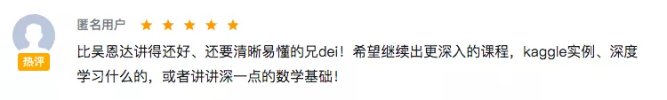

## 如何胜任真实的机器学习任务

我在慕课网上有一个机器学习算法课程[《Python3入门机器学习 经典算法与应用》](https://coding.imooc.com/class/169.html)，广受好评。甚至有人表示，比吴恩达的机器学习课程还要好。。。

这个。。。好意我心领了，但实在愧不敢当。我还要继续努力：）

 

但是，对于这个课程的售前，我见到的最多的问题，大概是这样的：

> “弱弱问一下，学了这门课能找到ai相关的工作吗？”

咳咳。

虽然有一些同学在学完我的课程后，确实成功地转入了人工智能领域，但我知道，这背后，绝不仅仅是我的课程的功劳。

他们有的是由于企业内部转岗，所以有不可多得的机会；

有的本身是数学或者物理专业，有极好的数学背景，用人单位更看重的是其自身的数学素养，而不仅仅是掌握的那些机器学习知识；

有的除了上我的课程，更是花了成百上千个小时，在其他教程，书籍上，并且辅以了大量的实践。

如果只是学习我的课程，我的回复基本都是这样的：

> 这门课程是机器学习的入门课程，以机器学习监督学习算法为主线，辅以介绍一些诸如算法的评价，方法的选择，模型的优化，参数的调整，等等内容。学习本门课程是您进入机器学习世界的第一步。但是离真正从事机器学习相关的工作还有距离。不过相信这门课程可以为您后续更为深入的学习研究工作打下基础！

嗯，看上去是不是特别彬彬有礼，特别职业？请叫我金牌客服bobobo！哈哈哈。

但是，我的内心其实是这样的：

> 亲，这门课程只有25个小时，500块钱。如果上完这节课，就能找到机器学习工作了，我觉得这门课至少值10万。

哈哈哈，只是开玩笑。我只是想说明，机器学习真的是一个很大的专有领域。要是想找到人工智能相关的工作，只上我的这个课程，是远远不够的。

在我的课程最后，我向大家具体介绍了，要想胜任真实的机器学习任务，还需要怎样继续深入学习。整体来讲，有两大部分内容：

**1.**

深度学习。这个不用说了，大红大紫。我的课程并不涉及神经网络和深度学习算法。

**2.**

特征工程。这一点，我在课程中多次强调了。当机器学习的方法大家大致理解以后，在一个具体的任务中，很多时候，都在拼特征工程。

从某种程度讲，各个专业领域研究的一个很重要的方向，都可以理解成在做特征工程。

比如医学：研究到底哪些基因和哪些疾病相关；

心理学，研究哪些大脑活动和哪些情绪相关；

经济学，研究哪些社会现象，和哪些经济表现结果相关；

等等等等。

很早之前，我看过一期Kaggle的冠军采访，印象深刻。问他获得冠军的秘诀，他的秘诀就是，把精力放在了查找那个领域的文献上，从而使用了更靠谱的特征。（印象里那一期是和医学相关的数据）

对于特征工程，当下，我没有见过特别好的教程。这也是非常合理的，因为特征工程整体是领域相关的。

如果你拿起一本自然语言处理的书，你会发现这本书其实就是在讲执行自然语言处理任务时，可以使用或者生成哪些特征；

拿起一本图像处理的书，你会发现这本书其实就是在讲执行图像任务时，可以使用或者生成哪些特征，

等等等等。

当然，特征工程有一些通用方法，但并不多。而且通用方法效果有限，有时间我可以再写文简单总结一下。最直接的方式，还是根据具体的应用场景（图像？自然语言处理？医学？认知神经科学？），去学习具体的领域知识。

---

(本文最初是一篇推广文，下有广告商的广告，在这里省略广告)