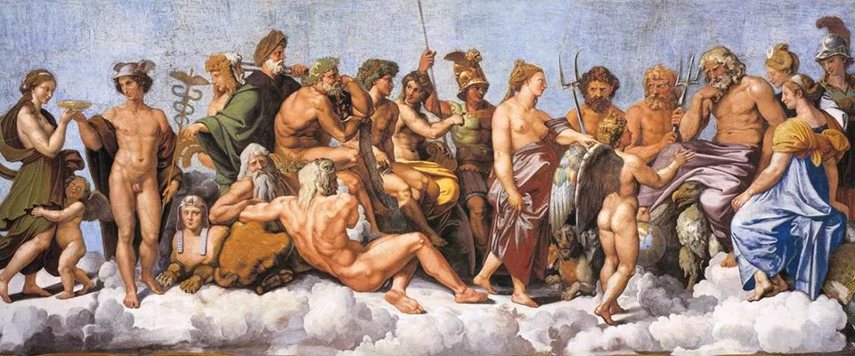
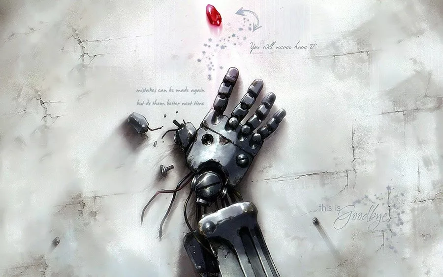
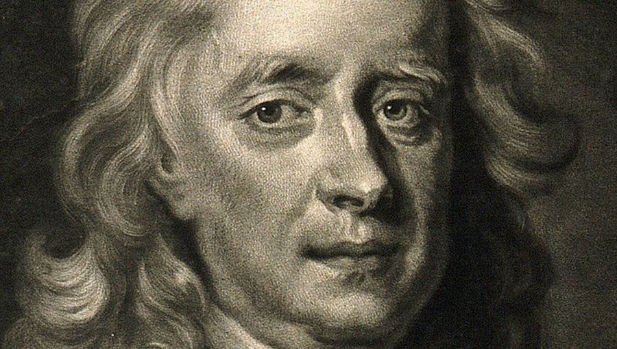
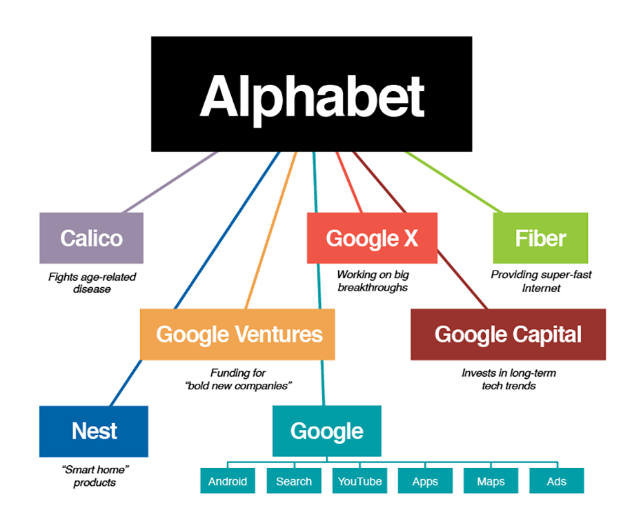
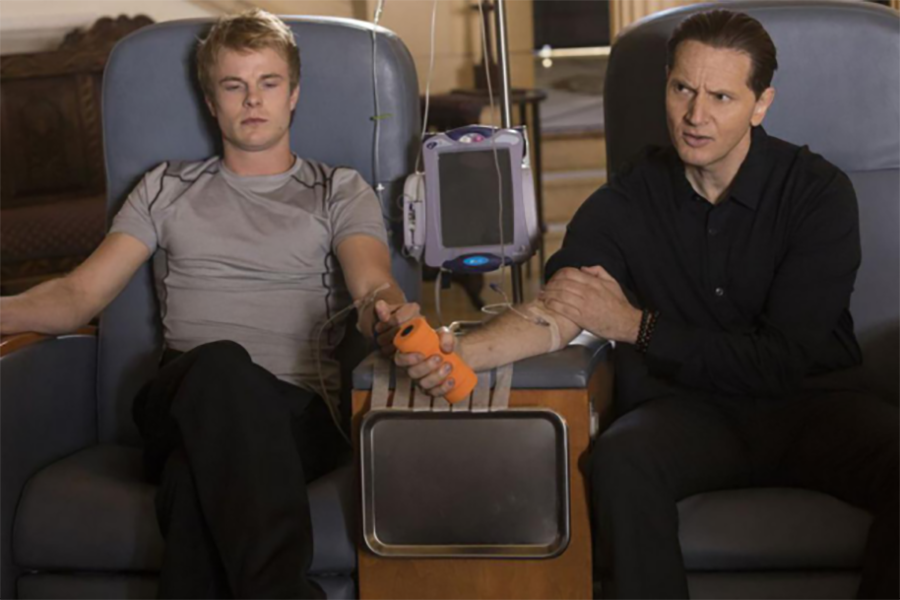

## 清明时节雨纷纷。科技，死亡，和永生。

题图：宗教油画《诸神的聚集》

（the assembly of gods）

---

**1.**

人类对于战胜死亡的尝试，从没有停止过。至今为止，也尚没有成功过。

秦始皇一统六国之后，便开始了追求长生不老之路。这位中国历史上第一位称为“皇帝”的人，也揭开了华夏大地炼丹术的篇章。从此，历代帝王将相，达官显贵，少不了对“成仙”和“不死”的热衷。就连曾经嘲笑始皇帝的唐太宗，也在晚年开始修炼“不死之药”，最终死在了自己的“仙丹”手上。

大名鼎鼎的雍正皇帝，仅在位十三年。如果你去查维基百科，上面写的是：1735年，雍正因工作过度劳累，在批阅奏章时去世。但是，200年后，历史学家在圆明园中发现了大量雍正在位时期炼丹的证据。开始有人怀疑，雍正的真实死因，是药物中毒。

这样的故事，在中国历史上，数也数不完。得到的越多，欲望就越大；得到了天下，就想永远。但是，永远和死亡，就是硬币的两面，追求永远的过程，一直和追求死亡联系在一起。

至少，至今为止，是这样的。

 

**2.**

面对死亡，西方的世界也并不淡然。人性本是如此。

从希腊神话，到圣经故事，充满着不死，或者复生的故事。和中国的炼丹术接近，在西方，炼金术则一度盛行。听名字，炼金术似乎和长生不老无关，但这只是一个中文翻译而已。如果你在维基百科中去查询alchemy（炼金术的英文），就会知道，炼金术从来都是和长生不老联系在一起的。炼金术的一大目的，就是制作长生不老药（the creation of an elixir of immortality）。日本著名动漫《钢之炼金术师》，就是以那个时代人类真实的社会观为背景虚构出来的故事。借炼金术，来探讨诸如：什么是生，什么是死，什么是人，什么是灵魂；能否长生，可否不死；我为什么是我，你为什么是你，你我有何不同，又何去何从，等等一系列的哲学问题。

即使到了航海技术极度发展的15-16世纪，哥伦布发现了新大陆，人类开始跃跃欲试，企图了解整个世界的全貌，绘制出世界地图。可此时，仍有一批野心勃勃的航海家，他们远渡重洋，征服大海的真实目的，是寻找传说中的“不老泉”。《加勒比海盗4》，便是以此为背景，虚构出的故事。

 

**3.**

到了17，18世纪，科学已经逐渐深入人心，但是，不老却仍然是神话。大名鼎鼎的牛顿公爵——举世公认的人类历史上最伟大的科学家之一，却在晚年，一直苦苦追寻长生不老的方法。

大多数人认为，这是牛顿一生的污点。有些人评论说，牛顿的这段历史告诉了我们：伟大的人物，也是凡人，也有荒诞的一面。牛顿晚年的研究，就证明了这一点。

但其实，我却不这么认为。科学终归是要发现未知的。牛顿的研究，之所以被人们看做荒诞，只是因为人们还没有做到而已。

曾经有一名中国人，自制了两个大风筝，拴在椅子两旁，同时用47支巨大的炮竹绑在椅子背后。他要飞行。当他命令仆人点燃炮竹的瞬间，他消失在了火海之中。这件事发生在15世纪，他没有飞起来。在之后的很长一段时间，他的举动在世人看来，都是极度荒唐的。是啊，人又没有翅膀，怎么能飞呢？直到今天，我们已经可以一边喝着可乐，看着电影，一边坐在一种叫做“飞机”的“怪物”中，翱翔在近乎世界的任何一个角落上空。我们可以“飞”起来了。此时，再回头看这名中国人的行为，真的那么荒诞吗？

1945年，美国火箭学家Herber S. Zin，将这名中国人，定义为世界上第一个尝试飞行的人。据他记载，这个人叫Wan Hoo。

牛顿的研究亦是如此。如果说他的研究荒诞，那么就意味着，硅谷里有一票公司都是荒诞的，一票投资人都是荒诞的，一票科学家都是荒诞的。因为，直至今日，我们还在追逐着长生不死。

当然，我们可能本来，就是荒诞的。

 

**4.**

科学的发展进入了近代。很多人觉得，人类已经清醒了，不再追求长生不老了。我不这么认为。只是，人类对长生不老的追求更理性了，更严谨了，更加小心翼翼了。并且，人类为其扣上了一个更加不玄幻的，科学的，严谨的，大气的名字——医学。

现代医学的起源，是从文艺复兴时期开始的。随着人体解剖学的建立，人类对自己的身体有了更加深刻的理解。尤其是到了20世纪，医学技术突飞猛进。保守估计，得益于医学的发展，人类的平均寿命，至少在一百年的时间里，延长了30岁。据英国人的统计，1841年，英国女性的平均年龄是42岁，男性的平均年龄是40岁；2016年，英国女性的平均年龄是83岁，男性则是79岁。不仅如此，可以预见的，在未来，人类的平均寿命还会继续延长。

虽还不是“不死”，但我们已然正在“长生”。而这长生的势头，在如今科技疯狂发展的势头下，也被诸多科技巨头们推向了巅峰。

2017年3月，一个阳光明媚的午后，数百名当代精英，聚集在洛杉矶的一间小房子里，其中包括诺贝尔奖得主，好莱坞明星，一掷千金的著名投资人，和不断创造神话，改变世界的硅谷CEO们。他们正在参加一个小型的研讨会，课题就是：长生不死。研讨会的主持在一开场，就面对诸多大咖，提出了一个问题：有谁，希望自己能够活200年？请举手。在场的世界顶级名人，突然都好像成为了小学生。所有的人，都举起了自己的手。

形形色色的生物科技公司犹如雨后春笋般出现。连大名鼎鼎的Google，都进行了大刀阔斧的企业改革，成立Alphabet，作为现在Google的母公司，和一系列其他子公司成平行关系。如果仔细看Alphabet的组成，就会赫然看到Calico的名字，这家和Google平行的公司，使命就是研究如何抵抗衰老，攻克和衰老相关的所有疾病。而在业界最为神秘的Google X，其项目全部保密，但很多人都认为，其中有大量生物医学相关项目。至于Google Ventures，Alphabet旗下的风投，也将大把资金投入了生物医学相关的项目中。

能不能做到长生不死，还不知道。但是，资源要到位。万一做到了呢，那绝对是花多少钱都值得的事情。乔布斯再伟大，说死也就死了。纵有再多人怀念，对于仍然在世的人而言，只有活着，才是最重要的。

 

**5.**

对于长生不死，科学界主流探讨的方法，大抵有两种。

第一种，非常科幻，即所谓的“意识电子化”。这是我的翻译，如果用英文硬翻，就是意识上传（mind uploading）。

所谓的意识电子化，是指，我们的大脑活动，本质是脑细胞中一系列生物电信号的结果。只不过，这些电信号，是产生自大脑这样一个有机体中的。那么，我们有没有可能在无机体上，比如硅片中（当下芯片的主要原材料），来模拟出这一系列电信号呢？要知道，“活着”这样的一个意识，只是一种大脑活动而已。

对于大多数人来说，大脑其实是被身体的其他脏器所拖累的。很多人在死亡时，大脑是完全没有问题的，只不过由于其他重要脏器出了问题，导致全身系统也被波及，进而走向了死亡。如果科技能够模拟出每一个人的大脑，那么，我们就真正脱离了肉身的束缚。这是至今公认的，最靠谱的永生形式。虽然离真正实现它，还有很长的距离。但是，大多数科学家已经承认，要想靠维持肉身的方式实现永生，似乎并不现实。在有形的世界中，一切终将消亡。但是，笛卡尔说：我思故我在。即使脱离了肉身，只要我的意识还在那里，那么，我就可以说，我是活着的。

但是，这个方案，至今，还完全没有靠谱的实施路径。甚至，可能永远无法实现。这个方案最大的问题在于，要想使用电子的方式复制人类的大脑，我们就必须首先对大脑有极其完整，清晰的认识。虽然现代医学已经对人的很多脏器有了非常清晰的认识，甚至都能做出人造心脏。但是，对于大脑，我们还知之甚少。甚至连皮毛都不到。有一派哲学观点甚至认为：人类自身，是不可能理解大脑的。有机会，我们可以再详细讨论这派观点。不管怎样，我们离“意识电子化”这项技术，还很遥远。

即使，假想，我们真的可以将一个人的意识电子化。一个巨大的问题又会摆上来。一个可以电子化的意识，意味着可以被无限制的复制。毕竟，将意识电子化的目的，就是永生。如果把你放在了一块硬盘上，这块硬盘却坏掉了，于是你消失了，那就太得不偿失了。和当下我们对所有重要资料所进行的措施一样，备份是必须的。但这样的话，哪个备份又是真实的你呢？

你当然也可以说，每个备份都是真实的你。但是，这些备份慢慢可能因为各种原因，产生思维的不同。那么，有无数个真实的你，和没有你，又有什么区别呢。毕竟，至今为止，让“你”是“你”的关键，就在于，这个世界上，“你”是独一无二的。

 

**6.**

我们可以先将这些哲学思辨放到一边，毕竟，这个技术本身，还不见踪影呢。但是对于长生不死，第二种方法则现实的多。甚至，已经有人开始行动了。

第二种方法，说白了：就是换血。用更年轻的血液，去替换成年人或者老年人身体里正在衰老的血液。当然，“换血”只是一种不专业的，大众化的表述，专业一些的表述，就是在细胞层面抵抗衰老。对于细胞层面抵抗衰老，还有很多方法，但是换血是当下，实施起来最简单的方法。

换血到底有没有用。科学界还在争论。但越来越多的研究成果表明，是有用的。2015年，斯坦福大学的研究表示：有证据表明，在小白鼠身上实行换血实验，将年轻小白鼠的血液输给老年小白鼠后，老年的小白鼠，明显在认知，行动等各方面，都有所增强。老年的小白鼠不会说话，研究者替它们说：这就是返老还童。

这项研究的结论太过惊人，对其背后确切的科学依据，科学家们慎之又慎，不敢断下结论。如果这一切有了更加明显的生物学证据的话，势必将极大地影响我们的社会。可能带来的改变，我觉得轮不到科幻小说家，每个人都能想象得到。为此，我将这篇推文的“阅读原文”链接，送给了nature网站上和这个“换血”研究相关的一篇报道。

尽管科学的证据还并不充分，但是，已经有人等不及了。硅谷著名风投人Peter Thiel，已经开始往自己的身体里，注入年轻人的血液。Peter Thiel的行为，是其所投资的一家硅谷著名创业公司Ambrosia的一项实验。这项实验，为600名年纪大于35岁的，诸如Peter Thiel这样有钱有势的“志愿者”，进行换血服务，并且长期跟踪，观察“换血”在人体上的效果如何。这些血液，都来自于25岁以下的健康年轻人，标价是每1.5L 8000美金。而这家公司的名字：Ambrosia，就是“神仙的食物”的意思。这个词源于希腊神话，希腊神话中，诸神都是不死的。其根源，就在于他们的食物：Ambrosia。

美剧《硅谷》第四季中的角色 Gravin Belson，就与另外一位金发小哥，实践着这种“换血”，技术术语被称为“异种共生”（parabiosis）。在剧中，这位科技界大佬解释道：定期将较为年轻健壮的捐献人的血液输入体内，可以显著地延缓衰老。

 

**7.**

很多科学家都非常自信地表示：在2030年左右，人类就有可能实现永生了。这是因为，到2030年左右，科学技术的发展，将可以做到：每过一年，就让人的平均寿命延长一岁。所以，到了这个时间点，大家只需要稳稳地跟着最新医学技术前进就好了。

能够让科学家有如此信心的技术，是纳米机器人。还记得我之前说的，在细胞层面抵抗衰老，还有很多其他方法吗？换血太过简单粗暴，纳米机器人相对就有针对性的多。科学家正在探索使用纳米级别的机器人，将他们注入血液，这些机器人可以摧毁病原体，清除杂物，血栓，以及肿瘤，纠正DNA的错误，从而达到延缓衰老的目的。最终，他们也会被排出体外，不会成为你身体的负担。

当然了，一直使用最新的技术，将会是非常昂贵的。只有世界上的顶级富人和政要，才能负担得起。但是，所有的技术，都会逐渐平民化。互联网，无线通讯，飞机旅行，医疗，无一例外。我们每个人现在手握的金钱和权力，比古时任何一个帝王将相都要小，但是，我们可以支付得起的生活，却远超任何一个帝王将相。从道理上，抵抗衰老的技术也将如此。

经济学家认为，如果2030年，科技真的可以达到每过一年，就让人的平均寿命延长一岁；那么大概在2050年，正常工作的中产阶级，就完全可以有条件支付得起永生的开销。

可是，如果“永生”真的成真，这个世界的运行方式是否还和现在一样？这，才是一个更大的问题。

技术终将以他特有的方式，改变整个人类社会。过去，技术一直在这样做。一整部人类文明的变迁史，就是一整部技术发展史。

 

**8.**

圣经旧约中，有一段话：

> 神造万物，各按其时成为美好。

> 又将永生安置在世人心里。

> 然而神从始至终的作为，人不能参透。

或许，因为我们一直摆脱不了对永生的执念，所以，我们才是人，不是神。

 

liuyubobobo

2019.4.5 凌晨，于Mountain View