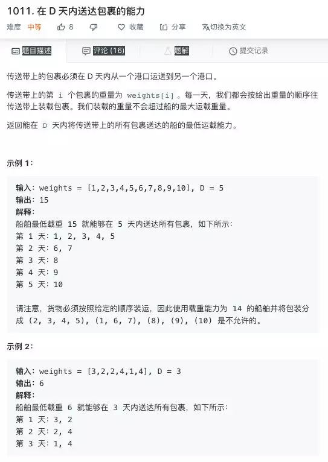
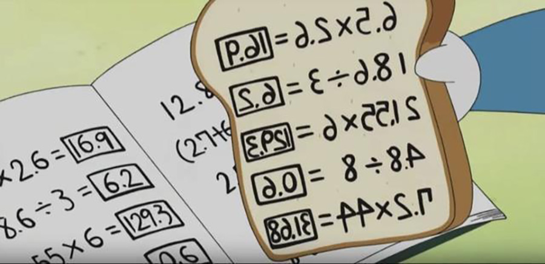

## 什么叫学会了？自己到底有没有学会？知识掌握的七个境界

最近，遇到了两个来自同学的提问，我觉得都挺典型的。

一个同学问我，**“学习的过程中，到底怎么样才叫学会了？掌握了？”**

还有两个同学，不约而同的问我，**“学习算法，是不是掌握了基本原理，面试的时候，能说出个大概就好了？”**——对于这个问题，其实不止这两个同学，在过去的两年时间里，我也已经遇到很多次了。

今天这篇推文，就借这些问题，聊一聊我眼里的，知识掌握的七个境界。

---

**第一重境界：撸串境界**

知识掌握的第一重境界，我管它叫“撸串境界”。什么意思？就是，对于这个知识，你只有在撸串的时候，才能“无障碍”地提起。比如：

> A：你知道吗？昨天人类首张黑洞照片公布了！
>
> B：是啊是啊，人类离宇宙的真相又近了一步。听说黑洞和时间的奥秘也有深刻的联系，可能我们离时空旅行又近了一步呢。

撸串的时候，我们可能会不自觉地聊起这种话题。但是，八成，A和B对黑洞的了解，都是在“撸串境界”，真的正儿八经地说说：黑洞到底是怎么回事儿，黑洞照片的历史意义是怎样的，对未来有可能有什么影响，黑洞和时间又有什么联系，可能都不太清楚。对于黑洞，也就是在撸串的时候随便聊聊。

大家都放黑洞照片，我偏放羊肉串儿照片！是不是很酷？

 

再比如：

> A：听说XXX自己做人工智能，预测股票走势，赚了一大笔钱！
>
> B：我也听说了，就是用现在最火的深度学习。Alpha Go已经战胜人类最强的围棋选手了，Alpha Go用的就是深度学习算法。

在这段对话里，A和B对人工智能和深度学习的理解，八成也是“撸串境界”。

通常，看新闻就能帮助你进入撸串境界。

---

**第二重境界：关键词境界**

知识掌握的第二重境界，我管他叫做“关键词境界”。就是，对于这个知识，你掌握了非常重要的几个关键词。比如：

> A：听说XXX自己做人工智能，预测股票走势，赚了一大笔钱！
>
> B：我也听说了，就是用现在最火的深度学习。好像是建立了一个叫LSTM的模型就好了。我也想找时间学习学习呢，搞不好就能赚1个亿呢。

在这段对话里，B对深度学习的理解，进入了“关键词境界”。当然，在这里我只是举例子，毕竟LSTM只是深度学习的一种方式，深度学习领域也有很多其他重要关键词。在这里，我想强调的是：关键词境界和撸串境界，是截然不同的。

为什么？因为如果你处于关键词境界，这个知识对你来说，就不仅仅是只有在撸串的时候可以提及的一个缥缈的概念了。你可以利用这个关键词，在网上查询，进而深入学习。换句话说，这个关键词已经可以指导你行动了——你已经可以开始具体的学习了。

很多时候，我们解决问题，就是缺少一两个关键词而已。比如，我本科的时候，做一个项目，其中一个子功能，要对用户输入的邮箱字符串是否合法做验证。当时我花了很长时间自己设计“所谓的算法”去处理，其实就是一堆if-else。到后来，我明白了，这事儿其实用正则表达式，一句话就搞定了。真要说其中的算法，也是一个专门的领域，叫模式匹配。“正则表达式”，“模式匹配”，就是正确的关键词。如果我早一些知道这些关键词，我就可以直接去学习正则表达式的使用，或者直接去学习“模式匹配”算法，就会少走很多弯路。

在这里，我要强调，从学习的角度，我觉得这个弯路，也是值得的。因为通过我的思考和尝试，再去看成熟的解决方案，我就能看到差距，总结自己思维上的缺陷，对知识的理解也会更深刻。我经常说，**在大多数情况下，走一些弯路绝不是坏事，走弯路是进步的源泉，所谓失败是成功之母。**只不过，对于很多时间紧任务急的业务场景，可能现实不允许你走弯路。

---

**第三重境界：原理境界**

第三重境界，就是你不但知道了这个关键词，你还知道了原理。

归并排序对你来说不仅仅是一个名词，你知道归并排序是每次将整个数组分成两部分，将这两部分排好序以后，再合并起来；

快速排序对你来说不仅仅是一个名词，你知道快速排序是每次以一个元素为标定点，把数组分成小于这个元素和大于这个元素两部分，对这两部分再去递归地进行排序；

二分搜索对你来说也不是一个名词，你知道，二分搜索就是对一个有序数组，先检查中间的元素，如果正好是你要查找的内容，就ok了；如果不是，你要查找的内容比它小，继续到左边找；你要查找的内容比它大，继续到右边找。

大部分同学通过在学校的专业学习，应该是至少能达到原理境界的。也就是，你知道这个名词，了解这个名词在解决什么问题，同时，也能用自然语言表述他的原理。

但是，在这里，我必须提醒大家，**对于计算机专业的学习，必须要把基础知识的掌握上升到第四重境界。**

---

**第四重境界：实践境界**

所谓的“实践境界”，在计算机领域，其实就是，你不仅仅能说出原理，还能用代码将他们正确实现出来。换句话说，你不仅仅知道“归并排序”，“快速排序”，“二分搜索”，你还能写出正确的代码。

我在这篇推文开篇，两个同学，不约而同的问我，“学习算法，是不是掌握了基本原理，面试的时候，能说出个大概就好了？”他们的问题，本质就是：对于算法知识的掌握，有没有必要进入实践境界？

**我的答案是：太有必要了。因为，这是计算机专业跟非计算机专业的本质区别。也是你能吃这碗饭，别人不能吃这碗饭的关键。**

计算机专业要做的，就是把抽象的逻辑转换成可以正确实现这个逻辑的代码。如果能顾及代码的效率，可维护性，甚至是简洁优雅，那就更好了。但如果你只是懂原理，能扯淡的话，恕我直言，别说数学系物理性能碾压你，连文学系历史系，甚至是一个素质高点儿的高中生乃至初中生，随便看两眼，可能都能碾压你。但是让他们转行程序员，还是会费一番功夫的，为什么？**正确，优雅，高效的代码实现能力，不是一日之功。**

如果到达原理境界就ok的话，我的所有算法课程，长度都可以直接缩减到1/5。但是，能用代码正确的实现出来，完全是另一回事儿。很多同学说得清楚原理，但是实现不出正确的代码。这就是编程基础不够。由于你实现不出正确的代码，我也不敢保证你的理解是完全正确的。

你跟我扯再多永动机的原理，要想让我不质疑你，请实现出一个永动机证明给我看。你跟我扯再多炼金术的原理，要让不怀疑你，请把这个易拉罐变成金子给我看（广告插入，推荐阅读我的文章：清明时节雨纷纷。科技，死亡，和永生。）。

同理，你说你懂快速排序，不要废话，实现一个快速排序给我看。

**Linus Torvalds说：talk is cheap, show me the code.**

大家一定要明白，计算机是工科，工科是靠东西说话的。我相信这也是很多同学选择计算机专业的一个原因——它没那么多虚的。你专业水平高，你就能用实现出来，时间短，效率高，代码整洁优雅，让所有人都闭嘴。从某一个维度看，这确实是更公平的，不像在有一些行业或者领域，单靠嘴皮子，人和人能拉开很大的差距。（当然，一切都是相对的，公平这个话题太大了，有时间单聊。）

所以，大家在具体学习的时候，一定要明白：**我是计算机专业的，能实现出来，才是我的立身之本。**

---

**第五重境界：灵活应用境界**

第五重境界，就是灵活运用。知识是死的，能灵活地运用这些知识解决实际问题，甚至是解释生活中的现象，对这个知识点，就达到了这重境界。

随便举几个例子。

Leetcode上1011号问题，大家可以看一看。在这里，我把中文版本的问题也截了一个图（没时间看具体问题直接跳过去，在这里只是举个例子）：

对于这个问题，如果你能很快地反应出，应该使用二分查找法来解决的话，你对二分查找的理解，就已经进入了灵活运用的境界。相较而言，写出正确的二分搜索代码，是简单的，但是，能快速反映出这类问题可以使用二分查找的思路去解决，还需要一定的专业训练才能达到。实际上，类似这样的使用二分查找法解决的问题，是算法竞赛里常见的问题套路。二分查找本身，也绝不仅仅局限在在一个有序数组中找一个数而已。对这个问题的深入解析，我在文章中不具体分析了，有兴趣的同学，可以自行搜索学习。

再比如，经典的“智力”题，过河问题：

> 农夫需要把狼、羊、菜和自己运到河对岸去，只有农夫能够划船，而且船比较小，除农夫之外每次只能运一种东西，还有一个棘手问题，就是如果没有农夫看着，羊会偷吃菜，狼会吃羊。请考虑一种方法，让农夫能够安全地安排这些东西和他自己过河。

以及经典的“装水问题”，版本众多，我随便取一个：

> 有两个水桶一个装5升一个装3升怎么利用水桶得到4升水？

如果你看见这类问题，能很快地想到，他们的本质，是图论中的一个路径搜索问题，那么你对路径搜索算法的掌握，就进入了灵活应用境界。给你一个图，让你找到从s到t的一个路径，是简单的；但是对于这类问题，可以使用图论去建模，将其转化成一个图中的路径搜索问题，是需要一定的专业训练的。

再举一个Google的面试问题：

> 一个硬币，抛了1000次，结果有560次是正面，请问，你觉得这枚硬币是不是“公平”的？

如果学过概率论的同学，可能都能说出什么是中心极限定理，都知道假设检验。但是，遇到这样一个问题，能不能联系已经掌握的知识，有理有据的说明白你得出结论的依据？需要你对相应的知识，达到灵活运用的境界。

---

**第六重境界：发明创造境界**

上面的几重境界，都是对已有知识的掌握逐渐深入。但是，这个世界上尚未解决的问题还很多，能不能根据已有的知识，发明创造出新知识，进而解决新的问题？这就是发明创造的境界。所有的诺贝尔奖，图灵奖的获奖者，对相关领域的知识掌握，都在发明创造的境界。

首先，必须承认，对于任何知识，我都达不到发明创造的境界。

事实上，对于大多数人来说，对某个领域的知识，能整体进入灵活应用的境界，就已经足够了。因为能够灵活运用，已经意味着你可以使用这些知识，解决大量实际问题了。这已经对整个社会有相当大的价值了。能否进入发明创造的境界，一方面看你是否有这方面的追求；另一方面，也看机缘和天赋，很多时候，是可遇不可求的。

不过，在这里，我想强调，所有的新知识，近乎都不是凭空出现的。都是靠大量的对前人知识的积累，理解，甚至是灵活运用之后，才出现的。所以，不断学习前人的知识和思想，是根本。没有积累，突然发明了新知识，尤其是在当下这个知识爆炸的时代，近乎是不可能的。

所以，不要妄想把自己关起来，就能解决黎曼猜想。不要觉得自己是张无忌，找几本世界经典教材，在“洞里”与世隔绝，苦读三年五载，就能一鸣惊人。金庸的小说是成年人的童话。所谓的童话，就是骗人的。相较而言，不断地去积累，甚至是跨领域的积累知识，从其他领域的知识中汲取灵感，才有可能更大概率地发明出新的知识，解决更难的问题。

---

**第七重境界：遗忘境界**

第七重境界，我称之为遗忘境界。在这里，首先要说明，前六重境界，是层层递进的关系。但是，在这里，我说的第七重境界，不是第六重境界的一个递进，而只是一种状态——遗忘，而已。

相信很多同学都有这样的苦恼：学了很多知识，很快就忘掉了。即使曾经达到灵活运用的境界，但是可能各种原因，几年甚至十几年没有碰，最后也会遗忘。

在这里，我想强调的是：这是极其正常的。如果你不会遗忘的话，你就是一个超人了。或者你拥有机器猫中的记忆面包，你应该已经是全球首富了。

关键在于，如何抵抗遗忘？首先，对一个知识的掌握，你的境界越高，越不容易遗忘。相较于已经达到灵活运用境界里的知识，只在原理境界的知识，更容易被遗忘。

另外，使用的次数越多的知识，越不容易遗忘。其实在我国，大多数初等教育，都是在采用“重复使用”这种方法，来帮助你记忆知识的。你根本没有具体应用过这些知识，但就是忘不了how are you后面，接的是fine, thank you. and you? 对于这种机械式地使用，我的评价是中性的。有好有坏，有机会可以单独写文。

其实，遗忘并不可怕。遗忘境界是一种境界，如果你的遗忘境界中存在着某种知识，基本就意味着你能迅速地把它捡起来，重新回到原来的境界。这是很重要的。所谓的经验，不过是遗忘境界的存储。比如，红黑树的内部原理，很容易遗忘。但是，如果你跟着我的课程，认认真真学习了红黑树的原理，实现了红黑树的代码，那么，即使你遗忘了，我相信，对于正常智力水平的同学，在需要的时候，比如面试前，一两个小时的时间，足以让你回到原有的水平。

最后，我想说的，虽然学习的目的不是遗忘，但**学习的目的也绝不仅仅是记住。**其实，“记住”，是学习的一个太低层级的收获。关键是，在学习的过程中，你的大脑在消化、吸收知识的过程中，会连带有很多附加的收获。这些附加的收获，在很多时候，都是更加重要的。

比如，对数学的学习，会逐渐让你对数字更敏感，同时，形成如何用数学模型解决问题的思维方式（所谓的数学思维和数学素养）；

对算法的学习，会逐渐培养你理清逻辑的习惯，对每一个变量作用的深刻理解，也能让你写出越来越优雅的代码；

更不用提，在学习的过程中，你会逐渐总结出适合自己的学习方法，把他们应用在更多领域的学习上；

你会慢慢体会到如何能够更加高效的查找资料，如何归纳，总结知识体系，帮助你更好的理解；

你会去提问，在提问的过程中，你会越来越多地理解：怎样提问更加有效？什么是一个好的问题？；

你会给别人讲解，在给别人讲解的过程中，你也能锻炼自己的表达能力；

你甚至能在学习过程中，逐渐找到自己的兴趣，自己的天赋，自己的理想；

通过学习越来越多的东西，你也会越来越有自信，你能感受到天地之大，也能感知到自己之小；

所有的这些，都比学习某一个具体的知识点，重要太多了。

**爱因斯坦说：所谓的教育，就是忘记了在学校所学的一切之后，剩下的东西。**

大家加油！：）