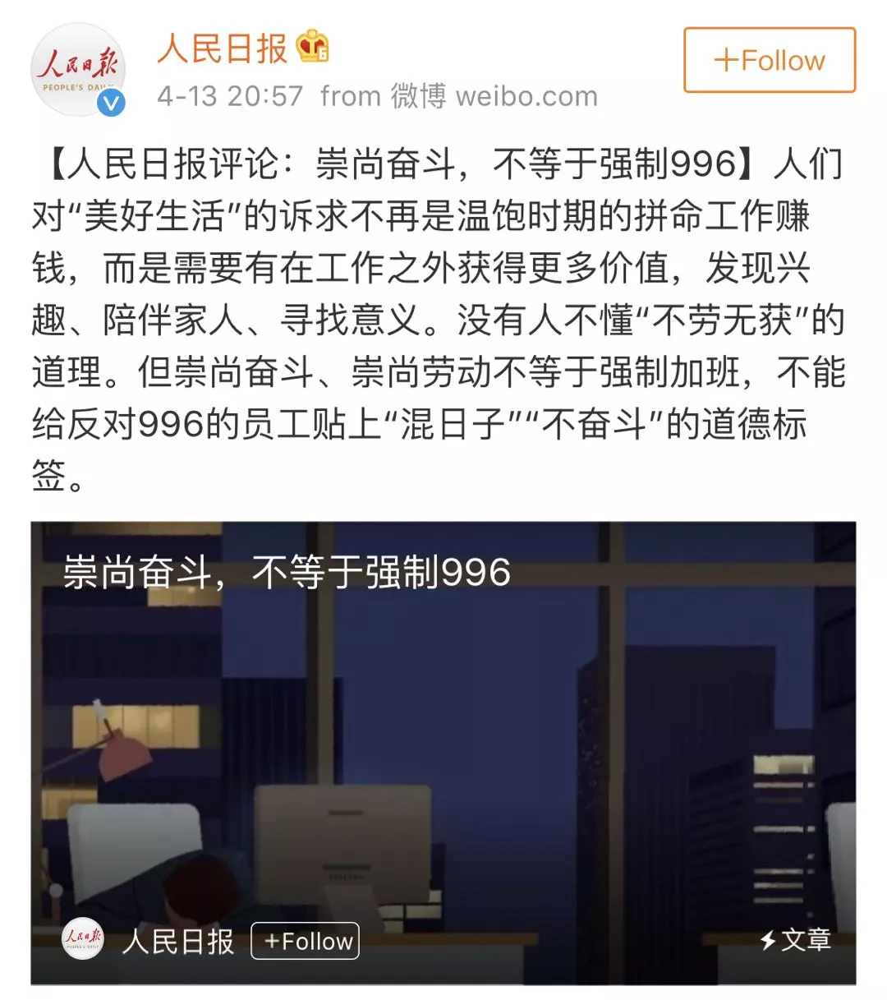
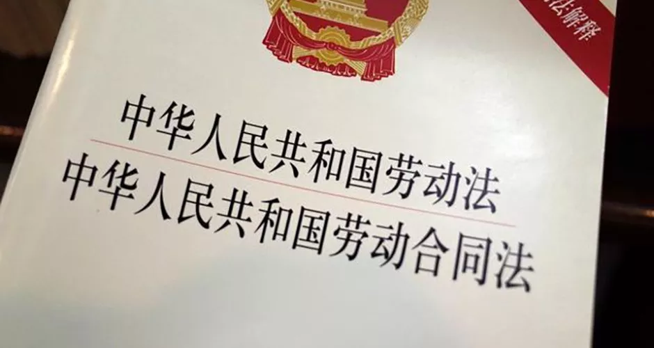

## 大佬们都是这么不讲道理

**1.**

马云谈996，说996是福报，被刷屏了。

然后马云可能觉得不合适，也可能是觉得不过瘾，不管怎么样，再谈了一次996。题目我看不太懂，叫《理性讨论比结论重要》。

理性讨论重要我明白；结论不重要，我不明白。

讲真，这次关于996的讨论，是我见过的网上对中国社会问题讨论中，最理性的一次。可能是因为参与讨论的人都是高学历群体吧，加上码农群体本来就是靠逻辑吃饭的，讲起道理都是逻辑严谨，一丝不苟，条理清晰，有始有终的。对于这个问题的讨论，我没有看到任何无端谩骂。结合最近的《西安奔驰维权事件，读书人总以为是能讲道理的... 》，唉，一声叹息。

马云在谈996的文章中，有这么一段话：

> 关于“996对不对”，法律自有规定摆在那里，这个问题并不是关键，...

我就不懂了，996对不对不关键？

至于刘强东强势发声，讲了一个根本没有起因经过结果的故事，叫《地板闹钟的故事》。虽然刘强东讲故事的水平不太高，但我还是希望他能强势发声，谈谈去年在美国的故事。

 

**2.**

无论是马云，还是刘强东，谈到996，都在偷换概念，将996和奋斗划等号。

你说奋斗就得996，甚至007，要忘我地付出，这个我没意见；

但是996就等于奋斗？

这篇推文，我本来想科普一下逻辑学的基础知识。毕竟这个公众号的文章，我都想和一些知识性的内容扯点儿关系，争取让大家在阅读的时候，也能学到些东西。但越写越不是滋味，越写越生气。写了几千字，硬是被我给删掉了。所以请原谅我，这篇文章更偏情绪化一些。因为大佬们的逻辑漏洞也太明显了。

奋斗确实需要996；但是996不等于奋斗！

这很难理解吗？小学生应该就能理解：狗有四条腿，但四条腿的不一定是狗。

按照大佬们的逻辑，19世纪末，无论是美国，还是英国，流水线上每天干12小时的工人，都是了不起的“奋斗者”。历史上根本就不存在“被剥削者”。

这样看来，福特真是个大坏蛋。他竟然带领福特汽车厂，实现了一周5天，每天8个小时的工作制。这才是赤裸裸的剥削啊！他剥削了工人们的奋斗权！凭什么工人不能奋斗！？凭什么工人不能享受996的福报！？

至于之后，各个发达国家，包括我们伟大的祖国，不停地完善劳动法，保障劳工权益，那简直是倒行逆施啊。制定最低工时？每周超出最低工时还要增加工资？员工还可以提出劳动仲裁？这分明是不想让普通人通过奋斗，成为大佬嘛！

所以，为什么会有阶级固化？原来在大佬们的眼里，劳动法就是阶级固化的根源啊！如果没有劳动法，不对劳工权益进行保障，过劳才不仅仅只是落个“过劳死”，阶级才能流动起来啊！

如此这般看来，奴隶制度真是好啊。奴隶制度才是阶级最不固化的制度哦。所有的奴隶们都疯了，竟然起来推翻奴隶制？

哦，对了，我们伟大的中华人民共和国国歌，第一句话，竟然就是：

> 起来，不愿做奴隶的人们

 

**3.**

如果在维基搜索“马云”，你会看到他毕业后的就业经历大概是这样的：

> 1988年毕业于杭州师范学院（现杭州师范大学）外语系英语专业，获英语学士学位，8月分配到之后于杭州电子工业学院（现杭州电子科技大学）基础部从事英语教学工作，1994年10月调任党政办公室所属外事办公室主任，1995年6月1日辞职。

简单来说，就是1988年8月在杭州电子工业学院任教职，1995年6月辞职。

但是，创业经历却是这样的：

> 1991年，马云初次接触商业活动，集资3,000人民币创办海博翻译社。头一个月，收入人民币700元，但房租高达人民币1,500元。他于是利用转手小商品交易的方式，从广州、义乌等地进货，成功养活了翻译社，还组织了杭州第一个英语角。1995年，马云在出访美国时首次接触到因特网，回国后和他的妻子，还有同为老师的何一兵于1995年4月创办网站“中国黄页”，专为中国公司制作网页...

哦？好奇怪，怎么1991年不好好工作，开始接触商业活动了呢？不仅如此，入不敷出以后，还不甘心，玩儿起了小商品贸易？1995年四月，也就是辞职前，就搞起了互联网？你的教育事业呢？你的学生们呢？说好的996呢？

这份经历看来看去，合着马云老师提倡的奋斗，就是拿着别人家的工资，干自己的事儿啊？！

这段经历我就不深入分析了，大家都不傻，一看就能懂，马云到底是怎么奋斗，逃避996，才走向成功的。996不等于奋斗这样一个简单的逻辑命题，在这段经历中，也一清二楚。

只是，我真的很想知道，马云如果能够知行合一，当年像现在坚信的那样，在自己的杭州电子工业学院996的坚守本职工作，坚信自己可以在学校当一名光荣的人民教师，已经是上苍对自己最好的福报，那么现在会是怎样。

至于刘强东说的8116 + 8，我坚信他把自己写《地板闹钟的故事》的时间，算成自己的工作时间了。这是多么重要的工作啊！管理啊！至于员工到网上发表自己对996看法的时间，我不知道东哥会不会觉得他的员工在偷懒，这样的员工，东哥会不会嫌弃，不是兄弟。

 

**4.**

这帮大佬真的傻吗？当然不是。这么简单的逻辑关系能想不清楚？这就是典型的屁股决定脑袋。

不仅如此，他们还站上了道德制高点，对员工实施道德绑架。996不重要，重要的是你是不是奋斗者。

咦？

一个乞丐在街上乞讨，别人不给他钱，还质疑他明明有工作能力，竟然还要乞讨。你猜乞丐怎么说：你给不给我钱不重要。重要的是，你有没有同情心，是不是一个善良的人。给我钱，那是缘分，那是你行善的机会，那是福报啊。

不对不对。大佬们怎么能是乞丐呢？

换个故事。

一个房屋的主人，请了个小时工打扫卫生。一个小时打扫不完。小时工表示，还需要多一个小时的工作量，所以还需要加一个小时的钱。你猜主人怎么说？咱们不提钱的事儿，咱们说说奋斗。你是不是奋斗者啊？你有没有进取心啊？你这样以后谁还会请你打扫卫生啊？能在我这里打扫卫生赚钱，已经是你的福报了啊。

这不是耍流氓吗？

哎呀，抱歉，一不小心，又提起了东哥在美国的故事。

 

**5.**

所以，对于996这个问题，我觉得理性的讨论太多了。多得大佬们已经失去理性了。咱们干脆别讨论虚的了，就提法律好了。

996是不是违法？马云原文说：

> 没有人喜欢在一个强制996的企业里工作，既不人道，也不健康，更难以持久，而且员工、家人、法律都不允许...

你看，马云把法律摆在了最后的位置。但不管怎么说，也算是承认996违法了。那么咱能不能就别那么多“但是”了，能不能谈谈，既然它是违法的，咱们怎么改善，怎么行动，别再干违法的事儿了。

讲真，你们这帮大佬，老是这样为违法行为做辩护，官媒都看不下去了。人民网，人民日报，官微都回应好几篇文章了。毕竟我们生活在社会主义新时代啊。

给各位大佬普及一段小学生都会背的政治学内容：全面依法治国是我党治理国家的基本方略；是发展社会主义市场经济的客观需要；是社会文明进步的显著标志；还是国家长治久安的必要保障！

呀，忘记了，其实大佬们的政治学修养应该都不错。

马云曾经是浙江省政协委员；

刘强东曾担任上海市政协委员和第十三届的全国政协委员。

 

**6.**

这篇文章写完，回顾了一下。我觉得这可能是我近十年写的最情绪化的文章了。如果有同学对此不适，我深表歉意。文末红包抽奖，算是我对大家的补偿。我在最近，也会再写至少一篇，从知识的角度，谈论996的文章的。

可是，我就是气不过。天底下怎么会有这么滑稽的事呢？明明不合法，还振振有词？

最后，补充几点：

1）自愿996，甚至007，是你的个人自由，别人无权干涉。但是，**企业强制所有员工996，是违法的**；

2）我没有不鼓励坚守岗位。在正常工作时间，坚守岗位是必须；在需要的时候，额外奉献是美德；如果你是一个无比高尚的人，无时不刻都自愿奉献，我敬重你，向你学习。但是，这不代表所有人都必须这样做。**企业强制所有员工996，是违法的**；

3）重要的事情说三遍：**企业强制所有员工996，是违法的**。

所以，这篇文章的题图，是这样的：

哎。这么简单的事情，搞得我这么义愤填膺。

这次，我觉得自己一点儿也不酷。