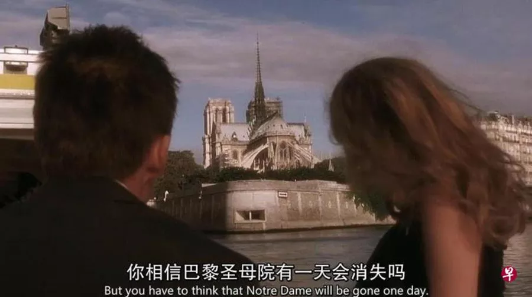
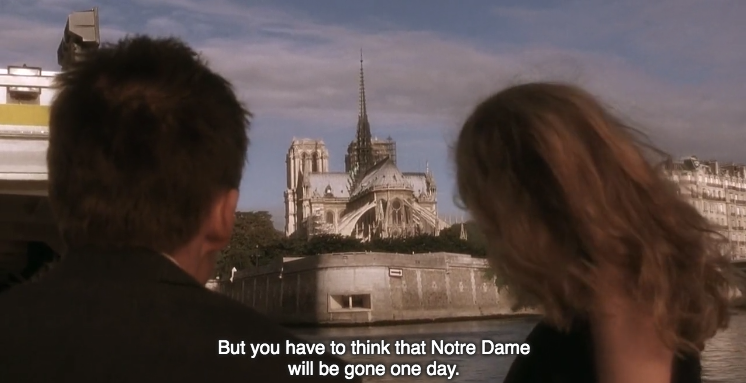

## 从巴黎圣母院的大火，到消逝的IT巨头

**1.**

巴黎圣母院着火了。拥有着850余年历史的哥特式教堂的主尖顶，在一瞬间轰然倒塌。

 

很多人拿出了《爱在日落黄昏时》（Before Sunset）这部影片中的一个截图：

在我看来，这句台词其实翻译的不是很准确。这个翻译，把这句台词变成了一个问句。可能译者也对巴黎圣母院有一天会消失抱有疑问吧。但其实，这句台词，是女主在听完男主所讲的关于巴黎圣母院的故事以后，很肯定地表示：巴黎圣母院总有一天会消失的。

所以，我的翻译是：但是，你不得不承认，巴黎圣母院总有一天会消失的。

> But you have to think that Notre Dame will be gone one day.

 

**2.**

巴黎圣母院着火以后，媒体采访一个法国人，一名普通的巴黎民众说的话，让我动容：

> 我出生的时候，巴黎圣母院就在那里；
>
> 我一直以为，我去世的时候，巴黎圣母院还会在那里；
>
> 但是，现在，我不知道在我有生之年，还能不能再走进巴黎圣母院去看一看了。

很多时候，我们都觉得我们身边习以为常的事情是那么平凡，甚至坚信它肯定可以永远下去，但事情的真相，往往会很残酷。

比如中国自改革开发以来，就没有经历任何真正意义上的经济危机。经济一直蓬勃向上发展。这是不是意味着中国不可能爆发经济危机？很多人都这么认为。

若果真如此，我一定要大声疾呼，让所有国家都来学习中国的经济模式。但其实，如果真是如此，根本不需要我呼吁什么，其他国家早就主动跑来学习我们的经济模式了。我是一个悲观主义者，我不认为中国不会爆发经济危机，问题只是什么时候，以何种形式到来而已。

不要误会，我衷心希望新中国是世界上第一个，甚至是唯一一个不会爆发经济危机的国家。

 

我们还是说技术世界的事情吧。

互联网刚刚在中国兴起的时候，我开开心心地注册了我的第一个电子邮箱：雅虎中国邮箱。那时的雅虎，绝对是互联网界的霸主。现在互联网，还有三分天下的局面，国内有BAT（百度，阿里，腾讯），国外有FAAMG（Facebook, Apple, Amazon, Microsoft, Google），不输一线大厂的各种准一线大厂更是不胜枚举。但在那时，国内国外，都是雅虎一家独大。我一直觉得，我可能会一直使用这个雅虎邮箱。

结果呢？2013年，雅虎中国邮箱停止服务。随之而来的，是雅虎背后更大的变动：整个雅虎中国关闭，雅虎从中国市场上消失了。之后，雅虎经历了一系列的转让，解体。2019年4月3日，以前雅虎公司为主要资产的Altaba公司，正式宣布清算和解散。一个时代彻底落幕。

雅虎中国邮箱的关闭，曾带给我巨大的麻烦，因为有一系列互联网服务，我都是使用雅虎邮箱注册的。但是，很快我就发现，事情好像也没有那么糟糕，因为大多数曾经注册的互联网服务，那些曾经我觉得好有用，我会一直用下去的互联网服务，似乎，也不是那么好用了。比如印象笔记。

至于邮箱，我早就使用Google旗下的Gmail邮箱作为主力邮箱了，直至今日也是如此。但是，我仍然会不停地，像《Before Sunset》中的那个女主一样想到：**我们不得不承认，Google总有一天，也会消失的。**

 

**3.**

说到消逝的巨头，雅虎是一个绕不过的典型案例。有太多媒体，书籍，作者，写过雅虎的故事。但是，每次我看到雅虎的故事，依然心潮澎湃。是的，一点都没有夸张，心潮澎湃。

我太喜欢雅虎的故事了。有时间，我一定从我的角度，再好好写一写雅虎的故事。

嗯，我就是这么奇怪，不喜欢成功者的故事，偏偏喜欢失败者的故事。在大多数文学作品，影视作品中，我都无法体会成功者的喜悦，但是我却能深刻地体会失败者的苦楚。可能因为我并不是一个成功者。同时，在我的眼里，成功的故事通常不能让我学到什么东西，但是，失败的故事往往可以让我学到很多。

唐骏有一本书，叫《我的成功可以复制》。我不知道谁看了唐骏的书，复制了他的成功；

李笑来在得到有一个专栏，叫《通往财富的自由之路》。我也不知道有多少人通过这个专栏，实现了财富自由。

就是这个道理。

 

**4.**

雅虎是IT界唯一消逝的巨头吗？当然不是。

大家可能都知道，IBM是推出第一台个人计算机的公司。但在此之前，计算机产品一直是被一家叫做DEC的公司主导的。这是1970-1980年的事情。如果你问那个年代的人们，90%的人会认为计算机只有在机构才有用武之地，大众是不会使用它的；他们也不会相信DEC会倒下，因为DEC在当时已经彻底控制了计算机市场。但是，现如今，这个品牌在我们这代人的眼里，连一丁点记忆的留存都没有。

**那么问题来了，IBM能永远存活吗？**

另外一个例子是美国半导体设计公司——仙童（Fair Child）。这家半导体公司，曾开发出了世界第一款商用集成电路，在硅谷的发展史上，占有举足轻重的地位。但如今，在这个行业，INTEL 和 AMD 楚汉争霸，仙童早就已经是纪录片中才能出现的企业了，而且是黑白纪录片。

**那么问题来了，INTEL 和 AMD，能永远存活吗？**

另一个例子是Sun，大家可能熟知它是因为Sun是Java的亲爸爸。我在本科参加ACM比赛的时候，比赛完全不支持Java语言。有一场比赛，我印象深刻，就是Sun公司赞助的，每个选手都能收到Sun公司发的一本比《算法导论》还厚的Java手册。那时，Sun公司还在推广Java语言。

那时候的Java语言，在我看来像弱智一样，连泛型都不支持（大概Java 5）。Java语言在之后的很长一段时间，也并没有特别大的发展。但后来，我才知道，虽然曾经Java那么弱智，但Sun公司来头不小，这是一家1992年上市，1993年挤入美国财富500强的企业。

讽刺的是，现如今，Java语言确实大红大紫了，但Sun公司早已人去楼空，卖给了甲骨文（Oracle），这也为后来甲骨文和Google之间的大战揭开了序幕。这段故事暂且不表。**问题来了：甲骨文能永远存活吗？**

这些都是美国的例子。那我们把视线移出美国，可能最著名的例子，就是大名鼎鼎的诺基亚了。这家来自芬兰的科技公司，一直到2012年，都在蝉联世界第一大手机厂商的宝座，毫不夸张的说，在那个时代，10台手机，8台诺基亚。但是随着苹果的出现，诺基亚溃不成军。现如今，10台手机，有几台诺基亚呢？

**但是，问题来了：苹果能永远存活吗？**

这些还都是国外的例子，看看国内。虽然我们的互联网历史还比较短，但我也能随口说几个名词：开心农场，饭否，ChinaRen，快书包，超级课程表，飞信....

这个列表可以无穷无尽。

在这里，我还特别想提一个品牌——凡客。为什么？因为当时，凡客太火了。凡客的广告，近乎遍布北京地铁的每一站。凡客体也是各大媒体竞相学习的榜样。韩寒——这个曾经说不会做广告的男人，都给凡客做起了广告。

但现在呢？

 

**5.**

BBC曾在2012年，发表过一篇振聋发聩的文章，叫《Can a company live forever?》（一家公司可能永远活着吗？）其中列举了一个统计数字。据统计，随着时代的变迁，美国标普500指数里的公司，平均寿命大幅度下降。在1920年左右，美国标普500指数的公司，平均寿命是67年；而现如今，美国标普500指数的公司，平均寿命竟然只有15年。换句话说，15年后，大部分现在耳熟能详的大企业，都会被新的公司替换掉。

我觉得，这个统计数字可以很好的解释代沟。毕竟，如今是商业社会，我们的生活，是被无数的商品服务所包围的。但是，每隔15年，人们所接受的商品服务，就完全不同了。

至于中国，这个数字更加夸张。但是鉴于我国自改革开放到现如今，只有短短的40余年，商业环境还没有完全稳定下来，所以，这个数字可能也不能太说明问题。但是，一个很显然的事实是：企业的寿命，是抵不上一个自然人的寿命的。远远抵不上。

所以，如果不出意外，我们这帮“幸运儿”，将不仅仅见证百度，腾讯，阿里巴巴，苹果，google，微软，Facebook，Amazon的崛起，我们还终将见证他们的消亡。不管我们愿不愿意。

别觉得不可思议，Facebook，Google，Amazon和Apple的日子，现在都不好过。尤其是Facebook。有时间我要专门写一写。

很多同学都给我留言，让我谈谈大龄程序员的困境，找到合适的机会，我也一定要写一写这个话题。但是，在我看来，**大家需要担心的，不仅仅是我们的年龄大了的问题；还有我们所在的企业年龄大了，突然就倒塌了。**

 

**6.**

昨天，互联网上刷屏的新闻，是早前指控刘强东性侵的明尼苏达州立大学女大学生，正式向刘强东和京东提起民事诉讼。我刚刚在[《大佬们都是这么不讲道理》](../2019-04-14/)中号召刘强东聊聊美国的故事，结果就出了这么个新闻，事主正儿八经地要聊聊和刘强东的美国故事。

这件事之后会怎么发展，不好说，还有待观望。但这个事情的关键根本不是刘强东，人家愿意喝什么味道的奶茶跟我们没关系。问题的关键是京东这个企业。因为这个企业，承载了18万名员工，这就近乎意味着18万个家庭。

我更关注的，其实是刘强东4月15日凌晨发布的一封所谓的“内部邮件”，这封邮件在解释，为什么京东物流取消了员工的底薪？因为不这么做，京东物流就完蛋了。京东物流已经连续12年亏损，2018年全年亏损23个亿。这样下去，京东物流只够撑两年。

所以，不是刘强东不认兄弟，是刘强东不能认这个兄弟。真认这个兄弟，大家就都死了。我没有为刘强东洗白，刘强东是洗不白的。我只是说：市场就是这么残酷。

与此同时，新的新闻又来了，亚马逊也将关闭中国的电商业务。

这事儿有解吗？其实，人类发展至今，无数先哲大家，一直在致力于解决这个问题，但很可惜，一直没有解决。

所以，才有乌托邦这么一个词儿。

 

**7.**

《Before Sunset》是一个豆瓣评分8.8分的高分文艺片。在我看来，就这一句台词，就值这个分数了。我这么长一篇文章，絮絮叨叨，说了一堆，想说的道理，回头一看，其实就包含在女主那一句台词里了。

> But you have to think that Notre Dame will be gone one day.
>
> 但是，你不得不承认，巴黎圣母院总有一天，也会消失的。

