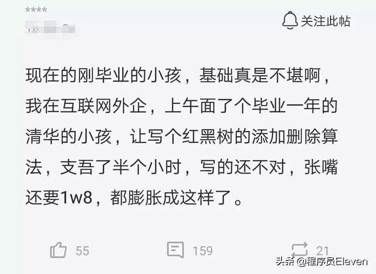

## 不能白板编程红黑树就是基础差？别扯了。

前一阵子，有同学在一个群里发了这样一个帖子：

看完以后，我一口老血就吐在了手机屏幕上。

虽然白板编程是计算机行业的一个通用的面试手段，但是，什么样的问题适合在面试中进行白板编程，还是有讲究的。**红黑树近乎是各大名企公认的，不适合白板编程的面试问题。**

在这篇文章中，我会仔细和大家分析一下：

1）为什么红黑树不适合做面试中的白板编程？

2）为什么同样属于经典算法实现的归并排序和快速排序，适合做面试中的白板编程？

---

在我的课程[《玩转数据结构》](https://coding.imooc.com/class/207.html)中，我带领大家详细实现了红黑树中的添加操作。但为了讲清楚这一个操作背后的原理，我们都做了什么铺垫呢？

首先，我们仔细学习了二分搜索树。二分搜索树是所有平衡二叉树的基础，这一点不用多说。我们的红黑树的代码（包括AVL树代码），是在二分搜索树的基础上，添加自平衡操作，修改出来的。

其次，我们仔细学习了AVL树。为什么要学习AVL树？

其一，**AVL树是历史上被发明出的第一个可以维护自平衡的树结构**，从历史意义的角度，值得学习；

其二，AVL树维护自平衡的主要手段——旋转操作，也是近乎所有树结构维护自平衡的通用操作。学习AVL树的重点，其实是学习旋转操作。这样一来，我在后续讲解红黑树的时候，就不需要讲旋转操作了，直接讲红黑树独特的“红黑节点系统”和相应的平衡维护就好了。

 

你看，为了讲清楚红黑树，我们花了这么大的精力，铺垫了这么多东西，大家才能比较好地理解红黑树。但即使如此，真正学习红黑树的时候，我们还是需要处理很多红黑树特有的问题，它依然并不容易。

**这就是红黑树最大的问题——背景知识过多，细节过多，整体操作过于复杂**，对于一个面试问题来说，它过于繁杂，答清楚一个红黑树操作背后的细节，需要的时间太多了。

更重要的是，对于红黑树来说，它背后有这么多细节，**却不具有延展性**。红黑树的“红黑节点”的定义，在我看来属于天才一般的独特思想。但是**这个解决问题的方式，近乎根本无法应用于其它问题。**而且，具体实现上，其实是一种case by case的分析方式，对多种不同的情况进行分类讨论（AVL树也是如此）。**这个实现背后，并无法提炼出一种通用的算法思想。**（所以，面试也很少考察AVL树的具体实现。）

即使是左旋转右旋转这种操作，虽然是树结构维护自平衡的通用操作，但也只在维护树的自平衡的过程中才有意义。这些操作也属于非常专门的算法，不具备延展性。

大家可以看到，**考察红黑树的底层实现，是考察不出面试者的能力的。近乎等于是在考察，面试者有没有在面试前准备红黑树的知识而已。**一个能力高的面试者，如果没有提前准备红黑树，也近乎不可能现场推导出红黑树怎么维护自平衡；而一个能力低的人，可能因为在面试前准备了红黑树，“背出”红黑树的具体实现的代码——但这和基础好毫无关系。

 

注意，我只是说考察红黑树的具体实现没有意义，**但是对于红黑树的基本原理和基本性质，大家还是需要掌握的。**也就是对于红黑树，计算机专业的同学，至少要达到我在[《什么叫学会了？自己到底有没有学会？知识掌握的七个境界》](../2019/2019-04-11/)中所描写的原理境界。

---

可能有些同学要问了，面试也会问很多其他经典算法问题的白板编程啊，他们为什么有意义？

我们举最简单的例子——**归并排序和快速排序，看他们的意义在哪里。**这两种排序算法，应该是会在面试中经常问到的经典算法的具体实现了。

 

首先，考察这两种算法，本质就是在考察递归。这两个算法都是标准的递归算法。所以，白板编程的过程，一眼就能看出来你理不理解递归。

同时，这两种算法也是标准的分治算法，而不是简单的“尾递归”。在递归函数中，至少要进行两次递归调用（而不是一次）。

**更重要的是，这两种排序算法，代表了分治算法的两种典型的“范式”。**

对于归并排序，简单来说，是先分别递归调用，最后将结果合并起来。可以看到，合并（merge）在递归调用的后面。如果从树的视角看（递归树），**这是一个后序遍历的过程。**只不过，我们的那个“遍历当前节点”的操作，不是打印输出，而是合并操作。

对于快速排序，简单来说，是先进行大名鼎鼎的partition，然后，根据partition的结果，对两部分分别进行递归调用。可以看到，partition在递归调用的前面。如果从树的视角看（递归树），**这是一个前序遍历的过程**，只不过，我们的那个“遍历当前节点”的操作，不是打印输出，而是partition操作。

如果深刻的理解了这两种范式，近乎就掌握了分治算法书写的精髓。（当然，书写是一回事儿，根据具体的问题做算法设计，其实是另外一回事儿。）

 

我们再来仔细看归并排序和快速排序中的这两个子过程：merge和partition。他们同时也都是非常好的线性算法的面试问题。

merge是：给定两个有序数组，如何合并成一个有序数组？

partition是：给定一个数组，选定其中一个值。如何把这个数组分成两部分，一部分小于这个值，一部分大于这个值？

大家可以看到，对于这两个问题来说，都：表述足够简单；同时，其实就是在数组中做事情，所以逻辑不会太复杂。即使你没有特别准备，对于合格的计算机专业的同学来讲，也都应该能够在现场写出正确的算法。因为这两个算法问题，其实毫无设计可言。需求很明确，实现这个功能就好了。最终的实现结果，应该在10行代码以内。

对了，根据需求对数组中的元素进行操作，绝对是算法面试的高频问题。

 

最后，就是这两个算法有足够多的扩展性。

对于归并排序，除了递归实现以外，我们还可以自底向上的非递归实现；归并排序可以引出稳定排序这个概念；归并排序的思路还可以用于完成诸如“快速计算数组中逆序对的数量“这样的问题；归并排序中的merge子过程，还用到了”双指针“的思想；

再看快速排序。快速排序的partition操作就有很多实现方式，单路，双路，再到三路快排。如果能一路优化下来，并且明确每次优化的目的是什么，就已经很可以看出面试者的水平了；快排的思路还可以解决“快速查找第k大的数字”这个经典问题；同时，快速排序本质是一个随机算法，因为在partition的过程中，pivot选择需要随机。这样也可以引出一些和随机算法相关的问题。

 

你看，归并排序和快速排序可以引出来这么多东西，但是，这两个算法，都是20行以内可以搞定的算法。一块儿白板，绰绰有余。**这才是白板编程的好问题，代码量足够小，却能不断地深挖，最大限度的测试面试者的功力。**

而白板编程红黑树，则完全没有这些附加价值。这就是为什么，**大厂近乎都不会考察红黑树的白板编程。**

---

那么，什么是和红黑树相关的好的面试题呢？我在网上简单搜了搜，这些问题都不错：

* STL中的set底层用的什么数据结构？（或者STL中的map底层用的什么数据结构？或者Java标准库中的TreeSet, TreeMap，底层用什么数据结构？）

* 红黑树的数据结构是怎么定义的？

* 红黑树有哪些性质？

* 红黑树的各种操作的时间复杂度是多少？

* 红黑树相比于BST和AVL树有什么优点？

* 什么场景应该使用红黑树？什么场景应该使用哈希表？

* 如何扩展红黑树，来获得比某个结点小的元素个数？（这个问题本质不是红黑树的问题，而是BST的问题。）

 

同学们在面试前，应该多准备这类和红黑树的性质相关的问题。完全不需要特别准备红黑树添加删除节点的具体逻辑。如果面试的时候，面试官真的让你白板编程红黑树，我的建议是：

1）承认自己很倒霉；

2）安慰自己，这家公司不想真的招人，或者面试官太...，不值得去；

3）直接起身走人。

 

所以，比起文初那位面试官的吐槽，这位面试官的吐槽更合理 

大家加油！：）

