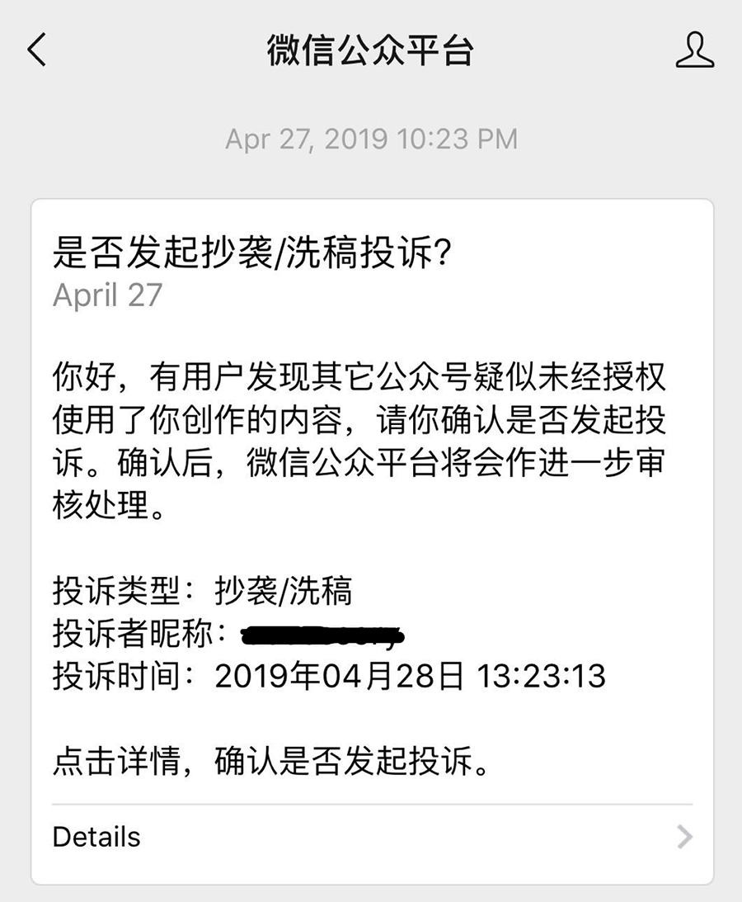
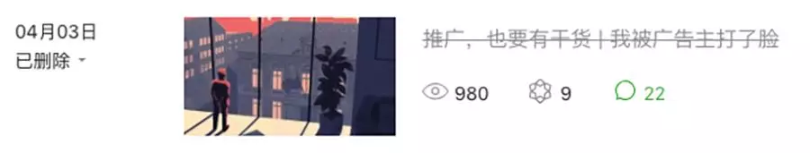
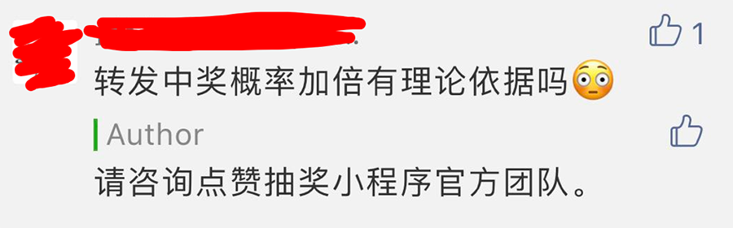
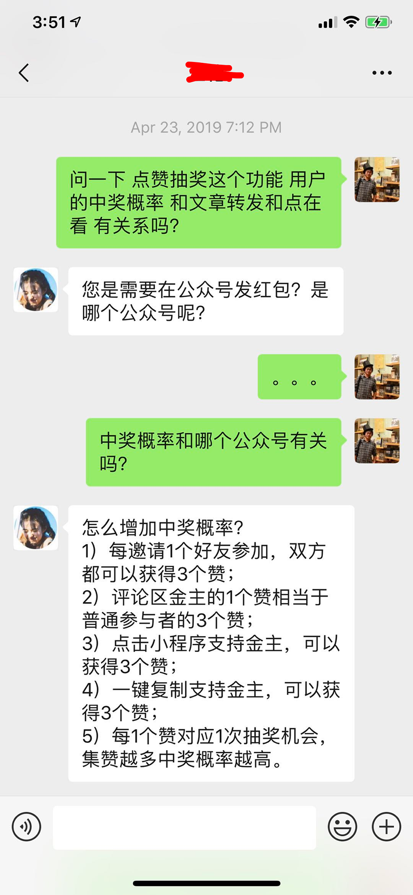

## 关于公众号的二三事 + 致歉

今天是五四青年节。先祝各位朋友们青年节快乐。不管你是10后，00后，90后，80后，70后，60后，甚至是50后，只要保持酷酷的心态，就永远是青年：）

今天的推文没有干货，所以只对干货感兴趣的同学可以直接关闭了。哦，对了，文末还有抽奖！

 

**1.**

首先，我把这个公众号的文章，在github上做了一下备份。地址是：[**https://github.com/liuyubobobo/my-blog**](https://github.com/liuyubobobo/my-blog)。

为什么要做这个备份？因为有一天，一个公众号大佬慌里慌张地告诉我：把你写的两篇和996相关的文章删掉吧。一篇是[《我们每个人都是囚徒。996.ICU与囚徒困境。》](../2019-03-28/)，另一篇是[《大佬们都是这么不讲道理》](../2019-04-14/)。不然的话，腾讯会给你删掉，与此同时，还会在你的公号上记一条违规。甚至，可能被封号。

作为一个公众号新手，我当时也吓了一跳。但思考了一下，马上就镇定了。

因为我写的文章完全没有违背社会主义核心价值观啊！甚至在[《大佬们都是这么不讲道理》](../2019-04-14/)一文中疯狂引用官媒党媒的观点，为人民网，人民日报打电话。

但是，我创业的时候也做过社交网络，了解很多时候，互联网上的审查会来得很突然。所以，我第一时间对我的两篇文章进行了备份。备份好以后，我就想，何不把我公众号的所有文章都备份一下？毕竟，我的每篇文章，不管好坏如何，都是我认真原创的结果。多少年后回头看，想必是很有意思的事情。但是，根据我在[《从巴黎圣母院的大火，到消逝的IT巨头》](../2019-04-18/)一文中的观点，微信公众号这个平台早晚要倒。

所以，就有了这个代码仓：[**https://github.com/liuyubobobo/my-blog**](https://github.com/liuyubobobo/my-blog)

当然，github也早晚要倒。但是，github本质是文件版本控制结果的一个展现，这些文件都保留好，就ok了。

再有时间，我琢磨琢磨，把我的文章放上区块链。年近35岁的技术大叔，就是这么矫情，还不要脸地问别人：是不是很酷？

 

**2.**

由于我创业的时候接触过社交网络的运营，所以对中国的互联网审核机制略知一二。

首先，对于互联网内容审核，我持中立态度。这个世界有很多国家，同样有严格的互联网审核制度，甚至比中国更加严格，想法更加大胆。比如俄罗斯。有时间我会好好写一下这个事情，挺有意思。

与此同时，即使以自由民主著称的西方国家，也不是零审核。关键在于，审核的边界在哪里，大家对违规内容的定义，背后依据的法理，参与决策的势力，以及如何执行，怎么执行，是不一样的。没有规矩肯定不行。关于互联网内容审核的问题，西方世界，尤其是最近，也一直在争论。有机会，关于这个话题，我也会好好写一下。

对于中国，其实，很多“审核”，并非政府所为，而是平台所为。这是因为，政府并没有统一的敏感词列表，或者敏感话题列表。但是，如果你的平台出现“不当”言论，会有严重的法律后果。所以，各家平台，会不自主的加强自我审查。因此，很多“删帖”行为，其实是平台怕不小心触及了红线，而自我严格审查的结果。

 

**3.**

尽管如此，在中文媒体环境里，写东西确实要小心，不能太偏激。但我也不是很偏激的人。如果我有“偏激”的观点，一定是因为法理不容。比如在[《大佬们都是这么不讲道理》](../2019-04-14/)一文中，我坚定不移地反对996，就是因为强制所有员工996，是100%的违法行为。这是全文的核心观点。这里的核心问题是“强制”。什么该不该奋斗，要不要努力，在法理面前，都要先放到一边。这叫依法治国。

当然，如果有人一定要争论法律是否合理，那是另一回事儿。法律有可能不合理，但解决这个问题的途径，是想办法推动法律的修订和完善。

前一阵子，B站源代码泄露，后来听说很多相关的文章被封了。我不确定这些文章持什么观点，但不管怎样，程序员泄露公司的源码，肯定也是违法的。包括删库跑路。大家平时开玩笑可以，但是真要付诸行动，请一定想清楚后果。

还有刘强东事件，听说很多维护女事主的文章被删，甚至有一个公众号，被永久封禁了。我依然不了解这些文章持怎样的观点，触犯了怎样的红线。但是刘强东事件确实已经陷入了罗生门。

当然，他出轨了，这事儿应该是坐实了，这就是我在[《从巴黎圣母院的大火，到消逝的IT巨头》](../2019-04-18/)一文中说的，刘强东是洗不白的。

但他到底是不是违法了，还真不好说。我们只能等待法律的裁决。

 

**4.**

最近，我还收到了一份提醒。有人举报了某个IT大佬公号的文章，理由是这篇文章疑似抄袭我的原创文章[《我们每个人都是囚徒。996.ICU与囚徒困境。》](../2019-03-28/)。微信官方询问我是否确认发起投诉。

对于举报的这篇文章，我仔细读了一遍。在我的概念里，不能叫抄袭。毕竟，**不能因为我写了一篇“996和囚徒困境”，别人就不能写“996和囚徒困境”了。**

知识产权保护是一个异常复杂的问题。即使在知识产权保护极其健全的西方世界，也是如此。因为**知识产权保护是一把双刃剑，如何在保护原创者利益的同时，能够让知识自由的传播，而不遭到垄断，是一个两难的困境。**这还只是从法理上看这个问题，在具体执行上，其实也面临着更多的挑战。有时间，我也会好好写一下这个问题。

但不管怎样，在这里，我要感谢我的读者朋友，不管是谁举报的，我真的很感激。与此同时，也让我很有信心，继续在原创这条路上坚持下去。

因为，我观察到的，经历到的，都在告诉我，越来越多的人拥有了版权意识，越来越多的人，能够理解原创者的辛劳，并且愿意为他们的付出给予回报。

**谢谢你们：）**

 

**5.**

这一个多月运营公众号，我还犯了两个错误。

第一个错误，是之前接了一个广告。我在这个广告前面，写了一段原创文字，所以，对于这个广告推文，就申请了“原创保护”，结果导致广告商无法把这段广告文案使用在别的文章中......

这是多么愚蠢的错误啊......

现在，这篇广告被我删掉了。但是，前面的这一小段文字，我觉得可能会对有一些同学有用，所以今天接着这个机会，我再推送一次，放在次条的位置。

公众号新手，如有打扰，还望大家见谅。

 

**6.**

另外一个错误，就有点儿严重了。

可能大家都知道，为了维护公众号的热度，我在我的每篇原创文章的后面，都添加了一个抽奖活动。这一招是跟别人学的，连抽奖活动的文案，我都是照抄的。以前一直写的是：大家如果转发我的文章，或者点击“在看”，可以增加中奖概率。

在[《还有没有机会逆袭？谈成功者的困境。》](../2019-04-23/)一文中，有人发出了来自灵魂深处的质疑：

虽然我的回答是“请咨询点赞抽奖小程序官方团队”，但毕竟是我发起的抽奖，于是，我联系了“点赞抽奖小程序”的客服。得到的答复是这样的：

简单的说，**中奖概率和大家点击“在看”和转发文章没有关系。**和大家是否邀请朋友参加抽奖活动，大家在抽奖活动中的留言是否被点赞，有关。至于这个答复中的3)，4)，貌似暂时和我的公众号无关。

**所以，在这里向大家致歉。我不小心欺骗了大家。**

不过，在这个公众号，**我还会继续保持每篇原创文章都有抽奖活动的。**因为，**如果这个公众号能够做起来，不仅是我一个人的功劳，也是所有阅读者的功劳。**

这其实是一个非常简单的道理。国外已经有一些社区，从社区底层功能的搭建上，考虑到这一点了。有时间，我也会写一写，和大家分享一下国外“创新”的模式。但是，微信公众号这个平台本身没有考虑这个因素，我决定先自掏腰包，做这件事情。

我的目的只有一个，希望有更多人能读到我的文章。毕竟，篇篇原创并不容易。能够被更多的人看到，不管你是赞同还是反对，我都是开心的。**如果你赞同我的观点，我收获了你的认可；如果你反对我的观点，我收获了你的认知。**

当然了，我还是希望大家如果觉得我的文章对你有启发，能够帮我转发，或者点一下“在看”的。

美国是一个小费制国家。出门吃饭，通常都是要给一笔小费的。我经常去的一家印度餐馆，却不强制要求顾客给小费，而是写了一句话：a tip brings good karma.（小费带来好运）。每次看到，我都会会心一笑，给的小费更多点儿。

在我的公众号里，我决定效仿。所以，从上一篇文章[《不能白板编程红黑树就是基础差？别扯了。》](../2019-04-29/)开始，我写的是：

**如果你喜欢我的文章，希望能多多转发，或者点击”在看“。相信会给你带来好运哦：）**

 

7.

絮絮叨叨说了一堆，又打扰大家了。

今天是每个人的节日，大家快乐。

明天是新的工作日。大家加油！

