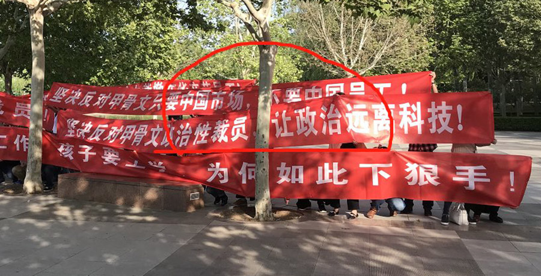
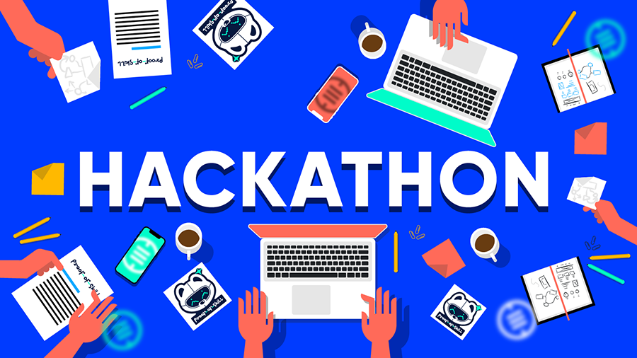

## 从Oracle的裁员，到“技术专家陷阱”

**1.**

Oracle裁员了。而且幅度还挺大。

整体事情很简单。Oracle的中国区研发中心（CDC）确定裁员900余人。而整个CDC的人员只有1600余人，并且肯定还有第二批裁员。根据外媒的估计，如果不出意外，Oracle的中国区研发中心将完全撤离。

对于这次裁员，虽然很多媒体给出了“良心裁员”的评价，但还是有很多Oracle员工进行抗议，并且打出了“坚决反对政治性裁员”，“让政治远离科技”的标语。

这些标语怎么来的，这事儿目测在公众号不能深说。说深了，绝对被禁。前几天，很多文章第一时间发文，发表了关于中美贸易战的新闻，都被封了。所以，对于中美贸易战，我们就和新华社保持一致就好了。在这里直接引用新华社的新闻：[《中方关于美方拟升级关税措施的声明》](https://mp.weixin.qq.com/s?__biz=MzA4NDI3NjcyNA==&mid=2649449918&idx=1&sn=4b079415402b49e9c83579767cc1eece&chksm=87f66125b081e8331a235ad59da04fa8795ae6dd8077cae0f76cab595609d7527814ed5c3b75&scene=21#wechat_redirect)。

中美贸易战绝对将是影响整个世界格局发展的一个重大事件。当下我们看到的一切，比如这条新华社新闻，只是整个巨大棋局中太小的冰山一角。但是独立媒体不能太深入分析。反正我说中国必胜，求腾讯不要封我。

作为一个技术向的公众号，也不应该深入探讨政治话题，说多了招人讨厌。所以我们不说政治。

 

**2.**

在具体说回技术之前，我们先扯一扯这个所谓的“良心裁员”。

为什么很多媒体说这是一个“良心裁员”呢？因为，Oracle高调公布了补偿标准：N + 6。其中N所对应的基数，是三倍于社会平均工资。大家估算，大概是25k；而6所对应的基数，是你在Oracle的工资水平（这是我现在得到的消息）。

所以，按照这样计算，假设你在Oracle干了10年，月薪5万元的话，你拿到的赔偿金就是 10 * 25k + 6 * 50k = 55万人民币。

猛地看，这绝对是一笔巨款。与此同时，在国内的环境，大家都懂的，很少会有企业完全遵守劳动法进行这样的全额赔偿。其实，说实话，外企也不想这么“合规办事”。但是在特殊时期，加上在别人家的地盘，只能100%的依法办事。100%的依法办事，就是“良心”了，想来，也有一丝不是滋味。

但是，为什么还会有Oracle员工抗议呢？

据称，**裁员的这批人，平均年龄是37岁，平均月薪是5万元。**

换句话说，即使你是一个10年的老员工，上面计算的那笔赔偿金，不到一年就赚回来了。而且，Oracle即使在硅谷，也素以硅谷养老院闻名。近乎没有加班哦。965是必须的。但这么好的工作，没有了。

肯定有很多同学说，这批工程师应该不愁再找到工作吧。其实我也觉得这批工程师是不愁再找到工作的。但可能很难像现在这么“理想”了。

毕竟今年的市场行情，大家都是有目共睹的。这还仅仅是从工作时间，工作强度和工资这些角度去分析，如果再思考一些其他因素，比如很多人可能基于当前的职业选择买了房，但是新工作的地点难免尴尬，就还会多一些通勤上的困难。再加上这个年龄段，可能还要考虑接送小孩儿上下学等问题。不管怎样，在短期内，生活质量肯定会有所下降的；长期看，则肯定充满了不确定性。虽然不确定性意味着机会。但不是所有人都想要机会的。其实大多数人都更喜欢平平稳稳。

而且，貌似员工手上的股权等问题也有纠纷，具体我就不了解了。这么看来，这个裁员，就不能叫“良心”了。这只是一个“特别合法的裁员”而已。

这也是之前，我在[《大佬们都是这么不讲道理》](../2019-04-14/)一文中，坚决反对996的另一个原因。大家再怎么违法给企业加班加点的干活，最终，如果企业“不行了”，撑死了，换回一个“合法裁员”。所以，大家合法上班就够了，别违法加班。

不是让大家不努力。下了班，努力的方向多了去了。而且，很多努力，对你的企业也是有潜在好处的。这篇文章最后，我也会给你一些建议的。

 

**3.**

正儿八经说技术了。

Oracle的这批员工能不能找到工作？肯定能。不用想。30-40岁是人的黄金年龄。所谓的“壮”年。对于工程师来说，既有之前的技术，职场和经验的积累，同时，学习能力，专注能力，认知能力，也都基本是在顶峰的。

别和我说什么三四十岁的人学习能力不如年轻人。绝对是扯淡。**学习意愿没有年轻人高是真的。但真要学习起来，甩年轻人10条街。**反正现在的我，比起十年前的我，学习效率高100倍。

但是！所有的事情似乎都有但是。为什么我说，近乎一定的，这批Oracle的老员工，哪怕有着十年的经验，名片上的title是技术专家，但是可能很难找到像现在一样的“理想工作”？

我们来看一个故事：

去年，一位ID是oraguy的程序员，在网上吐槽为Oracle的数据库做维护开发有多困难。据悉，现在的Oracle数据库，是一个有近2500万行C代码的复杂项目。不断的更新迭代，让内部的逻辑，是被数千个flag连接起来的。Oracle数据库的开发人员日常，是这样的：

* 开始处理一个新的 bug 。

* 花两周的时间试图理解 20 个不同的 flag ，这些 flag 以神秘的方式相互交互，导致这个困境。

* 再添加一个 flag 来处理新的特殊场景。添加几行代码来检查此 flag ，并解决有问题的情况，规避该 bug 。

* 将更改提交到包含大约100-200台服务器的测试服务器集群，这些服务器将编译代码，构建新的 Oracle 数据库，并以分布式方式运行数百万个测试。

* 回家。第二天来上班，继续处理别的 bug 。测试可能需要20-30个小时才能完成。

* 再回家。再来上班，检查你的集群测试结果。顺利的话，会有大约100个失败的测试。倒霉的话，将有大约1000个失败的测试。随机选择一些测试并试图搞清楚你的假设出了什么问题。或许还需要考虑10多个 flag 才能真正理解 bug 的本质。

* 再添加一些 flag 以尝试解决问题。再次提交更改以进行测试。再等20-30个小时。

* 来来回回重复两周，直到你得到了将这些 flag 组合起来的“神秘咒语”。

* 终有一天，你会成功，不再出现测试失败。

* 为你的新更改添加100多个测试，以确保下一个不幸接触这段新代码的开发人员永远不会破坏你的修复。

* 提交最后一轮测试的成果。然后提交以供审核。审查本身可能还需要2周到2个月。所以接下来继续去处理下一个 bug 。

* 在2周到2个月之后，一切已就绪，代码将最终合并到主分支中。

这段描述，如果你没有较大的项目经验，可能不太能理解。但如果你稍微有一点点项目经验，应该都会心有戚戚。据说，为Oracle添加一个小功能，可能要6-12个月，但是大一点的功能，比如添加一种新的身份验证，预估时间是两年。

其实，这赤裸裸地反映了当下软件工程行业的局限性，以及IT人员的工资为什么高。（如果有同学没看懂这个局限性在哪里，有时间我单写。）

 

**4.**

好了，现在问题来了，**一个Oracle的技术专家，回到就业市场，受不受欢迎呢？我的结论是：不好说。**

为什么不好说？上面的Oracle工作日常已经揭示了答案。

你在Oracle内部，可能是一个技术专家。

为什么你是技术专家，别人不是？因为你能比别人更快地修改bug，或者添加新的功能，完成需求。

为什么你能比别人更快地修改bug，或者添加新功能？因为你对Oracle数据库的内部代码非常熟悉，对几千个flag如数家珍。

可问题是，熟悉这几千个flag，对Google, Facebook, Apple, BAT, 没什么卵用。因为，**别人家的产品，是另外几千个，和你熟悉的，完全不同的flag。**

你理解了吗？**这样的技术专家的称号，是无法100%的平移到其他企业的。**

当然，你可以说，长期和这几千个flag作斗争，让你有了balabalabalabala的经验。我也同意。但是，在别的企业眼里，他还是不值你原来的薪水所代表的那个价值。

这个现状，就是大家经常说的，被大企业磨成了“螺丝钉”，也是这篇文章标题所说的“技术专家陷阱”。你确实是一个技术专家，但是，这个专家的头衔极其受限，脱离了Oracle这个平台，你的价值大大降低。

对于Oracle来说，你可能确实是其某一台“机器”不可或缺的“零件”。但关键是，**如果Oracle决定放弃这台机器了呢？**

这里，我只是用Oracle举例。所有的大企业员工，近乎都有这个困境。

 

**5.**

曾经有人分享过这么一个“现状”：

某企业招聘一个系统技术人员，来面试的人，都有着极好的学历背景，公司背景，以及工作经验。甚至十年之久的技术专家。但是当面试官让面试者写一段代码，描述一下LRU的原理的时候，大部分人却表现得一团糟糕。

很多同学都说，工作的时候从来不需要接触到那么底层的代码。但那是因为，你所在的公司，前人已经铺好路了。你只需要基于前人的工作，进行小修小补就好。在这个过程中，你对自己公司的代码越来越熟悉，看似能解决越来越多的问题，但与此同时，**你很有可能离真正的核心技术问题越来越远。**

你甚至可能一直在维护你们公司中的一个缓存系统，天天在和LRU打交道，却无法清晰地阐述LRU的原理。

那么换一个企业，即使还让你维护新的企业的缓存系统，你连LRU的基本原理都说不清楚，怎么能让人信服你能迅速理清楚上千个和LRU过程交互的flag，快速为企业提供价值？

 

**6.**

怎么避免这种情况？

首先，你为一个企业效力，尤其是大企业，势必会被打磨成螺丝钉。因为只有把你打磨成螺丝钉，你才对这个企业更有价值。

但是，我们要做的，是尽量成为一个形状不太奇怪的螺丝钉；尽量让自己能在别的机器上，也可以发挥相当的作用。

我的建议如下：

**1）拥有自己的开源项目。**拥有自己的开源项目，意味着自己要从底层实现一些东西，而不仅仅是依靠你的企业平台上成熟的技术栈。这个过程会让你对技术理解的更深刻。你的项目可能不会成为一个主流的产品，改变世界，但是，它绝对能改变你。更何况，万一改变世界了呢：）

**2) 看成熟开源项目或者框架的源码，而不仅仅停留在应用的层面。**如果只是自己做开源项目，难免受制于自己的能力。但是成熟的开源项目，已经集结了很多程序员智慧的结晶和实践的成果，看别人的设计，学习别人的实现，也可以让你走进技术的核心。

**3）适当轮岗。**接触更广阔的工作任务，而不仅仅把自己局限在一个部门的一个职位中。拓宽自己的眼界和经验的多样性。

**4）闲得没事儿的时候，多关注一些技术比赛信息。**这里，我说的不是ACM那样的算法比赛，因为算法比赛的形式太固定了。这个世界还有很多其他形式的计算机竞赛，这些竞赛，即使你不参加，关注一下，也能拓宽你的视野。

比如现在很多人工智能的竞赛，通过他们，你就会慢慢明白：人工智能能如何具体的应用在某一个领域，具体能解决什么问题。数据具体是什么样子。甚至别人是怎么分析这些数据的。这和看新闻，完全不一样。

再比如很多hackathon的比赛，通常都是在很短的时间（12-48个小时），完成一个小项目，从游戏开发，到物联网，到区块链应用，我还见过为太阳能板编程的hackathon。这些都会让你了解，原来，这个世界上有那么多奇怪的API；用编程的方式可以做那么广泛的事情；面对同样的主题，大家的想法那么不一样。这些，大会让你一定程度地逃离“技术专家”陷阱。

**5）不要局限在一般科技媒体中谁家裁员了，谁家盈利又多了一点，谁家又出了一个折叠屏一类的小事情。**多关注一些“大事情”。比如科技的昨天，今天，和未来。

关注我的公众号《是不是很酷》，就是一个很好的开始：）我绝对不会因为这样的小事情发文的。即使发文（比如这篇），也一定会有独立的观点，而不是制造焦虑感。

我在慕课网上的专栏[《用技术人的眼光看世界，程序员技术指北》(https://www.imooc.com/read/27)，可能是另一个很好的开始。**付费专栏，文章角度会不同，但我会尽最大努力，保证深度。**这个公众号上一篇推文，就是开篇词：[《正式邀请你，和我一起，用技术人的眼光，探索世界》](../2019-05-06/)。推荐你读一下，开篇词下面有订阅海报。

 

希望Oracle的被裁员工都能拿到令自己满意的补偿，同时有更广阔的前途。

也祝所有人都成为技术专家，同时不会掉入“技术专家的陷阱”。

大家加油！：） 

