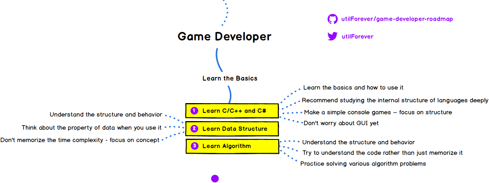
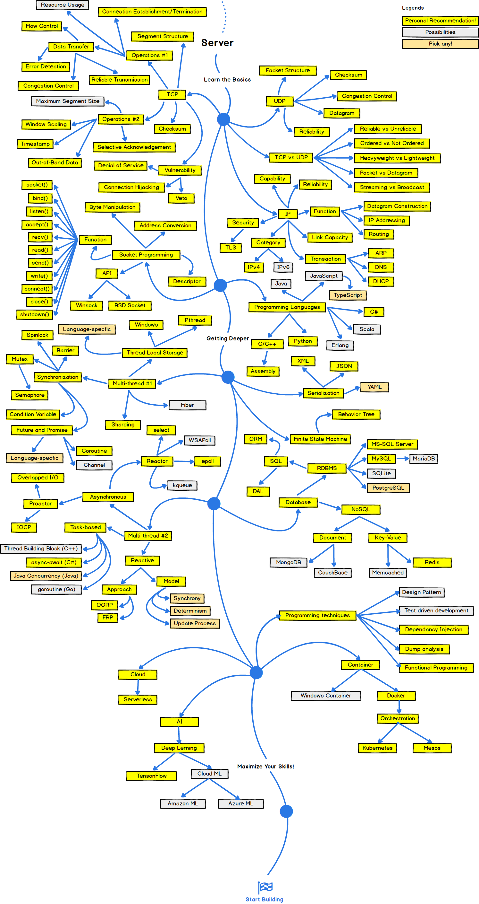
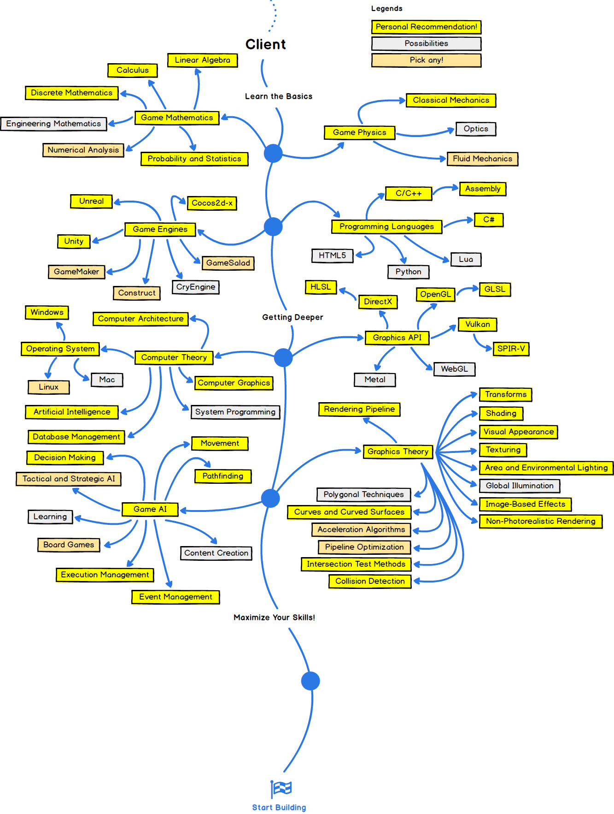

## 分享：国外大神制作的游戏开发学习线路

很多同学曾经问我游戏开发相关的问题。

嗯，怎么说呢。

我的建议是，选择一个你想做游戏的平台：iOS？Android？桌面？然后，直接上手游戏引擎，直接开发属于你的游戏。比较主流的，适合独立游戏开发者的引擎，是Unity。

当然，学习游戏引擎有一定的技术门槛，但是，现如今，游戏真的不完全是拼技术的行业。尤其是独立游戏越来越蓬勃发展的今天。近乎，每一个技术人，都有足够的基础，花不了那么多的时间，就能开始属于自己的独立游戏开发。在我看来，游戏行业更多的是一个创意行业。还有足够多的耐心和时间打磨自己的作品。

当然了，如果你想进入游戏相关大厂，参与AAA级别的游戏制作，那完全是另外一回事儿。你需要精进自己的技术，达到大厂要求。游戏行业涉及的具体技术非常非常多（其实前端，后端，移动开发，系统运维，大数据，人工智能...都很多啦）。在下面，我会给大家分享一个国外大神做的游戏行业学习路线图。

---

首先，这个路线图在我看来不能完全叫路线，不能顺着这个路径去学习的，会学死的。千万不要路径依赖。可以参考我的文章：[《高效学习的秘密》](../../2018/2018-04-18/)

但是，里面所涉及的知识点。是非常有参考价值的。能让大家对游戏开发领域有一个全局性的认识。

另外，图中都是英文，我就不翻译了。都是一个一个的技术名词而已，如果有不了解的，大家可以自行Google，也可以当一个计算机专业英语词汇手册来学习。

---

首先，不管是什么领域，只要在计算机行业，请学好至少一门基础语言，加上算法和数据结构。对于游戏开发来说，使用C++居多。由于Unity引擎的极度流行，C#也应用广泛。当然，根据你的游戏部署平台的不同，包括后端架构的不同，主流语言都在游戏行业有一席之地的。

---

在这个基础上，整体这个“路线图”分**服务端和客户端**。

服务端的知识点，其实和网页或者app的服务端，区别是不大的。所以，即使你的专业不是游戏相关的专业，对游戏行业感兴趣，进游戏厂做服务端是完全没有问题的：）

---

然后是客户端。

游戏开发的客户端，有一些其他领域开发不涉及的内容，其实主要集中在图形学，物理引擎，还有智能方面（是基于agent的AI，不是机器学习）。

而且，其实，做一名游戏开发工程师，也并不需要全部精通。比如，通常来讲，做渲染（图形学相关），做引擎，做智能，不是同一拨人。

---

最后，这个路线图，在我看来，也有不完善的地方。比如，游戏测试，其实是很重要的一块儿。据我所知，很多游戏为了测试方便，甚至会研发专门的内部使用的测试工具乃至专门的测试语言。我曾经翻看过一本不错的从底层搭建一个解析语言的书，竟然是一名游戏开发者写的：）

原文在这里：[https://codeburst.io/the-2018-game-developer-roadmap-e07e45b3c423](https://codeburst.io/the-2018-game-developer-roadmap-e07e45b3c423)

大家加油！：）