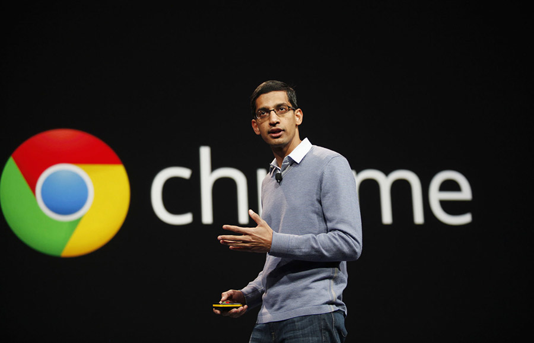
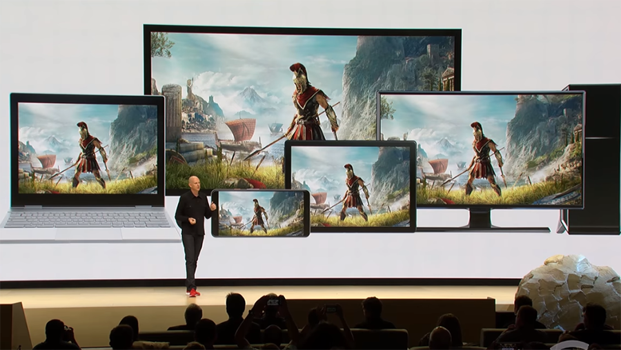

## 游戏的云端化，随便聊聊Stadia

谷歌在GDC2019大会上正式宣布了云游戏平台Google Stadia。

在笔记本界，除了Windows和macbook，其实一直有第三个竞争者。那就是Google一直提倡的Chrome Book。简单来说，就是整个笔记本就运行一个浏览器，就够了。（当然实际上没有这么简单，所以有Chrome OS的概念。）

Chrome Book是Google在2011年就提出的一个概念，到现在已经8年多了。直到如今，这个概念依然不够深入人心，因为技术上还不够成熟。但是，我从来不怀疑，这是趋势。如果大家思考一下，就会明白，已经有越来越多的任务，我们都可以直接在线上完成。

 

今年，Google在GDC2019上，公布了其云游戏平台Stadia，可谓是游戏界的一个重磅炸弹。

其实，这个平台做的事情，描述起来很简单，在云端运行游戏，客户端只需要浏览器显示游戏画面就好了。这样一来，我们根本不需要关注游戏对电脑的硬件的需求。因为真正的游戏相关运算，是在云端完成的。客户端，只是一个画面展示。

相信大家可以很容易地理解这样做的优点。理论上，我们再也不用担心自己的电脑配置无法运行新游戏了。因为，我们自己的电脑，本质就是一台显示器而已。

 

而其实，这样做的优势，还远远不止如此。从玩家的角度，我们可以想象这样的场景：在家里的客厅打了一半的游戏，要上班了，暂停。然后在通勤的路上，用手机或者平板电脑登录云服务，继续游戏。当然了，到了班上，如果你的老板允许，可以在单位的机子上继续...

也就是所谓的**终端无缝切换**。这里的关键还是在于，终端只是一个显示器而已，真正有价值的文件，在云端。

这还只是从客户端的角度。从服务端的角度，这样做，很有可能将重塑整个游戏行业。

 

首先，这样做，将**极大的杜绝外挂。**

了解外挂的同学都知道，一大部分外挂发挥作用的原理，都在于游戏本身需要在客户端进行计算，再将计算结果和服务器端做通信。

那么一方面，这个通信过程，我们可以做手脚；

另一方面，这个计算过程，由于也发生在客户端，我们也能做手脚；

还有一方面，一些计算结果，是依赖本地操作系统的。最典型的，就是时间。所以，我们还可以使用诸如变速齿轮一类的东东，根本不对游戏客户端做手脚，只是修改本地系统的运转速度，就能达到作弊的目的。

但现在，所有的这一切都发生在云端，而不在客户端。客户端就是一个显示器。可以预见的，外挂问题将得到极大地改善。

 

另外，这样的做法，还可能开创全新的游戏体验。由于所有的运算都发生在云端，那么，游戏厂商就能汇集更多的计算资源，提供以前无法想象的游戏模式。

比如，现在的吃鸡游戏，一局的参与者是100人，但是完全的云端游戏体验，一局10000人不是什么问题；

再比如，以前魔兽世界副本任务，最多40人参与，以后，全北京市的玩家一起打一个侵略北京城的大boss...？ 

 

当然了，这样做有一定的“副作用”，最大的副作用，在于简化了审核。某个游戏犯错误了，一秒钟就被拿下，所有的人都再也玩儿不了了。这个游戏，就像根本没有存在过一样。。。因为所有的游戏信息，都在云端。。。

---

anyway，云服务一定是趋势。理论上，所有的服务都能够云端化，同时，也都需要云端化。

这也是Oracle为什么要疯狂向云服务转型的核心原因。

很有可能，未来，我们的笔记本，其最大的功能，只是显示而已。到时候，我们争论的，应该是去使用微软的云服务，还是苹果的云服务：）
