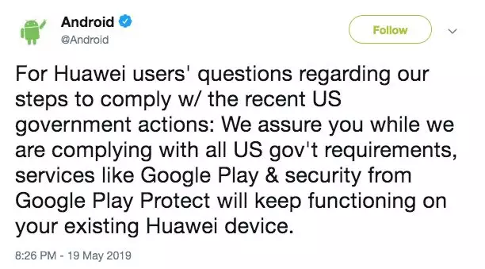
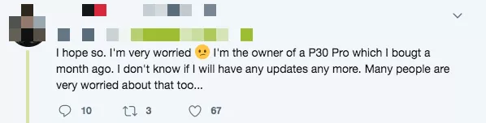
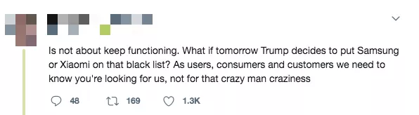
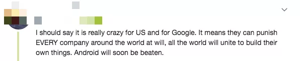
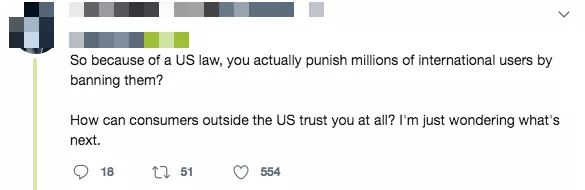
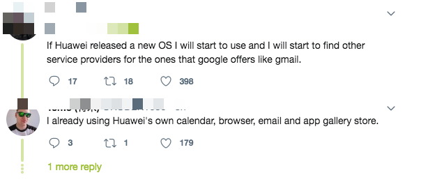
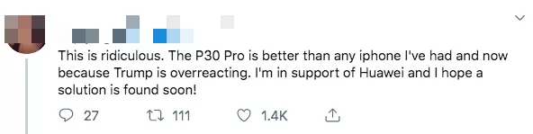

## 浅谈Google限制华为

这篇文章我在昨天得知Google停止与华为的所有业务合作的时候，就在第一时间写出来了。结果因为昨天一早推送了一篇准备好的文章[《如何把技术做深？可能，这是一个错误的问题》](../2019-05-19/)，就不能推送第二篇文章了。

今天一天在准备专栏的更新，所以没有特别关注事情的进一步发展。文章进行了一些简单修改，但并不保证消息的实时性。毕竟，**我的公号不是以报道科技新闻为主，而是分享技术观点为主**，所以，影响应该不大。

**我的观点保持不变。愿世界没有战争。愿中国更加强大。**

---

**1.**

由于美国总统特朗普早前签署的禁令，Google已停止与华为的所有业务合作。

虽然从法律角度，Google无法阻止华为访问安卓已经开放的原始代码（AOSP）。但是，Google可以禁止华为获得Google自家打造的Google框架服务（GMS）以及后续更新。这将限制华为手机使用诸多Google的服务，包括Gmail，Youtube，Google Play，Google搜索，Google日历，等等等等。

从长期角度，华为无法获取最新版本的GMS及后续更新，会带来怎样的影响，现在还看不出来。也并不排除，在几个月后，中美局势有所缓解，使得这一限制取消。毕竟，这一限制，对Google也是极其不利的。

但目前来讲，**这些限制虽然对中国用户的影响近乎为零；对华为海外用户的影响，将是致命的。**因为，绝大多数海外用户，近乎一定使用Google Play作为安卓App的应用市场；近乎一定会看Youtube；近乎一定有一个Gmail邮箱；最常用的地图服务就是Google Map ...... 更不用提，有大量其他App，在制作的时候，会或多或少的使用GMS框架。最典型的例子，就是使用Google账户登录，在国外，就像使用qq或者微信账户登录一样常见。

目前，安卓的官推已经宣布，现在华为海外手机，不会出现任何安全问题。因为对于Google Play以及背后的安全保护相关功能，还可以正常使用。

从我得知的消息，海外华为手机用户，也还可以正常使用诸如Gmail，Youtube等服务。所以这个限制具体将怎样落实，还是说对于已经发布的手机不进行限制，只针对未来华为的新手机做限制，Google还没有进一步的说明。不过，有一些海外用户已经开始表示极度的担心：

> 我一个月前买了P30 Pro，现在我不知道我的手机还能不能正常获得更新了。我身边的很多朋友也在担心这个问题。

2018年，华为的网络设备所占的市场份额，已经是全球第一；而华为手机的市场份额，则是全球第二（第一三星，第三苹果）。其中，华为手机的海外市场占比多少呢？大概占华为手机总市场的一半。2018年的数据，华为手机全球出货量2.06亿台，其中1.01亿台来自海外。

 

**2.**

对于这个事情，我的第一反应，是觉得有些吃惊。不是因为美国限制华为吃惊，而是这件事儿竟然被一贯以“不作恶”著称的Google打头阵而吃惊。我们曾经熟悉的那个Google，遇见这种事情，一定会一拖再拖，在最不得已的情况下，才会勉强为之。尤其这个事件本身，对Google的影响应该也是巨大的，并且是恶劣的。

不过在过去的一年，Google在硅谷的口碑非常差（有时间发文单聊吧），现在看来，Google是要一路走到黑了。

虽然我对安卓手机的生态不太熟悉，但可以预见的，还会有更多公司在Google的“榜样”作用下跟进，以各种方式限制华为。据我所知，现在，Intel，Qualxomn，Xilinx，Broadcom 四家企业也已经中断了和华为的业务往来。

对于这个禁令发展到现在的状况，整体是非常复杂的。已经很难讲清谁对谁错了。由于国内信息高度不对称，这个禁令酝酿了一年多的时间，其间发生的很多事情，也没法在国内媒体聊。

我只能简单地说：**对于这场贸易战，从道德的角度，我不站队。**

我坚持一个很朴实的观点：**像这个世界上的大多数争执一样，这场贸易战是一个双方都占理，同时双方也都有错误的纠纷。**如果像某些媒体宣称的那样，这场战争谁对谁错一清二楚的话，这个事情也早就消停了。

但是谁的理更多一些？谁的错更少一些？我相信，这是说不清楚的。

不过，因为我的国籍归属，**我希望中国挺住。中国必胜。**

 

**3.**

现在，这个禁令所折射出的另一个更严重的问题是，**美国能不能因为自己国家的利益，而损害全球消费者的利益？**毕竟，全球的其他消费者，是无辜的。

这是全球经济一体化带来的重大问题，同时也是当下互联网时代，越来越多的商品拥有互联网特性所决定的。如今，我们购买的大量商品，都严重依赖线上服务。我们之所以付费，是因为我们相信，这些线上服务，能持续为我们提供价值。

在没有互联网的时代，我买一个苹果，交完钱，这个苹果就在我的口袋里了。我想什么时候吃就什么时候吃；我想怎么吃就怎么吃，商家是完全无法限制我的。

但是在互联网时代，对于一台苹果手机，苹果公司有能力远远地让它变成一个“砖头”，即使你已经付完了全款。这确实是科技的发展为世界带来的一个全新的挑战。

现在看来，大多数消费者根本不关心贸易战的输赢问题，而是关注这个禁令可能带来的更深远的影响。在安卓的官推上，这样的言论随处可见。

> 如果川普决定明天把三星或者小米加入黑名单怎么办？作为用户，作为消费者，我们需要知道你们（安卓）在维护我们（消费者）的权益，而不是在维护那个疯狂的老头儿（川普）的权益！

 

> 我必须说，美国和Google都疯了。这意味着，他们可以任意惩罚世界上的所有公司。那么全世界都会开始做自己的独立产品。安卓终将被打败。

 

> 所以，仅仅是因为美国的法律，你们（安卓）就惩罚全世界成千上万的用户？如果这样做，美国以外的用户如何再信任Google？

 

可以想见，如果这个禁令持续下去，不管华为愿不愿意，不管华为有没有能力，**想要要生存下去，华为都必须自主研发属于自己的操作系统。站在国家的角度，我们国家也必须自主研制操作系统。**

**这已经不是一个可能不可能，生态不生态，成熟不成熟的问题了；而是这么做是唯一的出路的问题。**

同时，我们也将看到，在过去二三十年，全世界大多数软件开发者一起致力于建立的开源社区，也将一定程度萎缩。通过这一事件，不仅仅是中国，不仅仅是华为，对各个国家，各个企业，各个团队，都是生动形象的一课：**核心技术必须攥在自己手里。**

**我认为计算机领域越来越多的非公开项目将开始实施；计算机世界的一些底层技术或者高端技术的交流，将被阻碍；，就像我们现在国家和国家之间交流核技术一样困难。**

 

**4.**

当然，自主研发操作系统是一个艰巨的任务。对于到底什么叫“自主研发的操作系统”，也有很多争论的空间，这篇文章暂不涉及。但是，**大多数程序员都坚信的“技术没有国界”，被现实啪啪打脸了。**

实际上，**技术一直有国界。**因为技术一直是和商业利益捆绑在一起的。而一个国家商业利益的总和，就是这个国家的经济。小到一个个人，一个家庭，大到一个国家，经济都是有边界的。你我再熟悉，也不能我的钱你随便花，你的钱我随便花。所谓亲兄弟还要明算账，更不用提国家之间。**而技术上的优势，确实是美国的王牌。**从芯片，到操作系统。不管我们再怎么热血，也必须承认：**在技术上，我们确实和美国有很大的差距。**

最新消息，为了反击美国，中国将对美国的多种进口药品以及进口医疗器械加征关税。而医疗医药又是一个被高科技引领的领域，又近乎是美国的主场。对美国的药品加征关税会不会让美国损失。当然会，美国的股市已经在说明一切。但是，受到影响最大的是谁？

我们不得不承认：是那些在中国的病患。

 

**5.**

说回Google和华为。

一切挑战都是机遇。我希望借助这个契机，中国能够再用几年，哪怕是几十年的时间，在诸多高科技领域，真正达到世界领先水平。

对于今天的局面，有很多海外友人是极度支持华为，支持中国的：

> 如果华为发布新的操作系统，我会马上开始使用。并且寻找其他服务，来代替Google的所有相关服务。

> 我已经使用华为自己的日历，浏览器，以及邮件服务了。

 

> 这一切都太荒唐了。P30 Pro比我曾经使用过的任何一台iPhone都好。我支持华为，并且希望华为能够找到更好的解决方案。

 

> 我敢打赌，这个禁令之后，中国将做出一个更好的操作系统。

 

当然，我很理解，很多同学会觉得，这些外国友人根本不了解国内的实际情况，他们可能并不知道我们到底还差多远。一个完备的操作系统，不是靠喊口号就能做出来的。

这个逻辑当然对。可是就像前文所说，**事情发展到这里，逐渐拥有独立自主的研发能力和产品，将近乎是我们的唯一出路。**我也不喜欢空喊口号的人，可是，仅仅一味谴责喊口号，似乎也并不能解决问题。**所有问题的解决，都需要一步一个脚印的做出来。**

 

我想说，大家也不用对我们的国家这么没信心。我可以给大家分享一个去年（2018年），中美贸易战初露端倪时的一个小故事。

那天，我和一个美国朋友在车上闲聊，不经意之间谈起了中美之间的贸易战。你猜美国人是怎么反应的？

他大说特说了一顿特朗普政府的“错误”政策和夸张言行以后，一本正经地对我说：我觉得中美贸易战，中国会赢的。

**当然，历史可能会告诉我们，贸易战没有赢家。但我衷心希望：中国更加强大。**

 

大家加油：）