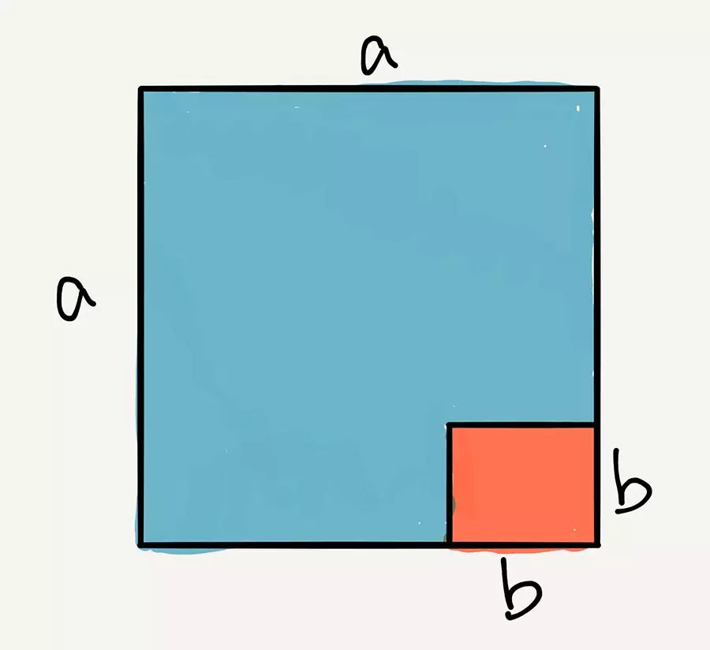
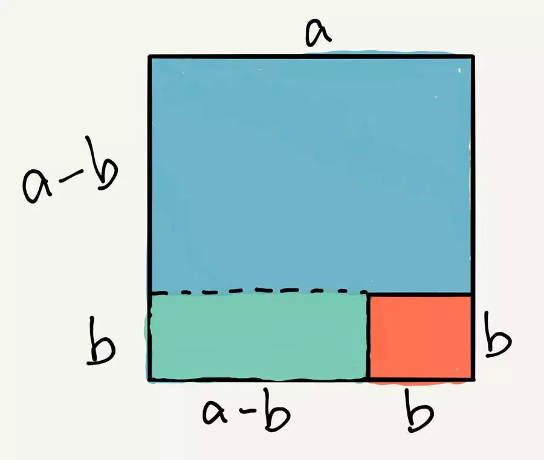
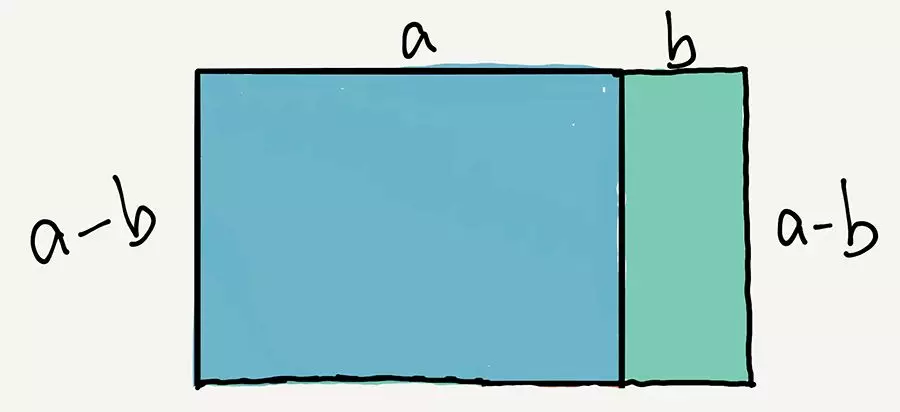

## 如何优雅地证明平方差公式？

聊点儿轻松的：）

出一个初中数学题：**平方差公式怎么证明？**

即，**如何证明：a² - b² = (a + b)(a - b)**

---

这个问题，在我们初中学习的过程中，证明思路大概是这样的：

首先，我们知道了多项式和的乘法公式，即：

(a + b)(c + d) = ac + ad + bc + bd

然后，我们就可以把c = a，d = -b带进这个公式：

(a + b)(a + (-b)) = a\*a + a\*(-b) + b\*a + b\*(-b)

注意，中间的两项，a\*(-b) 和 b\*a 是相反的，所以可以消掉，就剩下了两项。a\*a 和 b\*(-b)，即 a² - b²

所以我们证明出了：(a + b)(a - b) = a² - b²

当然，我们整个推导过程，每一步都是”等价于“，所以从左推到右和从右推到左都是可以的。我们就有了：

a² - b² = (a + b)(a - b)

---

上面的证明，是一个典型的代数证明。但是，**代数证明的缺点是：太过抽象。**

实际上，平方差公式有一个优雅的几何证明方式：）

因为一个数字的平方，就对应于以这个数字为边长的正方形的面积。

所以，我们可以想象：a² 是一个大正方形的面积；b² 是一个小正方形的面积。我们将两个正方形这么摆：

很显然，我们要求的 a² - b²，就是蓝色部分面积。

---

我们添加一条辅助线：

很显然，下面绿色部分的矩阵，面积是(a - b) * b；上面蓝色部分的矩形，面积是(a - b) * a。

我们要求的 a² - b²，就是把橙色部分的 b*b 的正方形扔掉，蓝色和绿色两部分面积之和。

---

由于这两个矩形，都有一个边是 a - b 这么长，我们可以把它们合起来。就是这样的：

这个矩形整体的面积是什么？就是 (a + b)(a - b) 啊！

得证：a² - b² = (a + b)(a - b)

 

---

对了，这篇文章的配图都是我在ipad上手绘出来的，允许我炫耀一下 

很多代数表达，都有很优雅的几何证明方式。

**通常，几何证明的缺点是，有局限性。**比如，在上面的证明中，其实隐含了很多假设：我们的a和b都必须是正数，同时，a还要比b大。但我们知道，平方差公式，是对任意数，甚至是复数，都成立的。

但是，**几何证明最大的优点，是直观。**它能帮助我们迅速将抽象的代数表达和具体的图形之间建立联系，**帮助我们”看到“代数式到底在表达什么意思。**

对于很多数学问题，直观的几何表达都能轻易帮助我们更快速的理解，之后，我们也能轻松将代数表达推广到更抽象的范围，比如数字是负数或者复数的情况：）

是不是很酷？

有机会，再向大家介绍更多代数问题的几何证明：）

大家加油！：）
