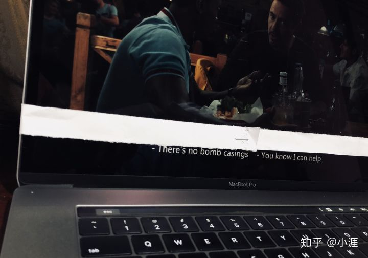

## 看美剧学英语考不考谱？我说靠谱，但别较劲

**1.**

上周，我的推文[《如何把技术做深？可能，这是一个错误的问题》](../2019-05-19/)一文中，我曾经谈到过英语学习，特别是英语阅读的问题。

在这一周，我在慕课网的专栏更新的[《学英语的最佳年龄到底是什么时候》](https://m.imooc.com/collector/27?distId=1a99b&utm_source=fenxiao)一文中，带领大家看了一篇比较新的研究英语学习的论文，又谈到了这个问题。

其实，两篇文章都指向一个方向：**想提高英语水平，最简单的方法，也或许是唯一的方法，就是不停地接触英语。**用英语去看书，看剧，看新闻，看动漫，打游戏，学习，交流。时间长了，自然而然，就会提高，想拦都拦不住。

很多同学总把注意力放在非常细节的学习方法上，比如遇到不会的词要不要查？每张纸查几个词？不会的词要不要记录？要不要复习？怎么复习？什么频率？。。。

对这些具体问题，我确实有一些建议，有机会可以再细说。但是整体上，**在“长期大量接触英语”这个方法面前，所有的这些细节问题都是雕虫小技。**在具体使用英文的过程中，不认识的词已经影响你获取信息了，你自然会去查。至于要不要复习，肯定能适当复习是好的，**但是，我敢向你保证：只要你愿意长期大量的接触英文，不复习一点儿影响都没有，肯定会进步的。因为长期大量接触英文本身，就是复习！**

 

**2.**

在这篇文章中，我想聊聊看美剧学英语。

其实，这是我在知乎的一个回答，之前也曾经向大家推荐过。但是鉴于很多同学肯定没有看到。我稍加修改，在公众号里再推送一遍。

看美剧学英语有多靠谱？我的结论是：非常非常非常靠谱。这个道理很简单，不断地进行英文输入绝对是没错的。但是，必须强调：**千万不要有中文字幕！**千万不要有中文字幕！千万不要有中文字幕！重要的事情说三遍！

如果挂中文字幕能学好英语的话，那每所大学里都有无数的英语达人了！毕竟，据我所知，追美剧的人不在少数，很多人对热播美剧如数家珍。甚至很多同学自大学以来的休闲时间，都是在美剧中度过的。但是！！大多数同学的英语水平没有显著提高，就是中文字幕惹的祸。

一旦有中文字幕，基本上大家都不会去思考语言的问题了。但没有中文字幕，为了理解剧情，我们就会去思考，这个人说的这句话是什么意思？我们才会去体会，原来表达这个意思，可以用这个词，可以这么说，可以这么搭配，可以这么组织语言，我们的英语水平才可能提高。

 

**3.**

对于看美剧学英语，很多人都会建议，完全扔掉字幕去看剧，直接啃生肉。当然，如果你的水平能直接啃生肉，固然是好的。但是，对于大部分同学来说，可能一上来就啃生肉，学习曲线过于陡峭了。

在大家已经有一定的英语基础（大概四级水平）和能啃生肉美剧之间，我认为有一个很重要的过渡。**这个过渡期，我建议大家看美剧挂英文字幕。**

有一派观点认为看美剧挂英文字幕，训练的是阅读而非听力。我的亲身经历表明，这是不对的，或者说是不完全对的。我认为：**看剧使用英文字幕，是从阅读为主的学习向听力为主的学习的一个重要过渡。**虽然，必须承认：有了英文字幕，很多人会依靠字幕而非听力获得美剧里的信息，但这不是坏事。

因为，这是一个非常重要的，纠正发音的过程。相信很多同学都有感受：整篇英语文章能“看”懂意思，但要是朗读出来，简直是一塌糊涂。这是因为我们“哑巴”英语的教学环境，使得很多同学是“看”懂词的意思，但是对单词发音并不明确，甚至错的很离谱。对单词发音错误的认识，将直接妨碍听力。你都不知道单词的正确读法，怎么可能听懂？

那怎么办？难道只能对着字典把所有单词的正确发音听一遍来纠正自己？虽然市面上有这样的产品，我也知道有人这样做，但这实在是太枯燥了！所以，对着英文字幕把美剧看一遍，我认为是非常自然地纠正发音的方式。

不要以为这个过程会那么的愉快。不信试试看。如果不曾只使用英文字幕看美剧，不管是多么喜欢的美剧，半个小时一定会看累的。就是因为不适应，我们需要额外的集中注意力才能反映出人物对白的意思，从而理解剧情的走向。这个过程大脑是以学习为主，休息为辅的，所以会疲劳。因为这是一个学习的过程。

 

**4.**

另外，我提倡看剧挂英文字幕，还有一个很普遍的原因：词汇量。

在这一点上，实际看美剧是有优势的。因为美剧中的词汇主要出现在对话中，所以不会像英文原著那样包含很多的复杂的文学性修辞词汇。但即使这样，不要小瞧美剧中的词汇量。《friends》之所以被奉为美语学习的经典，一个很大的原因是其词汇量低，用词简单（这里暂不探讨俚语和文化的问题）。

那么《friends》的词汇量是多少呢？整部美剧共十季237集，我粗略统计，不重复的单词个数是10697个。当然，这里会包括很多单词的不同形态，所以实际数字比这个数字要少。但大概是这个量级：一万词。

我不确定大家对词汇量有没有概念。随便在网上查一查，有很多词汇量测试的工具，国内外都有。我建议同学们有时间做一做，对自己的词汇量有一个大概的认识。整体上，如果大家只是在国内的环境下接触英语教育，即使过了六级，应该词汇量都达不到1万的。

**词汇量一万是什么水平呢？在英语为母语的国家，这是一个八岁孩子的词汇量的水平。**

这也告诉我们，虽然现在很多声音鼓吹什么核心词汇只要2000词；3000词；6000词的（虽然他们也有他们的道理），但是一部简单的friends，需要我们认识上万词。单词都不认识，怎么谈听懂？更不要说一个单词的不同用法和搭配了。所以对着英文字幕看美剧也是一个积累词汇量；更重要的是，学习词汇如何实际使用的过程。

 

**5.**

什么时候可以脱离英文字幕直接看美剧了？我的经验是，当不需要暂停，也能完整理解美剧的意思的时候，就可以尝试不要英文字幕了。注意，是“完整理解”，不是“猜懂”，这个度每个人要自己把握。是的，至少我在刚开始用英文字幕看美剧的时候，需要不时地暂停、甚至要回退重新看几遍，才能真的理解人物到底说了什么，是什么意思......

真到了那个阶段，如果想要看剧提高自己的英语水平，要聊的可能是另外一些问题了。这篇文章暂时聚焦在“需要使用英语字幕看剧”的阶段。

在这里，我还想说另外一个话题。就是有很多英语学习方法，建议一个剧来回刷，刷他个五遍十遍甚至二十遍。

这样做有没有效果呢？有。但是，我不是特别赞同。至少，这种方法不适合我，因为太枯燥了。讲真，在我眼里，很少有美剧值得让我在短时间内重复看十遍二十遍的。连第二遍我都懒得看，包括《friends》。

这又回到了文章开头的问题了。想提高英语水平，最简单的方法，也或许是唯一的方法，就是长期大量地接触英语。

我说是“接触英语”，而不是“学英语”。

什么区别？接触英语，本质是在应用英语，目的在于获取其他信息，而不是学习语言的使用方法（发音，语法，搭配，组织，等等等等）。获取信息是首要的，学英语是次要的。是“顺便”的。

而把一个美剧翻来覆去的刷，显然首要任务是“学英语”，而不是“获取信息”。因为顶多刷两遍，这个美剧讲的是什么，你肯定已经知道了。

翻来覆去地刷美剧，在我看来，只会让我“恶心”，时间长了，都不爱看美剧了。那就得不偿失了。

我觉得只要坚持，但凡看美剧或者英文电影，就只挂英文字幕看，时间长了，就会有效果。既然一遍看懂了，干嘛把美剧当课文，非要烂熟于心呢？那么多美剧，都能看懂也了不得。

翻来覆去地看，相当于是“精”学习了。**如果大家有时间精力去“精”学习，我建议把这个时间精力放到更专业的英语学习材料上。**比如《新概念》就很好。用看美剧的方式“学英语”，关键就是“顺便”二字，休息娱乐的时候，顺便学学英语。

**如果你不是要顺便学英语，有很明确的目标，要专门学英语，请千万不要看美剧学英语**，耽误事儿。根据你的需求，市面上不同的严肃且有效的英语教材非常多。

所以，大家想看剧顺便学英语，千万“别较劲”。看个美剧，别想着每个词每句话都搞得一清二楚的。看懂了就好了。真想较劲，跟严肃的英文教材多较劲。请大家再回顾我的文章：[《如果高效学习有什么秘诀的话，那就都在这里了：）》](../../2018/2018-04-18/)。**不要完美主义。**

当然了，人和人不同，比如有些人就是觉得《friends》超级好看，看二十遍都不腻，那么翻来覆去刷当然可以。

这里，还请大家体会我的核心思想：**怎么看，看什么，这些统统不重要。重要的是长期大量坚持接触英语。**

 

**6.**

最后，有些同学问我怎么找到只有英文字幕的资源。

国内大多数片源，都是中英文字幕的。其实，使用“物理法”就很好。我学生时代就干过这事儿。拿个纸条一贴就可以。我网上一搜，果然也有人这么干。如下图所示。图片来自知乎。

另外，有一些播放器支持马赛克功能，可以给中文字幕的位置打上马赛克。比如QQ影音。不影响观看的。以下图片来自网络搜索。

最后，如果想找到英文字幕的源文件，**可以尝试科学上网后搜索“english subtitles”**

英文原文接触多了，很多时候，对原文所表达的意思，也会有自己的理解，自己的思考。在我看来，这才是学习英语最大的魅力啊。我们因此可以接受第一手的材料，直接和作者“对话”。

比如，在我的文章[《从巴黎圣母院的大火，到消逝的IT巨头》](../2019-04-18/)中，我就对大多数字幕组在《before sunset》中关于巴黎圣母院的那句翻译产生了质疑。

虽然其实无关紧要，但是不是很酷？：）

**大家加油！：）**

