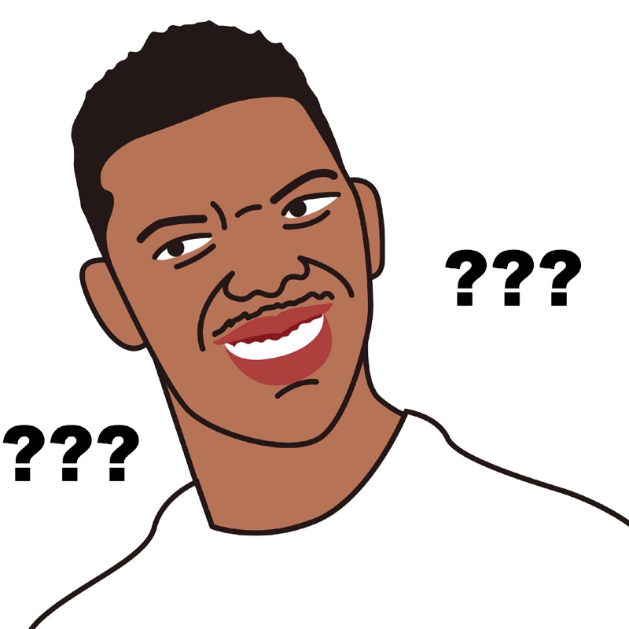
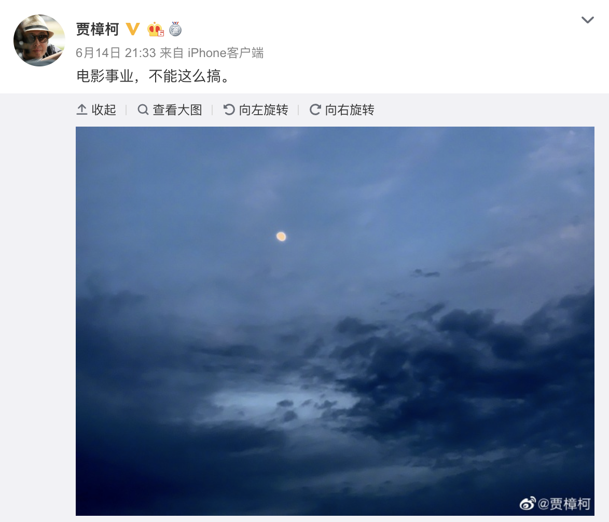

## 嘿，瞎说什么大实话。

这是一篇相对比较个人的文章，没有技术干货，只对技术干货感兴趣的同学，在这里就可以关闭了：）

**1.**

之前，我写了一篇文章，[《答读者问 | 这个年代，还有必要学英语吗？非说没必要，也没毛病》](../2019-06-03/)。一个很久没联系的老朋友，突然给我发来一个微信。

**“看你玩儿公众号玩儿的很high？竟说大实话，有流量吗？”**

我一看就乐了。和他聊了起来。

我和他自小学就认识。我自认为身边有很多大神朋友，但是如果说“聪明”，我觉得大多数人都和我一样，并非聪明之辈。所以，我写了文章[《天生不聪明》](../../2018-07-18/)。

但是，他是少有的，让我不得不承认，这个世界上真的有“聪明人”的人。

本科的时候，大家都玩儿《魔兽争霸》，他竟然垄断了某个服务器上的资源，然后风生水起的做起了“虚拟”生意，大赚特赚。此后他折腾的各种玩意儿，大多让我瞠目结舌，极大地拓宽了我对这个世界的认识。在赚钱这件事儿上，我向他学到了很多。

他和我一样，是个创业者。大多数创业者，都多多少少是“功利主义者”，我也一样。这里说的“功利”，就是钱。因为创业的职责，首先就是保证存活，自己也好，团队也罢。如何保证存活？就是要赚到钱。你可以谈理想，但是要先让大家吃饱肚子。不然，你再有理想，在别人眼里，也是个骗子。这是个很残酷的事实。

当然，赚钱分“站着赚”和“跪着赚”。但什么是“站”？什么是“跪”？这是一个没有客观标准，非常主观的问题。同样的姿势，有的人觉得是“站”，有的人觉得是“跪”。

我向来喜欢听每个人对这类主观问题的见解，但对这类问题，我从来不站队。

小时候，有人说我没有个人见解。

长大了，我才想明白，**其实，“没有对错”，就是我的见解。**

 

**2.**

对于写公众号这件事儿，粉丝数量，转发数量，阅读量，等等等等，都是硬性指标。发文章，讲的是流量。

所以，我的这位朋友对我发出了来自灵魂深处的疑问。**你这么写，都是大实话，有流量吗？**

拿[《答读者问 | 这个年代，还有必要学英语吗？非说没必要，也没毛病》》](../2019-06-03/)这篇文章来说，核心观点就是：如果觉得英语学习没有用，不学也没事儿。关键是把自己觉得有用的学好。

这个观点太不讨好观众了。喜欢学英语的不喜欢，正在努力学英语的不喜欢，想努力把英语学好的，也不喜欢。

你说不好好学英语的人会喜欢？呵呵，不好好学习的人怎么会关注我的公众号？

“但你说，我的观点有毛病吗？”，我问。

“一点毛病都没有，就是完全没有传播度。”

---

他又拿出一篇我的文章，[《浅谈Google限制华为》](../2019-05-20/)

“这篇文章是什么鬼？”他再次发出来自灵魂深处的疑问。

还用红字标出，

**“我只能简单地说：对于这场贸易战，从道德的角度，我不站队。” **

 

**“谁的理更多一些？谁的错更少一些？我相信，这是说不清楚的。” **

“你是认真的吗？你写公众号的，难道不看别的公众号吗？”

“还，...真没怎么看”，我老实巴交地回答。

”来来来，学习一下最近的10万+。“

他一甩手，丢给我一沓链接。标题基本都是一个套路。

**什么什么怎么就沸腾了，美国人怎么怎么就懵逼了。**

也不算骗人，美国人要是能看懂，一定真的很懵逼。

“你写的挺不错，也挺有深度，但真的不利于传播。”他开始总结性发言了。我还是很相信他的判断的。

**“嘿，瞎说什么大实话。”**

 

**3.**

当然，我们都知道：**实话不止如此，没有说的话太多太多。**

我们就又在微信里聊了起来。

在国内的时候，我和他曾经保持着每周一次夜谈的不成文的默契，很多时候，一下子聊到天亮。直到我因为家庭原因，跑到了国外。

面对面的交流，没什么顾及，想说什么说什么，想骂什么骂什么。每次和他的交流，都是一次酣畅淋漓的旅行。从商业，到技术；从文学，到艺术；从经济，到历史。

如果没有曾经的自由，我不会意识到，在微信里交流，会这么拘束。

很快，我们在微信的交流，成为了猜谜游戏。每句话都充斥着各种暗语和字母，刚开始，我还觉得拆解这些“暗语”是很有意思很酷的事情，但很快，一股悲凉从心而生。

虽然我们都不是什么“核心价值观好青年”，但我们也是衷心希望祖国繁荣昌盛的好少年（中年？）啊！

**为什么会被逼得如此说话？这真的正常吗？**

**我不知道。但我知道，这真的一点儿都不酷。**

 

**4.**

最近的时事热闻，一个发生在香港。

香港是中华人民共和国的特别行政区，但大多数人对发生在香港的事情一无所知。更不要说充分地讨论了。

我的投资老板，是在香港挖的第一桶金，现在移居在澳洲。香港对于他，有着不同寻常的意义。

他在朋友圈转发了一篇文章，叫[《香港，香港》](https://mp.weixin.qq.com/s?__biz=Mzg2MDE1ODM2OA==&mid=2247483806&idx=1&sn=c2e8ce14e564536d63ac04be409977b8&chksm=ce2be151f95c6847b554ffad8e2c2e4a6b9d204a6acaf52fdb0b6454a6b8030592e6ae26992d&scene=21#wechat_redirect)。我看了一下，是一篇十万加，就是一篇像香港旅游宣传片一样的文字。没有任何敏感内容。但作者关闭了评论通道。

我总在想，不同的人，不同的经历，和这片弹丸之地有着不同的纠葛，看到这篇文章，会想到什么，念起什么。

我不知道。

---

另一个事情，是电影《八佰》，因“技术原因”被取消放映。这道取消令来得如此突然，观虎导演在前一天，还在为电影做宣传。

贾樟柯在微博上说“电影事业，不能这么搞”，并且配了一张乌云蔽日的照片。

朋友跟我说，你口口声声做技术原创，这个“技术原因”，是不是要好好分析一下？

**我说，我的技术能力还没有那么强。**

---

说到《八佰》描述的这个主题，就要提到台湾。

我曾和朋友一起在台湾旅游，自驾环岛一圈。我个人极其喜欢台湾的风土人情。

在新加坡的时候，有一次，几个（新加坡）同事想一起去台湾开个会，顺便再玩儿一圈。结果，我和老婆悲哀的发现，由于我们是中国护照，所以需要办很多额外的手续，才能入境台湾。最后，因为时间太紧，我和老婆只得放弃了这个本来应该是“说走就走”的旅行。

新加坡的同事惊讶地表示，以为台湾是中国领土不可分割的一部分，为什么中国公民出入台湾，竟然比我们还严格？

**我无言以对。**

 

**5.**

1986年，崔健在北京工人体育馆举行的百名歌星演唱会上演唱了《一无所有》，宣告了中国摇滚乐的诞生。那时，我半岁。

1989年，崔健创作并完成专辑《新长征路上的摇滚》；1991年，某个著名的历史事件两年后，崔健发行了《解决》。其中，收录了这篇文章开头我放的音乐：《一块红布》。那一年，我6岁，懵懂地步入了小学课堂。

严格来说，崔健并不是我这个年代的音乐人，而属于比我更早的年代。直到又过了6年，我上初中，才开始接触崔健的音乐。那时候的男孩子，包括我，听崔健，更多的是在耍酷。虽然已隔十几年，但其实完全听不懂。只是，似乎，除了崔健，中国就没有真正的摇滚乐了。

那时候，听《一块红布》，最喜欢里面的一句歌词，**“可你的嘴将我的嘴堵住”。**

这喜欢，完全来自青春期的躁动。

但将近二十年后，再听《一块红布》，竟然还最喜欢这句歌词，**“可你的嘴将我的嘴堵住”。**

但这回，我仿佛听见，崔健跟所有人说，

**“嘿，瞎说什么大实话”。**

 

2019.06.16 于美国 Santa Clara

---

**《一块红布》部分歌词摘抄：**

那天是你用一块红布

蒙住我双眼也蒙住了天

......

你问我还要去何方

我说要上你的路

 

看不见你也看不见路

我的手也被你攥住

你问我还在想什么

我说我要让你做主

 

我感觉你不是铁

却象铁一样强和烈

我感觉你身上有血

因为你的手是热呼呼

 

...

 

我感觉这不是荒野

却看不见这地已经干裂

我感觉我要喝点水

可你的嘴将我的嘴堵住

 

我不能走我也不能哭

因为我的身体已经干枯

我要永远这样陪伴着你

因为我最知道你的痛苦

 

那天是你用一块红布

蒙住我双眼也蒙住了天

你问我看见了什么

我说我看见了幸福

 

**新的一周，大家加油！：）**
