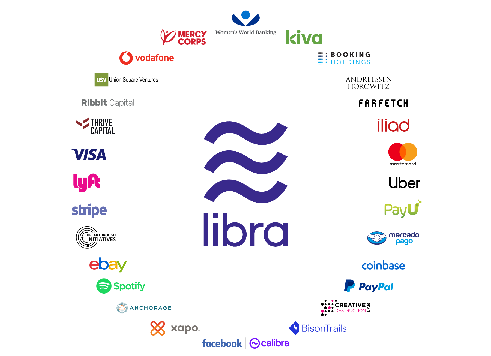
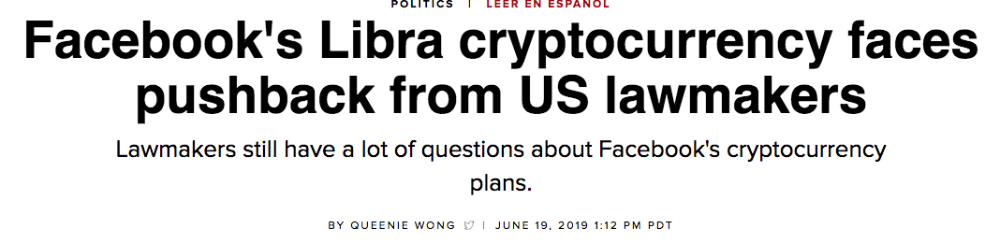
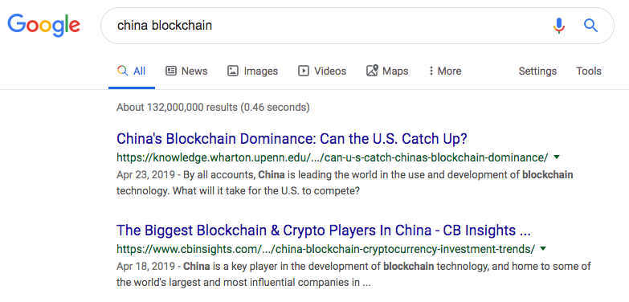
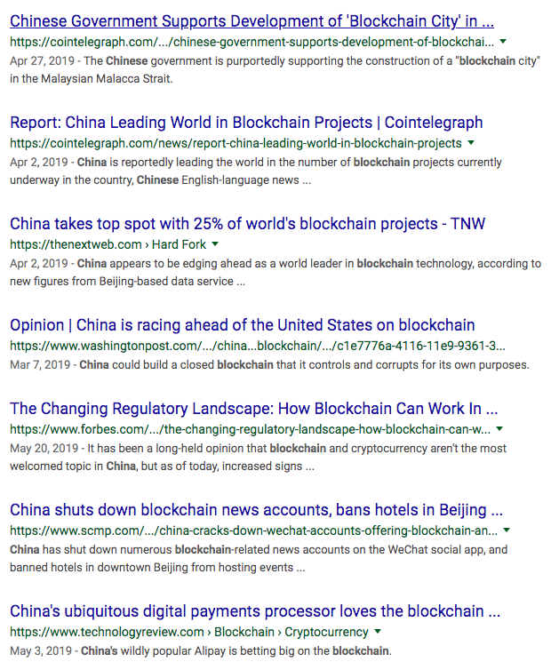

## 浅谈Facebook发布数字币Libra

**1**

6月18日，Facebook 公布了其筹备了近一年的加密币 Libra 的白皮书。现在这个白皮书还没有中文版，不过按照如今中文开发者社区的活跃程度，应该很快就有中文版了。想先睹为快的同学，可以访问以下英文版的链接。

[https://libra.org/en-US/white-paper/](https://libra.org/en-US/white-paper/)

由于微信不允许在推文中添加外链，所以需要大家手动复制地址到浏览器。不排除需要科学上网。

不过，白皮书这种东西，大部分和产品宣传书差不太多。什么在全球范围可以像短信或者分享照片一样简单，安全，可靠，便捷的交易。而且更加便宜，手续费近乎为零。

如果你曾经读过一两篇曾经一度很热门的诸如《五分钟带你了解区块链》，《从没有一篇文章能把区块链讲的这么明白》一类的十万加文章，应该会认同 Libra 具有这样的优势。虽然我看过的大多数这类文章，根本没有把区块链的实质给点出来。

与此同时，所有基于区块链技术的加密货币都具有这样的优势。所以这些也都是废话。

 

**2**

将 Libra 和大多数其他加密货币，比如比特币，区分开来的，是其背后有作为支持的实际资产抵押。Facebook 官方说法是，这个实际资产，是一系列低波动性资产，比如稳定且信誉良好的中央银行提供的现金或者政府债券。这使得 Libra 的价格近乎不可能像以比特币为首的电子币一样，有那么大的价格波动。所以，Libra 的价格不完全由，或者是完全不由用户的“共识”而决定，而由其背后作为实际支撑的资产所决定。

**李笑来的名言，傻逼的共识也是共识，一定程度对Libra失效了。**

所以，Libra 是一种稳定币（stablecoin）。这是一个专有名词，有兴趣的同学可以查一查。Libra 的问世，也应该会让 stablecoin 的概念一定程度火起来，被更多的人所了解。

不过，Libra 并不是世界上的第一个稳定币。以下加密币都是稳定币：DGX，TUSD，USDT，PAX...... 有兴趣的同学可以自己查一下。

但要注意，稳定币不代表没有风险。只是风险更少。历史上有稳定币彻底失败的案例，比如 NuBits；

而稳定币领域的绝对老大 USDT，直接使用美元做支撑，也曾在2017年曝出丑闻，疑似过量发行了超出其美元支撑金额的电子币。这里说是疑似，只是法律上的严谨而已，毕竟没证据。但我个人倾向于近乎肯定。因为USDT拒绝向公众或者权威第三方对其进行任何形式的审计或者提供证据。有一派观点认为，2017年比特币连带各种加密货币疯狂暴涨，幕后的黑手就是USDT。不过这扯远了...

说回稳定币，即使是法币，也有不稳定的因素。无论是津巴布韦，还是土耳其，都在近些年由于经济危机，出现了其国家法币价值迅速下滑的情况。所以，稳定币的稳定也是相对的。但不管怎样，**我坚信 Libra 的稳定性，比现在市面上主流的加密币，应该是稳定了不止一两个量级。**

 

**3.**

由于 Libra 是一种稳定币，其价格是由其背后支撑它的资产背书的。所以，获得 Libra 的手段不是“挖矿”，而是使用法币兑换。也就是。。。充值。。。

这使得区块链技术界的很多人，并不很认同 Libra。因为如果没有可以让普通人参与的“挖矿”机制，就意味着 Libra 不是“去中心化”的。而“去中心化”，近乎是区块链技术的核心。

或许也正是这个原因，使得 Libra 和比特币有着本质的区别。Libra 白皮书的发布，也并没有导致比特币大涨。

但我个人认为，至少在现阶段，这并无妨。对于其他加密货币，虽然本质确实是去中心化的，但是，一旦被实际作为货币使用，无论是支付，还是交易，都要经过第三方，此时，这些货币都一定程度中心化了。

交易所是最好的例子。当我们在一个交易所交易电子币的时候，交易所就成为了电子币的中心。交易所可以看到每个人名下的资产信息；交易所可以更改，没收你名下的资产；当然，国家或者其他权力机构也可以勒令交易所没收你名下的资产；如果交易所的安全防线被突破，你的资产也将遭受威胁。

这就是为什么出现过那么多起交易所跑路或者被黑的事件后，投资者的财产都遭受了严重的损失，而并没有像加密币所宣称的那样“安全”。

另一方面，在现阶段，我认为完全去中心化的货币，时机还并没有成熟，或者还远远没有成熟。这就像我们的社会，离共产主义还很远很远，是一样的。

完全的去中心，完全的匿名，将给洗钱，贿赂，勒索，等各种犯罪活动提供温床。基于比特币，已经有无数事件向我们证明了这一点。

这就好像绝对的言论自由，近乎一定将会产生无端的谩骂，诽谤和人身攻击；绝对的身体自由，我都不敢想象会发生什么。

所以，自由是相对的，至少在短期内，人类社会会是如此。关键是，如何界定有限自由（法律）；谁有权利剥夺他人自由（法院）；剥夺他人权力的自由如何被监督（三权分立）；以及如何执行这份权力（国家机器），等等等等。

因此，**我认为 Libra 其实走在了一条正确的，符合历史发展，社会发展的道路上。**

 

**4.**

其实，**Libra真正要做的，是支付网络。**

当然了，本质上，**区块链本身就是支付网络。这是所有加密币价值的核心来源。**理解这一点并不容易。

这有点儿像，爱因斯坦像我们揭示了：空间不仅仅是“空间”，空间其实是一个“场”，**我们所处的整个宇宙空间，是一个巨大的“引力场”。**理解到这一点，是理解爱因斯坦的相对论，尤其是广义相对论到底在说什么的金钥匙。也是现代物理学和古典物理学的巨大分水岭。

同理，比特币（以比特币为例）不仅仅是一个“币”，比特币是一个支付网络（区块链）。没有这个网络，就没有比特币；没有比特币，也就没有这个网络。**比特币价值的核心，是其背后的这个网络的价值。**

在我看来，是否将比特币和其背后的网络分割来看，甚至根本意识不到比特币背后所存在的网络，是“币圈”和“链圈”的核心分水岭。

但是，在这里，我不想对这个问题解释的过多，因为在我尝试向一些人解释这个问题之后，我意识到了很多人并不想这么看问题，所以很容易陷入鸡同鸭讲的境地。

我并不是说我比别人多高级，毕竟无论是鸡还是鸭，都是一个级别的家禽类动物。烧着吃都不错。我只是说，对这个问题，大家背景不同，接收的信息源不同，认识也就不同，所以得到不同的结论，完全是正常的。

如果你认为比特币（包括所有的加密币）都是骗人的，我无法反驳你，也不想反驳你。更何况咱们伟大祖国都这么定性了。所以，这么想挺好的。少了很多风险和麻烦。

说回 Libra，**如果我理解的没有错，Libra 其实就是想认认真真的做回区块链技术的本源：在符合当下人类社会经济发展的规则和制度下，利用区块链技术，做一个有影响力的支付网络。**

 

**5.**

从现在Libra背后的支撑企业来看，实力都是极其雄厚的。甚至，有很多本身做支付网络的大佬，在支持这个新兴的支付网络，比 VISA 和 mastercard。

但是，整体情况，还是并不乐观。

欧洲现阶段整体对 Libra 并不欢迎。

这其实不赖欧洲，赖美国。因为，Libra 是一家由美国企业发布的电子货币。纵使是私人企业，也很容易被认为其背后代表的是“美元体系”，而非一个“更方便安全快捷”的支付网络这么简单。

要知道，当年金融危机，美国人疯狂地做空欧元，就是为了保住美元在世界经济体系中的霸主地位。再加上早些年以 Facebook 为首的科技企业在隐私方面的问题，引发了欧洲最严隐私法 GDPR 的产生。欧洲整体对这家美国企业发布的电子币有一定的戒心，是无可厚非的。

但其实，即使在美国，Libra 可能也会比想象中的艰难。最新的新闻，美国的监管机构已经开始向 Facebook 的 Libra 喊停。

所以，**现在 Libra 面对的问题，其实根本不是技术问题，而是制度问题。**毕竟，区块链技术本质是要颠覆现行的货币制度，这不是一个小事情。

 

**6.**

不过，如我上文曾经说的，**我认为 Libra 走在了一条正确的，符合历史发展，社会发展的道路上。**很多细节问题的梳理，可能还需要时间。

在我这个《是不是很酷》公众号刚申请后不久，我就曾发表过一篇文章[《随便聊聊比特币和区块链》](../../2018/2018-01-30/)。整体，我还是十分看好区块链技术的未来的。

对了，顺便一提，虽然我国将 ICO 定为非法，但我国在区块链技术上可并不弱。以美国为首的很多国家，都在盯着我国，看我国要基于区块链技术有什么大动作。

不信？随便在 Google 上搜索 **China blockchain** 的关键词，得到的结果是这样的：

我就不翻译了。

在我上面的文章[《随便聊聊比特币和区块链》](../../2018/2018-01-30/)里，我就说过：**对ICO定性为非法融资，可以理解成是国家对电子货币发行的一种规范。至于这个规范的意义，我想不是“电子货币要玩儿完”，而更多的是“这个事儿大家不要自己搞了，国家队接手了”**

以上。

 

**大家加油！**

---

P.S. 

补充一句：我认为国家定性ico非法是没有毛病的，直接堵住了很多骗子依托ico进行金融诈骗的门路；而且现在基于ico也确实没什么能给社会带来价值的应用，不算打击创新。但是区块链是一项重要的，有应用前景的技术，国家为了保持竞争力，也要发展挖掘利用这种技术。这两者不矛盾。
