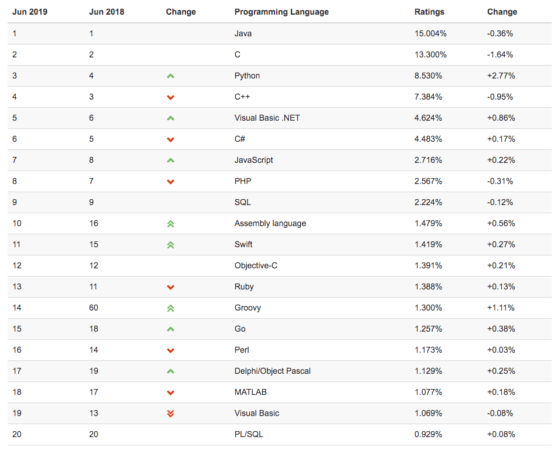
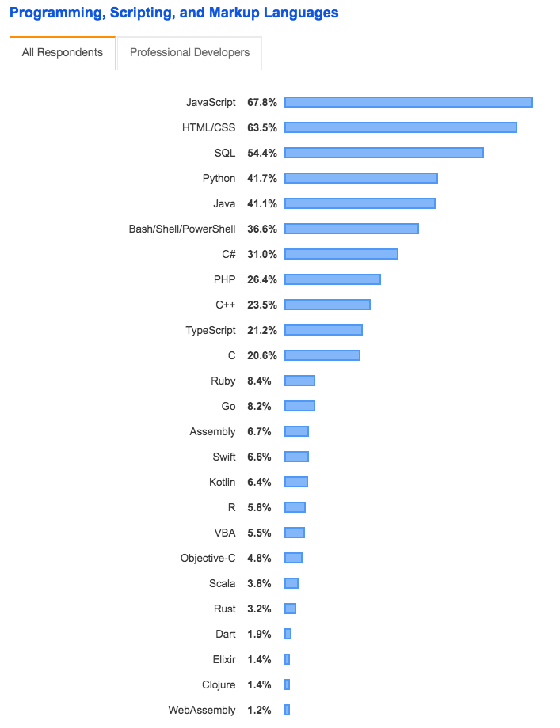
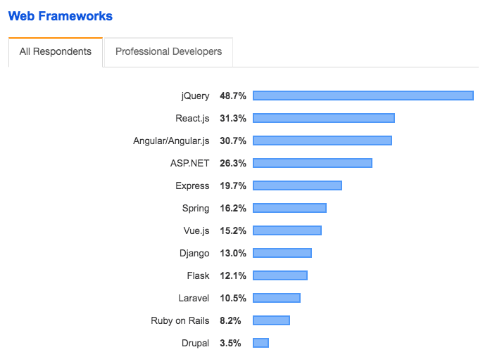
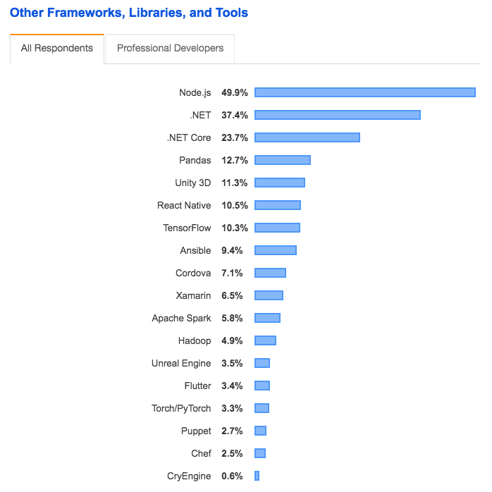
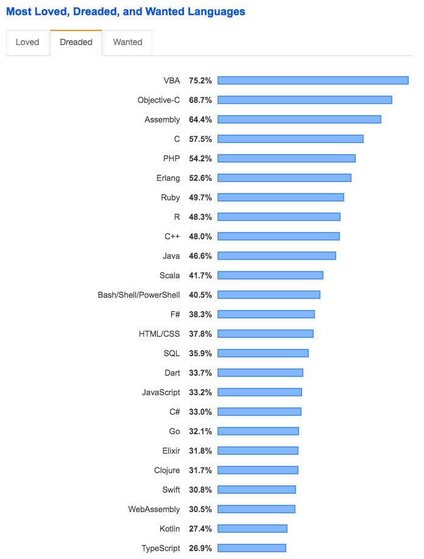
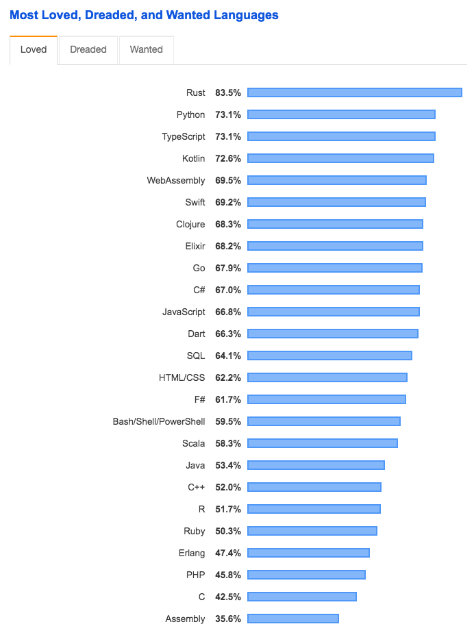
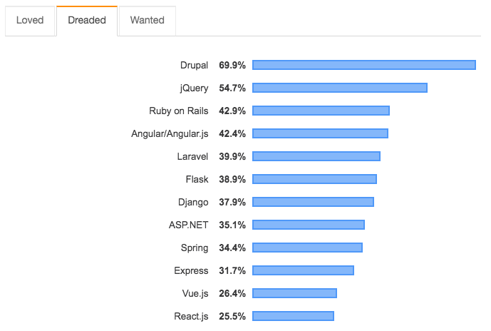

## TIOBE 编程语言排行榜到底靠不靠谱？我想大家推荐另一个榜单。

不知道从什么时候开始，很多公号喜欢拿 TIOBE 编程语言排行榜说事儿。这个榜上某个语言上升一个名词下降一个名次的都要被大书特书。

最典型的例子是对 Python 语言的吹捧，Python语言在最近几年的火热是众所周知的事情，不需要什么排行榜，大家都看在眼里。现在 Python 在这个排行榜是什么趋势呢？2019年6月最新的 TIOBE 编程语言排行榜是这样的：

Python 名列第三名。

所以，Python 连小学生都要学习了，大家快来学习啊。

在这里，我没有黑 Python 的意思，大家都学习 Python，掌握这么一个脚本语言，如果运用得到，在很多场景，都能大大提高工作效率，是个挺好的事情。我本人也很喜欢 Python 语言。（但绝不是铁粉）

但关键在于这个逻辑。如果在 TIOBE 排行榜上排名靠前，就意味着大家都要重视，意味着是趋势的话。那么显然，小学生都应该学习 Java，因为 Java 是第一名。

除了 Java，其次应该学习的，就是 C 语言了，因为 C 语言是第二名。不仅如此，从 Ratings 上看（大家可以理解成是投票数），这两个语言都和 Python 不在一个量级上。

仔细观察，这个排行榜还有很多“奇怪”的地方，比如大火的 JS 语言，竟然输给 C++, C# 和 Visual Basic.NET。大家可以随便在一个群里做个小调研，看看是 JS 应用广泛，掌握的同学多，还是 C++, C# 和 Visual Basic.NET 更流行。这显然是违背现实的。

所以，TIOBE 编程语言排行榜到底靠不靠谱？

---

一个排行榜靠不靠谱，这是一个伪命题。像我在[《如何把技术做深？可能，这是一个错误的问题》](../2019-05-19/)中所说的，很多问题的核心，是对问题的定义。换句话说，什么是“靠谱”，不同的人，理解不同。

看待一个排行榜，关键就是这个排行榜的依据是什么。如果这个排行榜的依据契合你的需求，他就靠谱，否则，就不靠谱。

那么 TIOBE 编程语言排行榜的依据是什么？按照 TIOBE 官方的说法：

> Popular search engines such as Google, Bing, Yahoo!, Wikipedia, Amazon, YouTube and Baidu are used to calculate the ratings

翻译：使用主流的搜索引擎，比如谷歌，必应，雅虎，维基百科，亚马逊，YouTube，百度等，来计算排行权重。

换句话说，TIOBE 使用搜索引擎上的数据作为排名的依据。**一个语言在TIOBE上排名越高，代表着你能在搜索引擎上寻找到更多关于这个语言的文字或者讨论。**

这样一来，是不是觉得 C 语言名列第二就合理了？毕竟，C 语言有着那么久的历史，曾在整整一个时代，是所有程序员的入门语言。即使今天，在我国，大多数院校计算机专业的学习，第一门语言也是 C 语言。

根据这个排名依据，TIOBE 确实能一定程度反应一个语言的流行度。但其实不能反映一个语言“当下”的流行度。因为历史在互联网世界里留下的印记，在 TIOBE 的这个指标计算方式中，会冲击真正的流行和趋势。所以，**在 TIOBE 排行榜中，经常会看到一些老古董名列前茅，但一些明明是趋势，具有相当的发展前景的语言，却名落孙山。**

---

如果不去看 TIOBE 编程语言排行榜，要如何选择学习的语言？

对此，我的建议永远是：**不要选择语言，而去选择领域。**换句话说，大家完全没必要去比较不同的语言的好坏，至少在新手阶段是这样的。大家应该去思考，自己想解决什么样的问题。

比如你觉得移动开发很酷，能做出有意思的App，那么进而去权衡想做 Android 开发还是 iOS 开发，当你做好这个决定好以后，你主力要学习的语言基本上就已经选择好了。**语言只是工具，服务于你想要达到的目的。**

通常情况下，我们很难看到一个人的头衔是某个语言专家，比如 Python 语言专家，或者 Swift 语言专家。我们只能看见机器学习专家，或者 iOS 专家，就是这个原因。领域比语言重要太多，甚至可以说，在领域面前，语言不值一提。

更何况，通常，成为某个领域专家，解决这个领域越来越多的问题的过程中，都是要使用多种语言的。这里的本质，也是因为**不同的语言适合的场景不同。**遇到某个场景的问题，就去用最适合的语言去解决相应的问题。再次强调，**语言只是工具而已，但一名技术人员真正的价值，在于解决了什么问题，而不是掌握了什么语言。**

当然，有一些领域，包含多种语言解决方案，比如都是做后端，Java 可以，C# 可以，C++ 可以，PHP 可以，Python 可以，JS 也可以。此时，是不是应该选择语言了呢？

我的答案也不是。**此时，应该去选择框架，语言依然是第二位。**

这里，最典型的其实就是 Python 语言。Python语言可以用来做后端，但 Python 语言的火热，更多的是在大数据，人工智能领域的应用。如果仅仅是因为 Python 火，而选择使用 Python 做后端，这个决策很有可能是不明智的。

依然是，我没有说不应该选择 Python 做后端，我想强调的是，**不应该因为 Python 语言火，而选择使用 Python 做后端。**这个因果关系是错误的，因此可能导致以后看来，你的决策是错误的。Python 语言火的背后，有很多和后端这个领域完全没有关系的因素。

---

所以，编程语言排行榜这个事儿，看看就好了。是个消遣，跟富豪排行榜似的。但真要做决定，语言不是第一要务。

最后，对于排行榜，我从来不推荐 TOIBE 的编程语言排行榜。我向大家推荐 **Stackoverflow 每年基于全球开发者统计得到的报告。**Stackoverflow 2019年的报告，可以[**点击这里**](https://insights.stackoverflow.com/survey/2019)

为什么推荐 Stackoverflow 的报告？首先是因为这份报告每年是重新统计的，所以不会出现之前我说的互联网上的历史数据淹没趋势的现象。

其次，这份调查统计是 Stackoverflow 这个近乎是全球最大的开发者问答社群，基于其真实开发者用户获得的数据。更能体现开发者的“意志”，而不会被非专业开发人员的想法所“绑架”。显然，对于具体技术的感觉，开发者自身更靠谱。

比如，对于编程语言，Stackoverflow 2019 年的报告，评选出的最普遍使用的语言是这样的。是不是觉得合理很多？

另外，还记得我上面说的，**首选框架，而非语言**吗？Stackoverflow 的调查也对框架进行了排名。

比如，对于 Web 端的框架，排名是这样的（从2019年开始，这个调查对 Web 框架单独列榜）：

其他框架的排名是这样的：

对于 Stackoverflow 的调查，我最喜欢的一点，是包含一个，大家今年最喜欢的语言（或者框架）是什么？最想学习的语言（或者框架）是什么？认为正在死亡的语言（或者框架）是什么？**在我看来，这个榜单，才更能说明趋势。**

比如，今年，大家认为**正在死亡的语言**是这样的：

大家可以看到，在 TOIBE 编程语言排行榜上很多名列前茅的语言，在这份“正在死亡的语言”榜单上也名列前茅，是不是很有意思？

那么大家此时都喜欢的，看好的语言，是什么样子的呢？是这样的：

嗯。。。不同背景的同学们应该能从中看出不同的东西：）

框架方面也是如此。比如，大家认为**正在死亡的 Web 框架**是怎样的呢？是这样的：

大家注意，在上面 Web 框架排名中，jQuery名列第一，但它同时在“正在死亡”的排行榜，名列第二。再次告诉了我们，**流行的，不代表趋势。**

Web 框架方面，最受大家喜欢的框架是什么样子的呢？是这样的：

当然了，所有的排行榜，都只是某一个角度的参考。面对这些参考，大家要怎么行动，是另外的事情了。

 

**新的一周，大家加油！**

