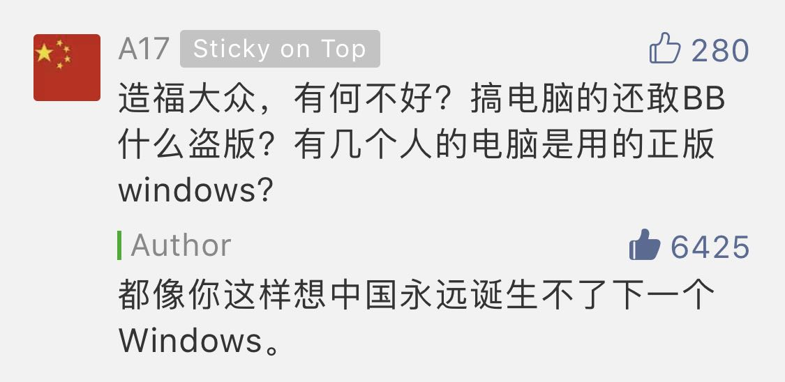

## 一场关于知识产权的讨论

上周，一名内容创业者韦老师在他的公众号发表了一篇文章[《闲鱼与盗版更配，起诉到底绝不和解！》](https://mp.weixin.qq.com/s?__biz=MzAxNTAyOTczMw==&mid=2649330749&idx=1&sn=634296a973a7839dde06e8df1a92b49d&chksm=839770b7b4e0f9a1032b63c0109e0660513191659ff55f28d41a32a27efa40fd2ad81fc3390b&mpshare=1&scene=1&srcid=0626VWRTwoRK4UbjwPHs8PG9&pass_ticket=B6hY64shJG2GbcMIeFXlsdoTUVOiqwjP%2Fx%2BNailBtcYr2fhWhke9RmzY7Xdtmsxp#rd)，怒斥了闲鱼平台对于盗版问题的“不作为”。

后来，这篇文章被公众号大V **小声比比** 转发，[《因为闲鱼上随处可见的盗版，这家创业公司要倒闭了》](https://mp.weixin.qq.com/s?__biz=MzIxMjgxMDAwOA==&mid=2247497524&idx=1&sn=e42168fb3ad4f22a50f50dd3cbb159a7&chksm=9742d743a0355e555b615fb7377a265424135915a6c485fb6e5f270d0869b2b3032d71fedc7a&mpshare=1&scene=1&srcid=&pass_ticket=B6hY64shJG2GbcMIeFXlsdoTUVOiqwjP%2Fx%2BNailBtcYr2fhWhke9RmzY7Xdtmsxp#rd)。

在这里，我不想声讨太多关于盗版的问题。中国的版权环境大家都是了解的。不过让我欣慰的是，越来越多的人有了版权意识，购买正版支持知识创作者，也正是因为如此，有越来越多的人，愿意花时间整理，贡献出自己的知识：）

尽管如此，在[《因为闲鱼上随处可见的盗版，这家创业公司要倒闭了》](https://mp.weixin.qq.com/s?__biz=MzIxMjgxMDAwOA==&mid=2247497524&idx=1&sn=e42168fb3ad4f22a50f50dd3cbb159a7&chksm=9742d743a0355e555b615fb7377a265424135915a6c485fb6e5f270d0869b2b3032d71fedc7a&mpshare=1&scene=1&srcid=&pass_ticket=B6hY64shJG2GbcMIeFXlsdoTUVOiqwjP%2Fx%2BNailBtcYr2fhWhke9RmzY7Xdtmsxp#rd)这篇文章中，第二名的留言依然很具有代表性。

在我看来，这就好比在说，小偷偷了东西便宜卖给别人，造福大众，有何不好？

讽刺地是，这名用户的头像使用的是中华人民共和国五星红旗。

---

不过，我确实承认，知识产权本身是一个有争议的话题。社会上围绕知识产权的讨论，从来没有停止过。

上周，我在朋友圈转发了小声比比的这篇文章，引来了一个朋友跟我的讨论。我觉得这个讨论挺有意思，在这里分享给大家。

所以，**这篇文章，我有点儿偷懒，基本就是我们在朋友圈的留言整理：）**

当然，我们的讨论不够充分，我们也都不是知识产权问题的专业人士，所以难免有不严谨的地方。

但是，我的核心观点是：**知识产权必须存在，但是以何种形式存在，可以讨论。知识产权存在的原因在于，要保证原创作者有回报，只有这样，才有人愿意产生知识，社会才能更好地发展**。

实际上，如果深入交流，就会发现，大多数所谓的“反知识产权”人士，对此也是赞同的。只不过认为现行的知识产权制度提高了公众获取知识的门槛。对此，我也赞同，现行的知识产权制度，有这样或者那样的问题。但关键是，更好的制度在哪里？因为，可见的，如果废除现行的知识产权制度，原创作者将没有动力做任何原创，结果是**公众获取知识的门槛更高**。

这就是经济学，政治学，社会学等领域有意思的地方。社会是一个整体，牵一发动全身。很多事情不是简单的 1 + 1 = 2。这就像曾经很多人讨论过的，从法律量刑的角度，拐卖儿童不能轻易判死罪；这也是曾经美国的“禁酒令”全面失败，最终不得不废止的原因。看起来拐卖儿童十恶不舍，我们把这些坏蛋杀掉就好；看起来酒是一个坏东西，我们把它禁掉就好了。但事情没有这么简单。如果世界这么简单，乌托邦就不是乌托邦了。

至今为止，在我们的社会上，没有一种制度或者法规，是完美无缺的。批评一种制度是不好的，这是很简单的事情。但关键是，现行制度是不是已有方案中的最好方案？**如果是，我们也只能暂时接受他的缺点。**

当然，还有很多“反知识产权”人士提出了这样或者那样的可能措施，在下面的讨论中会提到一二。我认为都是有问题的。

---

**下面是我和我的朋友的讨论：**

**朋友：**

或许本就不该有知识产权这种概念？或许确实无法保护所谓的知识产权？比如专利保护是公开换保护，但可口可乐就是不去申请专利，是否才是正确的方式？知识产权是否反而阻碍了创新？有关这个东西我还没有想明白……

**bobo：**

我以为知识产权在鼓励创新。因为知识产权保证了创新者有收益。如果没有知识产权，大家就没有创新的动力，窃以为这是中国少有技术主导的企业的核心原因。技术太容易被偷走，没有良好的版权保护环境，就没有人做。但知识产权应该是有期效的，当然期效是多少可以讨论，包括具体怎么叫侵权，细节上也有很多可以讨论的地方。但是没有知识产权，我认为是不可行的。

**朋友：**

拿写文章举例，知识产权说我的文章你不能直接拿走说是自己写的，我是靠写文章赚钱的，靠阅读收费；而反对知识产权的学者似乎认为你拿走无所谓，首先很难管，其次我不应该靠阅读收费，盈利模式可以是我通过写文章积累人气，然后去开讲座赚钱。你即使转发文章抹去作者，也会因为种种原因导致我被周知而抄袭者给我做嫁衣。

**bobo：**

为什么我不应该靠阅读收费？如果文章的作用只是积累人气的话，结果就是所有的文章都是为积累人气设计的。咪蒙的文章是例子；《厉害了我的国》似的文章也是例子。另外，开讲座赚钱也是知识售卖。那别人把你的讲座录下来倒卖可不可以？

具体怎么执行，确实是另一回事儿。但以这篇文章中的现象为例，闲鱼中明明包含大量明显盗版资源，版权人已经甄别出来并进行了举报，但是平台方不作为，这是有问题的。

**朋友：**

你说的这篇文章中的闲鱼，你认为闲鱼不作为，是基于现有知识产权保护体系前提下的，我同意。现在的情况下就是知识产权很难得到有效的保护。

不是说不应该靠阅读收费，而是在没有知识产权的保护下，你无法靠阅读收费，而不得不转向其他的盈利模式，这也迫使你创新，创新其他的盈利模式而不是简单的躺赚。别人确实可以把你讲座偷录卖钱，这就是我刚才说的，最终偷录者给讲座者做了嫁衣，因为帮助讲座人扩大了观众，让更多人了解讲座人的观点，从而提高了讲座人的价值。仅从这一点看，偷录人帮讲座人创造了价值，奖赏就是卖盗版的钱。

**bobo：**

不对。照这个逻辑偷窃不是罪。只要我把偷窃的东西以更低廉的价格卖给别人或者免费分一部分给别人，我都是在提升被偷用品的品牌价值。讲赏就是我在赃物中获得的那一份。

**朋友：**

错。偷窃的结果是我有了你没有。这应该叫做剽窃，我多了你没有少。至于剽窃是不是罪，是可以讨论一下的。

**bobo：**

如果按照“有无”定义，相当于是说只有实体才物品才受到保护，但知识由于无“形”，所以不受到保护。我不同意。**我认为集结劳动者的时间的产品就应该被保护。**否则，就不会有人付出这个时间。知识就无法发展起来。中国就是这样。似乎绕回去了。。。

**朋友：**

是的，所以似乎讨论的根本就变成了：如果没有知识产权保护，就没人创新。于是反方首先就会首先想到最著名的可口可乐的例子来反驳。。。

**bobo：**

我不认为可口可乐的例子可以反驳应该没有知识产权。专利，版权，包括商业机密等，本身就是平等的，各有优劣的保护知识的方式，每一个人，每一个企业都可以自由选择。可口可乐使用商业机密的方式成功地保护了自己的知识，不代表知识产权没有用。逻辑上不成立。

**朋友：**

另外一个不保护也创新的例子是，以前保护更差，仍然有那么多单机游戏。不过结果是大家都死了。再后来是被迫创新出网络收费模式。似乎看起来是因为保护不到位而导致再也没有单机游戏玩，实际可能是单机游戏被市场淘汰。只不过不是用户淘汰他们。

我在想，如果现有的体系无法有效保护，是不是这种方式压根就是不科学的。正好现在有学者提出了反对知识产权的观点，我觉得或许他们是对的。但是看他们的观点，也没有完全说服我，所以在这个问题上我目前无法回答“如果没有保护，创新者怎么活”的问题，但至少我能说“有保护也活不下去”。

**bobo：**

有保护当然能活下去。**我认为美国梦的本质就是因为有强大的知识产权保护。**

我认为知识产权保护是必须有的。因为要保证知识产生者有足够的动力去产生知识。但是，这个产权是什么样子，可以讨论。可以不是现在的样子。可能存在一种保护形势，消费者不买单，但是基于这样或那样的机制，知识生产者还能有足够的好处。那没问题。

但是你说“逼着创新”，这个逼，不应该是逼知识的生产者。因为这个创新属于社会制度的创新或者商业模式的创新，不能让每个知识产生者都是社会制度或者商业模式专家。比如大学的科研制度，其实就是另外一种模式，相当于由全体纳税人买单，经由政府分配，再到大学，再到每个科研工作者，然后科研工作者发表公开的论文。至于效果如何，每个人见解不同。

实际上现在的知识界也有这种“创新”，就是免费写文章靠广告收钱。但是问题就在于，由于要靠广告收钱，所以文章要顾及传播度，由于要顾及传播度，所以高深的内容就没人写。因为内容越高深，受众就越少。**所以在这种模式眼里，高深的，小众的内容，没有价值。对于整个社会，我认为这个结果是有害的。**

**朋友：**

反对派的观点是保护是先进国家对落后国家的一种流氓手段。最近还有谣传说美国要否认华为在美专利？对于是否应该有知识产权，我也没有被反对派说服，但我能get到支持派的观点。

**bobo：**

国家间是另一个话题。我以为我们讨论的问题首先假想这个世界没有国界，是否应该有知识产权。然后才应该细分国家间情况不同，知识产权应该怎么处理的问题。

**朋友：**

有道理，应首先假设无国界。中国不提了，了解一下美国的情况。盗版问题严重吗？可能不像闲鱼这么明目张胆，那是否可以方便的接触到盗版资源？比如win10？比如单机游戏盗版电影。使用的人多吗？微软在打击本土盗版的力度比中国强吗？

**bobo：**

盗版问题显然也有。但是没有闲鱼这么明目张胆。**盗版者知道自己在盗版，知道自己是违法的。这是很重要的分水岭。**就像抢劫的人知道自己做的是坏事儿。但是抢劫没法杜绝。这就是法律，警察，法院，监狱这套机制存在的意义。也正因为如此，显然美国的创新能力比中国强，创新意愿也更强。但是在国内，很多盗版者理直气壮，甚至引以为荣，结果就是深深地打击了知识的生产。

**朋友：**

我觉得因为美国知识产权法律健全，所以创新能力强或意愿强，这个推论过程可能存在问题。

**bobo：**

**有可能不是因果关系，是相关关系。**但是主观上看，原创人员在美国写书，做电影，写代码，等等等等，都更加没有顾虑。美国对知识产权的保护，公认是世界最严的，至少到现在，通过美国的发展，我们肯定得不出这样的知识产权保护在阻碍创新的结论。

**朋友：**

美国可以吸引全球顶尖人才无可非议，顶尖人才创新能力和意愿强似乎也可以这么假设，因此美国创新能力强。几乎可以假设不是因为美国的知识产权保护吸引高端人才，至少应该不是主要原因。因此能否推出无论是否有知识产权保护，美国创新能力永远第一的结论？

**bobo：**

不能。**无数例子在告诉我们制度的重要性。**中国人到了国外都是高素质好公民；外国人到了中国也开始加塞乱丢垃圾。人的素质固然重要，**但我认为制度是让人的素质持续发挥效能的核心原因。**我坚信高端人才在一个版权保护薄弱的社会，只有可能在非版权的领域发挥自己的能力。比如中国，无数别出心裁的侵权方式。

而且你说的“可以假设不是因为美国的知识产权保护吸引高端人才”。这个假设我也存疑。那是什么在吸引高端人才？

我认为是经济实力。这个经济实力是怎样累积的？我认为对知识的保护有巨大的贡献。因为有对知识的合理保护，所以创新者能做大做强，进而吸引更多人才。形成正向循环。

**朋友：**

嗯，我同意你的这些观点。我回头还得持续关注反对者的观点，看看他们对此有何高见。今天的讨论我很有收获！

**bobo：**

我也很有收获！：）

 

**新的一周，大家加油！**

