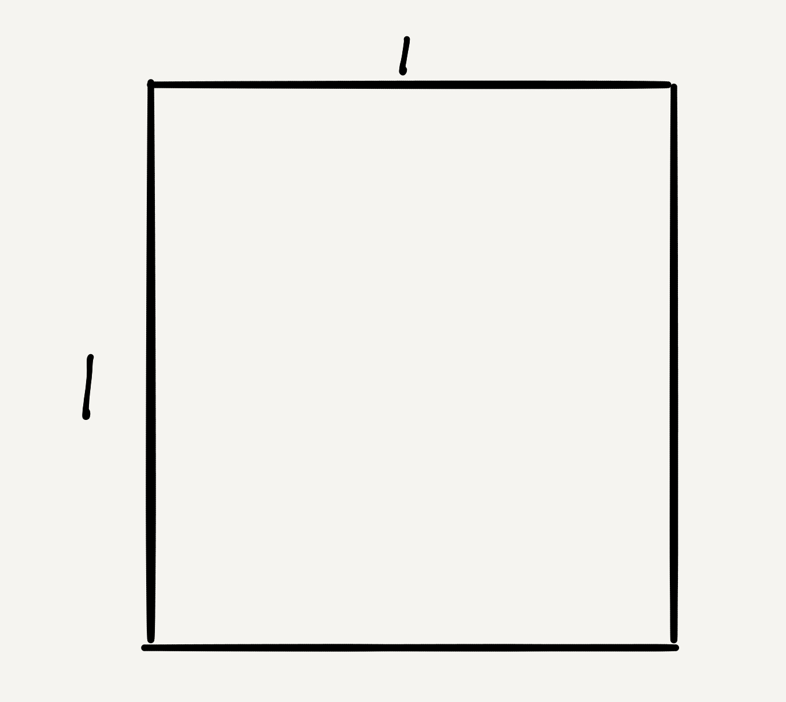
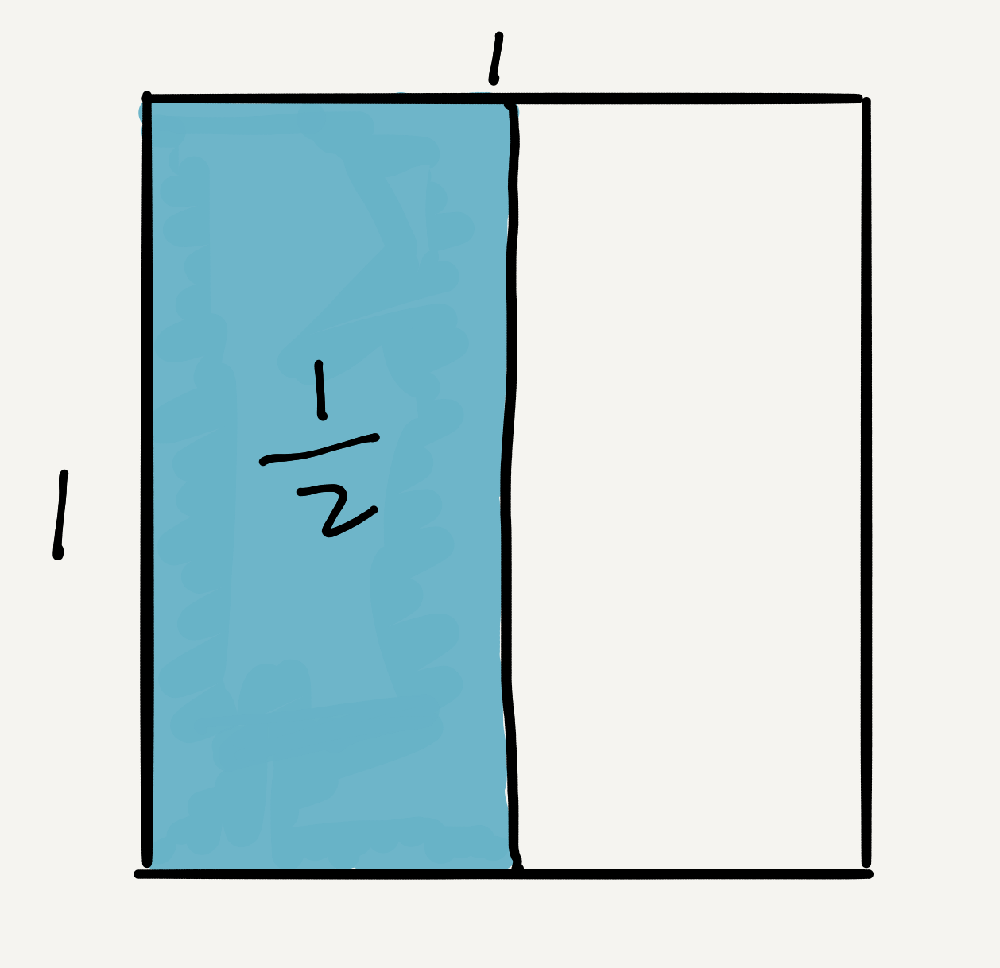
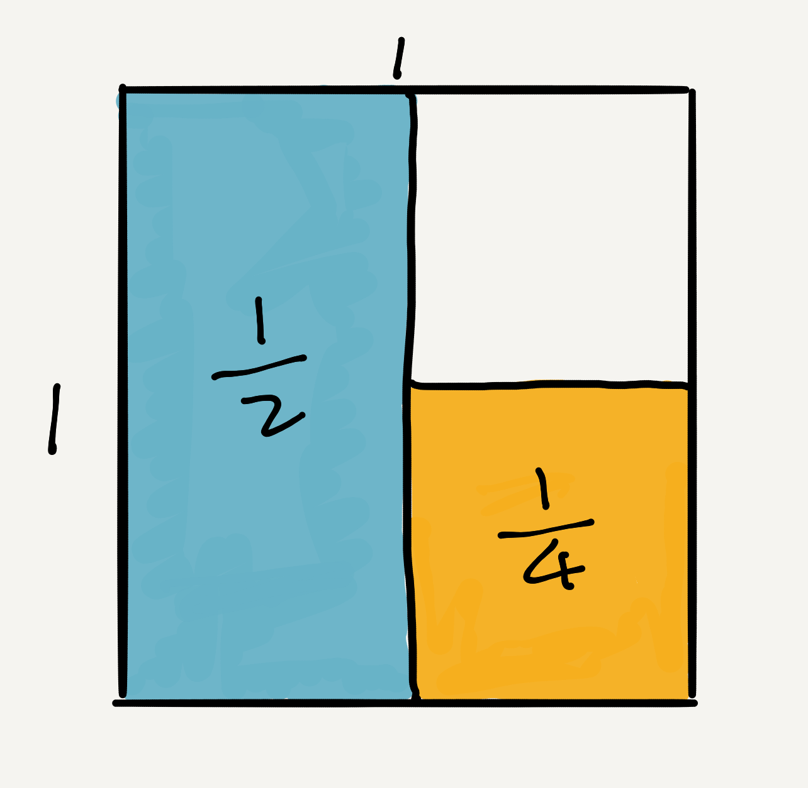
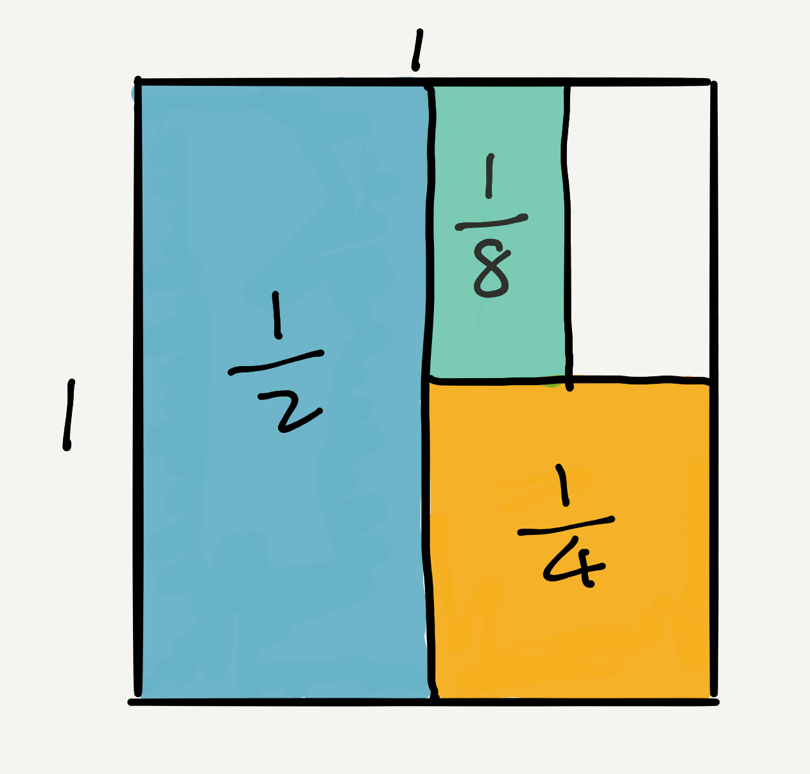
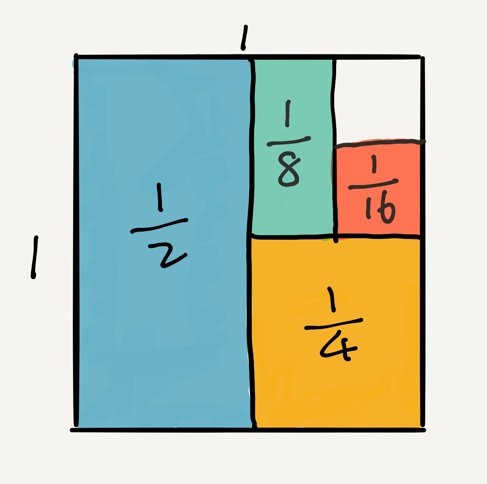
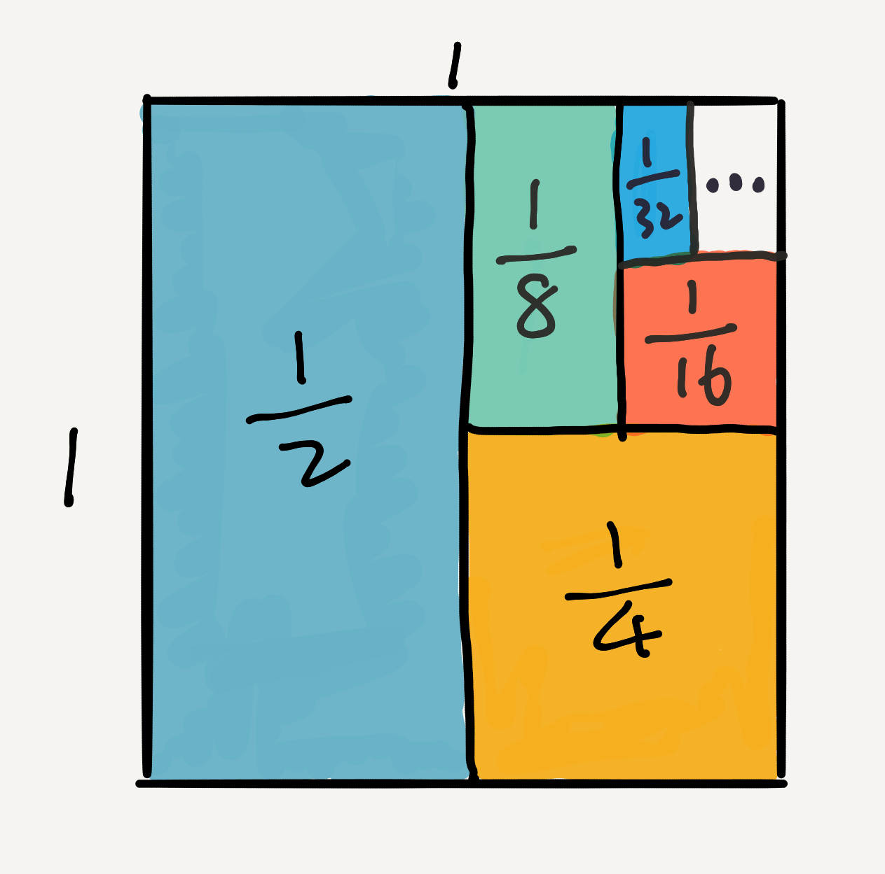

## 1/2 + 1/4 + 1/8 + 1/16 + ... 一个级数问题的几何求解

级数是高等数学中的一个非常重要的概念。在数学中，**一个有穷或无穷序列的和，称为级数。**

有穷级数，非常简单，因为是有穷的，用小学学习的加法运算，就可以求出。比如6, 60, 600，这个序列的级数是666。

比较难的是无穷级数，最典型的级数是等差级数（又叫算术级数）和等比级数（又叫几何级数）。

比如：1，2，3，4，5，... 是一个等差级数。

比如：1，2，4，8，16，... 是一个等比级数。其中，公比为2。

比如：1/2，1/4，1/8，1/16，1/32，... 也是一个等比级数。其中，公比为 1/2。

对于无穷级数，有一个很重要的概念，就是级数的敛散性。也就是一个无穷级数是发散的，还是收敛的。

所谓的收敛，就是存在一个“界”，这无穷项的和，肯定超不过这个“界”；如果不存在这个“界”，就称这个级数是发散的。

比如，1，2，3，4，5，... 是一个发散级数；

比如：1，2，4，8，16，... 是一个发散级数；

但是，1/2，1/4，1/8，1/16，1/32，... 是一个收敛级数。这个级数的“界”是1。也就是这串数字按照这样的趋势继续下去，无穷项的和，一定是小于1的。无论如何，都超不过1这个“界”。

通过定义，大家也能想到了，由于我们是在考虑无穷项的和的问题，所以严格地使用数学语言，我们要想证明这个“界”，需要使用“极限”的概念。

实际上，**极限是大家在本科学习高等数学所接触的第一个概念，是微分，积分，这一套数学工具的根基，是初等数学和高等数学的重要分水岭。**

不过，在这篇文章中，我将使用几何的方式，证明1/2，1/4，1/8，1/16，1/32，... 这个序列的和，一定不会超过1这个“界”：）

---

其实非常简单。首先，我们把每一个数字想成是一个矩形的面积。那么我们可以先画一个边长为1的正方形。它的面积就是1。

下面，我们将看到，这个面积为1的正方形，可以盛放面积为1/2，1/4，1/8，1/16，1/32，...的矩形，无数多个！：）

首先，我们放一个面积为1/2的矩形，非常简单，将这个正方形一分为2，一半的面积就是1/2。

然后，我们再放一个面积为1/4的矩形，将剩下的1/2再一分为2，其中一半的面积，就是1/2的1/2，即1/4。

相信聪明的同学们都已经会了。我们再放一个面积为1/8的矩形，只需要将剩下1/4面积再一分为2，其中的一半面积，就是1/4的1/2，即1/8。

这个过程可以一直下去。我们再放一个1/16的矩形：

再放一个1/32的矩形......

可以看出来，1/2，1/4，1/8，1/16，1/32，... 这个数列的每一个数所表示的矩阵，可以无穷无尽地放到这个大小为1的正方形中。

所以，1/2，1/4，1/8，1/16，1/32，... 这个级数是收敛的，结果为1：）

---

对了，和[《如何优雅地证明平方差公式？》](../2019-05-29/)的配图一样，这篇文章的配图也都是我在ipad上手绘出来的。虽然很简单，但允许我再次炫耀一下：）

怎么样，**是不是很酷？**

**大家加油！：）**