## 神一样的随机算法

之前，在我的文章 [《如何把技术做深？可能，这是一个错误的问题》](../2019-05-19/) 中，我谈到了对问题定义的重要性。很多时候，面对很多问题，我们思考的方向，并非是怎么解决，而是，我们要解决的问题究竟是什么。

不过，在那篇文章中，我举的例子，都是很抽象的例子，比如“如何把技术做深？”，“如何学英语？”，“如何成功？”。但其实，在具体的技术领域，也是如此。

这篇文章，我们从一道经典面试题开始来探讨这个问题。这个面试题有很多形式，但其实背后的算法是一致的。

这个问题是：

**设计一个公平的洗牌算法**

<br/>

**1.**

看问题，洗牌，显然是一个随机算法了。随机算法还不简单？随机呗。把所有牌放到一个数组中，每次取两张牌交换位置，随机 k 次即可。

如果你的答案是这样，通常面试官会进一步问一下，k 应该取多少？100？1000？10000？

很显然，取一个固定的值不合理。如果数组中有 1000000 个元素，随机 100 次太少；如果数组中只有 10 个元素，随机 10000 次又太多。一个合理的选择是，随机次数和数组中元素大小相关。比如数组有多少个元素，我们就随机多少次。

这个答案已经好很多了。但其实，连这个问题的本质都没有触及到。此时，面试官一定会狡黠地一笑：这个算法公平吗？

我们再看问题：设计一个**公平**的洗牌算法。

<br/>

**2.**

问题来了，对于一个洗牌算法来说，什么叫“公平”？这其实是这个问题的实质，我们必须定义清楚：什么叫公平。

一旦你开始思考这个问题，才触及到了这个问题的核心。**在我看来，不管你能不能最终给出正确的算法，如果你的思路是在思考对于洗牌算法来说，什么是“公平”，我都觉得很优秀。**

因为背出一个算法是简单的，但是这种探求问题本源的思考角度，绝不是一日之功。别人告诉你再多次“要定义清楚问题的实质”都没用。这是一种不断面对问题，不断解决问题，逐渐磨炼出来的能力，短时间内无法培训。

这也是我经常说的，**面试不是标准化考试，不一定要求你给出正确答案。面试的关键，是看每个人思考问题的能力。**

说回我们的洗牌算法，什么叫公平呢？一旦你开始思考这个问题，其实答案不难想到。洗牌的结果是所有元素的一个排列。一副牌如果有 n 个元素，最终排列的可能性一共有 n! 个。公平的洗牌算法，应该能**等概率地给出这 n! 个结果中的任意一个。**

如思考虑到这一点，我们就能设计出一个简单的暴力算法了：对于 n 个元素，生成所有的 n! 个排列，然后，随机抽一个。

这个算法绝对是公平的。但问题是，复杂度太高。复杂度是多少呢？O(n!)。因为，n 个元素一共有 n! 种排列，我们求出所有 n! 种排列，至少需要 n! 的时间。

有一些同学可能对 O(n!) 没有概念。我本科时就闹过笑话，正儿八经地表示 O(n!) 并不是什么大不了不起的复杂度。实际上，这是一个比指数级 O(2^n) 更高的复杂度。因为 2^n 是 n 个 2 相乘；而 n! 也是 n 个数字相乘，但除了 1，其他所有数字都是大于等于 2 的。当 n>=4 开始，n! 以极快的的速度超越 2^n。

O(2^n) 已经被称为指数爆炸了。O(n!) 不可想象。

所以，这个算法确实是公平的，但是，时间不可容忍。

<br/>

**3.**

我们再换一个角度思考“公平”这个话题。其实，我们也可以认为，公平是指，**对于生成的排列，每一个元素都能等概率地出现在每一个位置。**或者反过来，**每一个位置都能等概率地放置每个元素。**

这个定义和上面的**最终洗牌结果，可以等概率地给出这 n! 个排列中的任意一个**，是等价的。这个等价性，可以证明出来。并不难。如果正在学习概率论的同学，还比较习惯概率论处理问题的思想，应该能很快搞定：）

基于这个定义，我们就可以给出一个简单的算法了。说这个算法简单，是因为他的逻辑太容易了，就一个循环：

```
for(int i = n - 1; i >= 0 ; i-- )
	swap(arr[i], arr[rand() % (i + 1)])
```

这么简单的一个算法，可以保证上面我所说的，对于生成的排列，**每一个元素都能等概率的出现在每一个位置。**或者反过来，**每一个位置都能等概率的放置每个元素。**

大家可以先简单的理解一下这个循环在做什么。其实非常简单，i 从后向前，每次随机一个 [0...i] 之间的下标，然后将 arr[i] 和这个随机的下标元素，也就是 arr[rand() % (i + 1)] 交换位置。

大家注意，由于每次是随机一个 [0...i] 之间的下标，所以，我们的计算方式是 rand() % (i + 1)，要对 i + 1 取余，保证随机的索引在 [0...i] 之间。

这个算法就是大名鼎鼎的 **Knuth-Shuffle，即 Knuth 洗牌算法。**

这个算法的原理，我们稍后再讲。先来看看 Knuth 何许人也？

中文名：高纳德。算法理论的创始人。我们现在所使用的各种算法复杂度分析的符号，就是他发明的。上世纪 60-70 年代计算机算法的黄金时期，近乎就是他一手主导的。他的成就实在太多，有时间单独发文介绍，但是，我觉得一篇文章是不够的，一本书还差不多。

大家最津津乐道的，就是他所写的《The Art of Computer Programming》，简称 TAOCP。这套书准备写七卷本，然后，到今天还没有写完，但已经被《科学美国人》评为可以媲美相对论的巨著。

微软是 IT 界老大的年代，比尔盖茨直接说，如果你看完了这套书的第一卷本，请直接给我发简历。

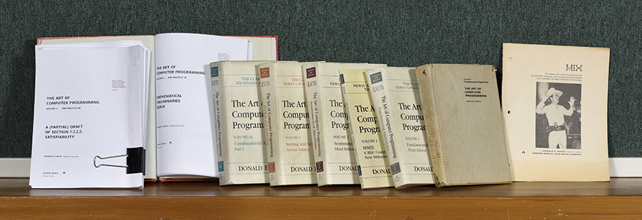

至于这套书为什么写的这么慢？因为老爷子写到一半，觉得当下的文字排版工具都太烂，于是**转而发明出了现在流行的LaTex文字排版系统...**

另外，老爷子可能觉得当下的编程语言都不能完美地表现自己的逻辑思想，还**发明了一套抽象的逻辑语言，用于这套书中的逻辑表示...**

下面这张照片是他年轻的时候。这张照片是我在斯坦福大学计算机学院的橱窗拍的。


下面的话和大家共勉：

> A programmer who subconsciously views himself as an artist will enjoy what he does and will do it better.
> 
> Donald E. Knuth 1978

所以，我从来都不认为自己只是一名工程师而已。**我是艺术家：）**

<br/>

**4.**

是时候仔细的看一下，这个简单的算法，为什么能做到保证：**对于生成的排列，每一个元素都能等概率的出现在每一个位置**了。

其实，简单的吓人：）

在这里，我们模拟一下算法的执行过程，同时，对于每一步，计算一下概率值。

我们简单的只是用 5 个数字进行模拟。假设初始的时候，是按照 1，2，3，4，5 进行排列的。

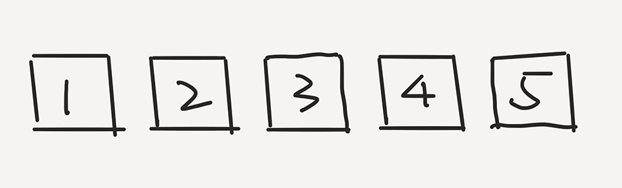

那么，根据这个算法，首先会在这五个元素中选一个元素，和最后一个元素 5 交换位置。假设随机出了 2。

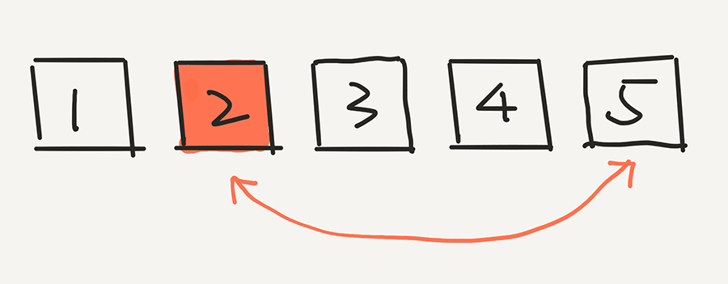

下面，我们计算 2 出现在最后一个位置的概率是多少？非常简单，因为是从 5 个元素中选的嘛，就是 1/5。实际上，根据这一步，任意一个元素出现在最后一个位置的概率，都是 1/5。

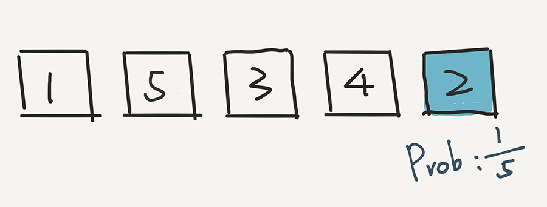

---

下面，根据这个算法，我们就已经不用管 2 了，而是在前面 4 个元素中，随机一个元素，放在倒数第二的位置。假设我们随机的是 3。3 和现在倒数第二个位置的元素 4 交换位置。

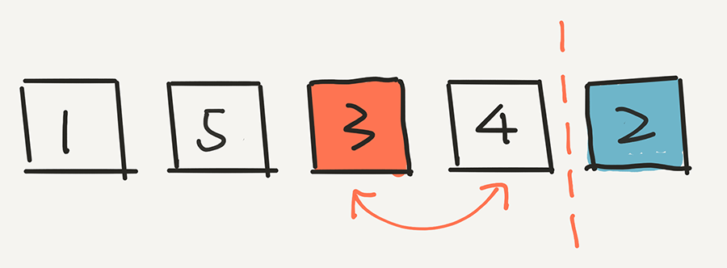

下面的计算非常重要。3 出现在这个位置的概率是多少？计算方式是这样的：

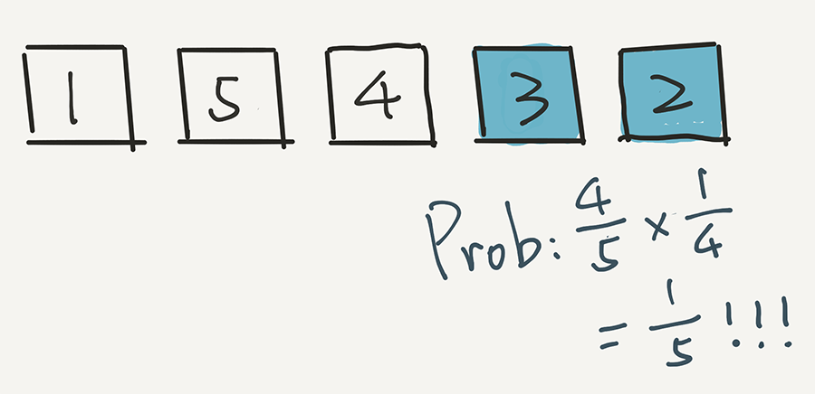

其实很简单，因为 3 逃出了第一轮的筛选，概率是 4/5，但是 3 没有逃过这一轮的选择。在这一轮，一共有4个元素，所以 3 被选中的概率是 1/4。因此，最终，3 出现在这个倒数第二的位置，概率是 4/5 * 1/4 = 1/5。

还是 1/5 !

实际上，用这个方法计算，任意一个元素出现在这个倒数第二位置的概率，都是 1/5。

---

相信聪明的同学已经了解了。我们再进行下一步，在剩下的三个元素中随机一个元素，放在中间的位置。假设我们随机的是 1。

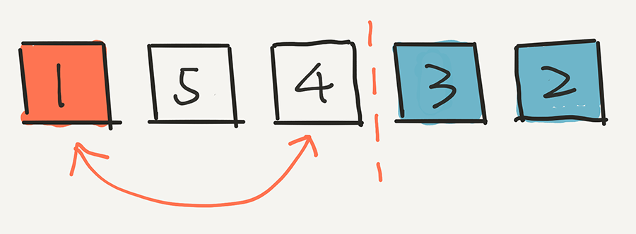

关键是：1 出现在这个位置的概率是多少？计算方式是这样的：

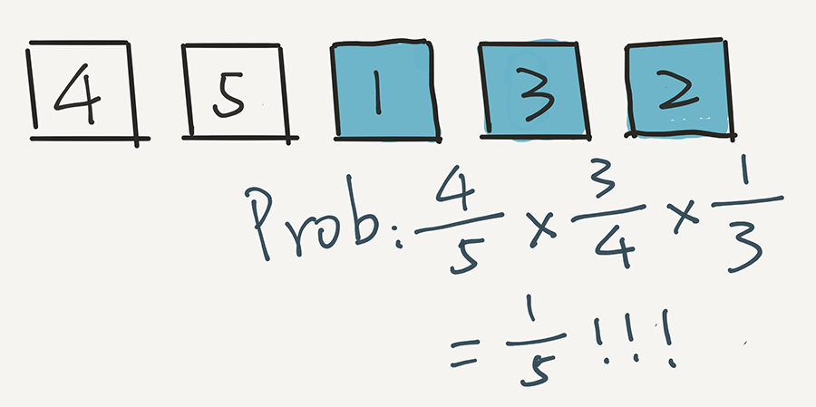

即 1 首先在第一轮没被选中，概率是 4/5，在第二轮又没被选中，概率是 3/4 ，但是在第三轮被选中了，概率是 1/3。乘在一起，4/5 * 3/4 * 1/3 = 1/5。

用这个方法计算，任意一个元素出现在中间位置的概率，都是 1/5。

---

这个过程继续，现在，我们只剩下两个元素了，在剩下的两个元素中，随机选一个，比如是4。将4放到第二个位置。

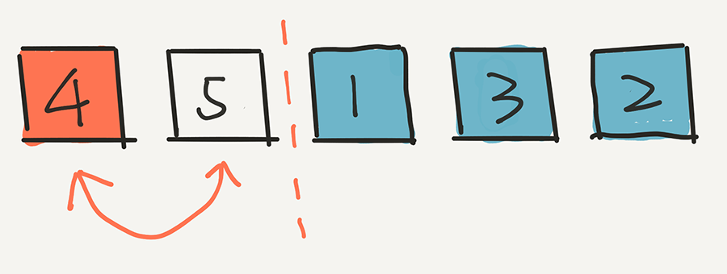

然后，4 出现在这个位置的概率是多少？4 首先在第一轮没被选中，概率是 4/5；在第二轮又没被选中，概率是 3/4；第三轮还没选中，概率是 2/3，但是在第四轮被选中了，概率是 1/2。乘在一起，4/5 * 3/4 * 2/3 * 1/2 = 1/5。

用这个方法计算，任意一个元素出现在第二个位置的概率，都是 1/5。

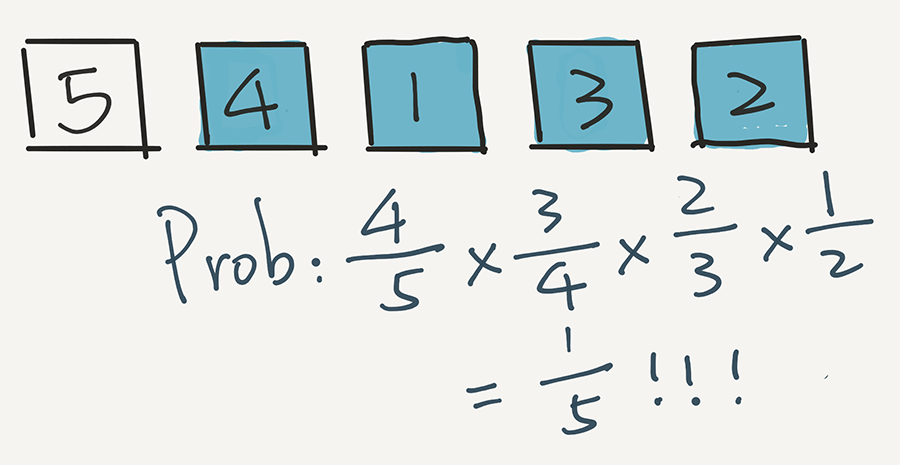

---

最后，就剩下元素5了。它只能在第一个位置呆着了。

那么 5 留在第一个位置的概率是多少？即在前 4 轮，5 都没有选中的概率是多少？

在第一轮没被选中，概率是 4/5；在第二轮又没被选中，概率是 3/4；第三轮还没选中，概率是 2/3，在第四轮依然没有被选中，概率是 1/2。乘在一起，4/5 * 3/4 * 2/3 * 1/2 = 1/5。

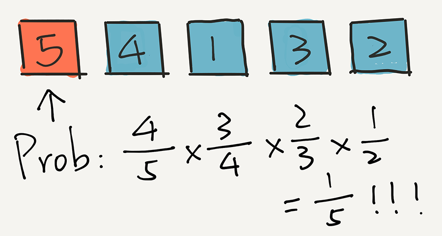

算法结束。

---

你看，在整个过程中，每一个元素出现在每一个位置的概率，都是 1/5 ！

所以，这个算法是公平的。

当然了，上面只是举例子。这个证明可以很容易地拓展到数组元素个数为 n 的任意数组。整个算法的复杂度是 O(n) 的。

通过这个过程，大家也可以看到，同样的思路，我们也完全可以从前向后依次决定每个位置的数字是谁。不过从前向后，代码会复杂一些，感兴趣的同学可以想一想为什么？自己实现一下试试看？

（因为生成 [0, i] 范围的随机数比生成 [i, n) 范围的随机数简单，直接对 i+1 求余就好了。）

怎么样，**是不是很酷？**

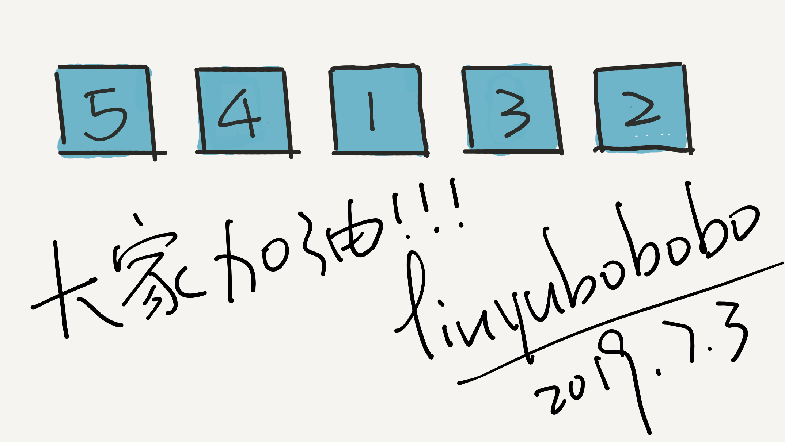

<br/>

**5.**

这个算法除了洗牌，还能怎么用？

其实，在很多随机的地方，都能使用。比如，扫雷生成随机的盘面。我们可以把扫雷的二维盘面先逐行连接，看作是一维的。之后，把 k 颗雷依次放在开始的位置。

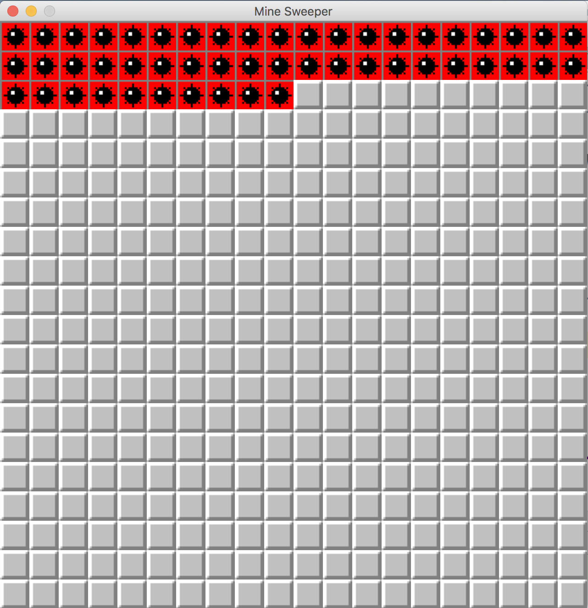

然后，我们运行一遍 Knuth 洗牌算法，就搞定啦：

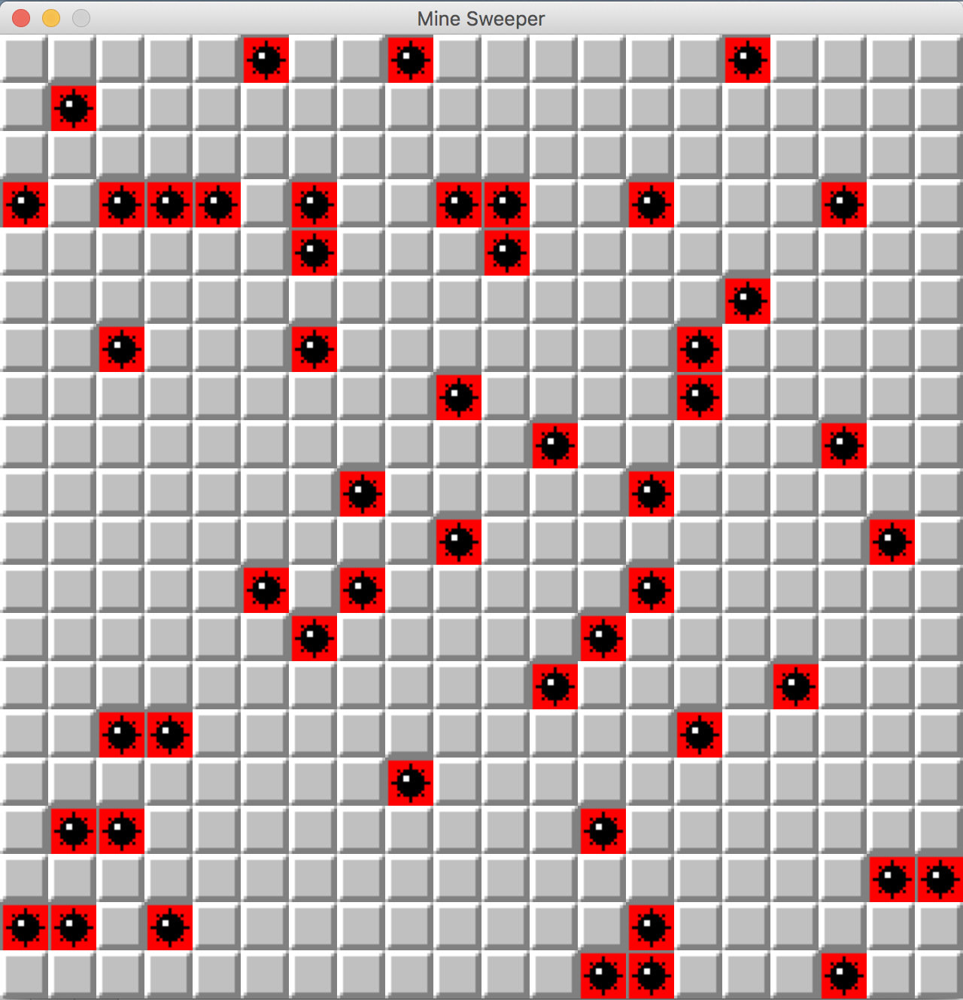

**是不是很酷？**

这就是我喜欢算法的原因。在我眼里，**算法从来不是枯燥的逻辑堆砌，而是神一样的逻辑创造。**

尽管这个世界很复杂，但竟也如此的简洁，优雅。

<br/>

**大家加油！：）**