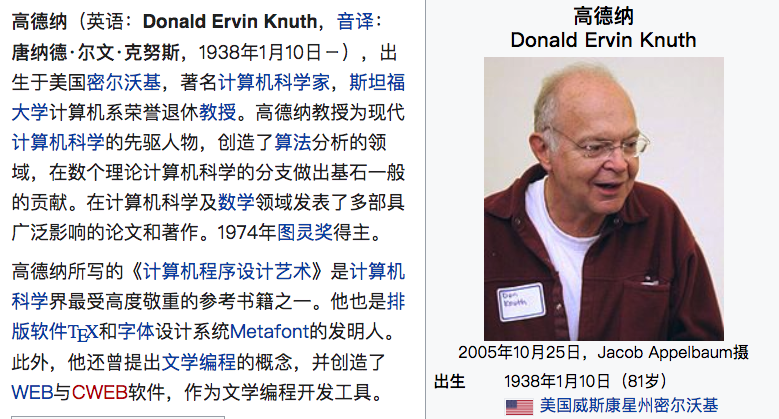
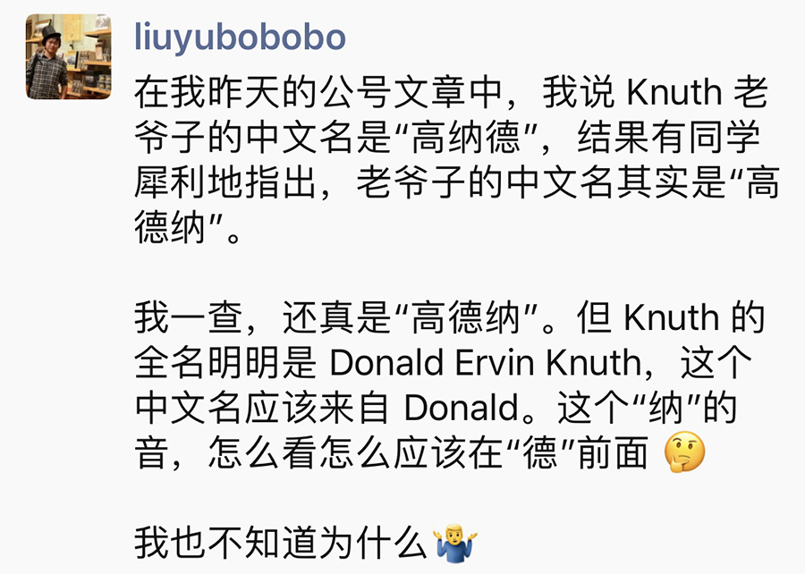
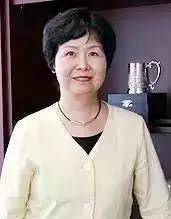
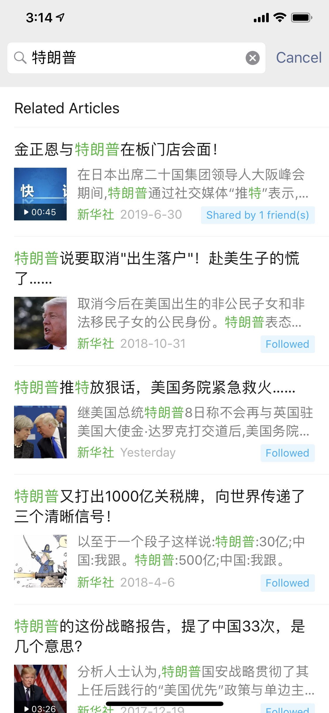
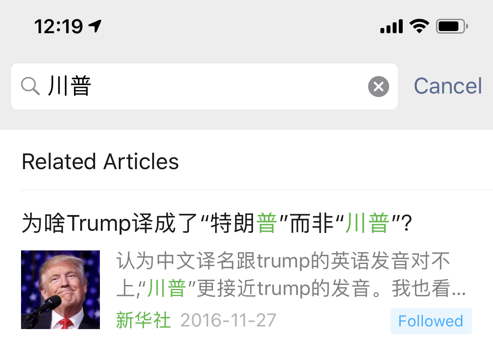
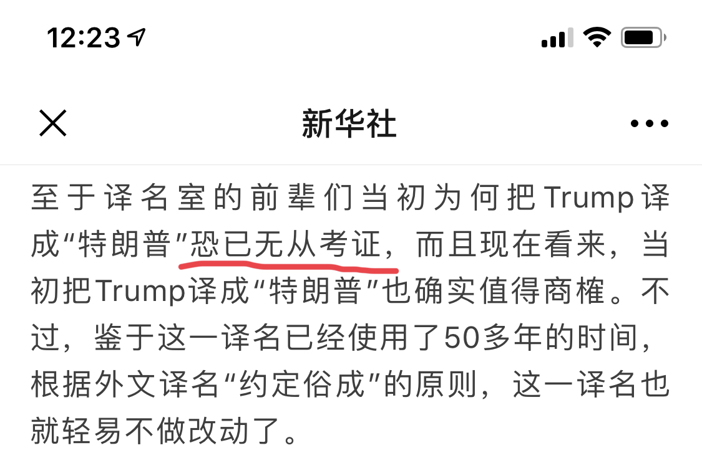
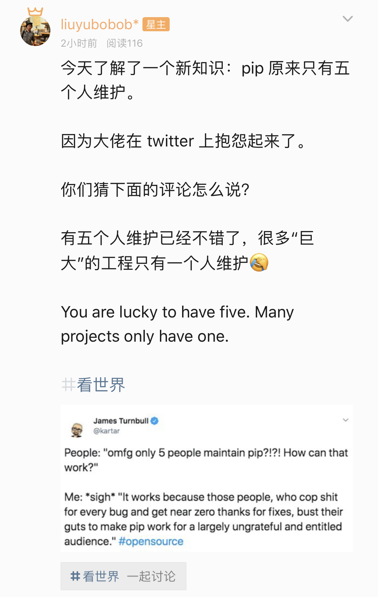
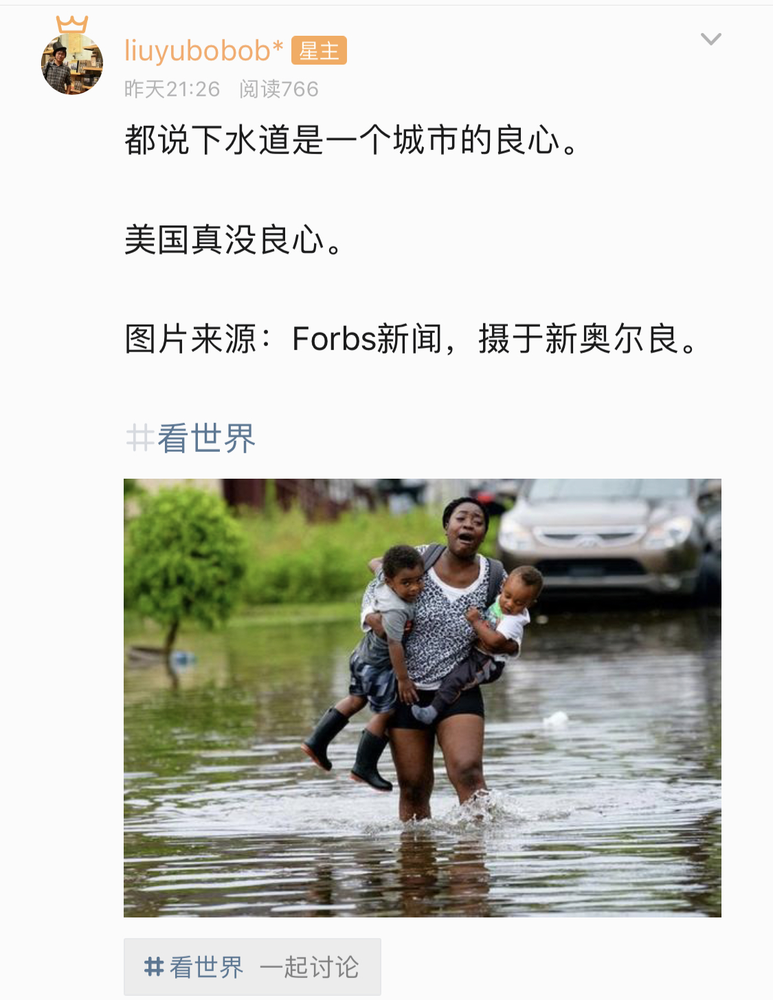
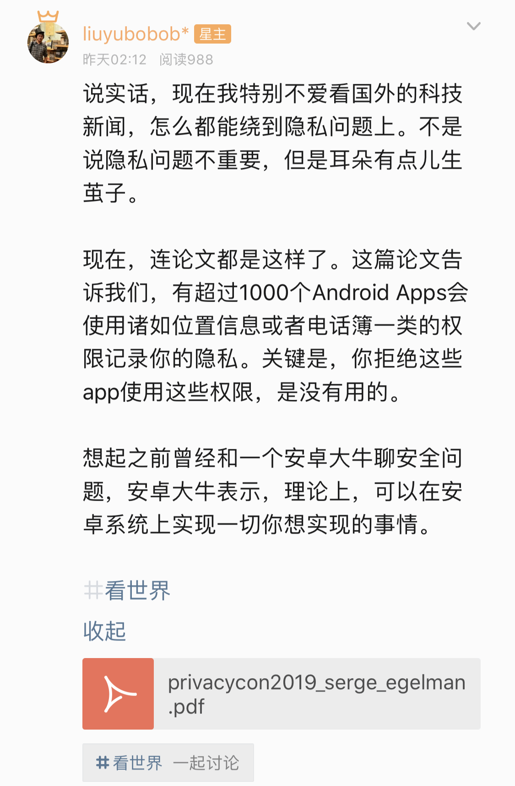

## 不小心，较真儿了：高德纳和特朗普

首先，和大家致歉。

在这一周更新的文章 [《神一样的随机算法》](../2019-07-09/) 中，我介绍了大名鼎鼎的 Knuth 洗牌算法。顺便简单地介绍了一下大神 Knuth。

介绍的时候，煞有介事的表示：中文名，**高纳德**。

但这是错的，马上有同学表示，Knuth 老爷子的中文名是**高德纳**。

我到维基百科一查，还真是。

 

由于 Donald 的发音，很容易联想到：其实“高德纳”是一个错误的翻译，但将错就错，约定成俗了。

所以，我大颜不惭地发表了如下言论：

马上有同学指出：其实在 TAOCP 的中文版的序言中，就曾经介绍过“高德纳”这个中文名字的来源。

额？

如果会正儿八经地介绍了名字的来源，那这个名字肯定就不会是错误的了，一定有来头。

但是我手头没有 TAOCP 的中文版，当年只是英文版翻了半本（其实不到）而已。。。

赶紧去网上查，最后终于搞清楚了。

 

Donald Ervin Knuth 的中文名为什么是高德纳？

这是**姚期智的夫人储枫，在高德纳 70 年代访问中国的时候，给他起的中文名字。**

其中“德纳”部分是 Donald 的音译。非常符合英文发音，尾巴的 d 被轻音吞掉。

第一个字“高”则是姓氏，据说也是因为 Knuth 这个姓氏起的。我怀疑是因为南方比如香港的发音，K 的发音就是 G。比如香港的“太古”，对应的英文是“TAIKOO”

所以，“高德纳”是一个地道的中文名，“高”是姓，“德纳”是名。

顺便一提：

姚期智相信大家都了解，目前中国唯一获得过图灵奖的华人。清华大学大名鼎鼎的姚班，大家也应该是如雷贯耳。如果没听说过也没有关系，反正和我等凡人根本不在一个次元。

但储枫大家可能不太了解了。也是一个很牛的理论计算机学家，香港城市大学计算机科学系的系主任。现在也是清华大学交叉信息研究院（姚期智任院长）的客座教授，讲计算几何与组合算法。

网上的八卦传闻，姚期智当年是搞物理的，是在储枫美女的建议下，经过冷静思考，转向了当时方兴未艾的计算机科学领域。

这么一位知识界的大牛，华人唯一图灵奖背后的女人，网上竟然找不到一张她的高清照片。但我一定要放一张！

 

---

 

说到 Donald 这个名字，马上就想到现在的美国总统 Trump，毕竟，他的全名就是 Donald John Trump。

马上就有同学问，现在的美国总统 Trump，为什么有一个中文翻译是特朗普？毕竟，从音译的角度，川普更准确。

对于这个问题，我的第一反应是日本。

可能很多同学知道，日本人的英语发音，会把 r 的音发成 l。比如 right，日本人可能会读成 light。

所以，或许是中国某些地方方言也有这样的发音规则？不过由于我从小是在北京长大，对中国各地的方言口音确实了解得不多。

但是，这回我不敢马虎了，赶紧在网上查了查，别说，这一查，还真有料。

简单地说，新华社官方管美国总统叫“特朗普”，而不是“川普”。也就是“特朗普”这个翻译，和方言口音没什么关系。是中国官方钦定的。

在新华社的公众号下搜索“特朗普”，全是他的新闻。

 

但是搜索“川普”，却啥都没有。除了！

除了第一篇文章，原来新华社专门发文解释过这件事情：为啥 Trump 翻译成了“特朗普”而非“川普”？

想阅读原文的同学直接点击这里：[为啥 Trump 翻译成了“特朗普”而非“川普”？](https://mp.weixin.qq.com/s?__biz=MzA4NDI3NjcyNA==&mid=2649342577&idx=2&sn=38bd5de614fc04329907763c40dd1d71&chksm=87f4c6eab0834ffc20e170745e123bbc7e26e3ede92a20a81cc1235d7b7aacc2c06d9fa4b78c&mpshare=1&scene=1&srcid=0711V9OG05reUmAX98yhLtMP&pass_ticket=D2oQgEogpFzWURFslsWalr1CBZYs188ZC9%2BITkGjXf1N1p8EmAdPhFLb7dcrNAaG#rd)

简单来说，新华社给出的解释就是，根据国家权威的《英语姓名译名手册》和《世界人名翻译大辞典》的规定，Trump 就应该翻译成“特朗普”。后面所有的文字解释，洋洋洒洒说了一堆，中心思想只有一个：这就是约定俗成的，官方认可，统一使用。

 

但是**这不叫原因，这叫事实。**

我们肯定还能往下追问：国家权威的《英语姓名译名手册》和《世界人名翻译大辞典》为什么规定，Trump 就应该翻译成特朗普，而不是川普？

上面的新华社文章说：无从考证。

 

但是我费了点儿功夫，考证出了一个我觉得可信的原因：

原来 Trump 这个词，追根溯源，**来自德语**。其实大量英语单词和德语有着千丝万缕的联系，毕竟都是欧洲语系，溯源的话，二者都来自原日耳曼语。日耳曼民族神圣罗马帝国毕竟也有近千年的辉煌。

而在德语中，Trump 的读音近似“特朗普”。（我没学过德语，如果有了解德语的同学，可以证实一下。）

《英语姓名译名手册》和《世界人名翻译大辞典》，对于有外来语言特征的单词，在音译成中文的时候，会首先参照原语言，在 Trump 这个词上，也就是德语发音。

所以，日本人把 r 发音成 l，看来也是有原因，有历史渊源的。

抱歉，较真儿了。

但是，涨姿势。

 

---

 

最后，以上这些讨论，发生在哪里呢？

发生在我新注册的**知识星球**。

很多同学都曾问过我有没有知识星球，但因为我以前没有玩儿过这东西，所以只是一直在观望学习而已。

看了几个大佬的知识星球，大体搞懂了。个人粗浅理解：这就是另外一个朋友圈儿呗。

所以，我注册了一个。**免费的。**

整体，我的知识星球的定位，是短分享。公众号的内容，比较适合做长文章的分享，我将在知识星球中，做更多短内容分享。虽然只是只言片语，也希望对大家有收获。

做更多短内容分享。“更多”是什么意思呢？

**日更。**

反正我每天都会抽出一部分时间阅读大量资讯内容，看到有趣的就分享一下，应该不是什么负担。

不过，由于是短内容分享，分享内容的严谨性就会打折扣，也会有一些非技术的内容。

我随便截取几个过去的分享：

 

**分享1：**

 

**分享2：**

 

**分享3：**

 

大概是这样。

如果玩儿知识星球的同学，对我的“短”内容分享感兴趣，可以加入。

以下为二维码：

 

**大家加油！：）**

