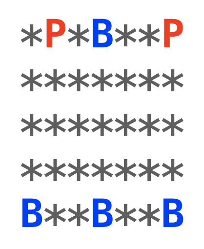
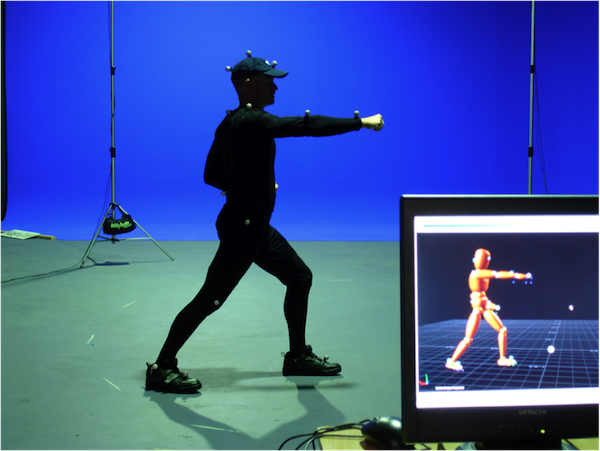
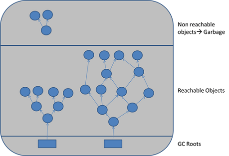
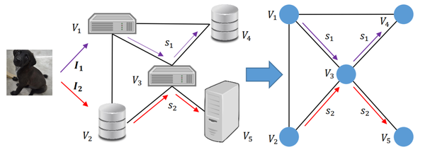
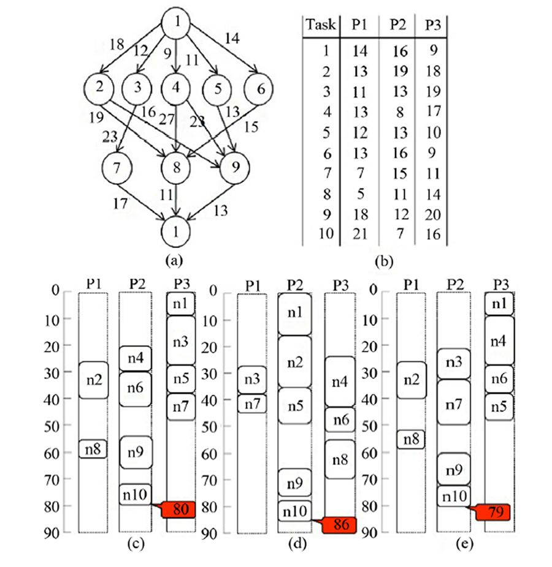

## 关于图论算法的杂七杂八

**1.**

Google 有一道很经典的面试题。大意就是，在一个二维平面上，有一些自行车，用字母 B 表示（Bike）；还有一些人，用字母 P 表示（Person）。比如下图，有两个人，四辆自行车。其中*代表什么都没有。

现在，要给每个人都分配一辆自行车，并且要求所有人到分配的自行车的距离总和最小。求分配方案。

距离的定义是曼哈顿距离。

原始的问题有一个条件：假设所有人到所有自行车的距离都不相同，该怎么处理？

这是一个初等图论问题。用 BFS 就能解决。

但是，这个条件稍微变一下，这个问题的难度陡然增加：如果有可能有多个人，到多辆自行车，距离相等，怎么办？

在这种条件下，一辆自行车可能离多个人的距离都是最近的，且距离相等，这辆自行车该分配给谁呢？随机分配是不行的，因为全局可能只有一个最优解。

但其实，这也是一个经典的图论算法问题。带权图的最小匹配。

当然，这个问题其实还有一个更简单的版本，就是不要求一人一车的匹配关系。可以理解成把题目中的自行车换成小卖部。要求每个人找到离自己最近的小卖部，大热天儿的，买根冰棍吃。多个人可以到同一个小卖部。

这基本上就是 Leetcode 上的 286 号问题了。有兴趣的同学可以找来看一看。

 

**2.**

去年，有一个同学，给我在慕课网上的课程《玩转数据结构》打了一个差评。原因是：课程不包含图论算法。

我当时很不爽。虽然我知道，近乎在所有的大学教育体系中，图论都是和数据结构一起教的。但是，在我的观念中，图论算法和其他数据结构的知识有很大的不同。再加上一门课程的时间有限，所以我将图论算法和其他数据结构分开了。这一点，在我的课程导论中，特意强调了 n 遍。

我们谈起一般的数据结构，比如数组，链表，队列，栈，二分搜索树，红黑树，哈希表，等等等等，这些数据结构主要的作用是内存数据存储。我们关注如何把数据放进这些结构中，如何取出来，如何删除，如何更新。说白了，就是在内存中做CRUD。不同的数据结构，有不同的优势，适用于不同的场景。

因此，在一般语言的标准库中，都有一个概念，叫容器类。不同的容器类，有着自己的优缺点和适用场景，其实本质就对应了不同的数据结构底层实现。我的《玩转数据结构》课程，基本上就是在和主流的容器类设计对标，讲解容器类的底层原理，并一一进行了代码实现。学习完《玩转数据结构》，大家应该能实现出一个属于自己的小型容器类库。

 

但是，图论不同。大家应该可以观察到，近乎没有一个语言的标准库中包含“图”这种数据结构。

为什么？因为在通常情况下，我们不需要使用“图”这种数据结构做数据存储。如果我们把数据组织成为“图”的形式，一定是因为要计算一些隐藏在这些数据关系中的属性。

比如，我们将城市交通系统组织成图的形式，绝对不是为了存储这些城市的信息，而是为了能方便的计算出：

* 从某个城市，到另外一个城市，最短时间应该怎么走；

* 路费最小应该怎么走；

* 是不是有些城市和另外一些城市没有联通；

* 是不是有一些路或者城市，担任着重要的交通枢纽作用，负荷过大；

* 如果新建一条公路，在哪两个城市之间修建最好；

等等等等。

对于这些问题的求解，都要使用图论算法来解决。

但是，解决不同的问题，无论是从图的存储角度，还是算法的细节，都有着细微的区别和变化，这使得对于一般语言来说，创建一个图的标准库，太沉了。

正因为如此，我决定把图论从数据结构中拆出来。

虽然，通过学习我的图论课程，也能够实现一个小型的图论算法库，但是，我更希望同学们能够体会使用图论模型解决问题的灵活性，掌握使用图论对问题建模的能力。

 

**3.**

说到使用图论对问题建模，我想到了我在公众号写过一篇文章：[《什么叫学会了？自己到底有没有学会？知识掌握的七个境界》](../2019-04-11/)，其中在“灵活应用的境界”中，提及了这样两道经典面试问题。

过河问题：

> 农夫需要把狼、羊、菜和自己运到河对岸去，只有农夫能够划船，而且船比较小。除农夫之外每次只能运一种东西。还有一个棘手问题，就是如果没有农夫看着，羊会偷吃菜，狼会吃羊。请考虑一种方法，让农夫能够安全地安排这些东西和他自己过河

装水问题：

> 有两个水桶，一个装5升，一个装 3 升。怎么利用水桶，得到 4 升水？

这两个问题都可以使用图论的方法解决。

我的老婆看了这篇文章，马上问我怎么求解。

你看，我老婆对图论的掌握，没有达到“灵活应用的境界”。

当然了，人家本身也不是搞计算机的，没必要对图论的掌握达到“灵活应用的境界”。人家是搞认知神经科学的。

但是，有意思的是，其实在认知神经科学领域，大量使用图论模型。认知神经科学，主要是研究人脑的运作机制。其中，一个主流的方式，就是将人脑不同认知区域看作是图的顶点，认知区域之间的信号传输看做是图的边。

所以，很多次，我和老婆交流认知科学领域的问题，最后竟然发现，其实，我们是在讨论一个图论算法。

 

**4.**

就在上周，七月老师和我交流了一个多小时。我们讨论，对于电商业务场景中的 SKU 查找问题，有没有效率更高的算法。

由于我平时很少接触这类业务场景的问题，所以，搞明白这个问题的本质，用了半个小时。但是，当我搞明白这个问题以后，竟然发现也能抽象成为一个图论问题。

我正在思考能否把这个问题再做一下抽象，有时间单独写文描述一下。

不过，这样的业务底层算法问题，通常的业务开发者应该不需要管。我一下子就想到了图数据库这个概念。

这个名词，连同大名鼎鼎的 NoSQL，我在各类科技新闻的标题上看到无数遍了，但因为犯懒，一直没有深入去理解到底是怎么回事儿，更别提上手实践了。

借着这个机会，我简单学习了一下图数据库的思维和应用场景，果然，很多业务问题，可以直接靠图数据库，得到更好的解决。而图数据库的底层实现，恰恰就是图论算法。

上一次我关注数据库的最新发展，学习的还是动态数据库的概念。

每每看到数据库的发展，我都会感慨，这样一个“古老”的领域，仍然在 21 世纪不断推陈出新，各种新概念层出不穷，可见计算机科学领域依然年轻蓬勃的生命力。

而更关键的是，**这些最新的发展，骨子里都离不开那些“古老”而经典的算法和数据结构。**

 

**5.**

我的研究生毕业设计论文，是做动作捕捉和建模。简单地说，就是在身上放传感器，做各种姿态的运动。计算机获取传感器的信号，然后在虚拟的世界中恢复真实世界中人的动作。

大概就是这么个意思：

对于这个任务，如果传感器足够多，就能恢复的很好。但是，传感器太多，就会很麻烦，不方便。

能不能使用更少的传感器完成这个任务，是我的毕业论文核心。

使用更少的传感器，就需要在算法中，添加一定的预测能力。比如通常需要 32 个传感器，现在我只用 4 个传感器，那就需要用这 4 个传感器的信息，想办法预测出剩下的 28 个传感器的信息。

在我读研的时候（10年前），机器学习还不火。甚至在我的印象中，我还没有听说过“机器学习”这个名词，更别提深度学习了。现在很多机器学习算法，那时我都是在一门叫做“模式识别”的课程中接触的。

对于我要解决的这个运动捕捉问题，由于还牵扯时间序列的问题，最后，我选择基于大名鼎鼎的隐马尔科夫的模型（HMM）进行实现和改进。相信很多同学都听说过这个模型，在语音识别等领域，有着重要的应用。

现在的知识体系，通常把隐马尔科夫模型，归入一类叫做**概率图模型**的范畴中。在这个范畴中，除了隐马尔科夫模型，还有诸如贝叶斯网络，马尔科夫随机场，条件随机场等模型。很多深入一些的人工智能课程，会专门介绍概率图模型。

简单来说，概率图模型就是结合了概率论和图论的模型，用来解决一些预测问题。

**又是图论。**

 

**6.**

大名鼎鼎的迪杰斯特拉，英文名是 Dijkstra，相信大家都知道。因为有一个以他命名的非常著名的算法：有权图的单源最短路径算法，又叫 Dijkstra 算法。

通常计算机专业的学生，会在至少三门不同的课程中学习这个算法，分别是数据结构，离散数学，和计算机网络。

但是，如果你翻开迪杰斯特拉的履历，就会发现，迪杰斯特拉的很多成就，都集中在在编译原理领域。

为什么？因为编译原理是图论算法应用的重灾区。随手拿起一个编译原理领域的问题，基本都能被抽象成一个图论问题。

最典型的就是内存管理，我随手搜了一个网上讲解 JVM 垃圾回收机制的示意图，大家可以感受一下。

 

至于计算机网络，就不用说了，天然就是一个图模型，每一个物理设备都是一个节点。设备间的通信是边。

 

操作系统亦是如此。我在网上找了一个讲解任务调度算法的文章，其中的配图如下：

 

当然，我的课程只是图论算法基础，不会涉及这些内容。但我希望通过这些例子告诉同学们，我们学习这些基础的算法和数据结构有什么用。

**它们是组建更高级逻辑的基石，是学习计算机科学领域更高级内容的前提。**

 

---

肯定还是会有同学跟我讲，“我觉得我在工作中，没用到过这些算法啊？”

对此，我不想反驳，我在我的公众号文章 [《学算法有什么用，没用》](../2019-03-18/) 中，已经说得很清楚了。

再次强调一遍文中的观点，**这个时代，我不认为每一名程序员都需要极佳的算法基础，才能做出成绩。**计算机已经是一个极其广阔的专业领域了。

但是，如果你对图论算法感兴趣，或者觉得有用，或者正在准备像头条这样的偏重算法考察的大厂面试。

或许，我在慕课网上的新课——**《玩转图论算法》**，是一个好的开始。

 

对了，现在还有优惠，便宜 50 块钱。

新课上线，还有更新期，请大家谅解。

二维码如下：

课程涉及的基本内容，可以在课程宣传页，点击“章节介绍”看到。

 

**大家加油！**

