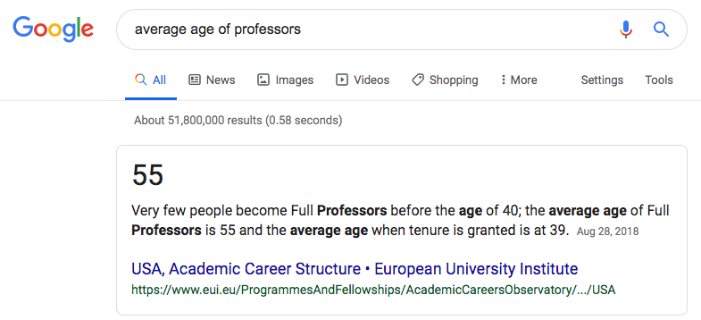
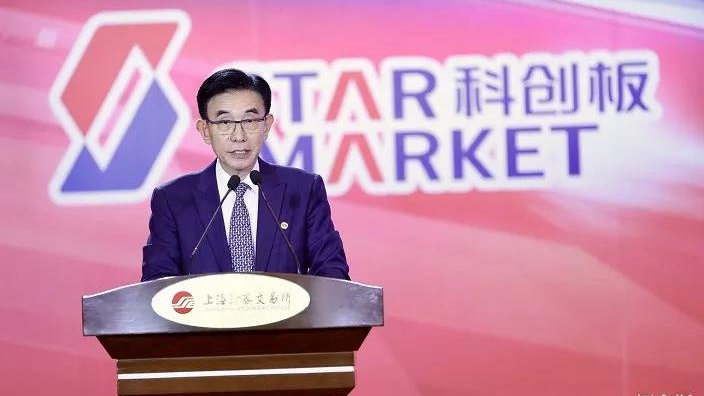

## 成功者的年龄

**1.**

老婆的老板，是一位在认知神经科学领域很牛的教授。一名 50 多岁的大叔，不仅在专业领域是佼佼者，为人还谦和有礼，没有一点儿老板的架子。总之，就是给他干活儿很舒服的那种。

有一次，我和我老婆突然在路上聊到了这位老板的履历，倒推回去，我们惊讶地发现，这名大牛老板，竟然是在大概 45 岁的时候，才拿到了正教授的职称。

为什么说是“惊讶”呢？因为，如果你在学术圈混，近乎每隔那么几个月，就会听到“某某大牛 30 多岁获得某某学校正教授职称”的新闻。给人的感觉就是，人家 30 多岁都当上正教授了，你要是 30 岁连副教授都不是，就别在学术圈儿混了。

可事实却是，这样一位圈内知名的大牛，45岁才是正教授。这个事实引起了我的好奇：平均来讲，大学的正教授，都是多少岁拿到的呢？

我 Google 了一下，结果是这样的。

**答案是 55 岁**。

换句话说，能在 45 岁拿到正教授的职称，已经比平均水平提前 10 年了。而且是在一流的学府。确实是大牛。

 

**2.**

这个月，哈佛商业评论的一篇文章引起了我的兴趣。这篇文章统计了一下成功的企业，创始人的平均年龄是多大。

大家可以先猜猜，大概多少岁？

**答案是 45 岁。**

哈佛商业评论的这篇文章的标题就是[《Research: The Average Age of a Successful Startup Founder Is 45》](https://hbr.org/2018/07/research-the-average-age-of-a-successful-startup-founder-is-45?gig_events=socialize.login)。

如果你经常看到 20 多岁或者 30 多岁创业成功的案例，很遗憾，这只是媒体制造的幻觉。

为什么媒体更愿意报道“年轻人”创业成功的案例？从道理上讲，是因为人们更愿意看到这样的案例。

每年的苹果开发者大会，让人印象最深刻的，就是那些最年轻的开发者。

 

比如 2016 年最年轻的苹果开发者 Anvitha Vijay，九岁。

 

比如 2017 年最年轻的苹果开发者 Yuma Soerianto。

 

这些都让人不禁怀疑，是不是现在 9，10 岁的小朋友，都是编程达人了？

于是，我查了一下。

**全世界的移动开发者大概有 8700 万人。平均年龄，北美地区是 34 岁；欧洲是 32 岁；亚洲是 27 岁。**

 

**3.**

说回《哈佛商业评论》的这篇文章。他们基于美国的数据，调查了一下，**大多数企业初创的时候，创始人的年纪是多大？答案是 42 岁。**

但是，这些企业，很多只是很小的生意，比如一家洗衣店或者饭馆。这些生意背后的老板从来不会进入公众的视野，也不会被媒体报道。

为此，他们又特意看了一下大众比较关注的“高科技”企业。他们定义“高科技”企业的标准是：看一家企业是否有专利；是否被风险投资；以及是否雇佣了大量科学、技术、工程、数学，等专业领域的人才。

结果并没有改变，这些“高科技”企业的创始人年纪，**平均也是 40 出头。**

大家注意，在上面的“高科技”定义中，并没有特指软件行业。实际上，如果只看软件行业，创始人的平均年龄是 40 岁，但是看其他领域的高科技行业，比如生物医疗行业，**创始人的平均年龄骤升至 47 岁。**

当然了，这样去看所有的企业，大家觉得不过瘾。毕竟，大家只对那些超级成功的企业感兴趣。于是，这个团队抽出了所有这些“高科技”企业中，5 年时间里增长最快的那千分之一的企业，看他们的创始人平均年龄。

**答案就是这篇文章标题声称的：45 岁。**

如果考虑到成功率这个概念，就更夸张了。近乎每个存活的企业，背后都有成百上千家失败的企业作陪衬。如果考虑成功的概率，这个团队的数据分析结果表示，50 岁以后，创业成功的概率才是最大的。具体见下图：

 

可能还会有同学说，不对啊。好像乔布斯 25 岁就创建了苹果公司？

但是，大家忽视了，苹果公司至今看家的产品 —— iPhone，首次发布会，是在乔布斯 52 岁的时候。

同样的道理，这篇文章认为，**那些创始人年龄很小的企业，真正高速发展，成为足以改变世界的巨头的时候，大多都是在创始人步入中年以后。**

 

**4.**

说回中国。就在上周，备受关注的科创板在上海正式开市。首批 25 家公司在上交所挂牌上市。

**这 25 家企业的创始人，平均年龄是多大呢？答案是：52 岁。**

其中40 后，50 后，60后，70后，有 24 位，占 96% 之多。80 后只有孤零零的 1 位。90 后？抱歉，没有。

你没有看错，还有 40 后，50 后。其中，40后，也就是大概 75 岁了，有 1 位；50 后，也就是大概 65 岁了，有 3 位。

这位 40 后的创业者，叫**尹志尧**，他先后获得中科大物理系学士的学位，北大化学系硕士学位，之后赴美留学，获得加利福尼亚大学洛杉矶分校物理化学博士学位。此后 20 年，一直在硅谷工作。

2004 年，60 岁的尹志尧回国创业，此时，他已经手握近 300 项国际专利。

2019 年，又是 15 年以后，这位大牛的企业成功在科创板上市。

 

这样一位大牛，创建一家企业，在改革东风的吹拂下，尚需要 15 年的时间，还只是在科创板上市。我不明白为什么很多人会觉得， 20 来岁的小年轻，可以用 3 年的时间，做成改变世界的大企业。

反正，我看到了凡客诚品，ofo，和最近网上一直讨论的暴风影音。

另外，大家可能已经感受到了，尹志尧是一名名副其实的学霸。值得一提的是，科创板的大多数创始人都是学霸。据统计，这 25 人中，有 11 人拥有博士学历，有 8 人拥有硕士学历。这还是在那个年代。

但是，就如同媒体喜欢宣传“低龄”创始人一样，媒体也喜欢宣传“没学历的”创始人。搞得大家都觉得读书无用。

 

**5.**

有意思的是，如果我们去看风投愿意投资的对象，很明显的，风投更愿意投给年轻人。

为什么？

《哈佛商业评论》给出了两个解释。

第一个解释，很简单。风投获取信息的来源之一，也是大众媒体。所以，风投也被媒体带歪了，误以为年轻人的成功概率更高。

但是，一个正儿八经的投资公司，有那么多分析师和内部消息，真金白银的把钱投下去，肯定是经过深思熟虑的。

所以，或许，第二个解释更靠谱。

那就是，虽然年轻人成功率低，但是，年轻人经验少，人脉少，通常财务状况也更紧迫，或者更急需证明自己。在这样的情况下，风投更容易以更低的价格介入，进而，让自己投资的收益更高。

换句话说，**风投不是选择成功率更高的企业，而是选择收益率最大的企业，进行投资。**

但是，人到中年，经验足够丰富了，接触的人和事更多，思考也更加成熟，对投资的看法就会产生巨大的不同。毕竟，我在北大商学院，还看到很多老板，坚持不融资，不上市。按照他们的话说，我的企业利润这么高，效益这么好，为什么非要拿别人的钱？为什么非要让自己变成给投资人打工？

从这个视角看，**投资人青睐年轻的创始人，很大一部分原因，是年轻创始人更容易被欺负。**

这多多少少有些像企业更喜欢年轻的职员。因为他们要的工资更少，加班也没意见，天天 996，也不见怎么声张。搞不好还在网上怼那些对 996 怨声载道的中年人：不愿意 996，那就辞职呗。

 

**6.**

很多同学问我，要 30 岁了，怎么办？

**其实，我也不知道怎么办。**

但我就是觉得，什么时候开始都不晚。哪怕自己 60 岁，80 岁。

很多人告诉我们，高考以后，上了大学，就轻松了。

但相信所有大学生都明白，上大学根本不轻松。高考根本不是结束，只是开始。

很多人告诉我们，大学毕业，找个好工作，就轻松了。

但相信所有职场人都理解，上班根本不轻松。找到工作根本不是结束，只是开始。

所以，30 岁，35 岁，40 岁，还没车子，房子，票子，工作还不稳定，事业也还不成功。

怎么办？怎么办？怎么办？

其实，回头看，对于大多数所谓的成功者而言， 30 岁，35 岁，40 岁，只是开始。

不要着急，路，是一步一步走出来的。

没有人是例外。

 

大家加油！
