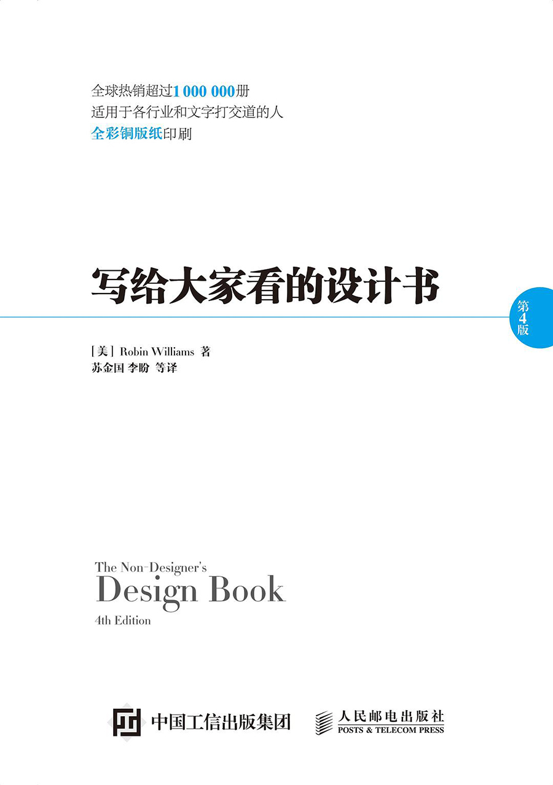
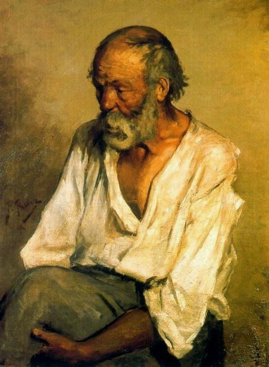
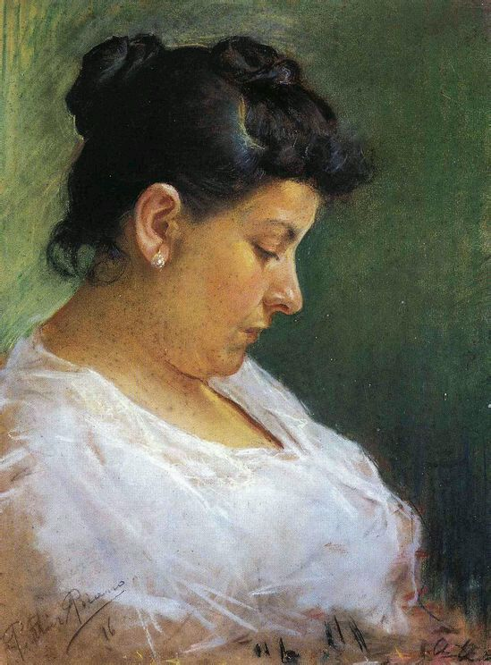
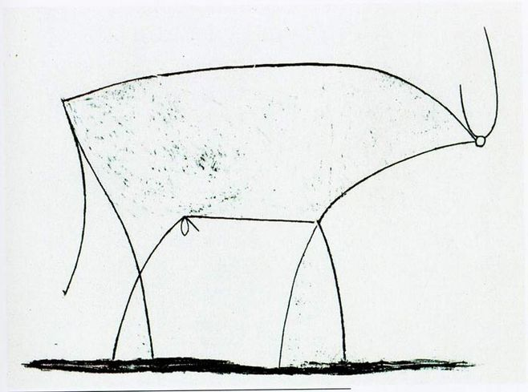
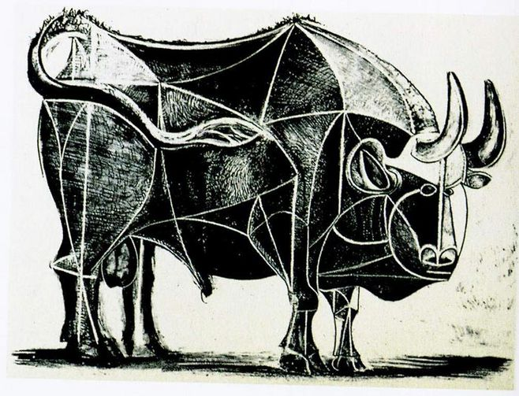
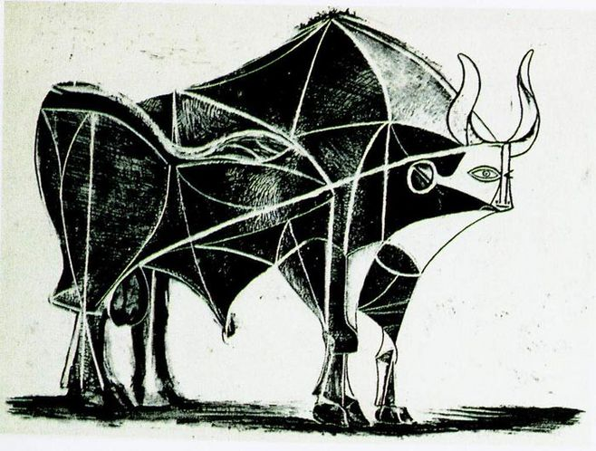
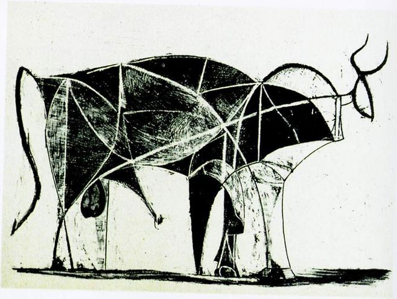
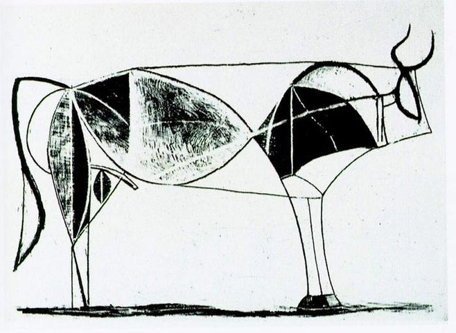
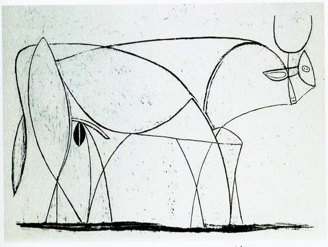
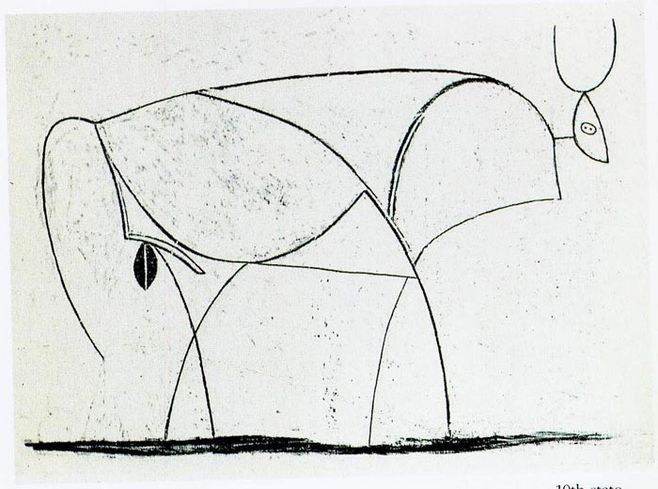

## 万能学习法

我曾拜一个师傅学习设计，更准确的说，是页面设计。

为什么要学习页面设计，因为我觉得页面设计很实用，也很简单。说“简单”或许不准确，说“门槛低”应该更准确。

毕竟，对于普通的开发者来说，做页面设计，其实主要是摆弄不同的文字或者图像元素，将他们进行合理的排列，调整方向，大小和布局；决定字体和颜色，大概也就如此，并不需要真正的去“创造”什么。

实际上，任何一个人，在生活中，近乎都一定会接触这样的设计。从写一份文档进行排版，到做 PPT；从为自己设计一张名片，到搭建个人网站。

设计有没有什么理论，技巧和原则？有。

对于程序员朋友，我强烈推荐一本书，叫《给大家看的设计书》。这本书的英文名字其实更准确，叫《The Non-Designer's Design Book》，即《给非设计师看的设计书》，里面介绍了很多极其基本的设计原则。现在已经是第四版了。

这本书我在拜师前就翻了两遍了。还是觉得对设计不得要领。总以为，还有很多更深刻的理论知识我没有掌握，所以设计出的页面总不能让自己满意。

师傅听说我看过这本书，告诉我，你已经不需要学习其他理论知识了。对于你的需求，这本只有 200 来页的小册子足够了。

那么这个师傅还能怎么教我呢？

他问我：你随便说一个你觉得好看的页面设计。

那个时候，苹果的设计风格风靡全世界。我说：苹果官网的页面设计就很好看啊。

师傅说，那好，给你留一个作业。你一定都记得苹果官网主页都有什么内容吧？回去，不要看苹果官网，按照自己的记忆和想象，把苹果官网的页面设计重复出来，下次带来。

就这么简单的一个事情，让我明白了什么叫“**我以为我知道得一清二楚的东西，但我其实完全不知道**”。

按理说，苹果官网我访问过那么多次；因为觉得它好看，还几次特意停留，长时间观察它的页面效果；甚至在浏览器的开发者模式下，看过其中的源码。

但是，当我从零开始，要再次把这个页面的设计重复出来——注意，只是重复而已，没有任何创造——我却发现，我完全做不好。

第二次，我拿着自己的“苹果主页设计”找到师傅，师傅只是打开苹果官网，和我的设计一点一点对照，对于其中的区别，讲了讲而已。其实，所有的理论我都懂。

相信很多同学了解这个师傅的“套路”了。大家一定觉得，他的第二次作业是，再问我一个我觉得好的页面，让我复制吧？至少当时我是这么觉得的。

但是，我错了。

师傅的第二次作业是：怎么样？是不是对苹果官网的设计理解更透彻了？那么好。回去，不要看苹果官网，按照自己的想象，把苹果官网的设计再重复一遍，下次带来。

是的，一样的作业。

这次，我能让自己满意吗？答案是不能。虽然有进步，但是，我发现，还是有很多细节，是被自己忽略的。

**我以为我知道得一清二楚的东西，但我其实完全不知道。**

再找师傅，师傅依然是，打开苹果官网，和我的设计一点一点对照，对于其中的区别，讲了讲而已。当然，这次，会触及很多更细节的内容，比如字体的选择，字号的选择，颜色的选择，等等等等。

 

---

这个师傅没教过我几次课。但是，我从他身上学到了一个重要的学习设计的方法：看再多理论都没用，去设计就好了。

只是，自己动手设计以后，还没有结束。还要用自己的作品，和别人的优秀设计再去做对比，仔细总结，自己的设计和优秀的设计，区别到底是什么。自己欠缺的到底是什么。

这步总结至关重要，**所有的进步，都在这步总结中**。

如果你认为有的人似乎没有那么努力，但却能取得不错的成绩，我认为关键就是这步总结做得是否到位了。

在一年的时间里，如果我做了 100 个设计，你只做了 10 个设计，但是，每个设计都认真和大师级作品做对比，总结，积累。我认为，大概率的，你的进步会更明显，取得的成就也会更大。

但不要以为这是什么捷径。实际上，认真和别人的设计做对比，总结，修改，很有可能比再设计 90 个稿子更熬人，累心。经历过的人都懂。

你为了做这 10 个设计，付出的努力，很有可能远远超过我做 100 个设计付出的努力。

 

---

为什么讲这个故事？

因为，有很多同学都问我：老师，听你的课，觉得自己都懂，但是一写代码，就不会写了，怎么办？

我的回答非常简单：**硬着头皮去写。**

实在写不出来了，开始总结，自己为什么写不出来？是语法原因？概念没搞懂？还是哪里的逻辑没有理清楚？

然后，再看一遍视频，特别是你没有理清楚的那部分，再仔细体会一下课程中是怎么完成这段逻辑的。

然后，关上视频，再尝试自己去写。

还写不出来？很正常。继续仔细总结，自己为什么仍然写不出来。当然，你也有可能写出有 bug 的代码，那就仔细去调试。看看 bug 在哪里？关键是总结：为什么自己觉得已经理解的逻辑，落实到代码上，却写出了 bug？是不是某一个变量的语义，或者初值，或者某些边界，其实是自己没有在意的地方？甚至，其实，自己以为自己理解了，但实际并没有理解？

然后再打开课程视频的代码，比较，总结。

如此反复。

说实话，看一遍视频，却写不出代码，这太正常了。**要是看一遍就会了才不正常。**那样的话，算法也太简单了一点，也就不会有那么多同学因为算法感到头疼了。

 

---

这个方法只适用于学习设计和算法吗？

当然不是。这个方法在我看来，是**万能学习法**，可以应用在一切领域的学习中。

说白了，**不断地重复，不断地总结。不断地把自己的学习成果，和专业人士的成果作对比，不断反思，自己的差距在哪里。在不知不觉中，我们就进步了。**

 

有的同学可能会说，不断重复，怎么能激发创造力，做出创新呢？

**所有的创新，都根基于对基础的深刻理解，而不是信马由缰的异想天开。**只是，在大多数时候，我们只能看见创新者的创新，却看不见他们基础扎实的那一面。

我们看到毕加索的《梦》，觉得这个好简单，我也能画。

 

但是，我们看不到，毕加索自小就有着扎实的美术功底。

比如，毕加索 13 岁的油画《老渔夫》

 

毕加索 14 岁的油画《艺术家的母亲》

 

毕加索 15 岁的油画《科学与慈善》

 

很多人只看到毕加索的这只牛，觉得好简单，我也能画：

却忽视了，这只牛，是从一头完整的牛，不断做减法，得到的艺术抽象的结果。

 

**大家加油！：）**