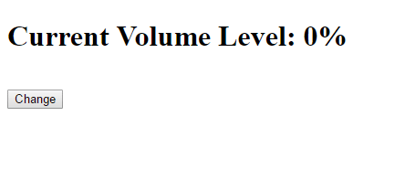
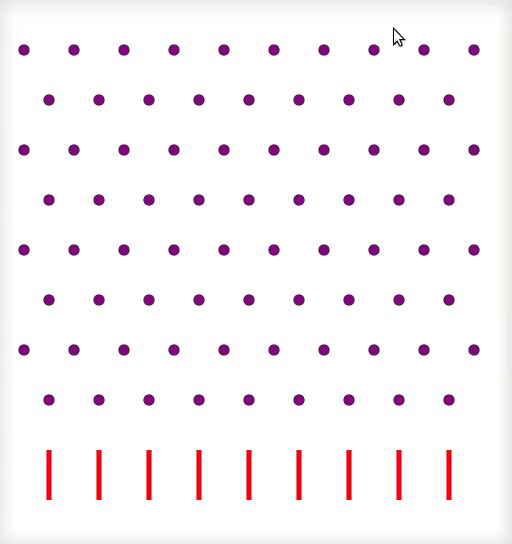
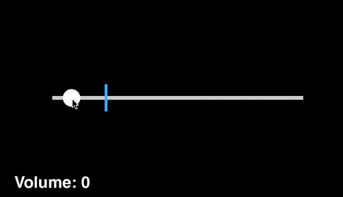
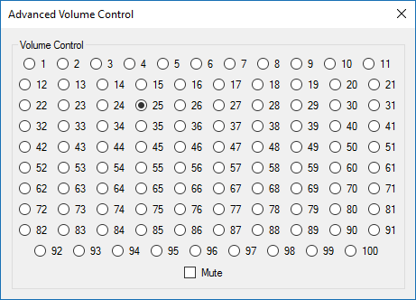
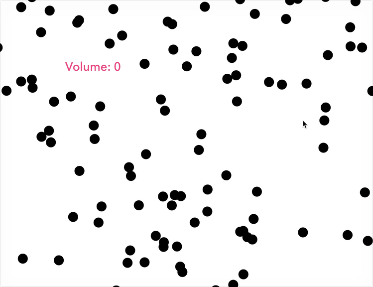

## 反设计：简单的音量调节控件，你能设计得有多糟糕？

在昨天公众号更新的文章 [**《万能学习法》**](../2019-08-20/) 中，我以设计为例，向大家介绍了一个看起来很朴素的学习方法：**将自己的作品不断去和大师的作品作对比，仔细总结，自己的作品到底哪里有不足，然后去改进。如此反复。**

不过，有的时候，反向思维也是很有意思的事情。

我们也可以设想，一个东西，最糟糕的情况，是什么样子？

---

最近，我在国外 Reddit 论坛上，看到了一个很有意思的帖子。大家可以点击 [这里](https://www.reddit.com/r/ProgrammerHumor/search?q=volume&restrict_sr=on) 查看原帖。

音量控制，是一个每个人都接触过的控件。无论是电脑操作系统，还是手机操作系统；无论是在线视频，还是游戏，都一定有音量控制的功能，让用户选择合适的音量。

在大多数情况下，音量控制的 UI 都是这样一种形式：

但是，这个帖子的标题是：**对于音量控制这样一个控件，你能设计得有多糟糕？**

这样一个问题，已经有了上百个网友的脑洞。通过这些设想，我们其实能总结出：**到底什么是坏的设计？**

 

---

简单举几个例子。

用户如果想要调整音量，一定是有非常明确的调整方向。或者用户觉得现在音量太大了，要调小一些；或者用户觉得现在音量太小了，要调大一些。

但如果，我们的音量调整是随机的，就很麻烦了。

比如：

甚至是这样：

好像很好玩的样子？🤔🤔🤔

 

---

说到好玩，**游戏化**是这几年产品设计界很流行的概念。如果不了解的同学，可以查一查 **Gamification** 这个概念。

如果把音量控制做得具有游戏性，会怎样？

比如，愤怒的小鸟？

 

或者是，打冰壶？

看起来很绚丽，但我们真的需要这样的音量控制吗？

不过，我觉得另外一个有意思的问题是，**在什么时候，我们其实需要这样的控制方式？**🤔🤔🤔

 

---

当然，和“好玩儿”呈反方向的设计，就是**过度专业**。

比如：

过度专业是很多理工专业的同学做设计的时候常犯的问题。在他们眼中，事情很复杂，琐碎，但是在用户眼中，是否真的需要这么专业的设置？

 

---

与之相对应的，**过度设计**，则是很多设计专业的同学容易犯的错误。

比如，设计专业很多时候强调“直观感受”。但是，下面的例子，我觉得特别好的说明了：过度直观感受，不一定是好的设计。

比如，对于音量来说，显然音量越大，就越“震撼”，那么，我们有没有必要把音量控制设计成这个样子？

 

---

另一类过度设计，则是应用最“前沿”的科技，做“烂创新”。

这和创业同理。**虽然好的创业项目通常都会和最前沿的技术做结合。但是，应用最前沿的技术，不一定是好的项目。**

比如，我们把音量控制和现在最流行的人工智能结合起来？

 

---

最后，作为产品设计，很多时候，我们要做价格设计。那么，音量控制这个功能如果做成这样？用户会是什么反应？

翻译：
 
> 最右侧 - 免费：您可以（并且只可以）将音量调到 100%。（有声音就不错了）
>
> 中间 - 我们最流行的套餐，2.97 刀一个月：可以无限次使用音量调节杆！
>
> 最左侧 - 每年只要 29.95 刀，您不仅享受到了 17% 的折扣和无限次使用音量调节杆的权限，还包括：静音功能；使用快捷键迅速调节音量；保护您的音量隐私！

有的同学干脆直接在 iOS 上做了这么一个 demo：

是不是很酷？🤔🤔🤔

 

---

这些设计方案，我称为是“**反设计**”，因为，它们是向着设计目标的反方向 —— “不好用”，甚至是“不能用”去努力的。

但很多时候，我觉得这样的反方向，也能为我们提供很多灵感。

比如，在做算法设计的时候，我经常使用这样的方式。假设我的计算机算力无穷，空间无限大，对于一个算法问题，我可以怎么解决？然后，基于这个最差的解决方案，再去优化。

为什么设想这样一个最差的解决方案是有意义的？

一方面，一个差的解决方案，也是一个解决方案。它比什么都没有强。

另一方面，一个差的解决方案，通常不言自明地向我们揭示了，这个解决方案到底差在哪里。很多时候，这将为我们提供优化的路径和方向。即使我们最终没有成功，我们也拥有了一个方向。

不要小瞧这一点，拥有方向，比面对一个问题毫无头绪，强了太多。

 

**大家加油！：）**