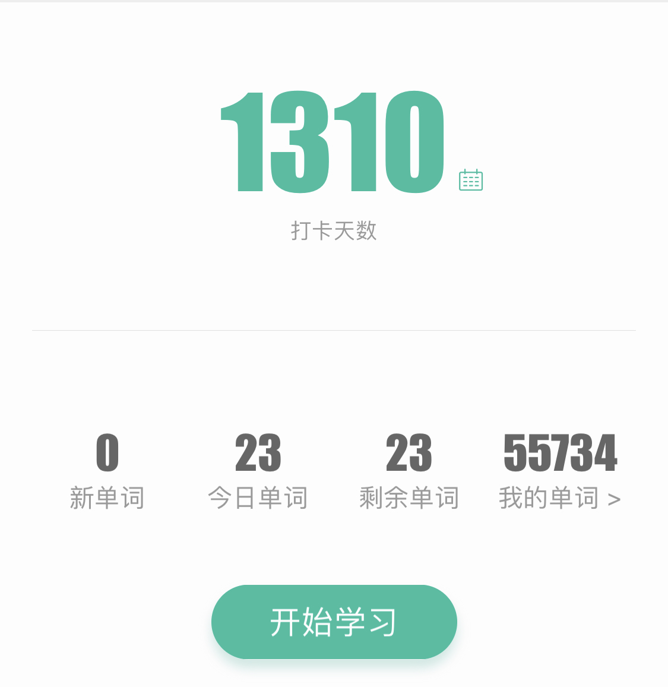
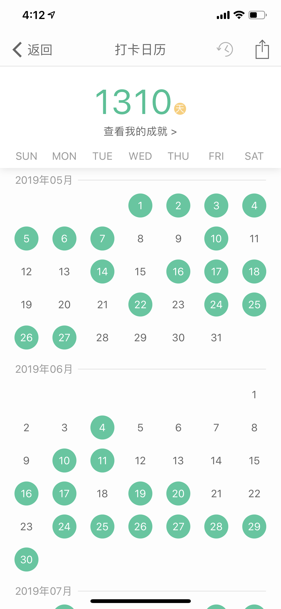

## 慢增长

这两天，我的公众号不知道为什么，突然有了一大波关注，增速是平常正常增长量的 20 倍之多。这让我有些惶恐。

为什么惶恐？

熟悉我的人都知道，我其实是一个很“慢”的人。所谓的慢，并不是指执行力低。我自认为自己的执行力还是可以的。这里说的“慢”是指，通常对于一个计划，我会给出一个很长的时间周期。比如一年，三年，甚至五年，十年。

之所以会这样，一个很重要的原因是，在我不长的人生历程中，我发现，“快”的结果通常都不尽如人意。至少在我的身上是这样。**我是一个不适合“快”的人。**

所以，在给自己制定计划的时候，我通常都不用任务量的方式做计划。

比如打算看一本书，我不会要求自己每天看10页。虽然这样算下来，一整本《算法导论》，4 个月就能看完了。但实际情况却是：这样的计划，近乎一定无法完成。

**无法完成的计划，除了打击自己的自信心，没有任何好处，不如没有。**

我是在列出了无数的计划，然后毫无意外地无数次完不成计划，之后无数次质疑自己，无数次人生观崩塌，然后无数次再把自己重新拾掇起来，无数次继续努力以后，得出这个结论的。

现在我通常是怎么给自己做计划的呢？给自己制定任务时间。

比如打算看一本书，我要求自己，每天看 40 分钟。这 40 分钟是看半本书还是 1 页纸，无所谓。只要高效利用这 40 分钟，努力吸收这本书中的知识，我觉得就够了。

所谓每天进步一点点。

毕竟，对于一本书，不同章节有难有易，有的地方进度快一些，有的地方进度慢一些，是很正常的。读懂，消化，学到知识才是目的。

我发现，这个方法对我特别有效。虽然这样算下来，完整学习一本教材的时间，通常都会比我最初预估的时间慢三倍甚至五倍。但关键是，我终于能完成自己的目标了。慢一点又何妨？积累起来，我比过去那个制定了无数目标却都完成不了的自己，强了不知道多少倍。

**过去追求“快”，结果却很慢。真的慢下来，才发现：慢就是快。**

 

---

其实，我也无法做到每天都按时按量完成自己的学习任务。毕竟，长大了，不像在学校里，近乎所有的时间都可以用来学习。生活中，总会有各种意外打断原本的计划。

但一旦明白很多事情都“快”不来，对于这种生活中的“意外”，也就不会那么焦虑了 —— 毕竟，对于大多数事情，不差那么一两天。

“不差这一两天”，这听起来似乎很“违背主流价值观”，我也不建议你和你的领导这么讲，但我确实是这么认为的。

已经有好几个同学，在不同的群里，扒出了我的扇贝账号。我在很早之前，就开始使用扇贝记单词了。最初只是想扩充词汇量，增强英语水平，但到现在，已经近乎是一个兴趣了。看见一个单词我不认识，我就觉得好奇，就会习惯性地拿扇贝单词给它记下来。（我没收扇贝一分钱广告费。）

到现在，我在扇贝单词上已经积累了 55734 个单词，打卡 1310 天了，折合下来，大概是三年半的时间。

 

如果对词汇量有概念的同学，一定明白，55734 个单词是一个很夸张的数字。因为，在英语为母语的国家，普通的成年人，词汇量大概是 2 万到 3.5 万之间。

当然，我在扇贝单词上积累了 5 万多个单词，不代表我的词汇量真的就是 5 万多。实际上，怎样计算词汇量，也有不同的标准。再加上这其中包含了很多词组或者固定搭配，而不仅仅是单词而已。

但是，这个数字确实也让我自己吓了一大跳。很多同学都说，波波老师太刻苦了。但是我自己知道，我一点儿都不刻苦，比我刻苦的人多了去了。

我不是在谦虚，因为，我的打卡日历大概是这样的：

 

大家可以看到，典型的三天打鱼，两天晒网。

现在的我，一般每天都会阅读很多英文文章。遇到不认识的词，就在扇贝里记录下来。晚上有时间，就过一下；没时间，就算了。有的时候一天遇不到几个新词，有的时候则能遇到上百个，甚至几百个。

虽然我在扇贝上真正打卡了 1310 天，但其实，这是大概六七年积累的量。

慢不慢？当然慢。但是回头看，我却发现，自己比六七年前，真的进步了一大截。毕竟，在六七年前，说要和我一起学习英语的小伙伴，没坚持几个月就放弃了。

在那几个月里，我估计他的进度比我快不少。但其实，站在更长的时间尺度上看，**这短暂的“快”，意义并没有那么大。**

 

---

更关键的是，我意识到了，**很多东西，是快不来的。**

对于理工科的同学，本科课本上的大部分学科都能考前突击，甚至花一晚上的时间，把一个学期的课程内容掌握得八九不离十。我估计，在国内读大学的同学们，99% 都有类似的经历。我也有。

但经验告诉我，这样“快速”掌握的知识，最终无一例外，只有可能忘记，到头来，真到需要的时候，还要重新学起。**以为很快，其实很慢。**

还有很多知识，根本快不起来，比如英语，比如算法。近乎所有的“内功知识”，都有这样的特点。

 

---

不仅仅个人学习如此，很多领域的创新，乃至产业的发展，亦是如此。

比如这阵子网上讨论得很热的芯片和操作系统，在我看来，就是快不起来的领域。大家固然要努力奋斗，但是所有的进步也要符合客观规律。这个世界并非“人有多大胆，地有多大产”。**对于很多领域来说，时间的积累是必须的。**

 

再说一个大家可能不熟悉的领域——农业（包括养殖业）。我在国内创业的时候，访谈了很多农企，深知农业技术创新的艰难。

为什么艰难？不是资源不到位。国家每年的一号文件，第一个提到的都是农业，每年大把的资金流向农业领域。

但是，客观事实是，一茬农作物，怎么也要半年一年，才能有收成。甚至一些果树，要几年的时间，才能结果。常言道“桃三杏四梨五年，核桃结果十五年”。什么意思？桃树要三年结果；杏树要四年结果；梨树要五年结果；核桃树呢？十五年。

慢不慢？太慢了。随便做个实验，几年过去了，搞不好还什么成果都没有。这种“慢”，和现代社会的节奏格格不入。这年头，没有几个人能熬住这种慢。因此，人才很难流向农业。

但这个“慢”有没有什么好处呢？

前一阵子，我在知乎看到的一个问答，很受启发。讲述了北欧国家是如何维持高福利的社会生活的。我将这个答案放在了这篇文章的“阅读原文”中。

其中有一条，就是在产业发展上，北欧国家在尽量选择“**高附加值，低发展速度**”的产业。

“高附加值”好理解，“低发展速度”是怎么回事？

互联网就是典型的“高发展速度”的领域。表现就是，技术更新换代快。结果就是，一款产品很难做到真正的“积累”，产品优势可能也就三五年的时间。

之前我们还在用人人网，突然就都去微博了；微博玩着玩儿着，就都来到微信了。微信稳稳地站住了社交服务的脚跟了吗？抖音快手等视频社交又来势汹汹，谁也不知道未来会怎样。

“高发展速度”的行业因为变化太快，所以很难有所积累，也因此，大家通常危机意识会很强。因为大家知道，自己被打败的时候，连渣儿都不会剩。所以，这些领域的人都在疯狂创新，生活节奏越来越快。

不仅仅是中国，其实美国也是如此，美国最发达的产业，是那些“高附加值，高发展速度”的产业。比如互联网，比如金融。

但欧洲国家，尤其是北欧国家，发展思路似乎完全不同。当然，这个不同背后，不一定完全是主观选择的结果，也是在很多历史政治经济等等方面的条件下，“被迫”采取的选择。但不管怎样，最终结果是：他们的支柱产业，大多是“高附加值，低发展速度”的产业。

农业就是典型的这类产业。尤其是畜牧业。

以乳制品为例，如果你认为养奶牛没什么技术含量，那就大错特错了，这里面的技术含量极高。在丹麦，能够做到 95% 的牧场，每毫升牛奶的细菌数低于 3 万。而美国标准是每毫升牛奶细菌数 10 万。至于中国，我查到的数据是 200 万。

当然，我不是畜牧业专家，现在是不是有什么变化并不了解，我也完全没有不爱国的意思，毕竟我们改革开放以后，发展时间并不长，我们在一些方面和发达国家还有差距，这个要承认。**我只是想用这个数据辅证，畜牧业是很有技术含量的一个行业。**达到丹麦的标准是极难的，需要漫长时间里的不断耕耘发展。在乳制品行业，可以和丹麦媲美的是荷兰，也是一个北欧国家。

欧洲的其他国家也有类似的“产业优势”，比如德国的发动机，在我看来也是如此，“**高附加值，低发展速度**”。这些产业变化很慢，一旦取得了成果，这些成果很容易积累下来，在很长时间里产生效益。所谓的“传统行业”。

当然，这样的选择也有损失，毕竟，变化才代表着机会，在迭代速度快的行业里，才有超越的机会。中国如今取得现在的国际地位，一个很大的原因是，在这类变化很快的新兴行业抓住了机会。

**但是，这并不意味着，“快”，是唯一的选择。**

 

---

我很早就认命了，自知自己无法像马云乔布斯那样，创造出阿里或者苹果一样的商业帝国。因为我太“慢”了。

研究生刚创业的时候，一腔热血，觉得自己要学习乔布斯，改变世界。**Change the World**。

后来，来了美国，和一个 Google 的同学聊天，启发很大。其实，我们不需要改变世界，对这个世界产生一点影响，就够了。所谓的 **Make an Impact**。

但是现在，我的观念又变了。我觉得，产生一点影响都是奢求。现在，我喜欢的说法，是产生一点涟漪。**Make a Ripple**。

你看，我是不是越来越没追求？

但我却觉得，我越来越进步了。因为，不再年少轻狂，理解了梦想和现实的分界。

慢慢来，哪怕产生一点涟漪，或许才是实现梦想的开始。

再不济，涟漪虽浅，但也证明，我在这里。

 

**大家加油！：）**