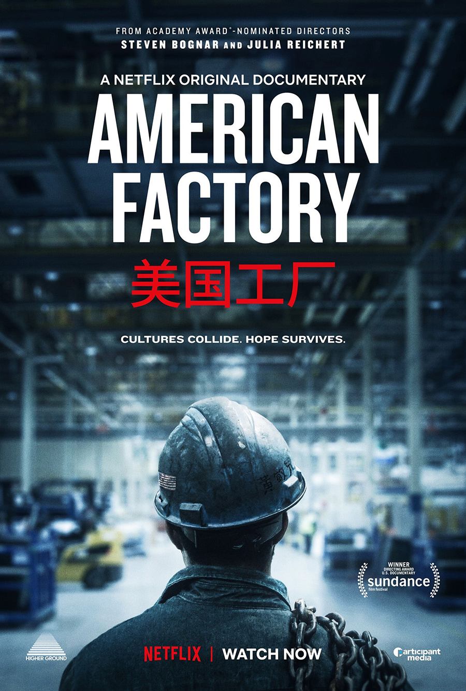
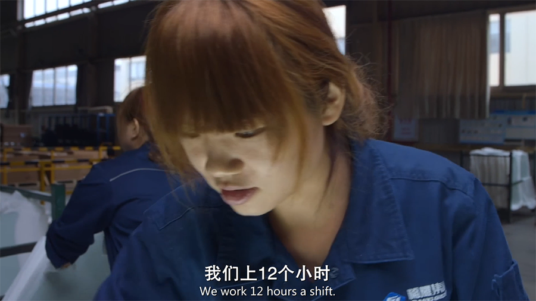
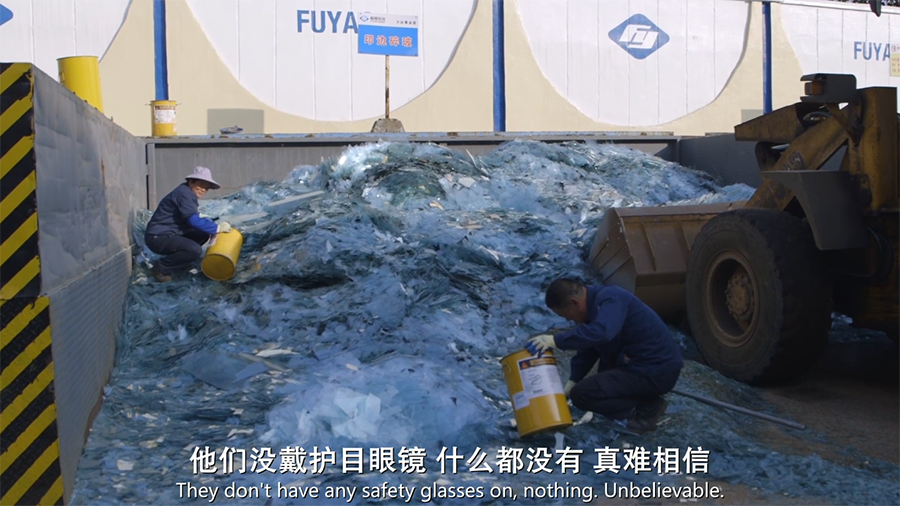
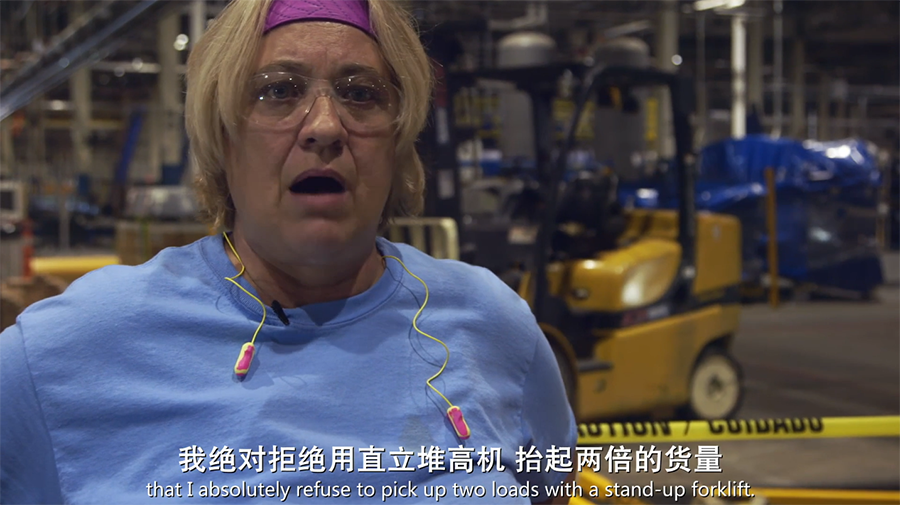
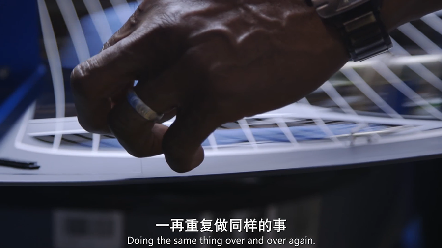
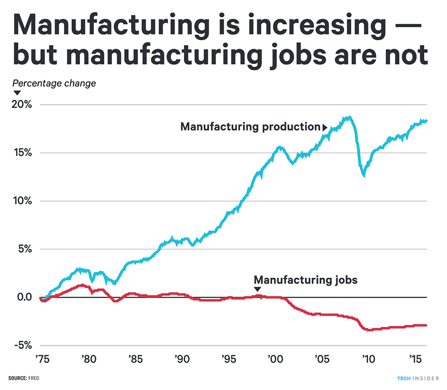
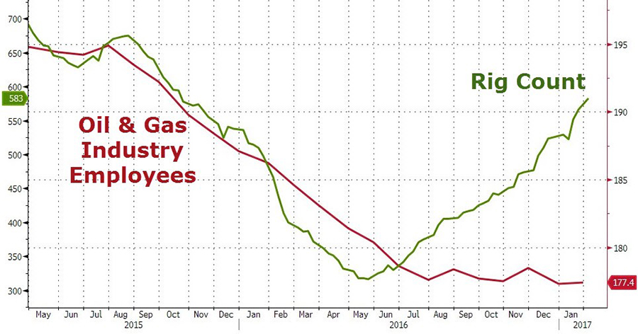
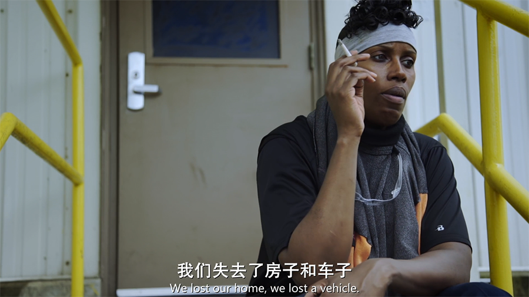

## 《美国工厂》到底在讲什么？

这两天终于补看了最近朋友圈火热的《美国工厂》。

简单地说，《美国工厂》讲述了一家中国企业在美国开办工厂的艰难。

之前看到很多文章，都在说这个纪录片是在讲述中美文化的差异和冲突。我本以为影片会重点刻画中国人民的勤劳刻苦和美国人民的自由散漫懒散。但是真的看完以后，我才发现，完全不是那么回事儿。

影片的态度显然不是夸耀美国，但也很难说是夸耀中国。

 

比如，在影片中，外国高管来中国参观学习，采访中国工人的时候，中国工人说，每天上 12 个小时班，一个月也就休息两三天。美国人呢？每周 5 天，每天 8 个小时。都 9102 年了，我实在不觉得这些数字代表我们更加勤劳刻苦。

 

再比如，这帮外国高管偶然看到中国工厂外，两个老人蹲在玻璃堆里分拣碎玻璃，都惊呆了。因为他们既没有佩戴护目眼镜，也没有使用防割手套——完全没有安全措施。这真的是在说我们不畏艰难，迎难而上吗？

 

回到美国那边，我不知道为什么，总觉得导演的剪辑在吞吞吐吐，刻意把事情说得很模糊。比如，采访一位员工，员工表示，拒绝用机器抬起两倍重量的货物，因为超过了机器的最大负载，她认为是不安全的。她不愿意冒生命的危险。

有毛病吗？我觉得一点儿毛病都没有。我们中国的工厂，不也到处贴着“抓生产更要抓安全”吗？只能说，似乎中美两国对“安全”的定义不太一样，中国人觉得用用机器抬起最高承重两倍的货物，也是安全的。

然后，镜头转向了一位曾经通用汽车厂的老员工，这位老员工表示：他在通用汽车厂干了 15 年，一次工伤都没有。但是，在这个中国投资的玻璃厂，他受工伤了。可是不知道为什么，影片不详细地介绍他究竟是因为什么受了工伤？是他个人的原因？还是厂子的原因？是制度不合理？还是设备有问题？统统没有解释。

影片想要描述的重点是，这家中国开办的厂子，似乎安全有些隐患，进而，引出了全片中美双方最大的冲突点 —— 工会问题。

 

在工会问题上，两边人打起了“舆论战”，支持工会的人上街游行，中国这边呢，“干掉”工会积极分子。

其实，公平地讲，这种“办公室政治”，哪里都有。所谓有人的地方就有江湖。这些问题我不想评价谁是谁非。因为这件事情真的太复杂。企业想要追求更大的效应没毛病；工人想要追求更多的福利也没毛病。企业主和员工本来就是站在不同位置看问题的。因为屁股坐的位置不一样，所以脑袋里想的事情也就不一样。

就这样，这家中国人投资的美国工厂，从刚一进入美国，受到了当地的热烈欢迎，甚至被很多人认为是救世主——拯救了很多家庭多年没有收入的窘境；到慢慢被美国人不接受，甚至反对。

我们可以说是中美的文化差异导致了这样的冲突。但是认真反观，在中国，冲突不存在吗？回头看影片中对在中国工人的采访和表情，其实，似乎只不过因为环境不同，文化不同，中国工人不会大声说 No，不会上街抗议。但中国工人也没那么幸福。

> 累啊，肯定累，那有什么办法？
 
 

或许，这个纪录片真正揭示的，是现代制造业的现状：不管是中国文化，还是美国文化，人们对于这样的工作，都越来越不能接受了。

引自影片中一段美国工人的话：

> 工作的状况并不是很好。
>
> 一再重复做同样的事情，会让你很疲惫。
>
> 你有时候会想：为什么我要做这个？
>
> 你会考虑自己有没有精力和毅力，做这个工作。

可是，在通用汽车厂，这些人就不会这么想吗？

 

其实，从工厂主的角度，也并不喜欢用工人。

影片的结尾，机器臂娴熟地做着原本是工人做的事情。主管告诉身边的曹德旺主席，下次就能把这里的人取消掉了，再下次就能把那里的人取消掉了。

> 没办法，人做的太慢了。

![film6.png]

 

人不仅仅做的慢，人还会劳累，还会出错，还要被管理，还要沟通，还要休假。人要自由，要尊严，要福利，要工会。这些问题机器统统都没有。

这在我看来，这才是《美国工厂》的核心。不管是美国文化，还是中国文化，都越来越不能适应现代制造业的发展了。在我们还在争论谁好谁坏的时候，企业家已经给出了答案——机器最好。

 

---

之前看过一个很有意思的统计数据。现在美国有很多的失业人口，造成了一定程度的社会不稳定。很多美国人喜欢将这些失业归咎为大量的移民，尤其是非法移民，抢了美国人民的饭碗。

但实际上，真实原因很有可能不是这样，如果我们看一下美国的制造业的产值，就会发现，它是在保持一个不断上升的趋势的；但是，制造业相关的工作数量却在逐渐降低。

下图中，蓝色的线条是制造业的产值；而红色的线条则是制造业的工作数量。

为什么会产生这种现象？就是因为自动化。自动化让企业主可以雇佣更少的人，创造更多的价值。

 

如果我们聚焦到一个具体行业中看，就更有意思了。一个偶然的机会，我在网上看到了这样一张图。

 

这个图描述的是，在石油行业里，石油钻机的数量和石油工人数量之间的关系。绿色线条是石油钻机的数量，红色线条是石油工人的数量。

大家可以看到，在 2015 年，工作的石油钻机和石油工人的数量都在疯狂下降。因为 2015 年，国际油价出现暴跌。有兴趣的同学可以搜索一下那会儿的新闻。

因为原油价格暴跌，大多数油企没有动力继续钻井采油了。所以，很多钻井平台停止了作业，很多石油工人也下岗了。

但是，油企在这个时间里可并没有闲着。油企们在投资，实验，研究自动钻井平台。

一方面，这是油企的求生之路。如果油价一直这么低，就必须要尽快将成本降低下来。怎么降低成本？大规模使用机器。虽然短期可能需要大量资金，但是长期来看，机器最省钱。

另外一方面，石油行业的实地钻井平台作业，是充满危险的，机器代替人类进行危险作业，本来就是早晚的事情。只不过，这波石油价格的暴跌，推动油企们更快地完成了这一进程。

结果是怎样的呢？2016 年 6 月开始，石油价格逐渐回升，美国的很多石油钻井机逐渐开始作业。但是，石油工人的雇佣量完全没有上升。

两年的时间，美国石油企业在自动化上的投资，已经可以让原先需要 20 人做的工作，现在只需要 5 个人就好。据统计，这波油价的暴跌，让美国 44 万石油工人下岗，但是，其中 22 万的工人，永远不会回到石油行业了。因为自动化的原因，石油行业不再需要这么多人了。

**什么美国文化，中国文化。机器没有文化，机器赢了。**

 

---

机器的逐渐发展完善，是否会让大多数人类失去工作，从而引发巨大的社会不稳定？这其实是一个老生常谈的问题。

截至目前为止，还没有发生这样的情况，并且，与之相反的，研究表明，因为机器的逐渐普及和应用，更多的工作岗位被创建出来了。

一个典型的例子，是 ATM 机的普及。

1970 年的美国，由于银行逐渐开始普及 ATM 机，一度导致大量银行的业务人员下岗。但是，随后，统计数据表明，正是由于 ATM 机的普及，导致银行慢慢开始需要更多的人才了。

为什么？因为 ATM 让简单的存款，取现等常规业务变得极其简单廉价，使得银行开一个支行的成本变低了。于是，银行开始了扩张，到处都有支行，每个支行都需要人员，虽然，他们的工作不是简单的为客户存钱和取现。

另一方面，因为这些常规业务的简单化，也使得人们对金融的需求越来越多元化，银行业开设了越来越多的业务种类，满足人们的金融需求。银行业，金融业蓬勃发展，导致需要更多的人才。

这还没有算维护 ATM 机器，升级 ATM 机器带来的就业。

所以，一派观点认为，机器逐渐普及，其实将带来更多的就业。只不过，**这些工作，不可能是原来那些轻松的任务了。**

以银行业为例，在过去，只是帮助用户存钱和取现，就可以成为一个体面的白领，**但在这个时代，已经不可能了。**

**在机器逐渐发展的时代，所有人的知识必须升级。持续学习很有可能不只是一种生活理念或者是优秀的人才拥有的素质，而是每个人想要生存下去必须经历的生活方式。**

否则呢？《美国工厂》里给出了一个很好的例子。

原来在通用汽车厂工作的工人，时薪是 29 美元一个小时；但是在福耀玻璃厂，继续当蓝领，每小时只能赚 12.84 美元，一半儿都不到。

注意，这其中还有时间差距，十几年前的 29 美元，和现在的 29 美元，完全不是一个概念。

按照影片的说法，在以前，孩子要想买双新的运动鞋，这些工人随随便便就买了，但现在不可能这么随性了。甚至，他们失去了自己的房子和汽车。

 

这才是真真正正的，美国在过去十几年，很多人经历的生活变化。曾经幸福美好的生活，突然就没了。

 

看着《美国工厂》中的代顿，我总是在不可遏制地想：今天的硅谷，会不会就是明天的代顿？今天风光的码农们，会不会就是明天的这些美国蓝领？

我也不知道答案。未来太远，我们只能把握今天。

 

**大家加油！**
