## iPhone 设计“崩溃”史

2019 年苹果秋季发布会结束了。重头戏就是发布了全新的 iPhone 11, 11 Pro 和 11 Pro Max。相信大家已经都知道了。如果还不知道，随便翻翻朋友圈或者公众号文章，应该到处都是类似的新闻。

作为一个非常酷的公众号，把苹果发布会的内容重复一遍，这就太不酷了。

 

说到不酷，苹果最新发布的 iPhone 11 系列，最大的槽点就是：太不酷了。或者，咳，让我们直白一点，**太丑了**。

iPhone 11 整体的视觉效果是这样的。

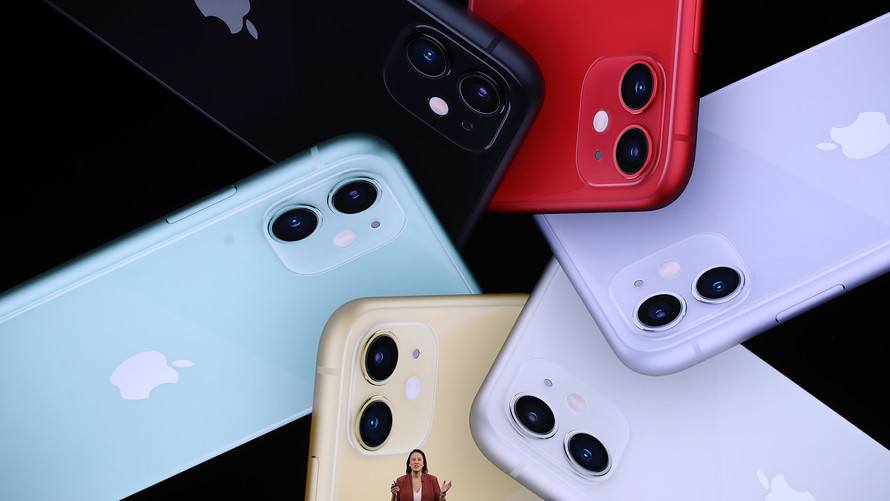

这个双摄像头放在一个方块儿里的排列方式，像极了某种很无奈的表情。

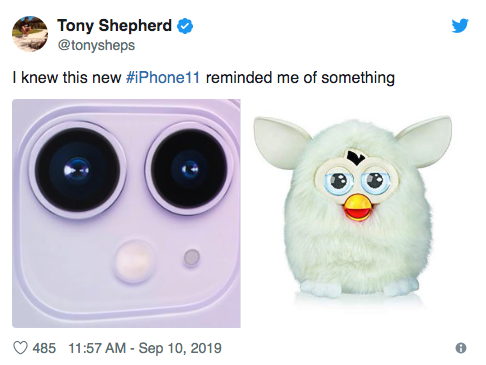

如果有表情包制作者看到这篇文章，建议深挖一下，做个表情包，搞不好能火。大概就是这么一个风格：

不用谢我了。

 

至于近一万大洋的 iPhone 11 Pro 和 11 Pro Max，视觉效果是这样的。

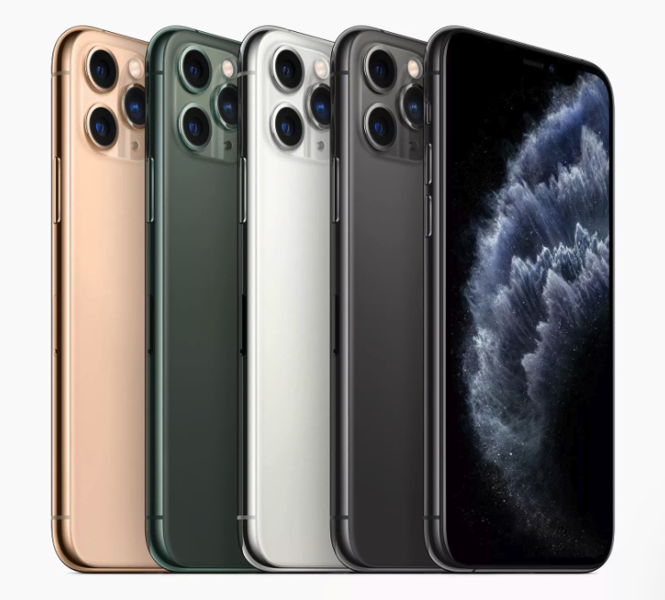

在 iphone 5 发布的时候，果粉们以为苹果手机会越做越长。

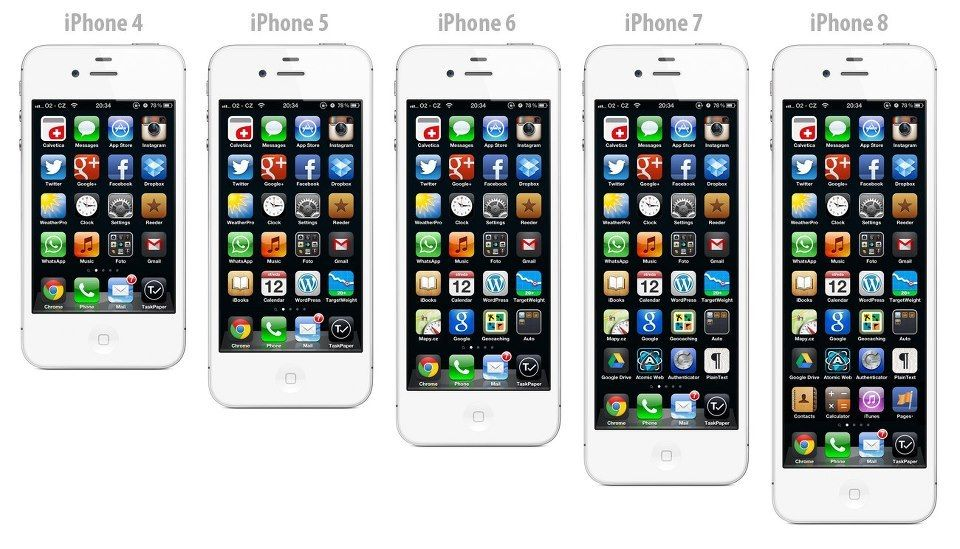

乃至 iphone 20 可能是这样的：

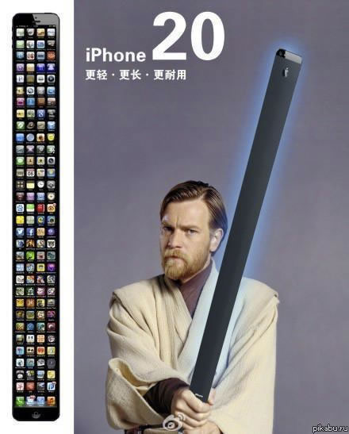

但是，时间证明：果粉们错了。苹果怎么可能只在屏幕的长度上做文章呢？这样的科技趋势预测，显然没有考虑到：摄像将成为手机最重要的功能之一，同时迎来直播业，网红业等行业的井喷式增长。

现在，大家终于明白了，到 2029 年，苹果手机第 21 代，应该是这样的：

当然了，现在刚 iphone 11，只有 3 个摄像头而已。放在一个方块儿里，像极了灶台。正好，现在苹果 CEO 姓 Cook...

但是，可能国内这种无火的灶台不是特别多。所以，我还是觉得说它像浴霸更贴切。

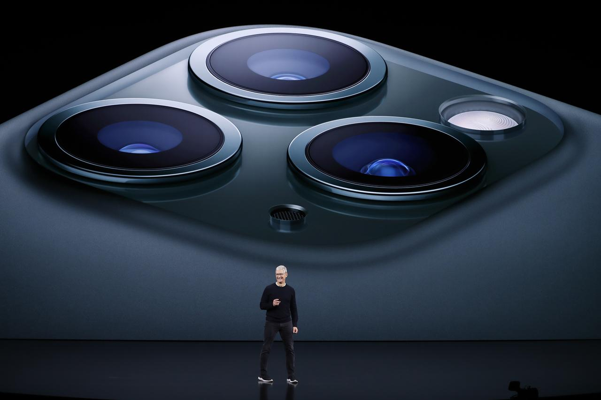

总而言之一句话：**苹果的设计全面“崩溃”**。

 

---

但其实，苹果设的计“崩溃”，已经不是一天两天了。最早可以追溯到 iOS 7 发布的那一天。

苹果自 iOS 7 起，摒弃了一直使用的拟物化设计，采用了全新的扁平化的设计风格，引起了设计界的轩然大波。至今，整个设计界对于扁平化设计，还是褒贬不一。

咱也不是专业设计，咱也不懂设计专业。反正美丑是比较主观的事情，仁者见仁，智者见智。远观对比图如下：

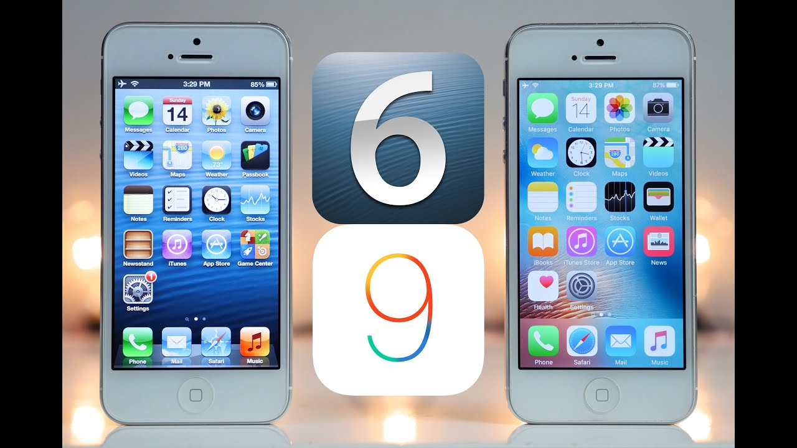

但是，逻辑咱们还是听得懂的。其实，我看到很多设计师的评论，并非反对苹果的扁平化设计，而是觉得苹果的很多扁平化设计，非常“业余”。

 

比如，照相的图标。左边是过去的设计，右边是新的扁平化设计。很明显的，右边的图标更加平庸，只是一个剪切画而已。

 

再比如游戏中心（Game Center）的图标。右边是新的扁平化设计，四个气球叠在一起，完全不知道是什么意思。我承认，“游戏中心”是一个相对比较抽象的概念，很难用一个图标准确表达。但左侧以前的设计，告诉你这是“游戏中心”，你会觉得合理；而对于右侧的新设计，就算知道它是“游戏中心”，大多数人多半一脸蒙圈，为什么这个图标是游戏中心？

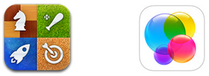

 

再比如，扁平化以后的“照片”图标，右侧新设计到底是什么？

 

还有一些图标的改变，很多专业设计师的评价是，“为了扁平而扁平”。

比如 newsstand，以前的设计是一个书架，上面摆放着你订阅的报纸杂志，一看就知道什么意思。但是新的扁平设计，让人觉得是一个三流的内容聚合 App：

 

不过没有关系，反正现在苹果已经没有 newsstand 了，取而代之的是全新的 News。

嗯，说实话，我一直不知道这个 news 的新图标，和“新闻”有什么关系？

 

---

我们不吐槽 iOS 的扁平化设计了，毕竟，iOS 7 已经是 2013 年的事情了，说实话，我已经习惯了。

时间飞逝，来到了 2015 年，苹果发布了全新一代的**苹果鼠标第二代**。

和所有的苹果中文翻译一样，苹果鼠标 2 代，有一个拗口得不能再拗口的中文名字，**妙控鼠标 2**。它的英文名字明明是 Magic Mouse 2，我实在不理解，直译的“魔法鼠标”哪里不好？

除了没有魔法以外？

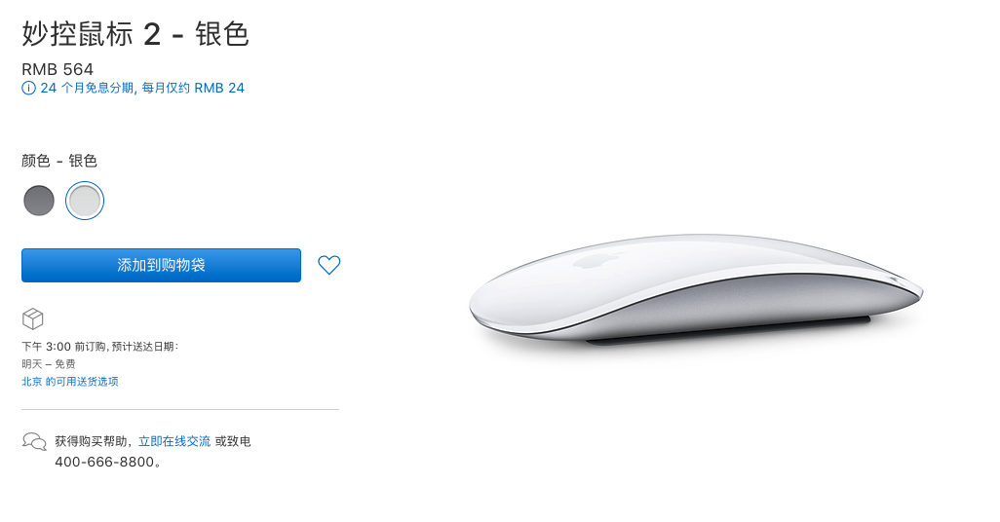

我现在使用的鼠标就是这款“妙控鼠标2”。这款鼠标比起 1 代鼠标，最大的区别是从使用七号电池，变成了充电电池。

但是...... 充电的设计是这样的：

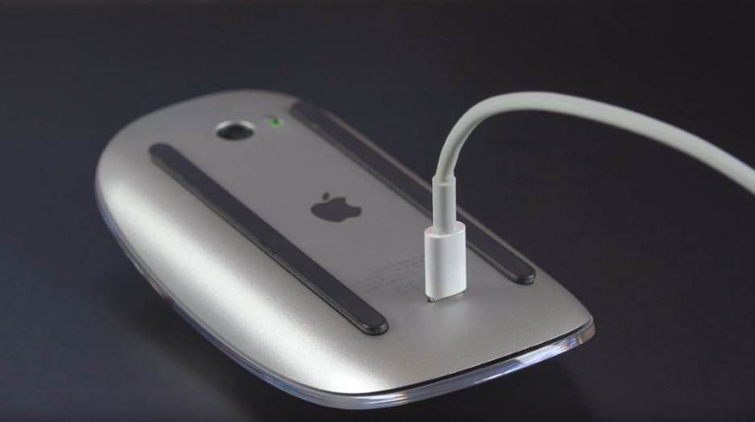

这意味着，在充电的时候，你无法使用这款鼠标。

2015 年，这样的设计简直不可思议。

我们可以看看罗技的充电鼠标是怎么设计的：

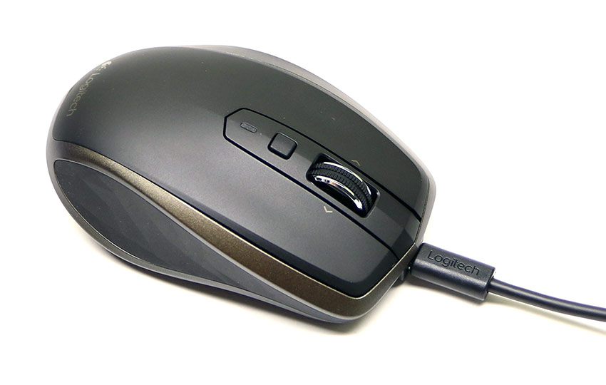

充电时完全不影响使用。

我本来不觉得这是什么了不起的设计，直到遇到了苹果的“妙控鼠标2”。

咱也不懂鼠标产业，也不懂设计。咱就是个小白，想弱弱地问一句：

**这个设计，对苹果来说很难吗？**

 

---

时间来到了 2016 年，苹果发布了 iphone 7。嗯，取消了 3.5mm 耳机接口。于是，如果你需要边充电边戴耳机的话，基本上是这样的：

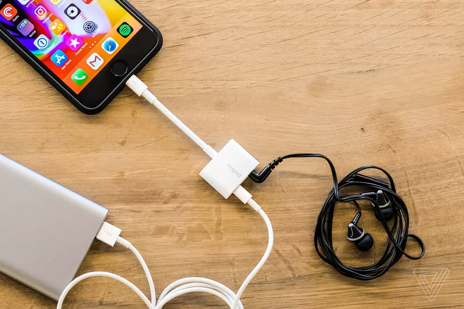

 

当然了，后来我们才知道，这可能是在给苹果即将推出的无线耳机 airpod 铺路。

不仅如此，2016 年最新的 Macbook Pro，苹果还取消了所有的 USB 接口。于是，使用新款 Macbook 的画风就成这样了。

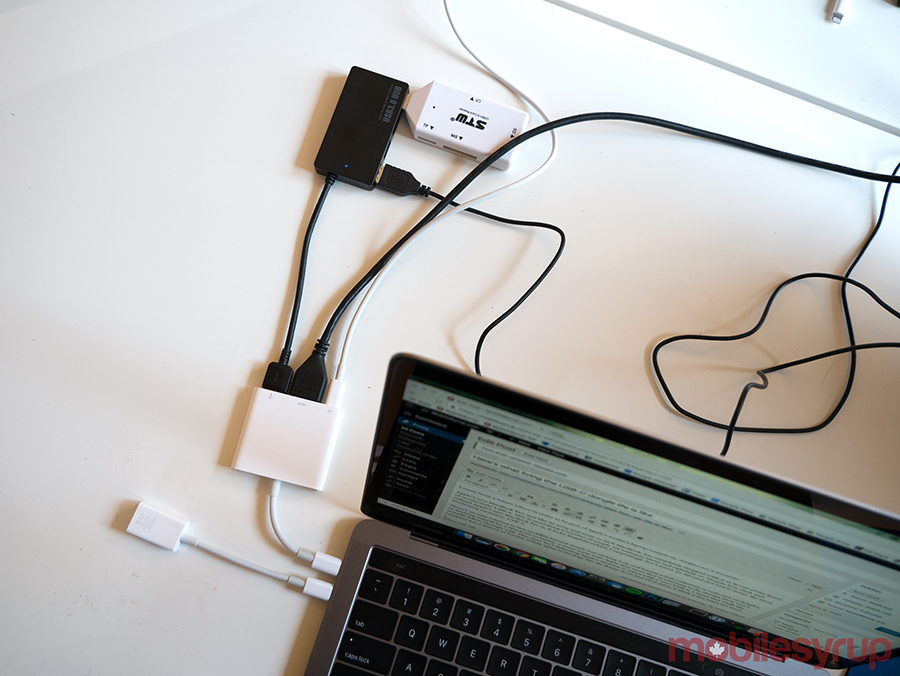

反正苹果的转换头儿生意是火爆了。在苹果官网，只看“显示器适配器”，就有 10 个选择，都是 200 大洋起步的。

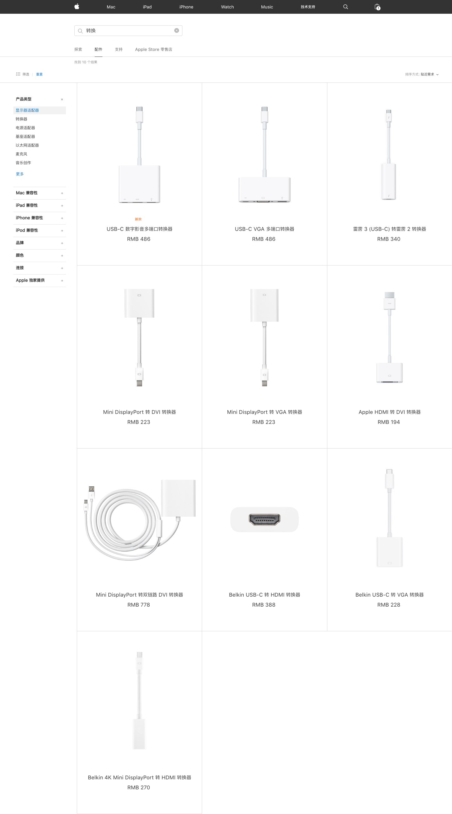

对了，苹果的转换头还特容易坏，我也习惯了。

 

---

不说 Macbook 了，我们说回 iPhone。2018年，大名鼎鼎的 iPhone X 系列发布。

全新的 iPhone，掀起了一阵全世界范围最新的手机设计风潮：**刘海屏**。

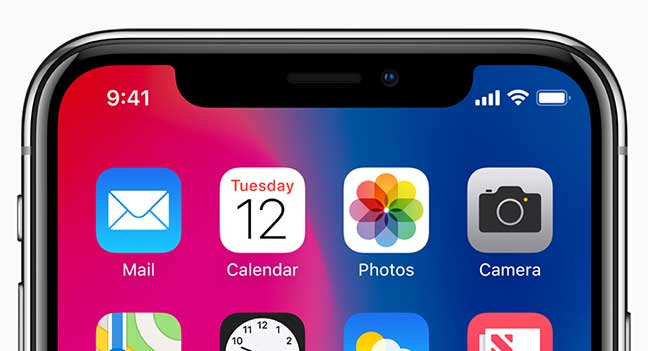

 

当然，采用刘海屏，也有不得已的技术原因。但是，很多设计师都表示，完全可以使用更巧妙的设计，避免这个视觉灾难。**毕竟，苹果曾经是将技术和设计结合得最完美的科技公司啊！**

比如，对于 iPhone 应用的整体设计，可以采用如下方式：

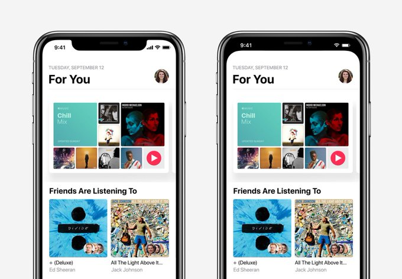

大家可以看到，对于右侧的设计，其实“刘海”还是存在的，但是，在视觉上，被隐藏了。与此同时，刘海两侧的屏幕并没有浪费，依然可以显示时间和电量等信息。

但不知道为什么，苹果坚持把刘海大大地展示在自家应用上。可能是考虑到土豪们使用起来，需要让周围人知道，这是最新的 iPhone X 吧。

所以，我们看到的全屏照片或者电影，都是这样的：

如今，很多注重用户体验的 app 设计——是的，比苹果还注重用户体验的 app 设计师们——将自己的 app 在全屏展示画面或者图片时，修改成了下图最后的设计：

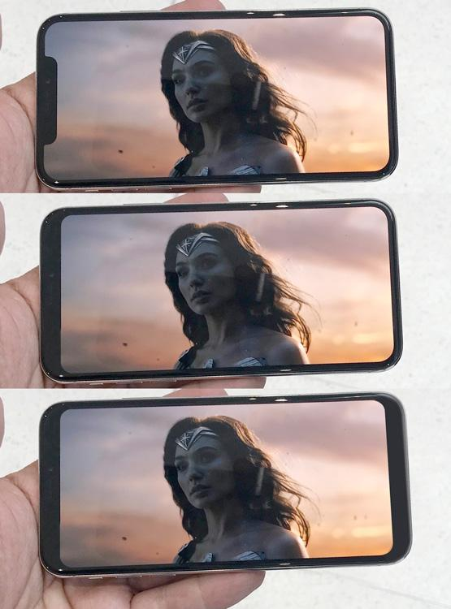

但是，对于苹果的官方 app，就没辙了。所以，使用 safari 横屏浏览网页的话，效果是这样的：

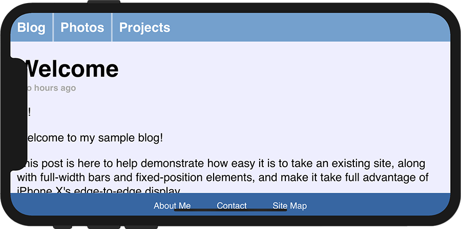

怎么办呢？很多网页设计的教程会告诉你：请考虑刘海屏的问题。当移动网页横屏浏览的时候，**网页的左右两边，应该留出一定的安全距离...**

**不知道这是不是当下前端设计必考的知识点...**

于是我试验了一下，在我的手机上，横屏看我的微信公众号《是不是很酷》的文章目录，效果是这样的...

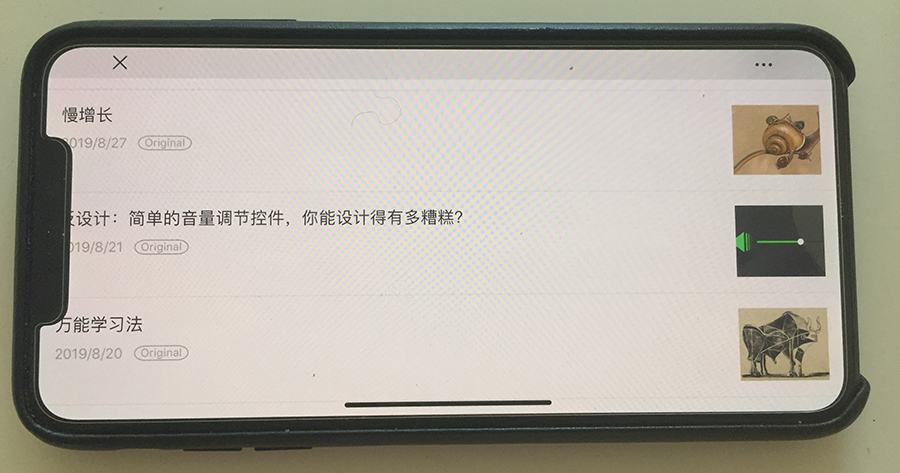

嗯，**不愧是腾讯，绝不向丑恶的设计低头...**

 

---

好了，时间来到了 2019 年，最新的 iPhone 11 Max Pro 浴霸版，大家也看到了。

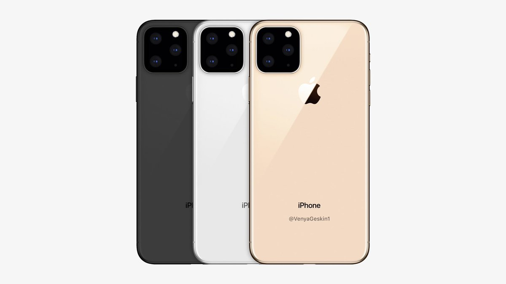

 

可是，你猜怎样？

就算苹果的设计大家都说“丑”，但每次都有大批跟风者。

就说刘海屏手机吧，现在的手机行业形势是这样的：

 

至于大方块儿三摄像头手机呢？嗯，据说 Google 的 Pixel 4 是这样的：

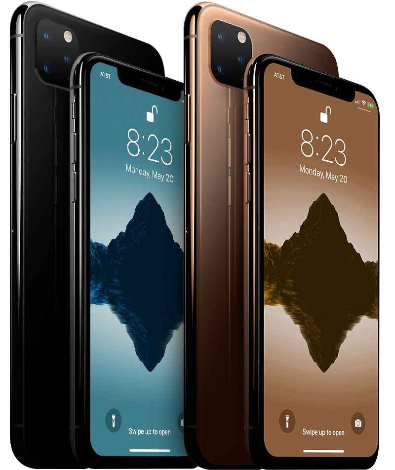

刘海，方砖浴霸三摄像头，一个都不能少。

其他手机呢？我们拭目以待。

 

或许，我们都冤枉苹果了。**不是苹果的设计太丑，只是，我们太不时尚。**

最新消息，发布会结束后，苹果股价呈上涨趋势。

所以，亲爱的同学们，你们准备好购买，最新出炉的，最时尚的，iPhone 11 , 11 Pro 和 11 Pro Max 了吗？

反正，我的课程群里已经有很多小伙伴表示，iPhone 11 还是很便宜的。性价比不错。

嗯，国行起步价，5499，确实比起往届便宜了。新款绿色看上去确实也挺有气质。

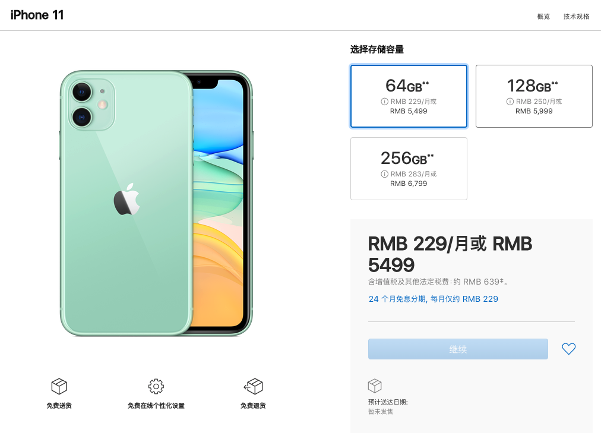

更良心的，其实是一起发布的新款 iPad，起步价 2699：

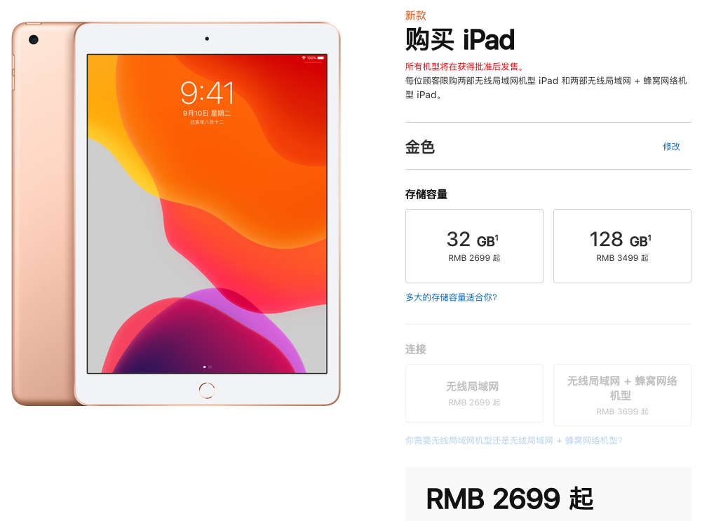

看来经济不景气，中美贸易战，谁都不容易。尤其是苹果——这个被外媒称为：**全美国对中国依赖最深的科技巨头。**

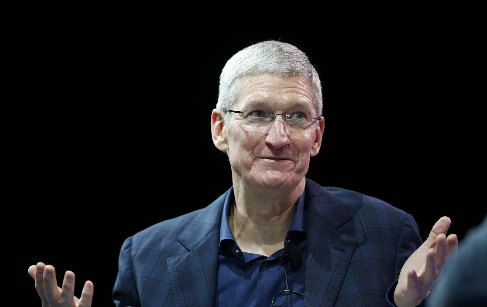

库克同学应该也很无奈吧。

 

**大家加油！**
