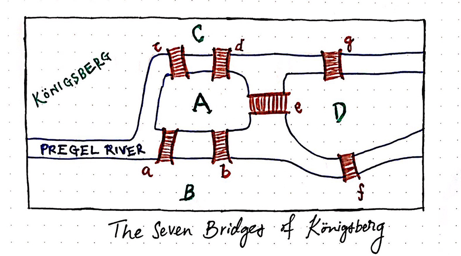
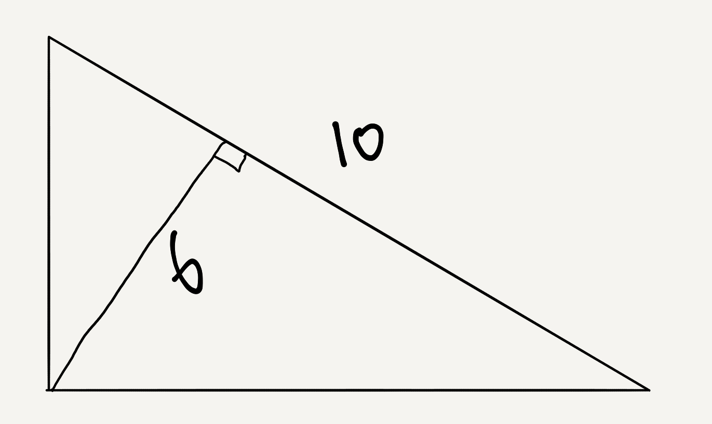
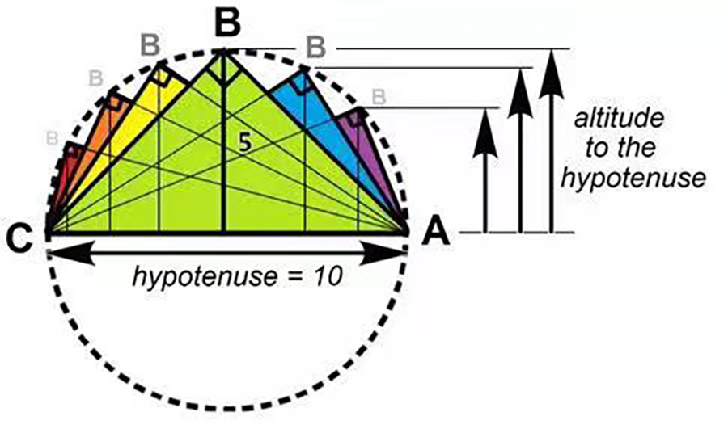
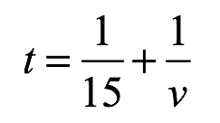
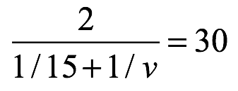
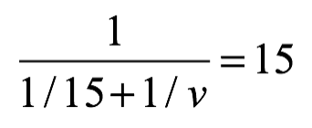
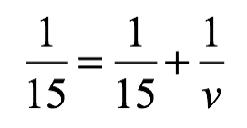
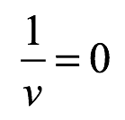
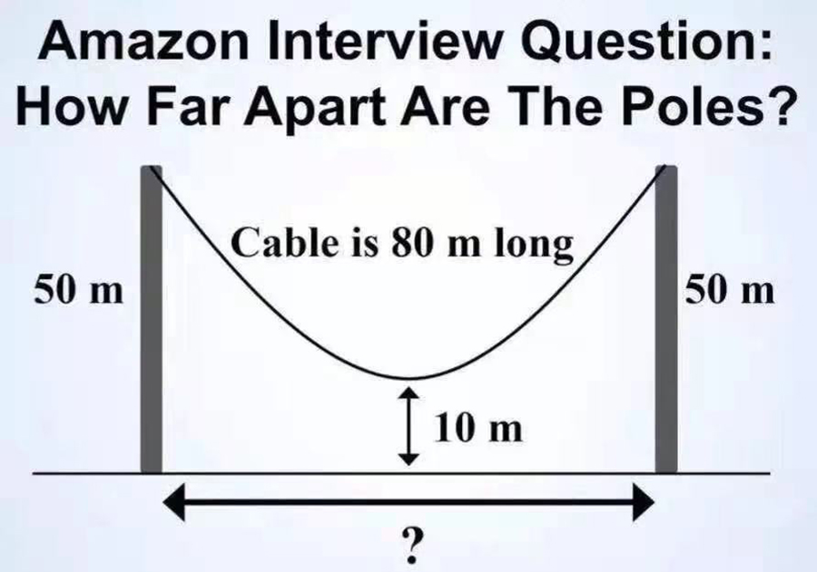

## 没有解的问题

**1.**

小的时候，有一类智力题特别流行，就是一笔画问题。现在我们都知道了，这本身就是欧拉图问题。但小时候哪有那么多理论知识，就是觉得笔不离纸，一笔能画出那么多图案，是件很酷的事情。

我印象很清晰，有一次去科技馆，在一个角落，我遭遇了经典欧拉回路问题的起源 —— 柯尼斯堡七桥问题 (Seven Bridges of Königsberg)。在这样一幅图中，我们能否从一个陆地出发，经过所有的桥一次且仅一次，最终回到出发的陆地？

小学时候的我，在那个角落研究了很长时间，都没有完成这个任务。我还想把这个问题抄到小本本上，回家好好研究。然后，科技馆的小姐姐告诉我：不用研究了，这个问题无解。

现在，相信大家都知道，对于一个图，如果图中的每一个顶点的度都是偶数，整幅图才存在欧拉回路。这可能是每个小学生都知道的结论，但是，这个结论对于当时的我来说，是非常震撼的。

在我印象里，这是我第一次意识到：**原来，这个世界上有的问题，是没有解的。**

 

**2.**

有一道网传的微软面试题是这样的：

一个直角三角形，斜边长是 10，斜边上的高是 6，问这个直角三角形的面积是多少？如下图所示：

如果你认为结果是底乘以高除以二，即 10 * 6 / 2 = 30，那么你就上当了。

这个问题的答案是：这样的直角三角形完全不存在。

为什么？其实，如果我们将这个斜边，想做是一个半径为 5 的圆的直径，就可以很清晰地看到这一点。所有的斜边长为 10 的直角三角形，都可以在这个圆中找到。圆上的任意一点，和这条直径的两个端点相连，就构成了一个斜边长为 10 的直角三角形。

很显然，这样的直角三角形，其斜边的高，最大为 5。

所以，斜边长是 10，斜边上的高是 6 的直角三角形是不存在的。

 

**3.**

一个据说骗过爱因斯坦的问题，是这样的：

一辆汽车，要行驶 2 英里，上山和下山各 1 英里。这辆车上山时的平均速度为 15 英里/小时。问：它下山要开多快，才能使上下山的平均速度是 30 英里/小时？

如果跟随直觉，很容易给出 45 这样一个错误的答案。但是，如果我们仔细计算一下，就会发现，事情没有这么简单。

这个问题的标准计算方法是这样的，我们假设下山速度要达到 *v*，才能使上下山的平均速度达到 30 英里/小时。

所以，我们就知道了，上山的过程，我们用的时间是 1 / 15；

下山的过程，我们用的时间是 1 / *v*；

上下山的总过程，我们用的总时间，就是这二者相加：

而上下山的路程总和，是 2 英里，因此，上下山的平均速度，就是 2 除以上面的时间表达式。所以，要想让上下山的平均速度达到 30，就是求解下面方程中的 *v*：

对于这个方程，首先，等号左右两边可以同时除以 2，就变成了这个样子：

我们再次可以把左侧分式的分母挪到右边，而右侧的 15，挪到左边的分母，上式就变成了这样：

很显然，等号左右两边都有 1/15，所以，原问题等价于求解 *v*，使得： 

相信大家都了解了，从初等数学的角度，这意味着无论 *v* 取多少，都无法使得原问题中的汽车上下山的平均速度是 30 英里/小时。

站在高等数学的角度，用极限的眼光去看，这意味着原问题中的汽车要无穷快，才能使得上下山的平均速度是 30 英里/小时。

是的，比光速还要快。但这显然不可能。所以，这个问题没有解。

 

**4.**

网传另一个亚马逊的面试题是这样的：

有两个杆子，高是 50m。两个杆子之间挂了一根绳子，绳子的长度是 80m。两个杆子间的绳子耷下来，最低点距离地面是 10m。如下图所示。

问：两个杆子之间的距离是多少？

正确答案是，这两个杆子之间没有距离，即距离为零。因为，只有当这根长度是 80m 的绳子对折的时候，其长度为 40m，距离地面才会有 10m。

 

**5.**

一个问题为什么没有解？因为问题的条件限制。说得文驺驺一点，叫做**约束**。

对于柯尼斯堡七桥问题，当前的七座桥连接陆地的方式，让这个问题没有解。如果我们改变这个约束，多添加一些桥，或者少走一些桥（拆掉一些桥），都能让这个问题有解；

一个直角三角形，斜边长是 10，斜边上的高是 6，这里的“直角”，“斜边的长度”，“高的大小”，都是约束，只要改变一个约束，这个三角形都会存在；

同理，对于两根杆之间的距离问题，杆的高度，绳子的长度，绳子离地面的高度，这些约束合在一次，让这两个杆之间的距离只有可能为 0。上述约束稍作改变，都会让这个问题的场景更加合理；

至于上下山的问题，我们只需要对汽车上下山平均速度的要求稍微低一点，哪怕希望汽车上下山的平均速度是 29 英里/小时，这个问题都是有解的。

**不合理的约束合在一起，让我们的问题无解。**

 

**6.**

上面的问题都是数学问题，虽然很 tricky，但我相信，这些问题对我的这个公众号的读者来说，都太小儿科了。

一个数学问题没有解，这似乎并不是什么稀奇事。但是，放在生活中，似乎很多人会忘记这一点。

比如，我会收到很多类似这样的问题：

* 我算法很差，想用一个月的时间，把算法面试准备得差不多，要怎么学习？

* 我大专学历，计算机专业，要求不高，在北上广找一个 8k 的工作就知足了，但一直没有着落，怎么办?

这些问题，在我看来，都是无解的。

但是无解的问题，并非没有意义。分析一个问题为什么没有解，可以说是一件非常有意义的事情。

通常，是问题的约束，导致了问题的无解。所以，**在大多数情况下，解决方案，都是改变约束。**

“一个月的时间把算法面试准备得差不多”是无解的，但是，如果改变约束条件，两个月呢？三个月呢？半年呢？问题可能就有解了。

或者，现在真的只剩下一个月的时间了，不能系统准备算法面试的方方面面了，那只准备算法领域的一个子集呢？如果只把数据结构扎扎实实拿下来呢？或者就把 Leetcode 上的腾讯面试题都刷一遍，认认真真把这些题都搞懂呢？

现在的形势，大专学历在北上广找一个 8k 的工作如果有难度的话，那么，如果改变约束条件呢？6k 呢？4k 呢？工资太少，在北上广生活不容易，换一个城市呢？杭州？南京？苏州？武汉？

或者，会不会，在这个问题中，决定性的约束条件其实是学历。一狠心，花几年时间，来个专升本，改变学历这个约束条件，以后找工作会不会就会简单很多了呢？

 

当然，每个人的情况不同，我很理解，很多时候，约束条件不是那么容易就可以替换，甚至取消掉的。

如果这样的话，那么我们就必须承认：**这个世界上，有很多问题，就是无解的。数学尚且如此，生活更是如此。**

在我看来，承认很多问题没有解，并没有什么不好。

一方面，这能让我们更聚焦在“有解”的问题上；

另一方面，这能让我们从一个全新的角度看待那些无解的问题。

很多时候，想明白让那些问题无解的约束条件究竟是怎样的，我们可不可能改变这些约束条件，就是创新的来源。

而另外一些时候，想明白一个问题为什么没有解，也就离这个世界的真相不远了。

比如，

钱就是难赚的；

生活就是不易的；

很多成绩的获得，就是需要时间的积累的。

 

**大家加油！**