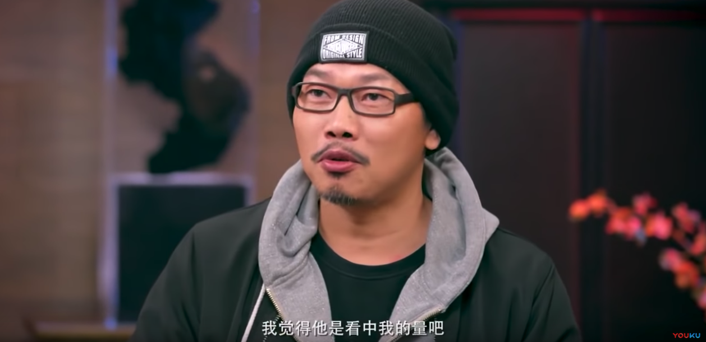
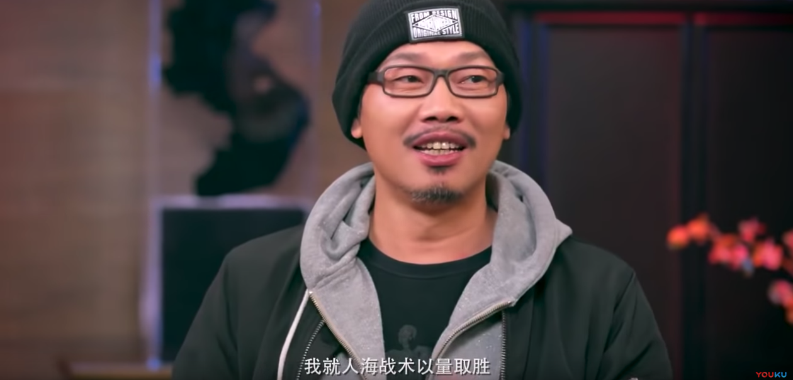

## 周杰伦与绝对音感

周杰伦 2019 年全新单曲《说好不哭》，刷屏了。

这首歌，在 QQ 音乐上，只用了两个小时，销量就超过了 1000 万人民币，还一度搞崩了腾讯的服务器。其影响力可见一斑。

说实话，这首新歌，在我听来，属于周杰伦很平均水平的一首歌，如果放在以往的专辑里，甚至排名可能要偏后。但周杰伦的名气在那里，随随便便一首很“一般”的歌，就能产生这么大的影响力。

杰迷勿喷，我只是有一说一，说一下自己的实际听感。实际上，我也是杰迷。高考结束那一年，《叶惠美》发布，整个寒假，我都是在《以父之名》的音乐中度过的。不信，我们可以到 KTV 飚这首歌去。

80 后 90 后，谁的青春里没有周杰伦呢？

---

这次，周杰伦的新歌发布，让很多人惊喜的是，这首歌的词是方文山填的。周杰伦方文山再次合作。

如果你查一下方文山的履历，就会知道，他是台湾桃园市成功高级工商职业学校电子科毕业的。这其实就是一个职业院校。毕业后的方文山，曾一度在桃源市当电子器材装配员。

他喜欢创作，但家里毫无背景。电影，音乐，他都做不了。最终，他选择了门槛最低的创作形式——写歌词。

方文山的伯乐也是吴宗宪。对于当时，自己毫无背景，吴宗宪怎么会看中他？方文山曾在一个访谈中直言：应该是看中了自己的“量”。

什么量呢？他写了一百多首词。

不仅写了一百多首词，他还别出心裁，将这一百首词装订成册，制作了清晰的索引，比如关键字是“悲伤”的词都在哪里；关键字是“离别”的词都在哪里...... 方便别人翻阅。

这样的一个小册子，他一共复印了 100 份。

然后，他找到当时流行的 CD 唱片，看背面的制作人名单，每一个制作人都寄去。滚石，飞碟，宝丽金，索尼，燕麦...... 这些唱片公司的制作人，无论大小，都是方文山的目标。

方文山当时是这么计算的：这 100 份小样，寄到唱片公司的前台，可能前台会被当做粉丝信处理，所以，只有 50 份会真正地转给制作人的经纪或者助理；

制作人的经纪或者助理，可能并不会把这份小样真正交给制作人，所以，可能只有 25 份会真正落到制作人手里；

制作人收到小样不一定看，所以，可能只有 12 个制作人，真的打开了这个小样，看了看；

看了的制作人，不一定觉得好，所以，可能也就有 5，6 个制作人觉得好，能给他一个机会，当面聊一聊。

方文山计算自己能收到 5，6 封回信，最终，他只收到了 1 封回信。就是吴宗宪的回信。

---

说到周杰伦，大家可能马上想到被吴宗宪逼着 10 天写 50 首歌的事情。这个故事太俗了，不说了。

我马上想到的另一个事情，是周杰伦具有绝对音感。

对于绝对音感，我一直很好奇。因为，在我看来，这就像你拥有一个超能力一样。

当然，现在，我知道了，经过后天训练，是可以培养出绝对音感的。绝对音感的培养，最佳时期是在 3 岁到 9 岁之间。尤其是学习钢琴的孩子，用专业的方法训练，有不小的概率能够培养出绝对音感。所以，我认为，周杰伦的绝对音感，大概率是后天培养出来的。

但是，仍然有很小比例的人，是先天就具有绝对音感的。这个比例是多少呢？大概是 0.01% 左右，即万分之一。

看起来很低，但从全球人口的角度，这并不是一个很低的数字。全球现如今有 75 亿人口，就算是万分之一，也有 75 万的人，天生就具有绝对音感。

我有的时候总在想：这 75 万人，是不是都在做音乐相关的工作呢？大概率的不是。虽然，如果他们做音乐，有着天然的优势。

我就又在想：他们之中，会不会有很多人，也梦想过做音乐呢？但是因为各种原因，他们没有尝试。

绝对音感就是这样一个神奇的天赋，你很有可能拥有它，但如果你不尝试学习音乐，你就永远不知道自己拥有这样的天赋，更谈不上发挥这个天赋了。

如果周杰伦不尝试，不去 10 天创作 50 首歌，他就不会推出自己的第一张专辑，《Jay》；

如果方文山不尝试，不去写 100 首词，寄给唱片公司，他还是一名流水线上的工人。

 

无独有偶，就在昨天，在我的知识星球，有同学向我提问：

**波波老师，怎样确定自己到底适合做什么呢？**

我的回答是这样的：

---

**bobo老师的回答：**

怎么才能知道自己适合什么？个人认为，只能去尝试，通过尝试做不同的事情，找到自己适合什么。否则，一个人就是不知道自己适合什么。

“自己究竟适合什么”这个问题的答案背后，是包含巨大的信息价值的。如果每个人都能轻易知道自己适合什么，大多数人就少了很多患得患失的烦忧。可惜，世界不是这个样子的。除了极少数的人，一出生就知道自己适合什么，大多数人都是不知道的。这其实和只有极少数人是富二代是一个道理。

无论国内外，近乎所有专业的本科阶段的学习，都是某一个领域的全面教育，而非专业教育。本科阶段，会让你接触一个领域的方方面面，目的就是让大家找到自己适合哪个方向。到了研究生阶段，才会具体钻进某一个细分领域深耕。

往前捯，我们的初等教育更是如此。小学初中高中，我们简直无所不学，天文地理，艺术哲学，美术音乐，物理化学。这些都是为了让我们在小时候接触这个世界尽量多的领域，在这个过程中找到自己适合什么。

其实，我一直认为，每个人的一生，都在不断寻找自己适合什么的道路上。我也一样。我适合写字吗？我也不知道。所以，今年开始，我决定定期更新我的公众号，就是逼自己不断去写字，看自己到底适合不适合。

一旦做了，我判断“是否适合”的标准很简单：看自己做起来，会不会觉得厌烦，如果不厌烦，不抵触，我觉得就是适合的。

至于能不能做出成绩。说实话，这个世界上的大多数事情，对于大多数正常智商的人来说，只要坚持去做，总能做出一点儿小成绩的。有没有大发展不好说，但混口饭吃肯定是没问题的。

必须有天赋才能去做的事儿，在这个世界上，其实挺少的。

 

**大家加油！**