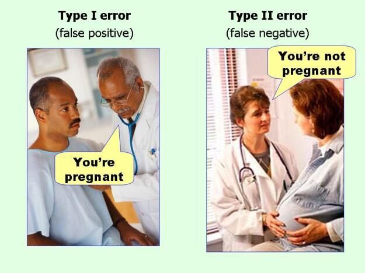
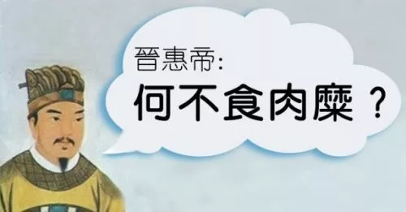

## 第一类错误和第二类错误

通常，在初等教育阶段，我们习惯于说，错误就是错误。我们要争取不犯错误。

但是，长大以后，所有的人都会慢慢明白一个道理。在这世界上，怎么可能不犯错误？犯错不可避免。关键是，我们要尽量避免我们不想犯的那类错误。

错误还有分类？是的。错误不仅有分类，错误的分类，还被大量领域非常认真地研究。如果你学习过统计学，就会接触过这个术语：**第一类错误和第二类错误。**

统计学教材上会对这两类错误有非常文驺驺的表述（不同看懂他们，我也一直傻傻分不清）：

第一类错误，也称为 α 错误，是指当虚无假设(H0)正确时，而拒绝H0所犯的错误；

第二类错误，也称为 β 错误，是指虚无假设(H0)错误时，反而接受虚无假设的情况。

但是，如果你学习过机器学习，就会看到对这两类错误的一个更加直观的表示。被称为 **False Positive 和 False Negative**。

这两个名词非常好理解。都是“False”，也就是都是错误。但一个是，你判断结果为“阳性”(Positive)，但是你的判断错了。另一个是，你判断结果为“阴性”(Negative)，但是你判断错了。

用一个漫画形象地表示。就是这样：

一个男人，是不可能怀孕的。但是，医生却说他怀孕了。医生显然犯错误了。这个错误，就是 False Positive，也就是第一类错误。

一个女人，挺着大肚子，显然是怀孕了。但是，医生却说她没怀孕。医生显然犯错误了。这个错误，就是 False Negative，也就是第二类错误。

---

大多数教材在介绍 False Positive 或者 False Negative 的时候，都会以医学测试作为例子进行讲解。因为，任何医学诊断都可能犯错。如果我们仅仅研究“如何不犯任何错误地去进行医学诊断”，人类的医学早就停滞发展了。

但慢慢的，人们意识到：这两类错误，我们不能同等看待。某类错误会比另外一类错误更严重。

在医学诊断领域，False Negative 就是比 False Positive 更严重的错误。换句话说，一个患病的人，没有被检查出来；远远比一个健康人，被误诊为有病要严重。

因为，一个健康人，即使被误诊为有病，他会开始进行后续的一系列检查和治疗，在这个过程中，就会甄别出这是一例误诊。但是，一个患病的人，如果没有被检查出来，他将以为自己是正常人，继续生活。错失了最佳治疗时期不说，还有可能威胁到他身边的人甚至整个社会的健康。

我在美国，已经听说过大量身边人遭遇了 False Positive 的医学诊断。甚至，曾经有过一次亲身经历。有一次，我陪老婆看病，老婆的某一项指标是 Positive，医生笑眯眯地说，“通常，遇到这种情况，我们都要花很长时间向病人解释什么是 False Positive。但因为你有博士学历，一定理解什么 False Positive。所以，不要太过担心。”

后来，事实证明，果然是 False Positive。

---

和医学类似，对于一个警报系统来说，False Negative 的错误也远比 False Positive 严重。警报系统可能犯错，以火警为例，可能设施内已经有了起火的隐患，但警报系统没有响（False Negative）；也可能设施内什么事情都没有，警报系统却突然开始响个不停（False Positive）。

如果错误是不可避免的话，对于这两类错误，显然，大家更愿意看到 False Positive，而不是 False Negaative。没有火情，警报响了，大家白疏散一场而已。但万一有了火情，警报器却没有响，那损失的，就可能是人命。

西方国家对这一点特别重视，所以留学生近乎一定都会有过被假火警疏散的经历。尤其是中国的烹饪方式，以“炒”为主，这个过程会产生大量油烟，在一些公寓，特别容易触发火警警报。这已经成了很多留学生的阴影。甚至，有一些人表示，看到“炒菜”，就马上条件反射般地想到了消防蜀黍的背影。自己 20 多年的饮食习惯因此得到了改善。现在天天吃这个。

---

是不是在所有情况下，False Negative 都比 False Positive 严重呢？不是的。

在一个和大家息息相关的领域里，False Positive 就比 False Negative 要严重。那就是人才选拔制度。

任何的人才选拔制度都会犯错。有可能把不是人才的人当做了人才（False Positive）；也有可能把人才漏掉（False Negative）。

很遗憾的是，对于大多数人才选拔制度来说，都是更倾向于不犯 False Positive 的错误，而可以容忍 False Negative 的。换句话说，大多数制度都认为，漏过人才没有关系，但要是把蠢材当做人才，就麻烦了。为什么，因为蠢材在组织中，将极大地对组织的氛围产生危害；但是即使漏掉了人才，是金子也总会发光的。

如果说的更严重点儿，一个国家的总统选举制度，如果伴随着大概率的 False Positive 错误的概率的话，就会让一个蠢材领导国家，对整个国家都是巨大的灾难。

古代世袭制，就很容易犯这样的错误。晋惠帝的“何不食肉糜”，应该是这类错误的杰出代表了。

---

总会有人抱怨，HR 只看学历，自己学历低，连简历关都过不去。但是，HR 的这一策略，其实就是在尽量不犯 False Positive 的错误。虽然学历低的群体中，确实有人才，但我们必须承认，如果要求所有的 HR 都去努力在低学历群体中甄别哪些是人才，不仅效率低，更重要的是，很容易犯 False Positive 的错误。

IT 大企业面试校招喜欢考算法，其实也是这个道理。如果大家都没有特别独到的某一个领域的成绩的话，实践表明，用算法考核成绩来衡量一个人的能力，最靠谱。这里“靠谱”的意思就是，不容易犯 False Positive 的错误。

诚然，有很多大神，算法水平不怎么样。那么，当这些大神在自己的领域做出越来越瞩目的成绩以后，这些 IT 大企业的 HR 们会前来“有针对性”地招安的。但是，对于大规模的 IT 人才选拔，考算法最好：虽然会漏掉人才，但是算法好的人，大都不会是蠢材。

可能有些同学会说，这些 IT 大企业难道不怕漏过人才吗？答案可能有些扎心：他们不怕。

或者说，就算怕，但是，他们更怕招来蠢材。一个苍蝇坏一锅汤的例子，在协同工作的环境下不要太多。尤其是在国外，福利完善，工会强势，万一一个蠢材在公司里没有产出，还耍无赖，福利好处一个都不落，对于整个项目组来说，都是毁灭性的打击。经历过的人都懂。

从某种意义上讲，高考也是这样的一个制度。是不是有天才因为不适应高考这种形式，从而陨落。肯定有。但是，在制度设计层面，所有选拔制度都会犯错。如果一定要犯错，高层更不希望看到 False Negative。

---

说到制度设计，这个话题就没完没了了。

因为，社会是人类已知的最复杂的系统。所有的制度设计，一定会产生错误，关键是取舍。我们对错误是否有倾向性？我们是否可能尝试降低某一类错误？

这个问题没有固定答案，在不同历史时期，不同的制度环境，不同的人或者组织，有不同的选择。

战时，桂系军阀陶屠户曾说“宁可错杀三千，不可放走一人”。“错杀三千”和“放过一人”，都是犯错，陶屠户对于这两类错误，做出了属于自己的选择。

而在现代社会环境中，大多数国家的法律，都是讲证据的。换句话说，只要证据有一点点不完善，有一丝丝可能错把一个好人当做罪犯，都更倾向于将这个嫌疑犯当做无罪处理。

不“错杀一个好人”，是另一个选择。

---

在投资的过程中，我们也会面对这种选择。保守的人宁愿错过机会，但不想承担风险，把不是机会的机会误判成机会（False Positive），造成损失；但是激进的人，宁愿损失，但是不想错失任何一个机会（False Negative）。

所以，正规的基金公司，都会对客户进行一个评估，看你是保守的人，还是激进的人。这本质其实是在看，你更愿意犯 False Positive 的错误，还是更愿意犯 False Negative 的错误。

你看，人家已经假设了，你肯定要犯错误。关键是偏好如何。没人能够做到，总是在最低点买入，最高点卖出。那是神。抱着不犯错的心态在市场上混，是不对的。我们必须正视错误。

所以，我总说，不要完美主义，就是因为，犯错才是常态。

 

**大家加油！**