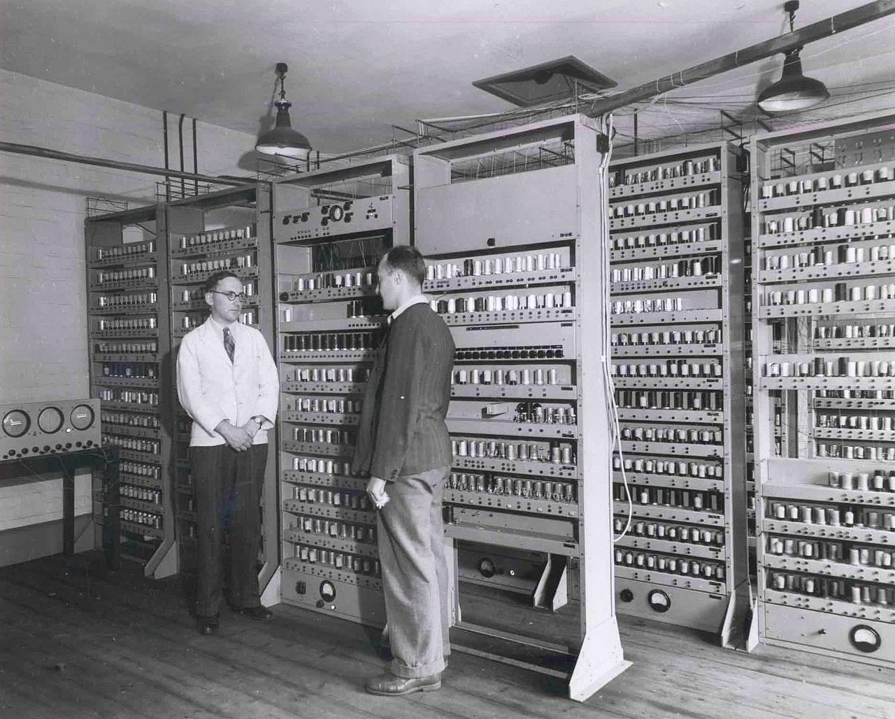
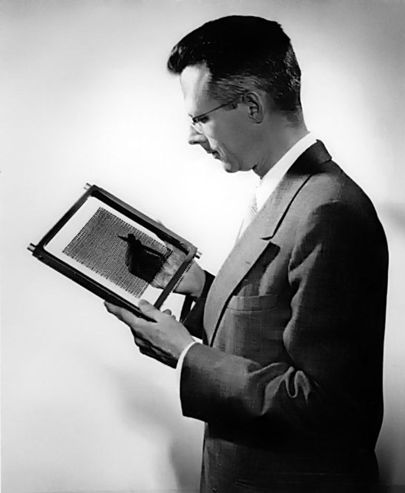
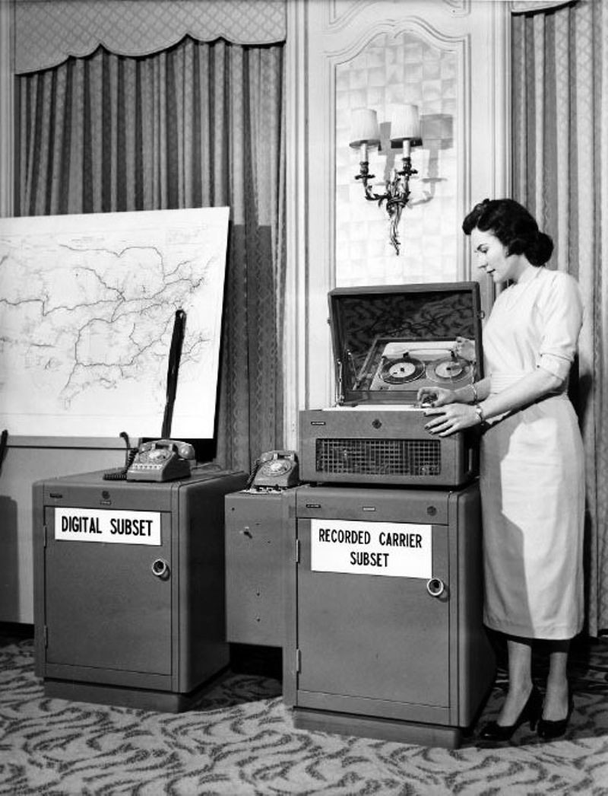
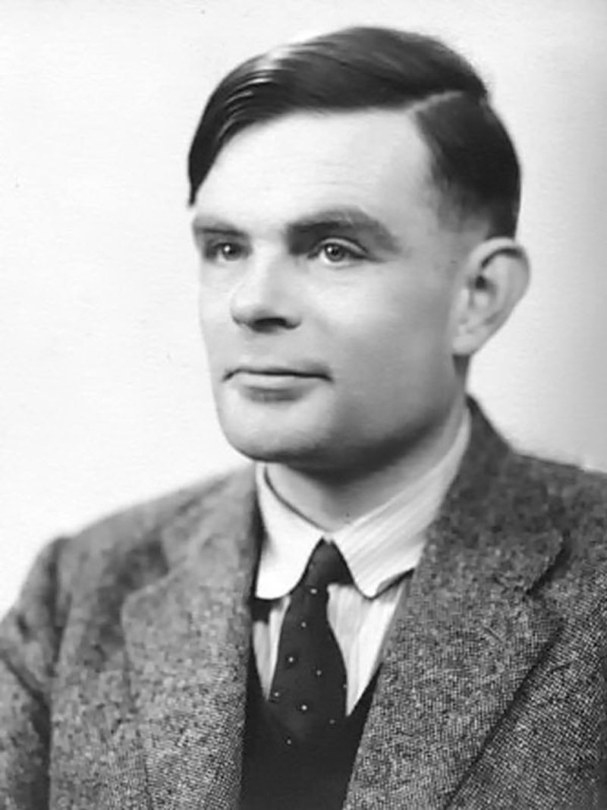
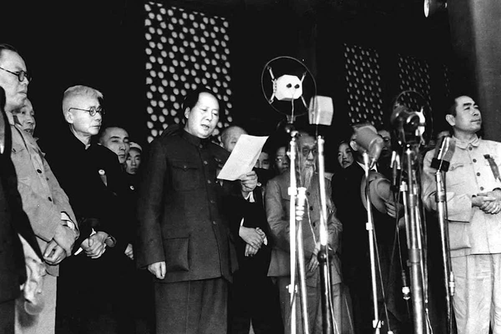

## 此后七十年

**1949 年。**

这一年，世界上第一台**电子延迟存储自动计算器**（Electronic Delay Storage Auto-matic Calculator, EDSAC）在英国剑桥大学诞生了。虽然叫它“计算器”（Calculator），但它实际是一台“计算机”（Computer）。只是当时，人们对计算机的认识很局限，认为，它只能作为“计算器”的用途而已。

这台计算机，是英国剑桥大学数学实验室的 Maurice Wilkes 教授带领他的团队完成的。他们深受冯.诺依曼的启发，使用了 3000 个真空管，排在 12 个柜架上，占地 5×4 米，消耗功率 12 Kw。

这是世界上第一台可以实际运行的存储程序式电子计算机。从此，计算机的世界里有了“子程序”（subroutines）的概念。

**此后七十年**，计算机硬件愈发成熟，软件行业更是如火如荼。子程序早已是一个连小学生都懂的概念，计算机则化为巴掌大的智能手机，装在了每一个人的口袋里。

---

 

**1949 年。**

MIT 的 Jay Forrester 教授，首次提出了**磁芯存储器**（magnetic core memory）的概念。这一技术成为了日后很长的时间里，随机存取存储器（Random Access Memory）的主要技术方案，也就是我们所说的内存。

值得一提的是，对于这一技术日后的发展和完善，美国华裔电脑科学家王安做出了突出贡献。他是王安计算机的创办人。1948 年，获哈佛大学应用物理博士学位的他，已经在磁芯内存领域，有了 34 项之多的发明专利。20 世纪 80 年代，王安电脑达到顶峰，王安也一度成为美国第五大富豪。

**此后七十年**，计算机行业的企业家将不仅仅诞生在美国的土地上。横跨整个太平洋，在遥远的东方，一个个响亮的名字逐一出现。华为，联想，小米，金山，百度，阿里巴巴，腾讯，京东，网易，搜狐，新浪，字节跳动。每一个名字，都是中国人的骄傲。

---

 

**1949 年。**

这一年，世界上第一台**调制解调器**诞生了。位于美国波士顿的空军剑桥研究中心（AFCRC），由 Jack Harrington 领导的研究小组，成功将电子信号转换成了模拟信号，使得信号可以在电话线中传输，之后，又在终端将模拟信号转换成电子信号。

调制解调器主要完成“调制”（MODulate）和“解调”（DEModulate）两个功能，将这两个单词的首字母拼接起来，一个新的英语词汇诞生了：MODEM。此后，这个词汇流入中国，因为音似“猫”的发音，被大众亲切地称为：猫。

这本是为了传输雷达信号而进行的项目，却打开了一扇新世界的大门。此后七十年，互联网蓬勃发展，推动了人类历史的又一次全新的信息革命。甚至，我们至今仍然置身其中。互联网成为了现代社会每个人离不开的技术。

---

 

**1949 年。**

图灵在《伦敦时报》上声称：计算机将可以进入任何一个人类智力可以涉及的领域，并最终和人类竞争。甚至，我们在未来区分不出来一首诗，到底是计算机写的，还是人类写的；而欣赏一首诗的标准，或许也将被计算机所定义。

图灵说的是**人工智能**。

**此后七十年**，人工智能这个“学科”开始在无数人的希冀与质疑下缓慢成长。它显然不像图灵想象的那么简单，却吸引了无数这个世界上最聪明的大脑。它曾陷入低谷，也曾辉煌；它曾被人排斥，害怕，也曾被人捧上神坛，引来无数投资人的青睐。至今，我们还在探索人工智能的道路上，准备迎接由人工智能主导的新的一轮信息革命。

---

 

**1949 年**，世界发生了很多大事。但这些，都比不上在遥远的东方，发生的一件大事。

1949 年 9 月，在中国共产党的领导下，中国共产党、各民主党派、人民团体与社会各界人士在北平召开了中国人民政治协商会议第一届全体会议。

会议决定：建立一个国家名称不同于中华民国的新中国。按照《中国人民政治协商会议共同纲领》，这个新国家的国号为**中华人民共和国**，并定于 1949 年 10 月 1 日举行建国仪式，史称开国大典。

1949 年 10 月 1 日下午 2 时 55 分，仪式正式开始。开国大典由中央人民政府秘书长林伯渠主持。在下午 3 点，毛泽东于北京天安门正式宣布：

**同胞们，中华人民共和国中央人民政府今天成立了！**

 

**此后七十年**，一条巨龙在世界的东方腾飞。

在这片土地上，我们的父辈曾经遭受磨难与困苦，但从未放弃希望。在这里，他们拼搏的泪水与汗水，浇灌出了一个全新的，强大的中国。短短七十年的时间，全世界都不得不为她所取得的成绩赞叹。

今天，她七十岁。

**祝祖国七十岁生日快乐，繁荣富强。**

 

**此后七十年，大家加油！**