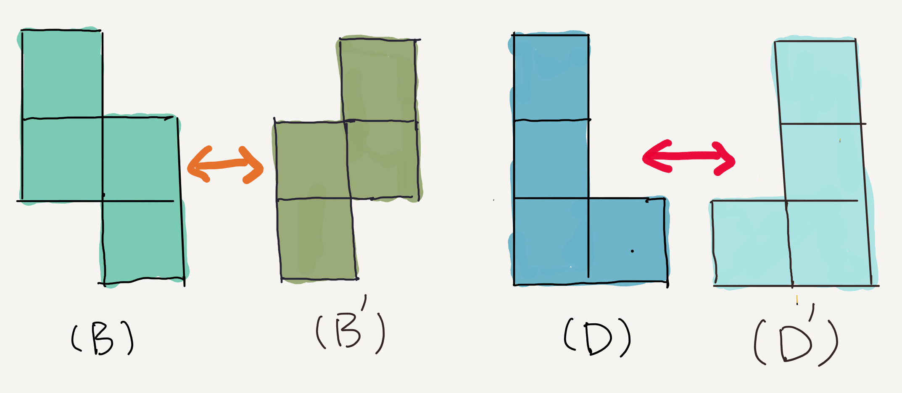
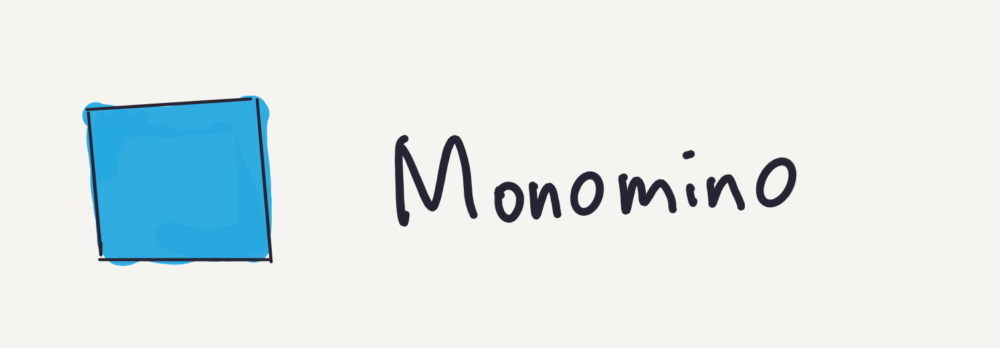
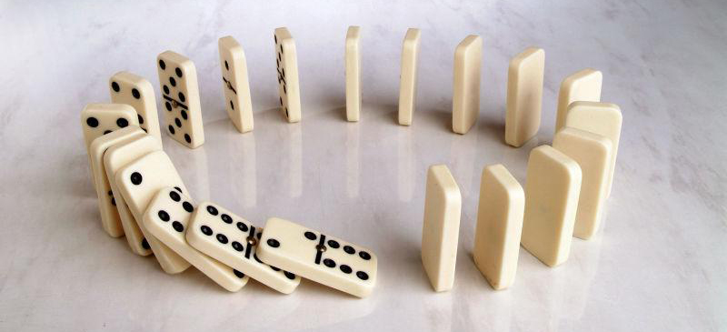
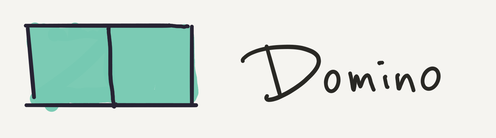
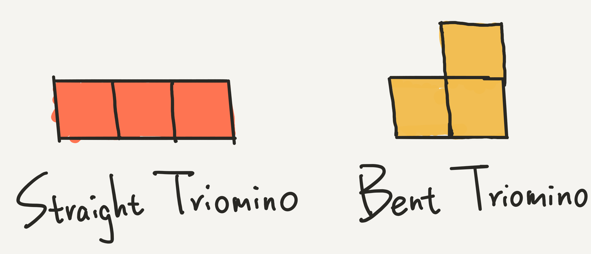
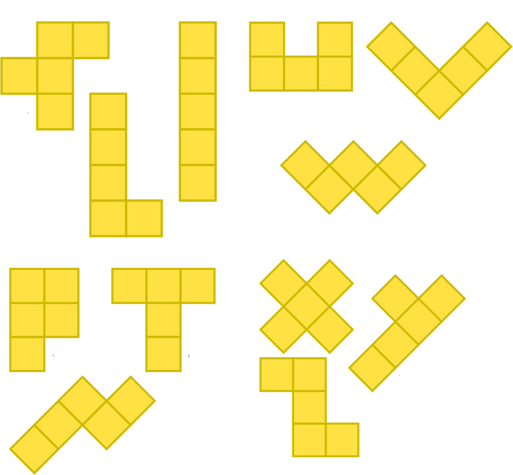
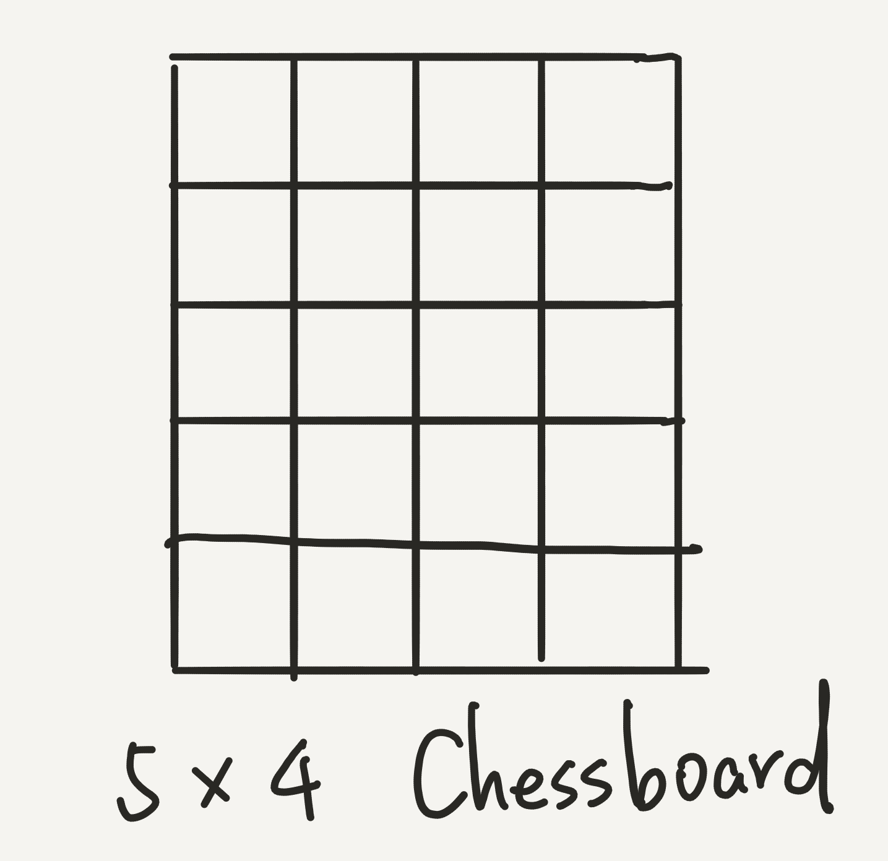
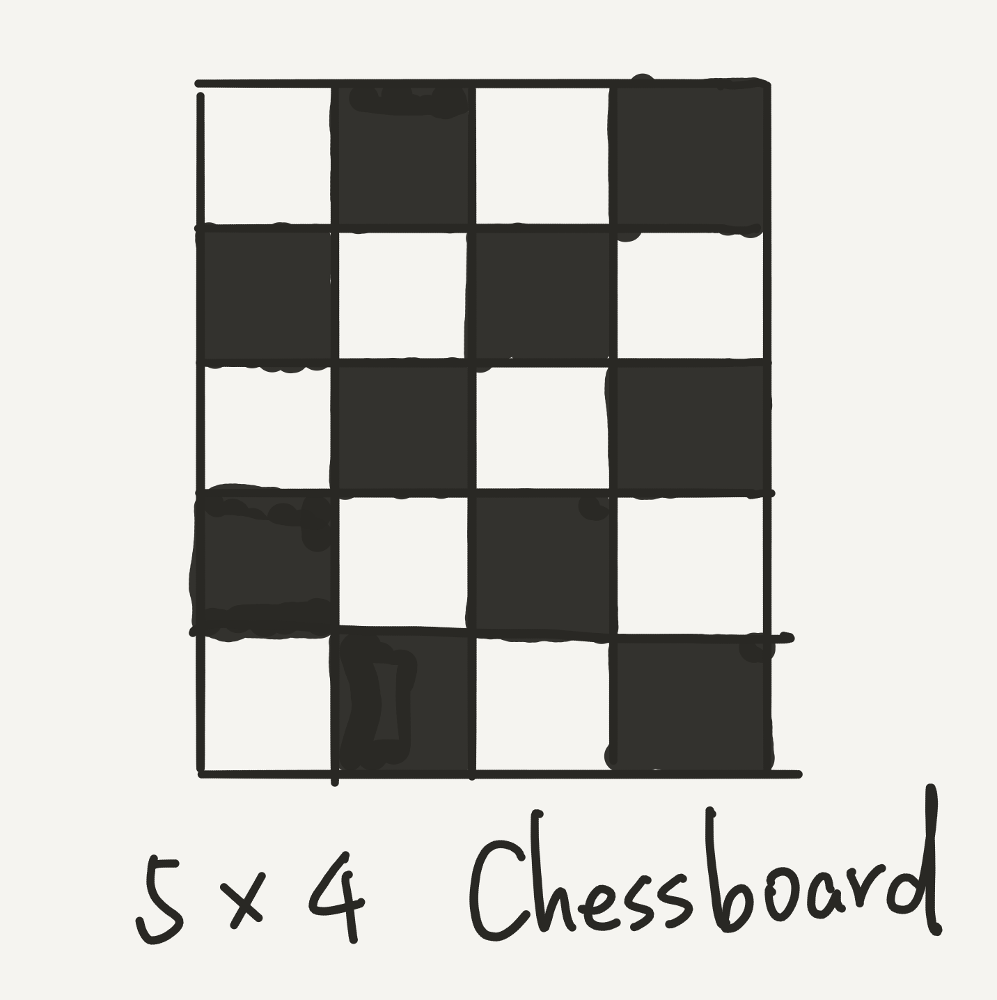
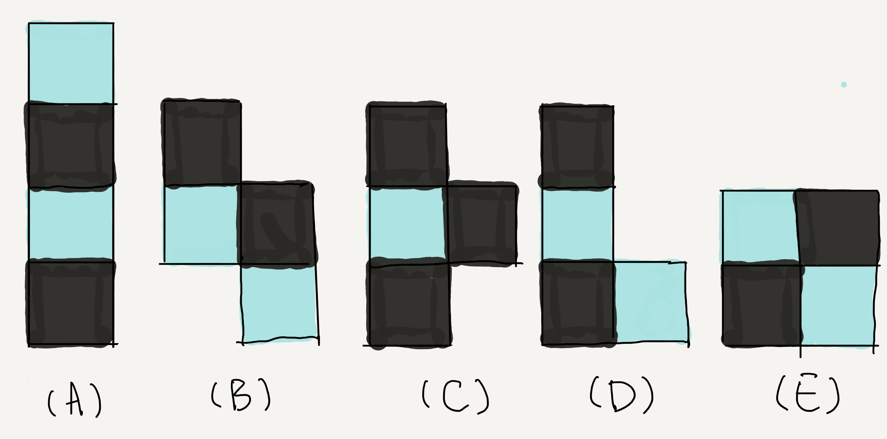
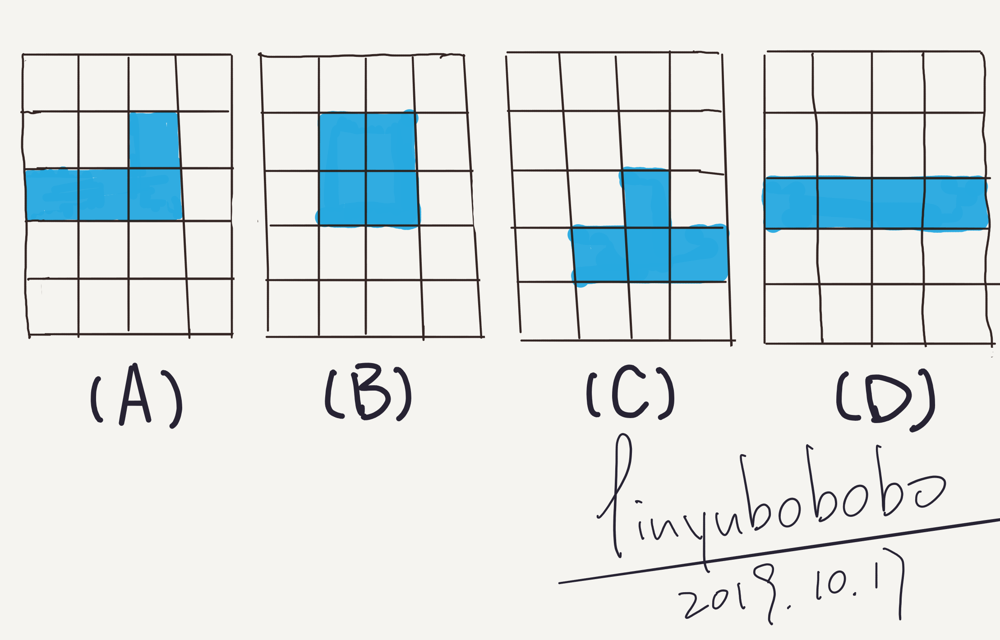

## 俄罗斯方块覆盖

这周，给大家分享一个有趣的几何问题：）

在俄罗斯方块中，一共有 5 种不同的形状。这 5 种形状，都是由 4 个小方格组成的。如下所示：

在真正的俄罗斯方块游戏中，其实一共有 7 种形状。这是因为上图的形状 B 和形状 D 不是对称的。所以，对这两种形状做镜面反射，可以得到另外两个形状，这两个形状，在我们今天的问题中不讨论。

---

值得一提的是，这些形状，在英文中，被称为 **Tetromino**。其中， **tetra-** 这个前缀，就表示“四”的意思。我们变换这个词根，可以得到一系列不同的英文单词。

 

比如，只由一个小方格组成的形状，就叫做 **Monomino**。

**mono-** 前缀，表示单独的，也就是“一”。比如“独裁者”，就是 monarch；比如“独白”，就是 monologue；比如“垄断”，就是 monopoly；比如“一夫一妻制”，就是 monogamy；比如我们数学中学的单调函数，“单调的”，就是 monotonous；等等等等。

Monomino 的形状只有孤零零的一种：

 

如果由两个小方格组成，就是 **Domino**，也就是大名鼎鼎的多米诺。相信大家都见过高手玩儿多米诺骨牌的超酷视频。

其中，**du-** 这个前缀，就是表示“二”，比如“两个人决斗”，就是 duel；比如“二重唱”，就是 duet；比如“两倍”，就是 double；等等等等。

因为对称性，Domino 的形状也只有孤零零的一种：

 

如果由三个小方格组成，就是 **Triomino**。其中，**tri-** 这个前缀，就表示“三”。比如“三角形”，就是 triangle。

Triomino 一共有两种。由于形状的不同，被称为 Straight Triomino 和 Bent Triomino，非常好理解。

 

而由四个小方格组成，就是上面所说的 **Tetromino**，也就是俄罗斯方块游戏中的形状。值得一提的是，俄罗斯方块这个游戏，官方的英文名字就是 **Tetris**，词根也是 tetra-。其实，这个名字和“俄罗斯”没有什么关系：）

 

由五个小方格组成，就是 **Pentomino**。其中，**pent-** 这个前缀，就是“五”的意思。比如大名鼎鼎的五角大楼，就叫 The Pentagon。而 pentagon 本身，就是五边形的意思。

由五个小方格组成的不同形状，一共有 12 种，如下图所示：

 

由 4 个格子组成的不同形状有 5 种；由 5 个格子组成的不同形状有 12 种。当我们使用更多的格子时，所能够组成的不同形状，将以几何级数的速度上升。这本身也是一个很有意思的，经典的组合数学的问题，不过我们这篇文章不探讨这个问题。

---

 

**这篇文章，我们探讨如下问题：**

对于俄罗斯方块的五种不同形状，每种形状使用了 4 个小格子。如果我们每种形状都取一个，则一共有 20 个小格子。

**用这 5 个形状，能否填满一个 5\*4 的棋盘格？**

 

注意，填满的定义是：不能有格子是空的，也不能有格子同时被两个形状占据（不能重叠）。

为了方便大家思考，我再把俄罗斯方块的五种不同形状摆上：

---

 

**解答：**

可能计算机专业的同学，会尝试使用程序，用穷举法试验一下。实际上，这个程序并不那么好写，但我还是建议计算机专业的同学尝试一下，是一个很好的编程练习。

对于这个问题，正确答案是：**不可能。**

是的，这又是一个[《没有解的问题》](../2019-09-15/)。

如果同学们可以正确地实现这个程序，你的程序会告诉你没有解。但是，要想理解为什么这五种形状不能填满一个 5*4 的棋盘格，还有更加巧妙的思考，可以不借助计算机，直接看出来。

这个思考本身，在问题中，我已经提示给大家了。就是“棋盘格”。

说起棋盘格，大家想到什么？一定是国际象棋中，黑白相间的格子。这正是想明白这个问题的关键。

大家可以看到，一个 5*4 的棋盘格，可以被这样划分为 10 个黑格子；10 个白格子。

如果，我们将俄罗斯方块中的五种形状，也按照棋盘格的方式，用黑白相间的格子表示，就是这样：

这里，大家要注意，中间的形状 C，也就是 T 形状，同时占据了三个黑色格子和一个白色格子。而其他所有形状，都占据了两个黑格子和两个白格子。因此，这五种形状，占据了 11 个黑格子和 9 个白格子。**他们是不可能摆在一个有 10 个黑格子和 10 个白格子的 5\*4 的棋盘格中的。**

证毕。

怎么样，是不是很简单？**是不是很酷？**

 

---

这本身是一个非常经典的，解决棋盘覆盖问题的技巧，同时，在我看来，也是非常巧妙的一种思维转换方式。我们从探讨 5*4 的棋盘格整体，转而去考察 10 个黑格子和 10 个白格子这样的一个“局部”。

 

最后，给同学们留一个思考题：

这个问题本身，虽然背景依然是俄罗斯方块，但和上面介绍的俄罗斯方块覆盖问题无关。但同样，可以巧妙地通过思维的转换，快速看出答案。

**问题如下：**

现在，你和 bobo 老师一起玩儿一个游戏。这个游戏是这样的：

我们面对一个 5*4 的棋盘格，一共有五种形状可供我们选择，就是俄罗斯方块中的五种形状各一个。

你和 bobo 老师轮流，每次拿出一个形状，摆在棋盘上。每个形状只能使用一次。

如果谁最后无法把任何剩余的形状拼进棋盘格中，谁就输了。依然是，格子之间不能重叠。

傲娇的 bobo 老师让你先行动。问：第一步，你要选怎样的图形，怎么摆放，能保证自己肯定赢？

在这里，给同学们四个选项：

看看大家能不能思考出答案？更关键的是，能不能解释清楚，为什么？

答案我会在下周揭晓。不过，根据我的经验，一般，同学们在留言区，就能把正确答案分析出来了：）

对了，大家应该看出来了，这篇文章中大部分配图，都是我手绘的。炫耀一下下：）

 

**大家加油！**

---

本篇文章最后的思考题答案，可以参考[这里](../2019-10-27/)