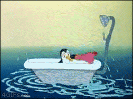
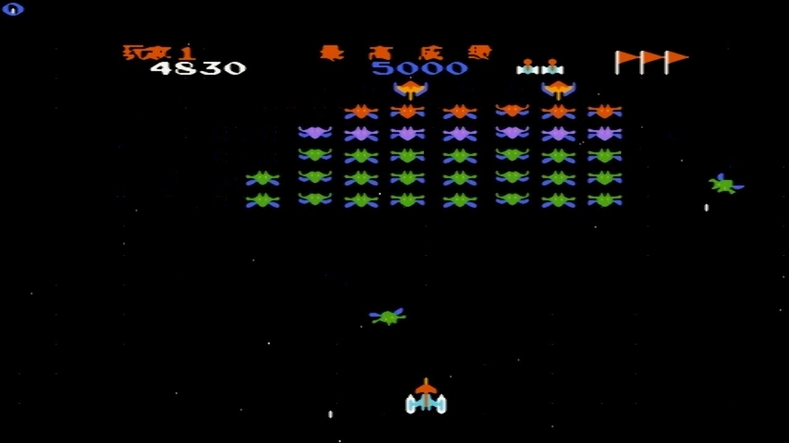
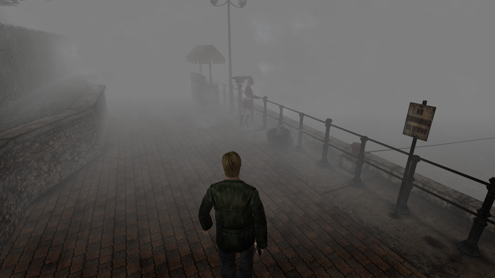
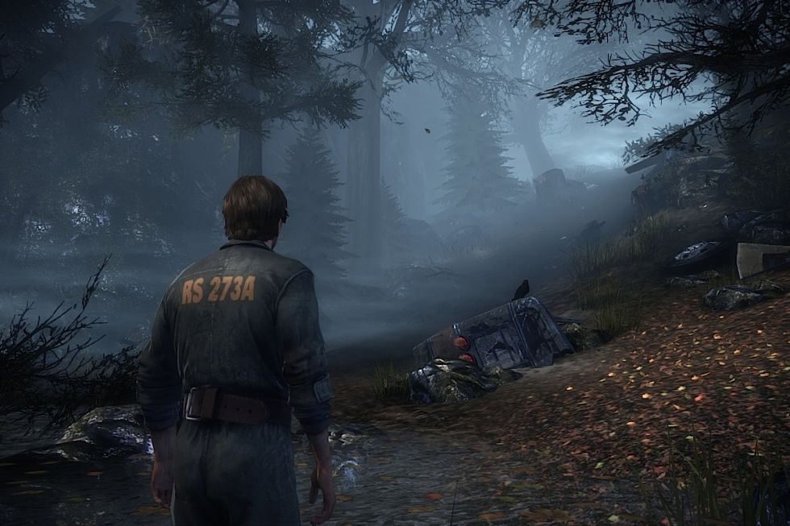
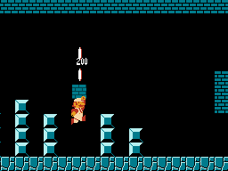
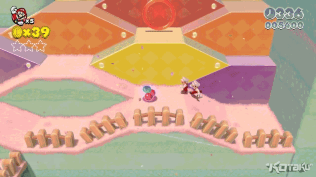
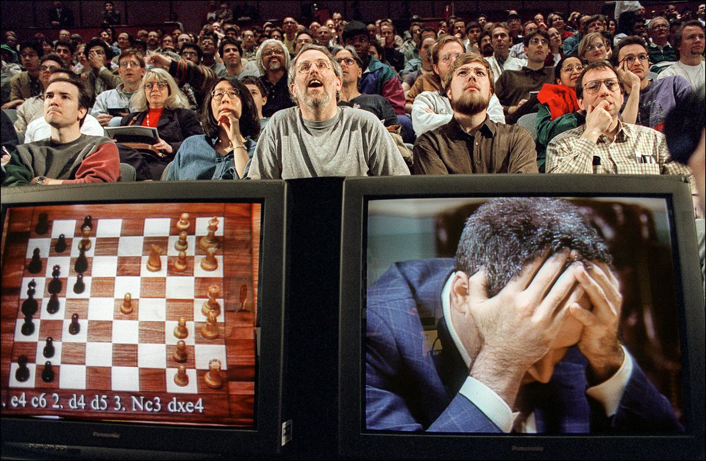

## bug 变 feature

今天是 1024，中国的程序员节。写篇轻松点儿的文章，大家放松一下。

聊聊历史上那些大名鼎鼎的 **bug 变 feature**。

 

最经典的 bug 变 feature 的例子，应该是 Gmail 的“撤回”功能。在 Gmail 上，用户发送的邮件，有 5 秒钟的时间可以撤销。如果在 5 秒钟内，发现邮件发错人了，或者突然决定不发了，可以点击这个“Undo”按钮。

这么一个简单的功能，在有些情况下，可能是救命的。别问我是怎么知道的 

但是，Gmail 的这个功能，其实并不是设计者的本意。最初，对于 Gmail 的服务器来说，发送一封邮件的处理准备时间需要 5 秒左右。每发送一封邮件，用户都需要等待 5 秒钟，这样的用户体验，实在是太差了。

最终，Gmail 的工程师创新性地将这 5 秒钟，让用户理解成是允许自己反悔的时间。这便成为了 Gmail 邮箱服务的一大特色。

即使如今，服务器的运算效率显然可以瞬间把邮件发送出去，Gmail 依然保留了这个功能。**bug 变 feature。**

 

---

实际上，在计算机发展早期，很多 bug 变 feature 的经典案例，都和计算机的性能局限性有关。

比如最经典的游戏 Space Invaders。

说这个名字，中国的用户可能并不熟悉。但是如果说“小蜜蜂”，80 后们应该都很熟悉。相信有无数同学，在家长下血本购买了小霸王学习机后，在一次又一次的“小霸王其乐无穷哇”的呼喊声中，开始了 FC 游戏之旅。比如我：） 

“小蜜蜂”，近乎可以说是 FC 上的第一代射击游戏。

小蜜蜂的设计是：在每一关开始，没有击落的敌人还比较多时，敌人的移动速度比较慢。随着画面上剩余的敌人越来越少，敌人的移动速度也越来越快，难度随之增加。

实际上，这并不是游戏有意设计的。在最初，由于计算机的性能较低，当画面上的敌人很多时，每一帧的渲染计算量过大，导致每一帧时间相对较长，帧率变低，所以看起来移动速度很慢。

随着游戏进行，画面上的物体越来越少，计算能力跟上了，帧率也就提高了，相应，敌人的速度也就变快了。

但是，这样一个结果，从游戏体验上看，并不差，甚至加入了更多挑战性。所以后来，虽然性能不再是问题，但是，这个游戏机制保留了下来。**bug 变 feature。**

 

---

另一个在游戏领域，和性能相关的 bug 变 feature 的例子，是大名鼎鼎的游戏《寂静岭》。

《寂静岭》初代，是 1999 年发行的一个 3D 游戏。在那个年代，3D 游戏还不多。由于计算机的运算性能不高，不足以支撑将人物视野范围内的所有场景都同时渲染出来。于是，就会产生：人物一边行进，周边的建筑物突然“蹦出来”的渲染效果。用户体验非常不好。

于是，《寂静岭》的团队决定将故事背景设定在一个虚拟的托卢卡湖边的小镇上。因为托卢卡湖上充满了水汽，常年都包裹着浓雾。

在浓雾这一背景设计下，“蹦出来”的建筑物变得自然了。与此同时，也和游戏的类型——心理恐怖游戏非常契合。这简直是史上最佳电子游戏界的遮瑕膏。

现在，《寂静岭》系列已经有了八部作品，计算机的 3D 渲染能力也早就不需要借助浓雾来遮掩了。但是，《寂静岭》的浓雾设计却一直保留着。**bug 变 feature。**

 

---

在游戏设计领域，bug 变 feature 的例子特别多。或许是因为，游戏设计本身包含艺术的成分。而艺术是没有标准答案的。很多时候，bug 反而是创新的来源。

比如，大名鼎鼎的《超级马里奥》里，有一种隐藏的金币砖块，可以顶出很多金币。实际上，这最初是一个 bug。游戏本身的设计，一个砖块只能顶出一个金币。但是，游戏设计者发现这个 bug 很有意思，就一直保留了下来。**bug 变 feature。**

 

再比如，《马里奥 3D 世界》中，程序员无意在一个场景里保留了两个马里奥的实体。设计师看到后，觉得很有意思，于是设计了一种特殊能力，可以一下子克隆出多个马里奥。**bug 变 feature。**

 

大名鼎鼎的《古墓丽影》系列中的女主劳拉，最初设计时，胸根本没有那么大。3D 建模师不小心将一个 50 的参数输入成为了 150。于是，一个举世闻名的大胸妹出现了。

大家一看，效果还不错，那就这样了。**bug 变 feature。**

 

甚至，据说，《街头霸王》系列的核心玩法：连招，最初也是一个 bug。本身，设计者并没有想到这个机制。但后来发现，动作可以在极短的过程中连接起来，而让对手动弹不得。

这本是一个 bug，由于要想触发这一 bug，需要在非常短的时间内进行人物招式的转换，其实也是有难度的。设计者也就没有修复这一 bug。慢慢的，连招，竟然变成了对打类游戏的核心玩法。

如果喜欢玩儿对打类游戏的同学，下次在使用连招的时候，可以告诉自己，自己其实触发了一个 bug，但是，**bug 变 feature。**

 

---

不仅仅是游戏，在操作系统领域，都有 bug 变 feature 的例子。最有名的，就是 Linux 或者 Unix 系统中的隐藏文件。

如果使用 Linux 或者 Unix 系统的同学会知道，隐藏文件的定义是以点(.)开头的文件。

比如，我们建立一个 git 仓库，文件下就会产生一个 .git 的隐藏文件夹；再比如，我们可以使用 .gitignore 文件，来告诉 git 不追踪哪些文件。

实际上，在 Linux 或者 Unix 系统上，大量配置文件都是以点(.)开头的。但这原本是一个 bug。

因为操作系统下的文件名称格式是 <文件名>.<文件后缀>。道理上，操作系统应该要检查文件名为空的情况。可是程序的边界条件检测不完整，就产生了这种文件名为空，于是显示不出文件的形式。

后来，开发者干脆将这种形式，定义成了隐藏文件的格式。**bug 变 feature。**

 

---

历史上最有名的 bug 变 feature 的例子，应该是在 1997 年，IBM 开发的人工智能深蓝（Deep Blue），打败了当时的国际象棋大师 Garry Kasparov。

后来，人们研究这场对战，发现决定生死的一招棋，是深蓝的第 44 步棋。在这一步中，人工智能做出了暂时性的牺牲，但是赢得了长远的胜利。

可后来，人们却发现，这其实是深蓝的一个 bug。在当时的棋局下，深蓝并没有找到自己的行动策略，于是随机走了一步。是的，随机。

然而，这随机的一步，竟然决定了历史的胜局...

 

我只想说：**为什么我写的 bug，终归还是 bug；但别人写的 bug，最终却变成了 feature？：）**

**1024 程序员节快乐！**

 

**大家加油！**

