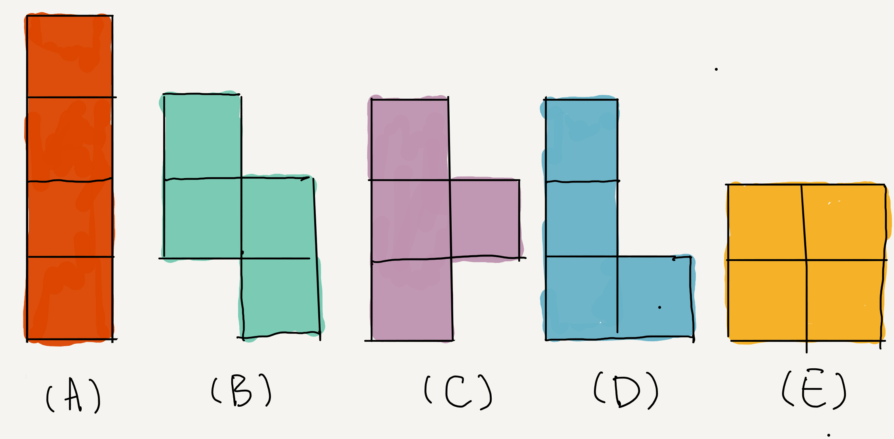
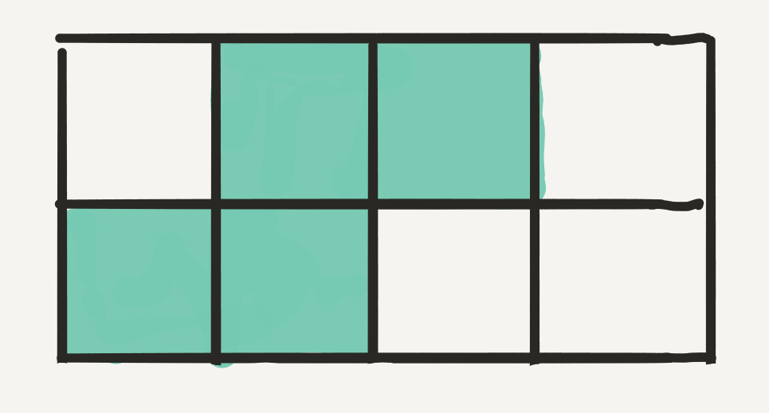
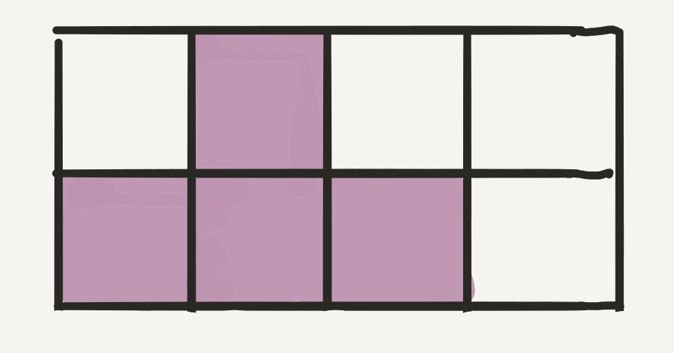
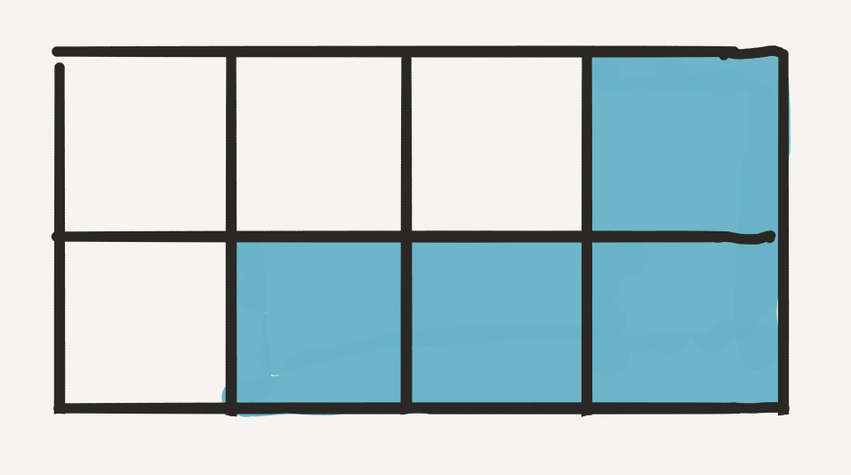
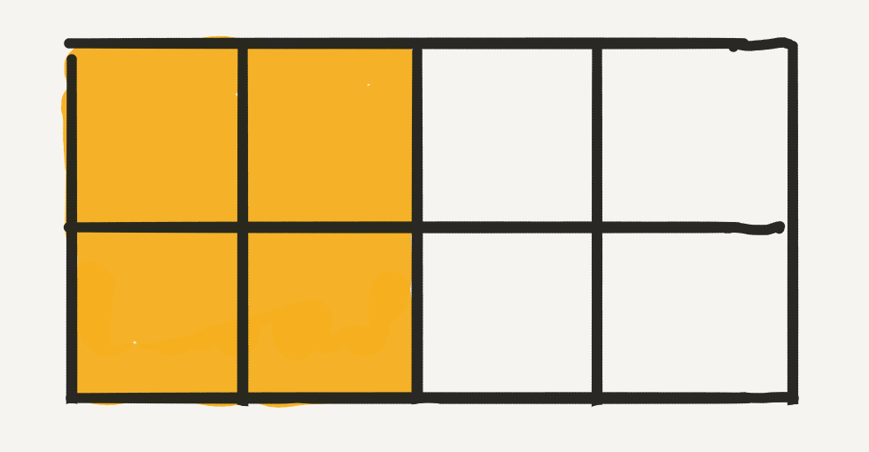
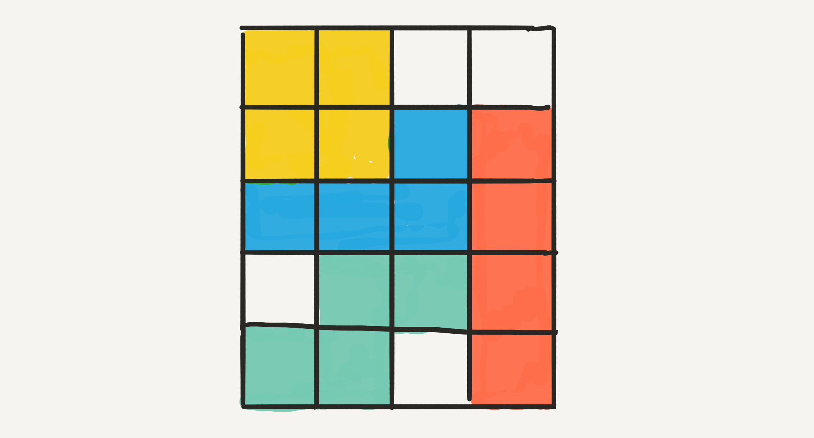
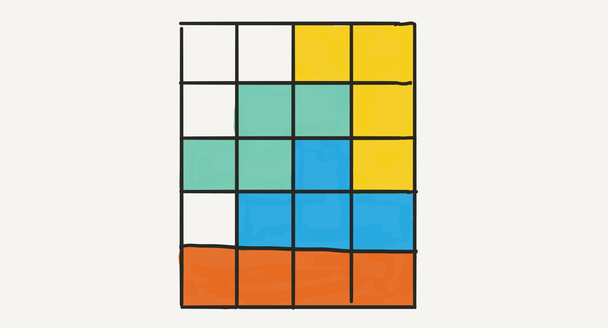

## 【俄罗斯方块覆盖】答案

在上一周的推文 [俄罗斯方块覆盖](../2019-10-17/) 的最后，我给大家留了一个小的思考题。如果没有看过上篇文章，请一定阅读后再看这篇文章。这篇文章是对文末思考题的解答：）

 

**思考题如下：**

现在，你和 bobo 老师一起玩儿一个游戏。这个游戏是这样的：

我们面对一个 5*4 的棋盘格，一共有五种形状，就是俄罗斯方块中的五种形状各一个。

你和 bobo 老师轮流，每次拿出一个形状，摆在棋盘上。每个形状只能使用一次。

如果谁最后无法把任何剩余的形状拼进棋盘格中，谁就输了。

傲娇的 bobo 老师让你先手行动。问：第一步，你要怎样走，能保证自己肯定赢？

为了降低难度，对于这个问题，我给出四个选项：

看看大家能不能思考出答案？更关键的是，能不能解释清楚，为什么？

在这里，大家注意，和很多博弈论问题不同的地方在于：**这个问题并没有要求你或者 bobo 老师每步行动都采用最佳策略。 **
 

---

**解答篇**

在这里，我们首先分析一下，什么叫保证自己肯定能赢？

第一步：你走；

第二步：bobo 老师走；

第三步：你走；

第四步：bobo 老师走；

...

大家可以看到，你走的是奇数步，bobo 老师走的是偶数步。换句话说，**你走完以后，棋盘格上应该有奇数个形状；bobo 老师走完以后，棋盘格上应该有偶数个形状。**

也就是说，如果在某种盘面下，棋盘格只能容纳奇数个形状，那么你就稳赢了。

只有 D 满足这个条件。因为 D 选项中的长条，将整个棋盘格拆分成为了两个 2\*4 的盘面。对于俄罗斯方块剩下的四种形状，不可能有两种不同的形状，可以同时“挤”在一个 2\*4 的盘面中。

在这里，同学们要注意：对于第三个图，虽然我们可以再塞进去一个 L 形状，但是题目要求，五种形状，每种只能使用一次。

所以，对于 D 选项，上下两部分最多再容纳各一个形状，整体只能容纳三个形状，是奇数。

你先将长条横在中间，bobo 老师走一步，你再走一步，bobo 老师就一定无路可走了：）

 

---

而对于其他的三个选项，都有方法可以再容下三个其他形状，也就是整个棋盘格可以有四个形状，是偶数。在这种情况下，你就输了。

在这里，请大家再体会一下，我们将这样的一个博弈问题，转换成为了：棋盘格中最多可以容纳多少个形状。

另外，值得一提的是，在这个题目中，并没有要求你和 bobo 老师的每一步都采用最佳策略。这是和很多博弈论类问题不同的地方。也就是，两个人的行动可能不是当前状态下的最优行动。

因为每一步不一定是最佳策略，所以对于(A)(B)(C)，你都有可能产生棋盘格中容纳四个形状的状态，导致输掉。但是对于(D)，你无论如何都不会输：）

 

**大家加油！**
