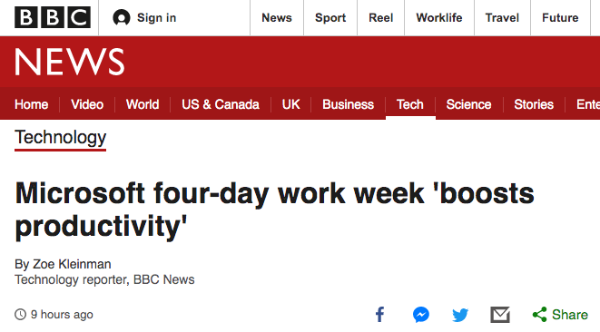

## 微软日本实验了一下一周只工作 4 天会发生什么，结果令人大吃一惊

今年 8 月份，微软日本做了一个实验，一周只工作 4 天，每周五、六、日三天都休息。但是员工薪水保持不变，每周五的休假也不计入年假中，看看结果会如何。

这相当于，今年 8 月份，微软日本的 2300 多名员工多了 4 天的带薪假日！

就在上周，微软日本公布了这次实验的效果，结果令人大吃一惊。微软日本官方网站对这次实验的总结页面，可以参考[这里](https://news.microsoft.com/ja-jp/2019/10/31/191031-published-the-results-of-measuring-the-effectiveness-of-our-work-life-choice-challenge-summer-2019/)。

 

简单来讲，结果就是，在今年 8 月份：

微软日本的员工额外请假的天数减少了 25.4%；

用电量减少了 23.1%；

打印纸张的使用量减少了 58.7%。

 

我查了一下，今年 8 月份一共有 22 个工作日，5 个周五。也就是微软日本在今年 8 月份，有 22.7% 的工作日放假了。

用电量减少的幅度 23.1%，和员工额外请假的天数 25.4%，和这个 22.7% 基本相当。但是，打印纸张使用量瞬间减少 58.7% 是什么鬼？大家平时在每周五都疯狂打印什么吗？

 

最最关键的是，据统计，**员工的工作效率提升了 39.9%。**也就是说，员工工作了更少的时间，但是，更多的工作任务被完成了！

这简直太神奇了，说实话，我觉得不科学！

于是，我又仔细查证了一下，为什么会发生这样巨大的效率提升，发现问题的关键，在于与此同时，微软日本实行了会议制度改革。不必要的会议，一率取消。如果一定要开会，微软日本在这期间严格规定：由于工作时间的减少，所以，**所有的会议都必须在 30 分钟内结束！**

看来，**会议真的是生产效率提升的巨大阻碍啊！**

 

最后，微软日本有 92.1% 的员工对这项政策满意。不知道 7.9% 的员工不满意是什么鬼，大概都是中高层领导吧。

不管怎样，微软已经决定，在今年冬天，再找一个月试验一下。

 

在外网上，对于这个新闻，已经吵翻了天。连 BBC 都进行了报道。

支持派就不用说了。实际上，在国外，一直都有倡导一周工作 4 天的支持派。很多科技企业因此实行弹性工作制，或者允许在家办公（Work from home），都是这派声音争取的结果。

但是，很多人认为，大多数企业，包括微软在内，短时间不会采取永久的一周四天工作制。

一个很重要的原因是：不时地进行一下一周四天工作制，对员工来说，是一个鼓励。但如果一周四天工作制是常态，员工一旦习惯了，大概率的，不会有太多的效率提升。

 

不过，似乎，更多的人在替企业主思考，如果一天只工作四天的话，到底多休息哪一天合适？

很多人认为，休息周三，比休息周五更好。因为元气满满地周一工作，周二就消耗地差不多了。然后周三休息一天，周四就又元气满满地来工作了。毕竟，再工作一天，就又到双休日了！

还有人觉得，应该每两周一个周期，单周周五休，双周周一休。这样一来，相当于每两周中间，多了一个四天的小长假！每两周都足够时间好好旅游一下。只是不知道，这样一来，会不会大多数人上班时间都去查旅游攻略了呢？

不知道你怎么看？

但是。。。

 

别人家的公司，大家看看就好了。

2019 年就剩下两个月了。希望在这最后两个月，大家努力，让自己的 2019 更精彩：）

**大家加油！**